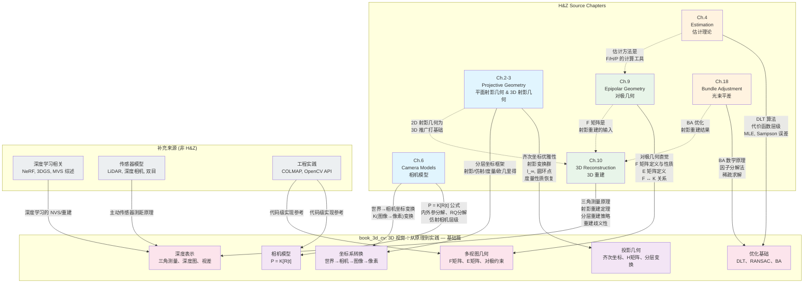
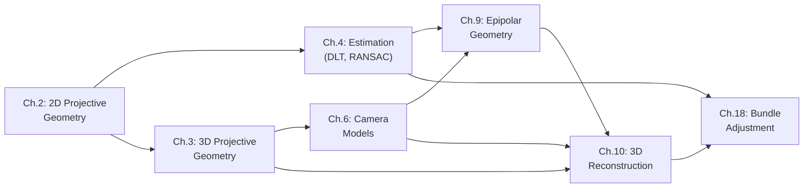

# Literature Map: H&Z Chapters to Book Sections

## Key Source Mapping Detail

### 相机模型 (`book_3d_cv` Section 1)

| 知识点 | H&Z Reference | Pages |
|--------|--------------|-------|
| Pinhole projection formula | section 6.1 | 154-155 |
| Calibration matrix K | section 6.1 | 155-157 |
| External params R, t | section 6.1 | 155-156 |
| General projective camera | section 6.2 | 158-163 |
| RQ decomposition to recover K, R | section 6.2.4 | 163-165 |
| Affine camera hierarchy | section 6.3 | 166-173 |
| Depth of points | section 6.2.3 | 162-163 |

### 投影几何 (`book_3d_cv` Section 2)

| 知识点 | H&Z Reference | Pages |
|--------|--------------|-------|
| Homogeneous coordinates | section 2.2.1 | 26-28 |
| Ideal points, line at infinity | section 2.2.2 | 28-30 |
| Projective transformation H | section 2.3 | 32-36 |
| Hierarchy of transformations | section 2.4 | 37-44 |
| Recovery of affine/metric properties | section 2.7 | 47-58 |
| Circular points, C*_inf | section 2.7.3 | 52-53 |
| Angle measurement in projective frame | section 2.7.4 | 54-55 |

### 多视图几何 (`book_3d_cv` Section 3)

| 知识点 | H&Z Reference | Pages |
|--------|--------------|-------|
| Epipolar geometry intuition | section 9.1 | 239-241 |
| Fundamental matrix F definition | section 9.2 | 241-246 |
| F properties (rank 2, 7 DOF) | section 9.2.4 | 245-246 |
| Essential matrix E | section 9.6 | 257-258 |
| F vs E relationship | section 9.6 | 257 |
| Camera matrices from F | section 9.5 | 254-256 |
| Special motions | section 9.3 | 247-250 |

### 深度表示 (`book_3d_cv` Section 4)

| 知识点 | H&Z Reference | Pages |
|--------|--------------|-------|
| Triangulation principle | section 10.1 | 262-264 |
| Projective reconstruction theorem | section 10.3 | 266-267 |
| Stratified reconstruction | section 10.4 | 267-273 |
| Reconstruction ambiguity | section 10.2 | 264-266 |

### 坐标系转换 (`book_3d_cv` Section 5)

| 知识点 | H&Z Reference | Pages |
|--------|--------------|-------|
| World to camera (R, t) | section 6.1 | 155-156 |
| Camera to image (K) | section 6.1 | 154-157 |
| Hierarchical frames | section 2.4, 2.7 | 37-44, 47-58 |

### 优化基础 (`book_3d_cv` Section 6)

| 知识点 | H&Z Reference | Pages |
|--------|--------------|-------|
| DLT algorithm | section 4.1 | 88-91 |
| Cost functions (algebraic, geometric, Sampson) | section 4.2 | 91-96 |
| Maximum Likelihood estimation | section 4.3 | 102-108 |
| RANSAC | section 4.7 | 116-123 |
| Bundle adjustment principle | section 18.1 | 434-436 |
| Factorization algorithm | section 18.2 | 436-440 |

## Dependency Graph

*Last updated: 2026-04-28*
