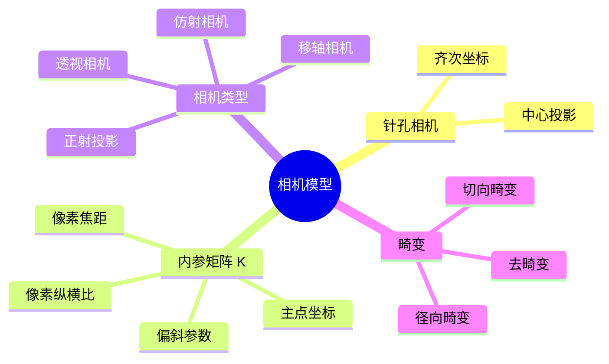
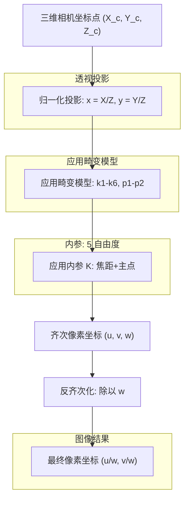

# 01 相机模型：三维世界如何变成二维图像

> [!NOTE]
> **预计阅读时间**：40 分钟 · **前置知识**：无（本篇第 01 节）
>
> **读完本节后，你可以**：理解光圈、焦距、视场角、景深等光学概念，知道为什么真实相机可以简化为针孔模型，写出相机坐标系下的投影公式 $x_{pixel} = K X_{cam}$，理解内参矩阵 $K$ 的每个元素的物理意义，理解镜头畸变（径向和切向）的产生原因和矫正方法，知道透视/仿射/移轴相机的区别和适用场景。

---

## 1.1 你真的了解你手里的相机吗？

在进入针孔模型之前，我们先花十分钟回答一个更根本的问题：**真实相机是怎么成像的？为什么我们可以用一个针孔来近似它？**

### 1.1.1 真实相机的结构

一台真实相机由四个核心部件串成一条"光路"：

- **镜头（Lens）**：一组精密研磨的玻璃或塑料镜片，负责将入射光汇聚到传感器上。通常有 5–15 片镜片，每一片都经过镀膜以减少反射和色差。

  

  *镜头剖面示意图。展示了前镜组（Front Element）、镜片组（Lens Group）、光圈（Aperture）和后镜组（Rear Element）的内部结构。*

  镜头外壳上通常有两个环（变焦镜头）：**变焦环**（Zoom Ring）改变焦距（视角宽窄），**对焦环**（Focus Ring）改变对焦距离（哪个位置的物体清晰）。**定焦镜头没有变焦环，但一定有对焦环**——否则它只能清晰拍摄某一个固定距离的物体，稍微远一点或近一点都会模糊，根本无法正常使用。

  

  *镜头外部结构。展示了变焦环（Zoom Ring）、对焦环（Focus Ring）、AF/MF 切换开关和焦距刻度窗。（来源：摄影器材教学）*

  拧对焦环时，镜头内部**某些镜片组**（通常是后组或中间组，不是全部镜片，更不是整个镜头）会沿光轴前后移动，改变的是**像距** $v$（投影中心到传感器的距离），从而改变清晰成像的物距。**光学焦距** $f_{opt}$（由镜片曲率和折射率决定）并不会变——定焦镜头的"定"就是这个意思。但像距 $v$ 的变化会悄悄改变后面标定出来的像素焦距，这是 3D 视觉中一个非常隐蔽的误差源，后面 1.3.2 节会详细展开。

  > [!NOTE]
  > 工业相机常用的定焦镜头（如 C-mount/CS-mount）通常**没有对焦环**——它们在出厂前就针对特定工作距离调好对焦并锁死，使用时不再调整。这与手机/单反上的定焦头不同。
  >
  > 自动对焦（AF）的本质和拧对焦环完全一样：用马达驱动镜片组前后移动来寻找最佳对焦位置。区别在于驱动力从"手指"变成了"马达"，对焦距离的判定从"人眼观察"变成了"相位检测/对比度检测算法"。

- **光圈（Aperture）**：镜头中间一个**可调节孔径**，控制有多少光能通过。用 **f 值**（f-stop）表示，比如 f/1.4、f/2.8、f/16。f 值越小 → 孔径越大 → 进光越多。

  

  *光圈刻度示意图。f 值越小，光圈孔径越大，进光量越多，景深越浅。*

- **快门（Shutter）**：控制传感器接收光的时间长度。机械快门是一道物理帘幕，电子快门则是直接控制传感器的通电时间。

  

  *机械快门帘幕。相机机身内部的焦平面快门，由前后两道帘幕组成，通过控制帘幕开合的时间来决定曝光时长。*

- **传感器（Sensor）**：将光信号转换为电信号的芯片，由数百万个感光单元（像素）排列成矩形阵列。

  

  *CMOS 图像传感器芯片。中央的矩形区域是感光阵列，覆盖着彩色滤镜（Bayer 阵列），四周是读出电路和引脚。*

### 1.1.2 曝光三角：光圈、快门、ISO

一张照片的亮度由三个参数的平衡决定——摄影师叫它"曝光三角"（Exposure Triangle）：

| 参数 | 作用 | 效果 | 单位 |
|------|------|------|------|
| **光圈（Aperture）** | 控制进光孔径 | 大光圈(f/1.4) → 亮、浅景深；小光圈(f/16) → 暗、深景深 | f 值 |
| **快门速度（Shutter Speed）** | 控制曝光时长 | 慢快门(1/30s) → 亮、可能模糊；快快门(1/4000s) → 暗、冻结运动 | 秒或分数秒 |
| **ISO（感光度）** | 控制传感器信号增益 | 低 ISO(100) → 干净、需要多光；高 ISO(6400) → 亮但有噪点 | 100–102400+ |

这三个参数互相牵制：在同样的环境光下，加大一档光圈 → 你可以用更快的快门或更低的 ISO → 分别影响景深和噪点。摄影就是在三者之间做取舍。

### 1.1.3 视场角（FOV）与焦距

**焦距（Focal Length）**是镜头的光学中心到传感器的距离。它和传感器尺寸一起决定了**视场角（Field of View, FOV）**——也就是相机能"看见"的角度范围：

$$FOV = 2 \cdot \arctan\left(\frac{d}{2f}\right)$$

其中 $d$ 是传感器在某一方向上的长度（水平宽度、垂直高度或对角线），$f$ 是焦距。$d$ 对应哪个方向，算出的就是哪个方向的 FOV。定性来说：

| 焦距 | 视场角 | 俗称 | 典型用途 |
|------|--------|------|---------|
| 8–24 mm | > 90° | 超广角 / 鱼眼 | 全景、AR/VR、机器人导航 |
| 24–35 mm | ~60–75° | 广角 | 街拍、手机主摄、安防监控 |
| 35–70 mm | ~30–55° | 标准 | 人像、日常记录 |
| 70–200 mm | ~10–30° | 长焦 | 远距拍摄、野生动物 |
| > 200 mm | < 10° | 超长焦 | 天文、体育、远距监控 |

在 3D 视觉中，FOV 决定了你能"看到"多大范围的三维信息。FOV 越大 → 单帧覆盖越多场景 → 但单位角度的像素越少 → 远处物体的细节越少。

> [!CAUTION]
> **物理焦距 vs 像素焦距——这是初学者最常踩的坑。**
> 上面公式里的 $f$ 是**光学焦距**（单位 mm），它写在镜头筒上（如"f=28 mm"），由镜片曲率和折射率决定，是透镜的固有属性。
>
> 但在 1.3 节的投影公式中，你会遇到另一个"焦距"——$\alpha_x = f \cdot m_x$，单位是**像素**。它本质上是**像距**（投影中心到成像平面的距离）乘上"每毫米多少像素"得到的。只有当对焦在无穷远时，像距才恰好等于光学焦距；近处对焦时，像距会变大——这意味着标定出来的"焦距"也会随之变大，FOV 会变窄。这就是影视工业中常说的**镜头呼吸效应（Focus Breathing）**。
>
> 为什么要搞两个焦距？因为光学焦距本身**不能决定视场角**——你还得知道传感器有多大、对焦在哪个位置。但像素焦距可以直接算 FOV：$FOV = 2 \arctan(W / 2\alpha_x)$，其中 $W$ 就是图像宽度（像素）。这就是为什么在计算机视觉中，我们几乎总是用**像素焦距**——它和图像坐标系天然对齐，不需要知道传感器的物理尺寸。更深层的原因见 1.3.2 Step 3 的详细推导。

### 1.1.4 景深：为什么近处清晰、远处模糊？

用大光圈拍一朵花，花很清晰，但背景是虚的。你看到的"虚"就是**景深（Depth of Field, DoF）**有限的表现。

景深是指：**在传感器前方，物体可以移动多远而依然看起来"清晰"**。它不是突然清晰→突然模糊，而是逐渐过渡的——模糊的程度用**弥散圆（Circle of Confusion, CoC）**来衡量。


*景深示意图。中间的蝴蝶位于焦平面上，成像清晰；两侧的蝴蝶偏离焦平面，成像模糊。双竖线标注了景深的范围。*

> [!TIP]
> 弥散圆的直觉：一个点光源恰好落在焦平面上，传感器上得到一个锐利的点；离焦平面上有一定距离，就得到一个模糊的光斑——这个光斑的直径就是弥散圆。当弥散圆小到人眼分辨不出时，我们就说它是"清晰的"。

景深的计算公式（简化版）：

$$DoF \approx \frac{2 N c (u - f) f}{f^2 - N^2 c^2}$$

其中 $N$ 是 f 值（光圈），$c$ 是弥散圆直径，$u$ 是物距，$f$ 是焦距。

公式不需要记，但结论要记住：

| 如何增大景深（让更多东西清晰） | 物理原因 |
|-------------------------------|---------|
| **缩小光圈**（增大 f 值） | 光线只能从更窄的范围穿过 → 更接近"一根光线"的理想情况 |
| 缩短焦距（用广角镜头） | 同样的物距下，广角的光线汇聚角度更小 |
| 远离被摄物体 | 物距增大 → 像距变化的比例减小 |

> [!NOTE]
> **"远离被摄物体"是什么意思？**
>
> 这里的"远离"指的是**对焦位置本身在远处**，而不是"相机后退但保持原来的对焦位置"。
>
> 对焦的本质是移动镜片组改变像距 $v$，使特定距离的物体清晰成像。同一支 50 mm 镜头，你可以对焦在 1 m 处拍人像，也可以对焦在 10 m 处拍风景——对焦位置由你选择，不是镜头的固定属性。
>
> 景深的绝对宽度随物距增大而增大（近似与 $u^2$ 成正比）。例如 50 mm、f/2.8：
> - 对焦在 1 m：景深约 3 cm
> - 对焦在 10 m：景深约 3.5 m
>
> 所以风景摄影常用小光圈+远距离对焦来获得"全景深"。但如果你把相机从 1 m 退到 10 m 却**保持对焦在 1 m**，原来的被摄物体反而会模糊——景深的增大是对焦位置变远带来的，不是单纯后退。

> [!TIP]
> **焦距 ≠ 对焦距离。** "50 mm" 是**焦距**（决定视角宽窄，定焦镜头不能变），"1 m" 是**对焦距离**（决定哪个位置清晰，拧对焦环就能变）。变焦镜头改变焦距（如 24–70 mm），对焦环改变对焦距离——两者完全独立。

### 1.1.5 关键桥梁：针孔模型是一个几何抽象

上面讲了这么多光学概念——光圈、景深、弥散圆——目的是让你理解真实相机的物理行为。但计算机视觉里的针孔模型不是对这些细节的完整描述，它抓住了一个更根本的东西：几何投影关系。

要回答的问题是：**一台真实相机（f/1.4 大光圈、全开拍摄），为什么能用针孔模型来建模？**

#### 针孔模型的本质：中心投影

针孔模型的核心假设只有一个：

> [!NOTE]
> **针孔模型的核心假设**：场景中每个三维点在传感器上对应**唯一一个**像点，这个像点由**穿过某一固定点（光学中心）的直线**决定。换句话说：三维点 P、光学中心 C、像点 p 三点共线。这个几何关系与光线实际走了什么路径无关——只与"在哪里成像"有关。

这个"光学中心 → 直线 → 像点"的映射，就是**中心投影**（Central Projection）。它不是物理实体的描述（有没有真的针孔），而是一个**几何模型**：不管光线在真实镜头里走了多复杂的路径，最终在传感器上形成的像点，等效于从光学中心连过去的一条直线。

#### 真实镜头怎么"实现"这个几何抽象？

真实镜头不是靠缩小光圈来实现中心投影的——它是靠**设计**。

一组精密研磨的镜片被排列成这样的光学系统：从场景中一个点出发、进入镜头的所有光线，经过折射之后，**重新汇聚到传感器上的同一个点**——条件是物体在焦平面上。

真实镜头用多片镜片把从物点出发、从镜头各位置进入的光线**弯曲后重新汇聚到同一点**。这就是镜头的本职工作——它对每个物距做"光线整理"。

针孔模型完全不管"光线如何被整理"——它直接假设所有成像光线都过同一个光学中心。这个光学中心在真实镜头中有个名字：**入瞳**（Entrance Pupil）——从场景侧看进去，光圈在镜片折射后形成的虚像。入瞳就是从场景出发的所有光线的"表观出发点"。

**关键结论**：真实镜头不是靠缩小光圈来"变成"针孔——它从设计之初就是为了模拟中心投影。光圈大小控制的是"偏离焦平面多远会开始模糊"（即景深），不是"是否服从中心投影"。f/1.4 和 f/16 都服从中心投影——差异仅在景深。

#### 针孔模型描述了哪些，没描述哪些

| 描述了什么 | 没描述什么 |
|-----------|-----------|
| ✅ 相机坐标系 → 像素的几何映射（$x_{pixel} = K \, X_{cam}$） | ❌ 景深 / 离焦模糊（弥散圆） |
| ✅ 像素坐标与三维方向的对应关系 | ❌ 进光量与曝光控制 |
| ✅ 多视图之间的对极几何约束 | ❌ 镜头畸变（后续标定修复） |
| ✅ 三角测量的数学基础 | ❌ 衍射、色差、眩光 |
| ✅ 焦距和视场角的关系 | ❌ 暗角（Vignetting） |

这个表的潜台词是：**针孔模型描述的是"哪个三维点落到哪个像素"，而不是"这个像素有多亮、多锐"。** 而计算机视觉的几乎所有几何算法——三角测量、对极匹配、SfM、SLAM——需要的恰好只是"哪个点对应哪个像素"。

#### 景深在针孔模型中怎么理解？

在针孔模型中，景深这个概念**不存在**，或者说景深是**无穷大**。

这不是因为"光圈太小"，而是因为针孔模型**压根就不描述离焦现象**。弥散圆、景深这些概念存在于真实镜头的物理行为中——大光圈时非焦平面上的点会散开成圆斑。针孔模型只说"物体的像落在传感器上的哪个位置"，不回答"它会不会模糊"。

这两个问题是正交的：
- 针孔模型回答：**在哪里成像**（where）——几何问题
- 景深回答：**成像锐不锐**（how sharp）——光度学问题

> [!NOTE]
> 针孔模型是一个**几何抽象**，不是"小光圈"的同义词。它假设所有成像光线经过同一个光学中心，而这个抽象在真实镜头中通过镜片组的光学设计来实现——不管光圈开到多大。计算机视觉只需要"在哪里成像"的答案，所以针孔模型的几何精度就足够了。至于真实镜头偏离这个模型的畸变，后面标定会修。

---

## 1.2 直观理解

### 1.2.1 一个场景

你拿起手机拍了张照片。真实世界是三维的——有远近、有高低、有前后。照片是二维的——只有宽和高。三维怎么变成二维的？这个"压扁"的过程就是**投影**。相机就是用来做这件事的，而理解相机如何做投影，是理解一切 3D 视觉算法的起点。

### 1.2.2 核心直觉：小孔成像

想象一个完全不透光的盒子，只在正面扎一个针尖大的孔。盒子背面贴一张感光胶片。外面有一棵树，阳光照在树上，反射的光线穿过小孔，在胶片上留下倒立的树影。

这就是**针孔相机模型**。它只有三个要素：


*针孔相机几何示意图。世界坐标系中的点 $X$ 经相机中心 $C$ 投影到图像平面 $x$。相机坐标系以 $C$ 为原点，$Z$ 轴沿主轴方向。（H&Z Figure 6.1）*

1. **三维世界中的一个点**（比如树顶的某片叶子）
2. **一个小孔**（光线只能从这里穿过）
3. **一个成像平面**（胶片、CMOS 传感器）

从那个三维点出发的光线，穿过小孔，直直地打在成像平面上。这个点落在成像平面上的位置，就是**投影点**。所有三维点的投影点合在一起，就是你的照片。

> [!NOTE]
> 真实的小孔成像是**倒像**——树顶的光线穿过小孔后打到胶片下方，树根的光线打到上方，照片上下左右都是颠倒的。但 H&Z Figure 6.1 中的 image plane 在相机中心**前方**，这不是物理真实位置，而是一个**虚拟成像平面**：我们把真实成像平面关于相机中心做对称，"搬"到镜头前方。这样树顶还是在上、树根还是在下，和真实世界同向，投影公式可以直接写成 $x = fX/Z$ 而不带负号。计算机视觉里的所有推导都基于这个虚拟平面——它让数学更简洁，而几何关系（哪个三维点对应哪个像素）完全等价。

这个模型的妙处在于：它只用**一条直线**（光线）连接了三维世界和二维图像。没有复杂的折射、没有镜头畸变——就是一个简单的几何关系。理解了这个关系，你就能用数学精确描述"拍照片"这件事。

### 1.2.3 技术全景




---

## 1.3 原理解析

### 1.3.1 第一性原理：中心投影

针孔相机做的事情，用一句话说：**将三维空间中的点，沿着穿过一个固定点（相机中心）的直线，映射到一个平面上**。这在几何上称为**中心投影（central projection）**，是从三维射影空间 $IP^3$ 到二维射影平面 $IP^2$ 的映射。（H&Z section 6.1, p.154）

### 1.3.2 从三维点到像素坐标——完整推导

#### Step 1：最简单的针孔——没有主点偏移

假设小孔（相机中心）位于原点，相机朝向 Z 轴正方向，成像平面在距离 $f$ 处。根据相似三角形：

$$x = \frac{fX}{Z}, \quad y = \frac{fY}{Z}$$

三维点 $(X, Y, Z)$ 变成了二维点 $(fX/Z, fY/Z)$。这个映射是**非线性的**——除以 $Z$ 使得远处的物体看起来更小。

#### Step 2：加入主点偏移

真实的传感器未必以光轴为中心。设主点（principal point）为 $(p_x, p_y)$——光轴打在传感器上的位置（H&Z 6.3, p.155）：


*相机坐标系 $(x_{cam}, y_{cam})$ 与图像坐标系的关系。主点 $\mathbf{p}$ 是光轴在成像平面上的交点，像素坐标 $(x, y)$ 以图像左上角为原点。（H&Z Figure 6.2, p.155）*

加上主点偏移后：

$$x = \frac{fX}{Z} + p_x, \quad y = \frac{fY}{Z} + p_y$$

#### Step 3：CCD 像素——从毫米到像素

Step 2 的公式里，$f$ 是物理焦距（mm），$p_x, p_y$ 也是 mm。但数码相机用的是像素坐标系，所以需要做一道"单位翻译"（H&Z 6.9, p.157）：

$$\alpha_x = f \cdot m_x, \quad \alpha_y = f \cdot m_y$$

其中 $m_x, m_y$ 是**像素密度**（像素/mm），$\alpha_x, \alpha_y$ 是**像素焦距**（pixel）——这才是 K 矩阵里实际存放的数字。

同时，主点 $p_x, p_y$ 也要从 mm 翻译成像素：$x_0 = p_x \cdot m_x$，$y_0 = p_y \cdot m_y$。

把 Step 2 的公式用像素单位重写：

$$x = \frac{\alpha_x X}{Z} + x_0, \quad y = \frac{\alpha_y Y}{Z} + y_0$$

如果像素不是正方形，x 方向还会被 y 方向"带偏"一点，于是加入偏斜参数 $s$：

$$x = \frac{\alpha_x X + sY}{Z} + x_0, \quad y = \frac{\alpha_y Y}{Z} + y_0$$

把上面两式两边同乘 $Z$，写成矩阵乘法：

$$\begin{pmatrix} u \cr v \cr w \end{pmatrix} = \begin{pmatrix} \alpha_x & s & x_0 \cr 0 & \alpha_y & y_0 \cr 0 & 0 & 1 \end{pmatrix} \begin{pmatrix} X \cr Y \cr Z \end{pmatrix}$$

这就是**内参矩阵 $K$**。左边 $(u, v, w)$ 是**齐次像素坐标**——要得到真正的像素位置，只需除以 $w$（也就是除以 $Z$）：

$$(u_{pixel}, v_{pixel}) = \left(\frac{u}{w}, \frac{v}{w}\right) = \left(\frac{\alpha_x X + sY}{Z} + x_0, \frac{\alpha_y Y}{Z} + y_0\right)$$

你看，矩阵乘法只是把"先乘后除 $Z$"这件事包装得更优雅。$K$ 的每个元素都有明确的物理来源：

| 参数 | 含义 | 物理来源 |
|------|------|---------|
| $\alpha_x, \alpha_y$ | 像素焦距（pixel） | $f \cdot m$，像距 × 像素密度 |
| $x_0, y_0$ | 主点坐标（pixel） | $p \cdot m$，光轴位置 × 像素密度 |
| $s$ | 偏斜参数（pixel） | 像素是否菱形排列——现代相机基本为 0 |

> [!CAUTION]
> **这里藏着一个隐蔽的近似——而这个近似在特定场景下会失效。**
>
> 针孔模型里的 $f$ 本质上是**像距** $v$（投影中心到传感器的距离）。但 $v$ 不是固定的——它由对焦位置决定：
> $$\frac{1}{u} + \frac{1}{v} = \frac{1}{f_{opt}} \quad \Rightarrow \quad v = \frac{u \cdot f_{opt}}{u - f_{opt}}$$
>
> - **对焦在无穷远**：$v \approx f_{opt}$（镜头筒上写的数字）。
> - **对焦在近处**：$v > f_{opt}$。一个 50 mm 镜头对焦在 1 m 处，实际像距约为 52.6 mm，误差 5%。
>
> 标定出来的 $K[0,0]$ 实际上是**当前对焦位置下的 $v$ 换算成的像素单位**。如果你标定后改变对焦位置（如打开自动对焦），内参就失效了。工业系统**必须固定对焦**。

> [!NOTE]
> **为什么像素焦距更方便？**
> 因为 $\alpha_x$ 可以直接算视场角：$FOV_x = 2 \arctan(W / 2\alpha_x)$，其中 $W$ 就是图像宽度（像素）——你在代码里直接能拿到。如果用物理焦距 $f_{opt}$，你还得查传感器的物理尺寸。

用一个数字串起整条链：一部手机光学焦距 $f_{opt} = 4.2$ mm，传感器宽度 $6.4$ mm，分辨率 $640$ 像素。像素密度 $m_x = 640/6.4 = 100$ 像素/mm，像素焦距 $\alpha_x = 4.2 \times 100 = 420$ 像素。OpenCV 标定后你会看到 $K[0,0] \approx 420$——**不是 4.2**。

#### 核心公式：相机坐标系下的投影

本节固定相机坐标系（$R=I, t=0$），投影只需要一步：

$$x_{homo} = K \, X_{cam}$$

其中 $X_{cam} = (X, Y, Z)^T$ 是三维点，$K$ 是 $3 \times 3$ 内参矩阵，$x_{homo} = (u, v, w)^T$ 是齐次像素坐标。实际像素位置：

$$x_{pixel} = (u/w, \; v/w)$$

> [!TIP]
> 本节只讨论"相机坐标系 → 像素"这一步。世界坐标系 → 相机坐标系的变换（相机"在哪"、"朝哪看"），那是下一节「坐标系转换」的内容——那里会引入 $3 \times 4$ 的投影矩阵 $P = K[R|t]$，$X$ 才会扩成 4 维。

#### 真实镜头会"弯"：畸变模型

针孔模型是一个美丽的几何抽象，但真实镜头不是完美的针孔。它是一组精密研磨的曲面玻璃，光线在穿过这些曲面时会发生偏折——尤其是**远离光轴的光线**。

**直觉：为什么照片边缘的直线会弯曲？**

想象你把一张棋盘格纸贴在墙上，用广角镜头拍摄。如果你仔细看照片的四个角落，原本笔直的棋盘格线会向内或向外弯曲。这不是你的错觉，而是**镜头畸变**。


*短焦距（广角）镜头拍摄的室内场景。注意边缘书架的明显弯曲——这是径向畸变的典型表现。（H&Z Figure 7.4a）*


*同一位置用长焦距镜头拍摄，边缘直线保持笔直。（H&Z Figure 7.4b）*

> [!TIP]
> 广角镜头（短焦距）的镜片曲率大，边缘光线偏折剧烈 → 畸变明显。长焦镜头更接近"理想针孔" → 畸变小。这就是为什么手机超广角拍合影时，站在边缘的人脸会被拉得变形。

---

**径向畸变（Radial Distortion）**

径向畸变是最主要的畸变类型，名字已经说明了它的来源：只和像素到图像中心的**径向距离**有关，与方向无关。

它的物理原因是镜头的**曲面形状**。镜头中心附近近似平面（光线近乎垂直入射），但越往边缘，曲率越明显（光线斜着穿过玻璃，折射更强）。就像透过一个球形鱼缸看外面的直线——直线会弯。

数学上，OpenCV 采用多项式模型来描述这种径向拉伸/压缩（H&Z §7.4, p.189；OpenCV 文档 `calib3d`）：

$$
\begin{bmatrix} x_d \\ y_d \end{bmatrix} = \underbrace{(1 + k_1 r^2 + k_2 r^4 + k_3 r^6)}_{\text{畸变因子}} \begin{bmatrix} x' \\ y' \end{bmatrix}
$$

其中 $(x', y')$ 是理想针孔投影后的**归一化坐标**，$r^2 = x'^2 + y'^2$ 是到中心的距离，$(x_d, y_d)$ 是畸变后的实际坐标。$k_1$、$k_2$、$k_3$ 是**径向畸变系数**。

> [!TIP]
> **为什么畸变要在归一化平面上应用，而不是像素平面？**
>
> 因为畸变是**镜头的物理属性**，跟相机的分辨率、主点位置无关。归一化平面 $(x', y') = (X/Z, Y/Z)$ 是一个"去掉了相机个性"的标准化空间——在这里，焦距被归一化为 1，主点在原点。
>
> 假设你在像素平面上建模畸变：同一个广角镜头，装在一台 640×480 的相机上和一台 4K 相机上，边缘像素到中心的距离差了 3 倍，算出来的 $k_1$ 也会不同。这不合理——**镜头本身没有变**。
>
> 正确的流程是：三维点先投影到归一化平面 → 在这里用 $k_1, k_2$ 描述镜头的弯曲 → 再用 $K$ 矩阵把结果映射到像素。这样畸变参数就从传感器分辨率里解耦出来了——无论你把同一个镜头装在 640×480 还是 4K 相机上，算出来的 $k_1, k_2$ 都一样。

> [!CAUTION]
> **但不要误解"解耦"的含义。** $K$ 不是"相机的属性"，畸变也不是"镜头的属性"——$K$ 是**整个相机+镜头系统**的属性。$K$ 里的像素焦距 $\alpha_x = f \cdot m_x$ 既依赖镜头的焦距 $f$，也依赖传感器的像素密度 $m_x$。换一个焦距不同的镜头，$K$ 必须重新标定。归一化平面上的畸变模型只是让畸变系数不依赖传感器分辨率和主点位置——但它依然依赖镜头的光学设计。

> [!TIP]
> 这个公式在做一个非常简单的操作——根据像素离中心有多远，按比例"拉伸"或"压缩"它。$r^2$ 和 $r^4$ 只是让拉伸量随距离"加速增长"（就像重力随高度变化不是线性的）。

两种典型的径向畸变：

| 类型 | $k_1$ 符号 | 视觉效果 | 常见于 |
|------|-----------|---------|--------|
| **桶形畸变**（Barrel） | $k_1 < 0$ | 边缘向外鼓，像桶壁 | 广角镜头、手机、安防相机 |
| **枕形畸变**（Pincushion） | $k_1 > 0$ | 边缘向内凹，像枕头 | 长焦镜头、老胶片相机 |

> [!TIP]
> 一个简单的记忆法：桶形畸变让直线向外"鼓"成桶状——你想把东西装进桶里，桶壁是向外凸的。枕形畸变像有人捏住了枕头的四个角往中间挤，边缘向内凹。

OpenCV 文档还提供了更精细的**有理模型**（Rational Model），用 $k_4, k_5, k_6$ 作为分母多项式：

$$
\text{因子} = \frac{1 + k_1 r^2 + k_2 r^4 + k_3 r^6}{1 + k_4 r^2 + k_5 r^4 + k_6 r^6}
$$

> [!TIP]
> 什么时候需要用到 $k_4$-$k_6$？只有当你使用非常廉价的广角镜头（畸变极强）或者鱼眼镜头时。大多数场景下，$k_1$ 和 $k_2$（最多加个 $k_3$）已经足够了。

---

**切向畸变（Tangential Distortion）**

切向畸变来自一个更平凡的源头：**镜头和传感器没有完美平行**。装配时如果有微小的倾斜，图像就会在某个方向上被"拉扯"。想象一下：你把一本书正对桌面放，书上的字是正的；如果把书稍微倾斜一个角度，字就会在某个方向上被拉长——切向畸变就是这个效果。

$$
\begin{aligned}
x_d &= x' + 2p_1 x' y' + p_2(r^2 + 2x'^2) \\
y_d &= y' + p_1(r^2 + 2y'^2) + 2p_2 x' y'
\end{aligned}
$$

$p_1$ 和 $p_2$ 是切向畸变系数。对于工业定焦镜头，切向畸变通常很小（因为装配精度高）。但对于消费级相机和车载模组，不可忽视。

> [!NOTE]
> 切向畸变和径向畸变是**叠加**的——真实图像先经过径向拉伸/压缩，再被切向"拉扯"。OpenCV 的标定函数同时估计这两组参数。

---

**OpenCV 的畸变系数向量**

在 `cv2.calibrateCamera` 中，所有畸变参数被打包进一个向量 `distCoeffs`：

```
(k_1, k_2, p_1, p_2[, k_3[, k_4, k_5, k_6[, s_1, s_2, s_3, s_4[, tau_x, tau_y]]]])
```

| 参数个数 | 包含内容 | 适用场景 |
|---------|---------|---------|
| 4 | $k_1, k_2, p_1, p_2$ | 大多数情况——手机、单反、工业相机 |
| 5 | + $k_3$ | 广角镜头、畸变较明显的模组 |
| 8 | + $k_4, k_5, k_6$ | 强畸变广角/鱼眼、廉价镜头 |
| 12 | + $s_1$-$s_4$ | 薄棱镜畸变（极少需要） |
| 14 | + $\tau_x, \tau_y$ | 移轴镜头（见下一节） |

> [!TIP]
> **参数不要贪多。** 14 个参数虽然能拟合更复杂的畸变，但标定越容易不稳定、越容易过拟合。OpenCV 官方推荐：先用 4 个参数（`k1`、`k2`、`p1`、`p2`）标定，如果重投影误差在图像边缘仍然偏大，再逐步增加 $k_3$ 和 $k_4$-$k_6$。

---

**什么时候可以忽略畸变？**

不是所有场景都需要考虑畸变。判断标准：

| 场景 | 畸变影响 | 建议 |
|------|---------|------|
| 工业定焦镜头，FOV < 60° | < 0.5 像素 | 可忽略 |
| 手机主摄，只用中心 70% 区域 | < 1 像素 | 可忽略（边缘裁剪后） |
| 手机超广角，全画面使用 | 3-10 像素 | **必须矫正** |
| AR/VR，虚实叠加 | 任何偏移都可见 | **必须精确矫正** |
| 立体匹配，未矫正图像 | 破坏对极约束 | **必须矫正** |
| 变焦镜头（如监控球机） | 随焦距变化 | 每个焦距单独标定 |

> [!TIP]
> 一个快速判断方法：在图像中找一条你知道是直线的边缘（比如建筑墙角、门框）。如果这条线在照片边缘明显弯曲，畸变就不可忽视。

---

**Code Lens：去畸变**

标定后得到的 `distCoeffs` 可以反过来"拉直"图像：

```python
import cv2

# K: 相机内参矩阵 (3x3)
# dist: 畸变系数 (k1, k2, p1, p2, k3)
# img: 原始畸变图像

# 方法 1：一步去畸变（适合单张图）
undistorted = cv2.undistort(img, K, dist)

# 方法 2：预计算映射（适合视频流/多张图——只算一次映射，后续复用）
map1, map2 = cv2.initUndistortRectifyMap(
    K, dist, None, K, (width, height), cv2.CV_16SC2
)
undistorted = cv2.remap(img, map1, map2, cv2.INTER_LINEAR)
```

> [!TIP]
> 为什么方法 2 更好？`initUndistortRectifyMap` 只计算一次"每个像素应该去哪里"的查找表。视频流的每一帧只需要做一次 `remap`（查表+插值），比重复计算 `undistort` 快得多。

> [!NOTE]
> 去畸变内部实现。畸变模型是"正向"的：给定理想点 $(x, y)$，你能直接算出畸变后的位置 $(x_d, y_d)$。但去畸变要做的是**反问题**——已知畸变后的像素，求理想位置。这个反问题**没有解析解**。OpenCV 内部用的是**不动点迭代**（Fixed-Point Iteration），默认迭代 5 次。核心思路：把畸变后的坐标作为初始猜测，每次用当前猜测计算正向畸变，比较误差，修正猜测，直到收敛。


*原始畸变图像。注意右侧书架和天花板的明显弯曲。（H&Z Figure 7.6a）*


*去畸变后的图像。书架和天花板恢复笔直，但图像边界呈弧形。（H&Z Figure 7.6b）*

> [!TIP]
> 去畸变的副作用——矫正后的图像边界会变成弧形（因为边缘的像素被"拉直"了，原始矩形的角点不再存在）。实际应用中通常需要裁剪掉边缘的黑色区域。


*畸变校正的几何示意图。左侧为畸变的"圆角矩形"（桶形畸变），右侧为校正后的正常矩形。（H&Z Figure 7.5）*

---

**畸变模型的局限**

针孔+多项式畸变模型虽然覆盖了大量场景，但它不是万能的：

1. **超广角和鱼眼镜头**（FOV > 120°）：多项式模型会失效——边缘的畸变太强，高阶多项式反而引入震荡。OpenCV 提供了专门的 `fisheye` 模型（等距投影）。
2. **变焦镜头**：畸变参数随焦距变化。标定一次只对一个焦距有效。如果需要全焦距范围使用，必须对每个焦距单独标定，或者建立"焦距-畸变"的查表/插值模型。
3. **温度影响**：镜头玻璃的热胀冷缩会轻微改变畸变。高精度工业应用中，标定需要在实际工作温度下进行。

> [!TIP]
> H&Z 中的优雅方法——除了用标定板估计畸变，H&Z 还提到了一种不需要标定物的方法：利用场景中的直线。如果场景中有足够多的直线（比如建筑、室内），可以通过最小化"直线弯曲程度"来直接估计畸变参数（H&Z §7.4, p.190）。这在摄影测量和无人机航拍中非常实用。

### 1.3.3 投影全流程（相机坐标系视角）



> [!NOTE]
> 本节固定相机坐标系，只关注"相机坐标系下的三维点如何变成像素"。世界坐标系 → 相机坐标系的变换（外参 $[R|t]$）将在下一节「坐标系转换」中详细讲解。

### 1.3.4 从 K 矩阵读出相机的"个性"

内参矩阵 $K$ 不仅是一个计算工具——它的每个元素都直接对应相机的物理属性：

| K 的元素 | 物理意义 |
|---------|---------|
| $K[0,0] = \alpha_x$ | 横向焦距（像素单位），决定水平视场角 |
| $K[1,1] = \alpha_y$ | 纵向焦距（像素单位），决定垂直视场角 |
| $K[0,1] = s$ | 偏斜参数，现代相机基本为 0 |
| $K[0,2] = x_0$ | 主点横坐标，光轴打在 sensor 的 x 位置 |
| $K[1,2] = y_0$ | 主点纵坐标，光轴打在 sensor 的 y 位置 |

关键性质：

- **焦距与视场角**：给定图像宽度 $W$，水平视场角 $FOV_x = 2 \arctan(W / 2\alpha_x)$。焦距越长，视场角越小。
- **主点**：$(x_0, y_0)$ 是光轴与成像平面的交点。理想情况下在图像正中心，但由于装配误差可能偏移几个像素。
- **像素纵横比**：$\alpha_x / \alpha_y$ 反映像素是否为正方形。现代传感器这个比值通常非常接近 1.0。

> [!TIP]
> 一个 $3 \times 3$ 的标定矩阵 $K$ 就是**整个相机+镜头系统**的"个性签名"——你能从中直接读出**像素焦距**是多少、主点在哪、像素是不是正方形。记住，$K$ 不是单独相机或镜头的属性——像素焦距 $\alpha_x = f \cdot m_x$ 把镜头的光学焦距和传感器的像素密度绑在了一起。

### 1.3.5 Code Lens：用 NumPy 实现相机坐标系投影

以下代码直接在**相机坐标系**下验证投影过程：给定相机坐标系中的三维点 $X_{cam} = (X, Y, Z)$，用 $K$ 矩阵投影到像素平面。

```python
import numpy as np


def project_camera_to_pixel(K, X_cam):
    """
    Project 3D points in CAMERA coordinates to 2D pixel coordinates.
    H&Z (6.1, p.154): (X,Y,Z)^T -> (fX/Z + cx, fY/Z + cy)^T
    
    Parameters
    ----------
    K : np.ndarray, shape (3, 3)
        Intrinsic calibration matrix.
    X_cam : np.ndarray, shape (N, 3) or (3,)
        3D points in CAMERA coordinates (not world coordinates).
        
    Returns
    -------
    pixels : np.ndarray, shape (N, 2)
        2D pixel coordinates (u, v).
    """
    if X_cam.ndim == 1:
        X_cam = X_cam.reshape(1, -1)
    
    X, Y, Z = X_cam[:, 0], X_cam[:, 1], X_cam[:, 2]
    
    # Direct perspective projection (H&Z 6.1, p.154)
    x = X / Z  # normalized image coordinates
    y = Y / Z
    
    # Apply K matrix: [u, v, 1]^T = K @ [x, y, 1]^T
    # This is equivalent to: u = fx*x + cx, v = fy*y + cy (when skew=0)
    fx, fy = K[0, 0], K[1, 1]
    cx, cy = K[0, 2], K[1, 2]
    
    u = fx * x + cx
    v = fy * y + cy
    
    return np.column_stack([u, v])


def project_camera_to_pixel_homogeneous(K, X_cam):
    """
    Same projection using homogeneous coordinates and matrix multiplication.
    Shows the 'elegance' of homogeneous coordinates: linear-ish until the last step.
    """
    if X_cam.ndim == 1:
        X_cam = X_cam.reshape(1, -1)
    
    # Convert to homogeneous: [X, Y, Z] -> [X, Y, Z, 1]... wait, no.
    # In camera coordinates, we don't need the 4th dimension because there's
    # no extrinsic transform. We directly project: x_homo = K @ [X/Z, Y/Z, 1]
    # But cleaner: x_homo = K @ X_cam.T, then divide by Z (the 3rd component)
    
    x_homo = (K @ X_cam.T).T  # shape (N, 3)
    w = x_homo[:, 2]  # This is just Z (since K[2,:] = [0,0,1])
    
    u = x_homo[:, 0] / w
    v = x_homo[:, 1] / w
    
    return np.column_stack([u, v])


# --- Example usage ---
fx, fy = 800.0, 800.0   # focal length in pixels
cx, cy = 320.0, 240.0   # principal point (640x480 image center)

K = np.array([
    [fx,  0, cx],
    [ 0, fy, cy],
    [ 0,  0,  1]
], dtype=np.float64)

# 3D points in CAMERA coordinates (NOT world coordinates!)
points_cam = np.array([
    [0.0,  0.0,  5.0],   # on optical axis, 5m away
    [1.0,  1.0,  5.0],   # off-axis, 5m away
    [2.0, -1.0, 10.0],   # off-axis, 10m away
])

pixels = project_camera_to_pixel(K, points_cam)
pixels_homo = project_camera_to_pixel_homogeneous(K, points_cam)

print("Camera coord -> 2D pixel")
for i, (pt, (u, v)) in enumerate(zip(points_cam, pixels)):
    print(f"  ({pt[0]:.1f}, {pt[1]:.1f}, {pt[2]:.1f}) -> ({u:.1f}, {v:.1f})")

# Verify both methods agree
assert np.allclose(pixels, pixels_homo, atol=1e-9)
print("\nBoth methods agree!")

# Manual verification: H&Z (6.1, p.154)
for pt in points_cam:
    X, Y, Z = pt
    u_man = fx * X / Z + cx
    v_man = fy * Y / Z + cy
    assert np.allclose([u_man, v_man],
                       project_camera_to_pixel(K, pt)[0], atol=1e-9)
print("Manual formula check passed.")
```

**代码解读**：

1. `project_camera_to_pixel` 直接实现公式 $(f_x X/Z + c_x, f_y Y/Z + c_y)$——这是针孔投影最直观的形式（H&Z 6.1, p.154）。
2. `project_camera_to_pixel_homogeneous` 用矩阵乘法 $x_{homo} = K X_{cam}$ 然后除以第三分量。注意这里 $X_{cam}$ 是三维的（不是齐次四维），因为**没有外参变换**——我们固定在相机坐标系下。
3. 两种方法结果完全一致，验证了我们的推导。如果你把这两个函数的结果和下一节的 `full_projection` 对比（设 $R=I, t=0$），也会完全一致。
4. **关键区别**：本节所有输入点都是 `points_cam`（相机坐标系）。在下一节「坐标系转换」中，我们会加入从世界坐标系到相机坐标系的刚体变换 $X_{cam} = R(X_{world} - C)$，从而得到完整的 $P = K[R|t]$ 投影链。

---

**可视化验证**

下图展示了同样的三个三维点（左：相机坐标系中的位置）经 $K$ 矩阵投影后在像素平面上的位置（右）。注意 $P_1$ 位于光轴上，所以投影点恰好落在主点 $(320, 240)$；$P_3$ 的 $X=2$ 比 $P_2$ 大一倍，但因为 $Z=10$ 也最远，$X/Z=0.2$ 与 $P_2$ 相同、$|Y/Z|=0.1$ 只有 $P_2$ 的一半，投影反而更靠近主点——这正是透视投影"远处景物被压缩"的几何效果。


*相机坐标系下的透视投影可视化。左侧为三维相机空间中的点和投影射线，右侧为对应的二维像素平面投影结果。*

---

**OpenCV 接口：`cv2.projectPoints`**

上面的代码是为了帮你理解投影的数学本质。但在实际工程中，你几乎不会手写投影公式——OpenCV 已经封装好了：

```python
import cv2
import numpy as np

# K matrix (3x3)
K = np.array([[800, 0, 320],
              [0, 800, 240],
              [0,   0,   1]], dtype=np.float64)

# 3D points in CAMERA coordinates (N, 3)
points_cam = np.array([
    [0.0,  0.0,  5.0],
    [1.0,  1.0,  5.0],
    [2.0, -1.0, 10.0],
], dtype=np.float64)

# No extrinsic transform: R=I, t=0
rvec = np.zeros(3)  # Rodrigues vector for identity rotation
tvec = np.zeros(3)  # zero translation

# project!
pixels, _ = cv2.projectPoints(points_cam, rvec, tvec, K, None)
pixels = pixels.reshape(-1, 2)

for pt, (u, v) in zip(points_cam, pixels):
    print(f"({pt[0]:.1f}, {pt[1]:.1f}, {pt[2]:.1f}) -> ({u:.1f}, {v:.1f})")
```

`cv2.projectPoints` 的参数说明：

| 参数 | 含义 |
|------|------|
| `objectPoints` | 三维点，形状 `(N, 3)` |
| `rvec` | 旋转向量（Rodrigues），`(3,)` —— 相机坐标系下填 `np.zeros(3)` |
| `tvec` | 平移向量，`(3,)` —— 相机坐标系下填 `np.zeros(3)` |
| `cameraMatrix` | 内参矩阵 $K$ |
| `distCoeffs` | 畸变系数（本节不涉及畸变，填 `None`） |

> [!TIP]
> 为什么用 Rodrigues 向量而不是旋转矩阵？旋转矩阵 $R$ 有 9 个数但只有 3 个自由度，直接用矩阵做优化会有约束问题。Rodrigues 向量用 3 个数无约束地表示任意旋转，是标定和姿态估计中的标准做法。下一节「坐标系转换」会详细讲解。

返回值 `pixels` 的形状是 `(N, 1, 2)`，所以通常需要 `.reshape(-1, 2)` 才能得到 `(N, 2)` 的数组。下一节加入外参后，你只需要把 `rvec` 和 `tvec` 换成真实的旋转和平移，同一行代码就能完成"世界坐标系 → 像素坐标"的完整投影链。

---

## 1.4 部署实战

### 1.4.1 透视相机 vs 仿射相机

真实相机是透视的——远处的物体看起来更小，平行线在远处交汇。但有时候，这个"近大远小"的效果可以忽略。

**仿射相机**是透视相机在极端条件下的近似：当焦距 $f \rightarrow \infty$ 且物体到相机的距离也 $\rightarrow \infty$ 时，透视效应消失。此时 $Z$ 的变化对投影结果的影响可以忽略，投影公式退化为**线性映射**：$x = M_{2\times3} X + t$（H&Z section 6.3, p.166-173）。

对比：

| 特性 | 透视相机 (Finite) | 仿射相机 (Affine) |
|------|------------------|-------------------|
| 投影公式 | $x = K X_{cam}$，然后除以齐次第三分量（非线性） | $x = M_{2\times3} X + t_{2\times1}$（直接线性） |
| 平行线 | 交汇于消失点 | 始终保持平行 |
| 深度影响 | $Z$ 越大，投影点越靠近主点（近大远小） | $Z$ 不影响投影结果 |
| 相机中心 | 有限远处 | 无穷远处（沿光轴"无限远"） |
| 主点 | 有定义 | **无定义** |

仿射相机的三个子类型（H&Z p.171-172）：

| 类型 | DOF | 说明 |
|------|-----|------|
| 正射投影 Orthographic | 3 | 最简单的仿射，不缩放（H&Z 6.22, p.171） |
| 缩放正射投影 Scaled Orthographic | 5 | 加了一个均匀缩放（H&Z 6.24, p.171） |
| 弱透视投影 Weak Perspective | 7 | 允许不同的 x/y 缩放（H&Z 6.25, p.171） |
| 通用仿射相机 General Affine | 8 | $x = M_{2\times3}X + t$（H&Z 6.26, p.172） |

### 1.4.2 什么时候用仿射相机？

- **远距离长焦摄影**：你站在远处用长焦拍建筑，建筑上各点到相机的距离差异远小于到相机的平均距离——透视效应几乎消失。
- **卫星/航拍图像**：卫星离地面几百公里，地面高度变化几十米，深度变化相对极小。
- **显微镜成像**：被观测物体非常小，景深变化可忽略。

一个实用的判断标准：如果场景中所有点到相机的距离变化 $\Delta Z$ 远小于平均距离 $\bar{Z}$（即 $\Delta Z / \bar{Z} \ll 1$），仿射近似就成立。此时使用仿射相机可以显著减少待估计的参数数量（8 vs 11），简化重建算法（比如用因子分解法——后面章节会讲）。

### 1.4.3 移轴相机：透视之外的控制

在透视相机模型中，图像平面垂直于光轴——这意味着所有平行线都会汇聚到一个消失点。但在一些应用中，我们**不想要这种汇聚**。比如拍建筑时，如果相机朝上拍，楼会看起来向后倒；拍产品时需要精确控制景深以保证整体清晰。

**移轴相机（Tilt-Shift Camera）**通过让镜头相对传感器**偏移（Shift）**和**倾斜（Tilt）**来解决这些问题。


*移轴相机镜头结构。可见镜头相对传感器偏移和倾斜的机械结构。*

> 对移轴镜头的光学原理和实际操作有直观演示，可以参考 YouTube 上的 [Tilt-Shift Lens: Explained](https://www.youtube.com/watch?v=gvV5sINKnT8)。

#### Shift：改变成像区域而不改变透视

Shift 是将镜头平行于传感器移动。因为透视由相机中心的位置决定，而 shift 只移动了镜头（传感器相对移动），**相机中心没有变**，所以透视关系保持不变。

在数学上，shift 修改的是 $K$ 矩阵中的主点位置：
$$K_{shift} = \begin{pmatrix} \alpha_x & s & x_0 + s_x \cr 0 & \alpha_y & y_0 + s_y \cr 0 & 0 & 1 \end{pmatrix}$$

其中 $(s_x, s_y)$ 是 shift 量（单位：像素）。

**实际用途**：
- 拍高楼时，保持相机朝正前方，shift 镜头向上——大楼不会"倒"，而且透视仍然是正视的
- 全景拼接：用 shift 拍多张图，它们共享同一个相机中心，拼接时只有平面变换，没有视差

#### Tilt：改变焦平面（Scheimpflug 原理）

Tilt 是将镜头相对传感器**旋转**一个角度。普通的透视相机焦平面（最清晰的平面）总是平行于传感器。但 tilt 之后，**焦平面不再平行于传感器**——它可以斜着伸展。

这就是 **Scheimpflug 原理**：当镜头平面、传感器平面、焦平面三者的延长线相交于同一条线时，焦平面上的所有点都同时清晰。


*Scheimpflug 原理示意图。镜头平面、传感器平面和被摄平面的延长线相交于同一点时，被摄平面上的所有点同时清晰成像。（来源：摄影光学）*

在计算机视觉中，tilt 的效果可以**近似**建模为对相机内参 $K$ 施加一个旋转变换：

$$K_{tilt} = K \cdot R_{tilt}$$

其中 $R_{tilt}$ 是一个描述镜头倾斜的旋转矩阵（倾斜角通常在 $0.5^\circ$ 到 $8^\circ$ 之间）。但这只是一个概念模型——真实情况更复杂，下面会展开。

**实际用途**：
- 产品摄影：让一个长物体的整个表面都清晰（焦平面沿物体表面延伸）
- 微缩模型效果（Miniature Faking）：这是很多人认识的"移轴效果"——反向用 tilt 让焦平面非常窄，真实场景看起来像微缩模型


*移轴镜头拍摄的微缩模型效果。真实火车场景因极窄焦平面而看起来像玩具模型。*

- 结构光三维扫描：控制投影平面的聚焦范围

#### Tilt 的数学模型（OpenCV 视角）

在 OpenCV 的标定框架中，tilt 被建模为对**归一化图像坐标**的额外透视变换（OpenCV 文档 `calib3d`，`CALIB_TILTED_MODEL`）。如果你启用了这个模型，标定函数会额外估计两个参数 $\tau_x$ 和 $\tau_y$——它们描述镜头平面相对传感器绕 X 轴和 Y 轴的旋转角度。

数学上，tilt 的效果分两步施加在**归一化图像坐标** $(x'', y'')$ 上：

$$
s \begin{bmatrix} x''' \\ y''' \\ 1 \end{bmatrix} = \underbrace{\begin{bmatrix} R_{33} & 0 & -R_{13} \\ 0 & R_{33} & -R_{23} \\ 0 & 0 & 1 \end{bmatrix}}_{\text{透视校正矩阵}} \cdot \underbrace{R(\tau_x, \tau_y)}_{\text{倾斜旋转}} \begin{bmatrix} x'' \\ y'' \\ 1 \end{bmatrix}
$$

第一步：$R(\tau_x, \tau_y)$ 是倾斜旋转矩阵——先绕 X 轴转 $\tau_x$，再绕 Y 轴转 $\tau_y$：

$$
R(\tau_x, \tau_y) = \begin{bmatrix} \cos\tau_y & \sin\tau_y\sin\tau_x & -\sin\tau_y\cos\tau_x \\ 0 & \cos\tau_x & \sin\tau_x \\ \sin\tau_y & -\cos\tau_y\sin\tau_x & \cos\tau_y\cos\tau_x \end{bmatrix}
$$

第二步：旋转改变了齐次第三分量（不再为 1），需要通过**透视校正矩阵**把倾斜平面上的点映射回传感器平面。

#### 透视校正矩阵的推导

记 $R = R(\tau_x, \tau_y)$。第一步后的坐标为：

$$\begin{bmatrix} x_t \\ y_t \\ z_t \end{bmatrix} = R \begin{bmatrix} x' \\ y' \\ 1 \end{bmatrix} = \begin{bmatrix} R_{11}x' + R_{12}y' + R_{13} \\ R_{21}x' + R_{22}y' + R_{23} \\ R_{31}x' + R_{32}y' + R_{33} \end{bmatrix}$$

如果简单地除以 $z_t$ 做透视投影（$x''' = x_t/z_t$, $y''' = y_t/z_t$），这只是把旋转后的 3D 点投影回 $z=1$ 平面。但这相当于**传感器本身旋转**的效果——不等于镜头倾斜。

镜头倾斜的效果更微妙：它等价于在归一化平面上施加一个**单应变换（homography）**。这个单应把"理想正对平面"映射到"倾斜后的像平面"，并由 $R$ 的元素决定。OpenCV 的透视校正矩阵：

$$\begin{bmatrix} R_{33} & 0 & -R_{13} \\ 0 & R_{33} & -R_{23} \\ 0 & 0 & 1 \end{bmatrix}$$

是把这个单应写成"先旋转，再透视校正"的两步形式。展开乘积分量，利用 $R^{-1} = R^T$（旋转矩阵的正交性），分子中的交叉项会消成 $R$ 的子式（cofactor）——最终 $x'''$ 和 $y'''$ 的表达式恰好是 $x'$, $y'$ 的有理函数，分母都是 $R_{31}x' + R_{32}y' + R_{33}$。这正是**平面单应**的标准形式。

> [!TIP]
> 可以这样直观理解：倾斜的镜头让图像像被"透视扭曲"了一样——画面不再是单纯的旋转，而是近处和远处的缩放比例不同。那个带 $R_{33}$ 和 $-R_{13}$ 的矩阵，做的就是把这层透视扭曲从旋转中"剥离"出来。整个过程只引入了两个额外参数（$\tau_x, \tau_y$）——透视校正矩阵的所有元素都取自同一个 $R$，不是新的自由度。

**什么时候需要在标定中启用 `CALIB_TILTED_MODEL`？**

| 场景 | 是否需要 tilted model | 原因 |
|------|----------------------|------|
| 普通手机/单反/工业相机 | ❌ 不需要 | 传感器和镜头几乎平行，$\tau_x, \tau_y \approx 0$ |
| 移轴镜头（建筑摄影、产品摄影） | ✅ 需要 | 故意倾斜镜头以控制焦平面 |
| 粒子图像测速（PIV） | ✅ 需要 | 相机倾斜以聚焦流场中的斜平面 |
| 激光三角测量 | ✅ 需要 | 传感器倾斜以匹配激光扇面的最佳聚焦面 |
| 航拍倾斜摄影 | ⚠️ 有时需要 | 大角度俯拍时，如果镜头有轻微倾斜 |

> [!CAUTION]
> **不要为普通相机启用 `CALIB_TILTED_MODEL`。** OpenCV 的标定优化器不会自动判断"是否需要 tilt"——如果你给普通相机启用这个标志，优化器可能会为了拟合噪声而硬凑出非零的 $\tau_x, \tau_y$，导致内参估计出现系统性偏差。只有当物理上确实存在传感器倾斜时（移轴镜头、PIV  setups、激光三角测量），才启用这个模型。

在 OpenCV 中启用 tilted model 的方法：

```python
# 启用 tilted model 标定
distCoeffs = np.zeros(14)  # k1, k2, p1, p2, k3, k4, k5, k6, s1, s2, s3, s4, tau_x, tau_y
ret, K, dist, rvecs, tvecs = cv2.calibrateCamera(
    obj_points, img_points, image_size, None, None,
    flags=cv2.CALIB_TILTED_MODEL
)
print(f"Tilt angles: tau_x={dist[12]:.4f}, tau_y={dist[13]:.4f} (radians)")
```

> [!TIP]
> 如果你不确定是否需要 tilted model，可以做**两次标定**：第一次不用（4-5 个畸变参数），第二次启用（14 个参数）。比较两次的重投影误差。如果第二次的误差显著降低（>20%），且 tau_x/tau_y 显著非零（>0.01 rad），说明 tilt 确实存在。

#### 在计算机视觉中的意义

移轴相机在传统 CV（尤其是摄影测量和工业检测）中有重要应用：
- 摄影测量中，shift 可以消除建筑物透视变形，使测量更精确
- 在立体视觉中，使用 tilt 可以扩展景深范围，减少因离焦带来的匹配失败
- 在 SfM（Structure from Motion）中，如果输入图像来自移轴镜头，标准的针孔相机模型会失效——必须修改投影模型，否则重建会扭曲

> [!NOTE]
> 普通相机的投影是"先外参变换到相机坐标系，再内参投影到像素"，移轴相机则是"先外参变换，再对成像平面做倾斜/平移，最后内参投影"——多出来的自由度给了你对成像平面和焦平面的精确控制。

> [!NOTE]
> **标定的完整理解需要下一节的知识。** 标定的本质是：已知世界坐标系中的三维点（棋盘格角点），求相机的内参 $K$ 和畸变参数。这涉及"世界坐标系 → 相机坐标系"的外参变换——这正是下一节「坐标系转换」的内容。不过，本章 1.8 节的实操练习里已经放了一份可用的标定代码——你可以先跑起来看看效果，背后的数学原理在下一节补齐。

---

## 1.5 本章符号速查表

下面汇总本章出现的所有核心符号，方便你快速查阅定义、维度、单位和用途。

### 光学与物理参数

| 符号 | 定义 | 维度 | 单位 | 本章主要用途 |
|------|------|------|------|-------------|
| $f_{opt}$ | **光学焦距**：镜头光学中心到成像面的标称距离，由镜片曲率决定 | 标量 | mm | 写在镜头筒上的数字（如"50 mm"），决定理论视场角 |
| $v$ | **像距**：投影中心（入瞳）到传感器的实际距离 | 标量 | mm | 随对焦位置变化；$v \approx f_{opt}$（无穷远），$v > f_{opt}$（近处） |
| $u$ | **物距**：被摄物体到镜头的距离 | 标量 | mm / m | 对焦位置；决定景深大小和像距 $v$（高斯公式） |
| $N$ | **f 值**：光圈孔径的相对大小，$N = f_{opt}/D$ | 标量 | 无量纲 | 控制进光量和景深；$N$ 越大 → 孔径越小 → 景深越大 |
| $c$ | **弥散圆直径**：离焦物点在传感器上的模糊光斑直径 | 标量 | mm / pixel | 衡量"清晰"的阈值；$c$ 越小 → 景深越浅 |
| $FOV$ | **视场角**：相机能覆盖的角度范围 | 标量 | 度 (°) | $FOV = 2\arctan(d/2f)$；由焦距和传感器尺寸决定 |
| $d$ | 传感器在某一方向（宽/高/对角线）的物理长度 | 标量 | mm | 与 $f_{opt}$ 一起决定 FOV |

### 坐标系与投影

| 符号 | 定义 | 维度 | 单位 | 本章主要用途 |
|------|------|------|------|-------------|
| $X_{cam}$ | **相机坐标系**下的三维点，$(X, Y, Z)^T$ | $(3,)$ 或 $(N, 3)$ | m / mm | 本节固定相机坐标系，投影公式 $x_{pixel} = K X_{cam}$ 的输入 |
| $(x, y)$ | **归一化图像坐标**：$(X/Z, Y/Z)$ | $(2,)$ | 无量纲 | 中间步骤；去除了深度 $Z$ 和单位的影响 |
| $x_{pixel}$ | **像素坐标**：$(u, v)$ 或齐次形式 $(u, v, w)$ | $(2,)$ 或 $(3,)$ | pixel | 最终输出；照片里每个像素的位置 |
| $P$ | **投影矩阵**：$P = K[R \mid t]$（$3 \times 4$） | $(3, 4)$ | 混合 | 完整投影链；本节只涉及 $P = K[I \mid 0]$（无外参） |

### 内参矩阵 $K$ 的元素

| 符号 | 定义 | 维度 | 单位 | 本章主要用途 |
|------|------|------|------|-------------|
| $K$ | **内参矩阵**（标定矩阵） | $(3, 3)$ | 混合 | 编码**相机+镜头系统**的属性：像素焦距、主点、偏斜 |
| $\alpha_x, \alpha_y$ | **像素焦距**：$v \cdot m_x$, $v \cdot m_y$ | 标量 | pixel | $K[0,0], K[1,1]$；直接决定视场角和投影缩放 |
| $x_0, y_0$ | **主点坐标**：光轴在传感器上的交点 | 标量 | pixel | $K[0,2], K[1,2]$；理想情况下在图像中心 |
| $s$ | **偏斜参数**：像素是否呈菱形排列 | 标量 | pixel | $K[0,1]$；现代传感器基本为 0 |
| $m_x, m_y$ | **像素密度**：每毫米多少像素 | 标量 | pixel/mm | 连接物理焦距和像素焦距的桥梁：$\alpha = v \cdot m$ |

### 畸变参数

| 符号 | 定义 | 维度 | 单位 | 本章主要用途 |
|------|------|------|------|-------------|
| $k_1, k_2, k_3$ | **径向畸变系数**（多项式分子） | 标量 | 无量纲 | 桶形（$k_1<0$）或枕形（$k_1>0$）畸变 |
| $k_4, k_5, k_6$ | **径向畸变系数**（有理模型分母） | 标量 | 无量纲 | 极强广角/鱼眼镜头使用 |
| $p_1, p_2$ | **切向畸变系数** | 标量 | 无量纲 | 镜头与传感器不平行导致的"拉扯" |
| $s_1$–$s_4$ | **薄棱镜畸变系数** | 标量 | 无量纲 | 极少需要 |
| $\tau_x, \tau_y$ | **移轴倾斜角**：镜头平面相对传感器绕 X/Y 轴的旋转 | 标量 | rad | 移轴镜头、PIV、激光三角测量场景 |

### 变换矩阵与向量

| 符号 | 定义 | 维度 | 单位 | 本章主要用途 |
|------|------|------|------|-------------|
| $R$ | **旋转矩阵**：世界坐标系 → 相机坐标系 | $(3, 3)$ | 无量纲 | 外参；本节设 $R=I$（固定相机坐标系） |
| $t$ / $C$ | **平移向量/相机中心**：世界原点 → 相机中心 | $(3,)$ | m / mm | 外参；本节设 $t=0$ |
| $rvec$ | **Rodrigues 旋转向量**：$R$ 的紧凑表示 | $(3,)$ | rad | `cv2.projectPoints` 的输入格式；优化时更方便 |

> [!TIP]
> **记忆诀窍**：内参 $K$ 描述相机"怎么看"（焦距多长、主点在哪），外参 $[R|t]$ 描述相机"在哪朝哪看"。本节固定外参为 $R=I, t=0$，只研究 $K$ 的每个元素的物理意义。

---

## 1.6 苏格拉底时刻

1. **如果你的手机用超广角拍了一张合影，站在最边缘的人脸被拉得变形了——这是径向畸变的哪种类型？如果用 `cv2.undistort` 矫正后，这些人脸会恢复正常吗？还有什么副作用？**

   （提示：手机超广角通常是桶形畸变（$k_1 < 0$），边缘像素被向外"推"了。去畸变会把它们"拉"回来，人脸比例恢复正常。但副作用是图像边界变成弧形，四角会损失像素——这就是为什么很多相机 APP 的"超广角矫正"会裁掉边缘 10% 的画面。）

2. **为什么切向畸变 $p_1, p_2$ 通常比径向畸变 $k_1, k_2$ 小一个数量级？**

   （提示：径向畸变来自镜头本身的曲面光学设计——这是"设计固有"的，大广角镜头无法避免。切向畸变来自装配误差——现代工业镜头的装配精度很高，传感器和光轴的平行度通常在微米级。所以切向畸变是"制造误差"，理论上可以做得非常小。）

3. **K 矩阵有 5 个自由度，但现代相机标定通常只估计 3 个（$f_x, f_y$ 加上主点）。另外 2 个自由度去哪了？**

   （提示：回想最简单的针孔模型——如果我们假设像素是正方形的、没有偏斜，K 矩阵的自由度从 5 降到了 3。那两个"消失"的自由度被物理假设"吃掉了"——它们对应的是偏斜参数 $s$ 和像素纵横比，在现代相机中几乎为常数。）

---

## 1.7 关键论文清单

| 年份 | 论文/书籍 | 一句话贡献 |
|------|----------|-----------|
| 2004 | Hartley & Zisserman, *Multiple View Geometry in Computer Vision* (2nd Ed.) | 多视图几何的圣经，定义了相机标定矩阵 K 和投影模型，本章主要参考 Ch.6 |
| 2004 | Hartley & Zisserman, *MVG*, §7.4 (p.189) | 径向畸变的数学模型与"直线法"标定畸变——不需要标定板 |
| 1971 | D. C. Brown, "Close-range camera calibration", PE&RS | 镜头畸变模型的奠基工作，定义了径向/切向畸变标准形式 |

---

## 1.8 实操练习

**练习 1：观察你手机镜头的畸变**

1. 找一扇有笔直门框或瓷砖墙的场景，用手机主摄和超广角分别拍摄同一画面。
2. 把两张图导入电脑，用直线工具（Photoshop 或 Preview 的画笔）沿边缘画线。
3. 观察：超广角的边缘线条是否弯曲？是桶形还是枕形？

**（进阶）用手机自己做标定、做去畸变**

去畸变需要两个东西——**内参矩阵 $K$** 和**畸变系数 `distCoeffs`**。手机不会把这些参数告诉你，但你可以自己标定出来。

最简单的做法：打印一张棋盘格（网上搜"chessboard pattern"，A4 打印），贴在平整的墙上或桌面上。然后用手机超广角，从**不同角度、不同距离**拍 15–20 张（关键是让棋盘格出现在画面的各个位置，包括四个角落）。

代码框架：

```python
import cv2
import numpy as np
import glob

# 1. 准备棋盘格角点（世界坐标系）
chessboard_size = (9, 6)  # 内部角点数，根据你打印的棋盘格调整
square_size = 25.0  # 每个格子的边长，单位 mm（用尺子量一下）
objp = np.zeros((chessboard_size[0] * chessboard_size[1], 3), np.float32)
objp[:, :2] = np.mgrid[0:chessboard_size[0], 0:chessboard_size[1]].T.reshape(-1, 2) * square_size

obj_points, img_points = [], []
images = glob.glob("chessboard_*.jpg")  # 你拍的棋盘格照片

for fname in images:
    img = cv2.imread(fname)
    gray = cv2.cvtColor(img, cv2.COLOR_BGR2GRAY)
    ret, corners = cv2.findChessboardCorners(gray, chessboard_size, None)
    if ret:
        obj_points.append(objp)
        # 亚像素精细化
        corners2 = cv2.cornerSubPix(gray, corners, (11, 11), (-1, -1),
            (cv2.TERM_CRITERIA_EPS + cv2.TERM_CRITERIA_MAX_ITER, 30, 0.001))
        img_points.append(corners2)

# 2. 标定
ret, K, dist, rvecs, tvecs = cv2.calibrateCamera(
    obj_points, img_points, gray.shape[::-1], None, None
)
print(f"K = \n{K}")
print(f"dist = {dist.ravel()}")

# 3. 对任意一张超广角照片做去畸变
img = cv2.imread("your_ultrawide_photo.jpg")
undistorted = cv2.undistort(img, K, dist)

# 并排对比
cv2.imshow("original", img)
cv2.imshow("undistorted", undistorted)
cv2.waitKey(0)
```

> [!TIP]
> 标定质量取决于三点：**棋盘格照片数量够多**（15 张以上）、**角度覆盖够广**（平拍、俯拍、斜拍都要有）、**角点检测成功率高**（照片不要太模糊、棋盘格要占画面 1/4 以上）。如果标定后重投影误差（`ret`）超过 1 像素，说明角点检测有问题——检查打印的棋盘格是否平整、照片是否对焦清晰。
>
> 如果你不想自己标定，也可以在网上搜索同机型的标定参数（比如搜"iPhone 15 Pro ultrawide camera calibration"）。但别人标定的参数**不一定适用于你的手机**——同一型号的不同个体，镜头装配有公差，内参可能差几个像素。自己做标定虽然麻烦，但结果最可靠。

**练习 2：体验"近大远小"与仿射近似**

1. 找一面有水平纹理的墙（如砖墙），分别在 0.5 米和 5 米处拍照。
2. 观察两张图里平行线的表现：近处拍照时，砖缝明显交汇（有消失点）；远处拍照时，砖缝近似平行。
3. 思考：如果要知道做 Structure from Motion 时该用透视模型还是仿射模型，要看什么条件？

---

## 1.9 延伸阅读

- 本书内：[[02 坐标系转换]] · [[03 投影几何]] · [[04 多视图几何入门]]
- H&Z 原书 Ch.6：完整覆盖有限相机、无限相机、相机标定矩阵的代数性质
- OpenCV calib3d 模块文档（畸变与移轴模型）：https://docs.opencv.org/4.x/d9/d0c/group__calib3d.html
