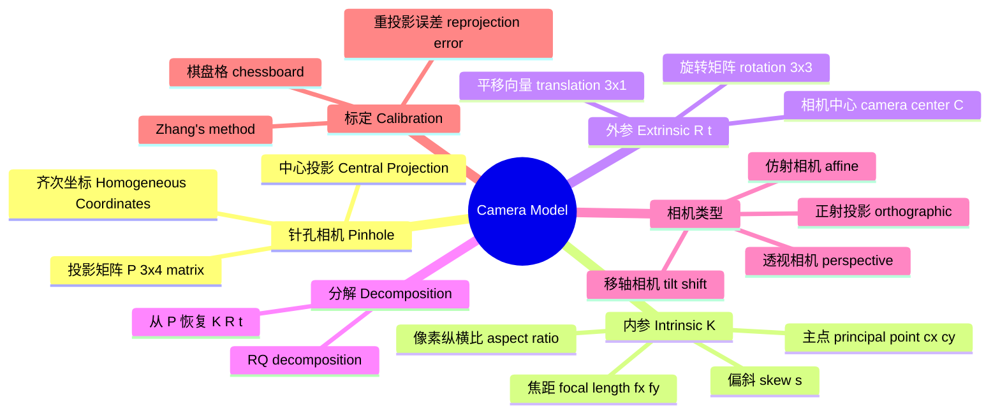
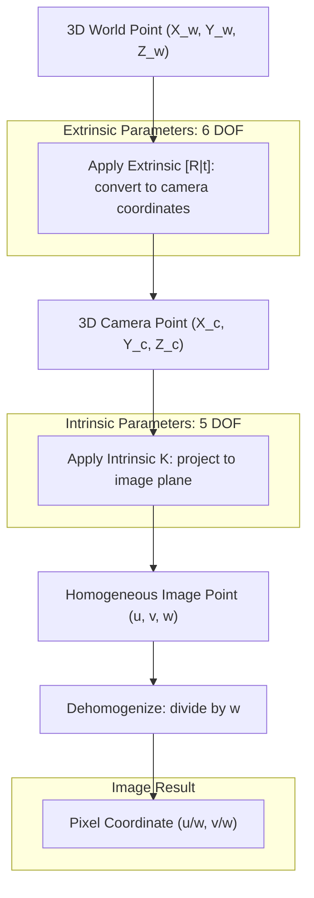

# 01 相机模型：三维世界如何变成二维图像

> 预计阅读时间：40 分钟
> 前置知识：无（本篇第 01 节）
> 读完本节后，你可以：理解光圈、焦距、视场角、景深等光学概念，知道为什么真实相机可以简化为针孔模型，写出完整的投影公式 $P = K[R|t]$，理解内参和外参的区别，用 OpenCV 标定自己的手机相机。

---

## 第〇阶：你真的了解你手里的相机吗？

在进入针孔模型之前，我们先花十分钟回答一个更根本的问题：**真实相机是怎么成像的？为什么我们可以用一个针孔来近似它？**

### 真实相机的结构

一台真实相机——无论是你的手机、单反还是工业相机——都由以下核心部件组成：

```
                        光圈 (Aperture)
                     ┌───────┐
                     │  ●●●  │  ← 可调节孔径
被摄物体  ──→  镜头组  │  ●●●  │  镜头组  ──→  CMOS/CCD 传感器
                     │  ●●●  │
                     └───────┘
                       ↑
                   光圈大小决定进光量
```

- **镜头（Lens）**：一组精密研磨的玻璃或塑料镜片，负责将入射光汇聚到传感器上。通常有 5–15 片镜片，每一片都经过镀膜以减少反射和色差。
- **光圈（Aperture）**：镜头中间一个**可调节孔径**，控制有多少光能通过。用 **f 值**（f-stop）表示，比如 f/1.4、f/2.8、f/16。f 值越小 → 孔径越大 → 进光越多。
- **快门（Shutter）**：控制传感器接收光的时间长度。机械快门是一道物理帘幕，电子快门则是直接控制传感器的通电时间。
- **传感器（Sensor）**：将光信号转换为电信号的芯片，由数百万个感光单元（像素）排列成矩形阵列。

### 曝光三角：光圈、快门、ISO

一张照片的亮度由三个参数的平衡决定——摄影师叫它"曝光三角"（Exposure Triangle）：

| 参数 | 作用 | 效果 | 单位 |
|------|------|------|------|
| **光圈（Aperture）** | 控制进光孔径 | 大光圈(f/1.4) → 亮、浅景深；小光圈(f/16) → 暗、深景深 | f 值 |
| **快门速度（Shutter Speed）** | 控制曝光时长 | 慢快门(1/30s) → 亮、可能模糊；快快门(1/4000s) → 暗、冻结运动 | 秒或分数秒 |
| **ISO（感光度）** | 控制传感器信号增益 | 低 ISO(100) → 干净、需要多光；高 ISO(6400) → 亮但有噪点 | 100–102400+ |

这三个参数互相牵制：在同样的环境光下，加大一档光圈 → 你可以用更快的快门或更低的 ISO → 分别影响景深和噪点。摄影就是在三者之间做取舍。

### 视场角（FOV）与焦距

**焦距（Focal Length）**是镜头的光学中心到传感器的距离。它和传感器尺寸一起决定了**视场角（Field of View, FOV）**——也就是相机能"看见"的角度范围：

$$FOV = 2 \cdot \arctan\left(\frac{d}{2f}\right)$$

其中 $d$ 是传感器的对角线长度，$f$ 是焦距。定性来说：

| 焦距 | 视场角 | 俗称 | 典型用途 |
|------|--------|------|---------|
| 8–24 mm | > 90° | 超广角 / 鱼眼 | 全景、AR/VR、机器人导航 |
| 24–35 mm | ~60–75° | 广角 | 街拍、手机主摄、安防监控 |
| 35–70 mm | ~30–55° | 标准 | 人像、日常记录 |
| 70–200 mm | ~10–30° | 长焦 | 远距拍摄、野生动物 |
| > 200 mm | < 10° | 超长焦 | 天文、体育、远距监控 |

在 3D 视觉中，FOV 决定了你能"看到"多大范围的三维信息。FOV 越大 → 单帧覆盖越多场景 → 但单位角度的像素越少 → 远处物体的细节越少。

### 景深：为什么近处清晰、远处模糊？

用大光圈拍一朵花，花很清晰，但背景是虚的。你看到的"虚"就是**景深（Depth of Field, DoF）**有限的表现。

景深是指：**在传感器前方，物体可以移动多远而依然看起来"清晰"**。它不是突然清晰→突然模糊，而是逐渐过渡的——模糊的程度用**弥散圆（Circle of Confusion, CoC）**来衡量。

```
清晰的像             传感器不在焦平面 → 弥散圆

   ●                    ○
   │ ← 点物             ／＼  ← 模糊光斑
   │                   ／  ＼
 镜头                 传感器
```

景深的计算公式（简化版）：

$$DoF \approx \frac{2 N c (u - f) f}{f^2 - N^2 c^2}$$

其中 $N$ 是 f 值（光圈），$c$ 是弥散圆直径，$u$ 是物距，$f$ 是焦距。

公式不需要记，但结论要记住：

| 如何增大景深（让更多东西清晰） | 物理原因 |
|-------------------------------|---------|
| **缩小光圈**（增大 f 值） | 光线只能从更窄的范围穿过 → 更接近"一根光线"的理想情况 |
| 缩短焦距（用广角镜头） | 同样的物距下，广角的光线汇聚角度更小 |
| 远离被摄物体 | 物距增大 → 像距变化的比例减小 |

### 关键桥梁：小光圈 → 针孔模型

上面讲了这么多光学概念，现在把它们串起来回答本章最根本的问题：**为什么一个由十几片镜片、镀膜、马达组成的复杂相机，可以被简化成"平面 + 小孔 + 胶片"三个东西？**

#### 问题出在哪：大光圈让"一个点"变成"一个圆"

真实镜头的光圈是一个圆形开口。我们来追踪物体上的一个点发射的光线：

```
大光圈（f/1.4）                         小光圈（f/16）
     点物                                  点物
      ●                                     ●
     /|\                                   /|\
    / | \         镜头                     / | \
   /  |  \      ┌────┐                   /  |  \
  /   |   \     │    │                   │  │  │
 /    |    \    │    │                   │  │  │
/_____|_____\___│____│___               _____│_____
      |         │    │                    │  │
      ● ● ●    └────┘                    │  └─┘─── 镜头
   三个可能的                              │  ●
    成像点                              唯一切线穿过
                                        → 一个像点
```

- **大光圈**（左图）：点物的光线可以从镜头表面的**各个位置**进入。如果传感器恰好不在完美焦平面，这些光线会聚成一个**弥散圆**——点变成了圆斑 = 模糊。
- **小光圈**（右图）：镜头只留了中间一条缝。点物的光线只能从**近乎同一位置**进入 → 不管传感器在哪里，光斑始终很小 → 始终"清晰"。

#### 极限：光圈趋近于零 = 针孔

当你把光圈收到无穷小的一瞬间，每个三维点发射到相机方向的光线中，只有**唯一一条**能穿过这个小孔：

```
三维点 A（近）  ─────────→
                            ＼
                             ＼
                              ○  ← 针孔（无穷小）
                             ／
                            ／
三维点 B（远）  ─────────→
                            │      │
                            │ CMOS │
                            │      │
                            │  ● A'（像点 A）
                            │  ● B'（像点 B）
                            │      │
```

此时发生了几件关键的事：

1. **景深消失了**（或者说：景深变成无穷大）。A 和 B 都在传感器上形成清晰的点——因为没有弥散圆，**每个物点对应唯一一个像点**，无论距离远近。物理上这叫"出入瞳趋近于零"。

2. **所有光线都是直线**。没有镜头 → 没有折射 → 没有色差 → 没有畸变。三维空间中的几何关系被**完整保留**为二维图像上的几何关系。

3. **投影变成相似三角形**。这是整个 3D 视觉数学的基石——第 01 节的核心公式 $P=K[R \mid t]$ 最终就是一个 3×4 矩阵乘法，它的"物理合法性"来自这个假设：**光是走直线的**。

#### 针孔模型解决了什么，牺牲了什么

| 维度 | 针孔模型做了什么 | 为什么这对 CV 至关重要 |
|------|-----------------|----------------------|
| **景深** | 消灭了景深概念 → 所有距离都清晰 | 不必关心"物体在不在焦平面上"，每个物点都有像点 |
| **光线路径** | 简化为唯一一条直线 | 投影关系退化为纯几何——可以用线性代数写出来 |
| **畸变** | 消灭了（无限小孔 = 无折射） | 不需要光学建模，标定只需拟合"偏离直线的部分" |

| 维度 | 针孔模型牺牲了什么 | 工程上怎么弥补 |
|------|-------------------|--------------|
| **进光量** | 几乎为零 | 真实相机用大光圈拍照，CV 用标定纠正畸变 |
| **衍射模糊** | 孔径太小 → 光波弯曲 → 本征模糊 | 适可而止——真实针孔相机孔径在 0.2–0.5 mm 左右 |
| **景深控制** | 无法用对焦突出主体 | CV 不关心这个——我们要的是"所有东西都清晰" |

> **关键认知**：针孔模型不是"真实相机的近似"，而是**真实相机在一个特定极限条件下的精确退化**。就像圆周率 π 在你取 100 位小数时已经很精确了——针孔模型在你"锁住光圈"时已经很精确了。后面的畸变标定就是处理"第 101 位小数"。

#### 景深在针孔模型中怎么理解？

在针孔模型中，景深这个概念**消失了**——或者更准确地说，景深变成了**无穷大**。

回顾景深公式：$DoF \propto N$（f 值）。当 $N \to \infty$（光圈趋近于零），$DoF \to \infty$。物理意义：针孔下没有任何一个距离范围是"模糊"的——所有距离的物体在被记录时，对应的弥散圆直径都等于针孔本身的直径。如果针孔直径足够小，这个模糊就小到可以忽略。

**但实际上你不能无限缩小光圈**。当光圈直径接近光的波长（~500 nm），**衍射**（Diffraction）出现了——光不再走直线，而是在小孔的边缘弯曲。这为针孔尺寸设定了一个下限：太大会模糊（几何模糊），太小也会模糊（衍射模糊）。最优针孔直径约在 0.2–0.5 mm。

所以真实的针孔摄影是：**所有距离都有一点点模糊，但所有距离的模糊程度完全一样。** 这句话对应到计算机视觉里就是：**如果假设了针孔模型，你不需要知道物体的距离就能写出它的投影方程。** 这正是 $P=K[R \mid t]$ 不需要场景深度的根本原因。

> **一句话**：普通摄影中"景深"的存在，是因为光圈不是无穷小——光从多个位置进入，在非焦平面形成了弥散圆。当你把光圈关到趋近于零，弥散圆消失了，景深趋近于无穷——针孔模型就是这个极限。所以我们可以在完全不知道场景深度的前提下，用 $3 \times 4$ 矩阵写投影。

---

## 第一阶：直观理解

### 一个场景

你拿起手机拍了张照片。真实世界是三维的——有远近、有高低、有前后。照片是二维的——只有宽和高。三维怎么变成二维的？这个"压扁"的过程就是**投影**。相机就是用来做这件事的，而理解相机如何做投影，是理解一切 3D 视觉算法的起点。

### 核心直觉：小孔成像

想象一个完全不透光的盒子，只在正面扎一个针尖大的孔。盒子背面贴一张感光胶片。外面有一棵树，阳光照在树上，反射的光线穿过小孔，在胶片上留下倒立的树影。

这就是**针孔相机模型**。它只有三个要素：

1. **三维世界中的一个点**（比如树顶的某片叶子）
2. **一个小孔**（光线只能从这里穿过）
3. **一个成像平面**（胶片、CMOS 传感器）

从那个三维点出发的光线，穿过小孔，直直地打在成像平面上。这个点落在成像平面上的位置，就是**投影点**。所有三维点的投影点合在一起，就是你的照片。

这个模型的妙处在于：它只用**一条直线**（光线）连接了三维世界和二维图像。没有复杂的折射、没有镜头畸变——就是一个简单的几何关系。理解了这个关系，你就能用数学精确描述"拍照片"这件事。

### 技术全景



### Mini Case：用 OpenCV 捕捉一帧并查看像素坐标

打开你的电脑摄像头，捕捉一帧，看看每个像素的坐标是什么样的。

```python
import cv2
import numpy as np

# Open the default camera
cap = cv2.VideoCapture(0)
if not cap.isOpened():
    raise RuntimeError("Cannot open camera")

ret, frame = cap.read()
cap.release()

if not ret:
    raise RuntimeError("Cannot read frame")

h, w = frame.shape[:2]
print(f"Image size: {w} x {h}")
print(f"Top-left pixel coordinate:    (0, 0)")
print(f"Top-right pixel coordinate:   ({w-1}, 0)")
print(f"Bottom-left pixel coordinate: (0, {h-1})")
print(f"Center pixel coordinate:      ({w//2}, {h//2})")
print(f"Bottom-right pixel coordinate: ({w-1}, {h-1})")

# Save and display
cv2.imwrite("/tmp/capture_test.jpg", frame)
print("\nFrame saved to /tmp/capture_test.jpg")
print("Now imagine: each of these pixels corresponds to a 3D point")
print("in the real world. The camera model tells you exactly which one.")
```

这段代码没有做任何视觉处理。它只是告诉你：你看到的每一帧图像，本质上就是一个二维数组——每个位置 `(u, v)` 记录了一个颜色值。相机模型的全部工作，就是告诉你：**三维世界中的点 `(X, Y, Z)` 会落在图像上的哪个位置 `(u, v)`**。

---

## 第二阶：原理解析

### 第一性原理：中心投影

针孔相机做的事情，用一句话说：**将三维空间中的点，沿着穿过一个固定点（相机中心）的直线，映射到一个平面上**。这在几何上称为**中心投影（central projection）**，是从三维射影空间 $IP^3$ 到二维射影平面 $IP^2$ 的映射。（H&Z section 6.1, p.154）

### 从三维点到像素坐标——完整推导

#### Step 1：最简单的针孔——没有主点偏移

假设小孔（相机中心）位于原点，相机朝向 Z 轴正方向，成像平面在距离 f 处（f 是焦距）。根据相似三角形：

```
X/Z = x/f   →   x = fX / Z
Y/Z = y/f   →   y = fY / Z
```

中心投影公式（H&Z 6.1, p.154）：
$$(X, Y, Z)^T \rightarrow (fX/Z, fY/Z)^T$$

这个映射是**非线性的**——除以 Z 使得远处的物体看起来更小（近大远小）。

#### Step 2：用齐次坐标线性化

引入齐次坐标后，这个非线性映射变成了线性矩阵乘法（H&Z 6.2, p.154）：

$$x = P X$$

其中 $P = \text{diag}(f, f, 1)[I\;|\;0]$，展开为：

$$\begin{pmatrix} u \cr v \cr w \end{pmatrix} =
\begin{pmatrix} f & 0 & 0 & 0 \cr 0 & f & 0 & 0 \cr 0 & 0 & 1 & 0 \end{pmatrix}
\begin{pmatrix} X \cr Y \cr Z \cr 1 \end{pmatrix}$$

从齐次坐标回到像素坐标只需除以第三分量：$(u/w, v/w)$。这就是齐次坐标的核心魅力——用多一维的代价换来线性的简洁。

#### Step 3：加入主点偏移

真实的相机传感器未必以光轴为中心。设主点（principal point）为 $(p_x, p_y)$——即光轴打在传感器上的位置（H&Z 6.3, p.155）：

$$(X, Y, Z)^T \rightarrow (fX/Z + p_x, fY/Z + p_y)^T$$

在齐次形式下，这等价于在投影矩阵中嵌入标定矩阵 K（H&Z 6.4, p.155）：

$$K = \begin{pmatrix} f & 0 & p_x \cr 0 & f & p_y \cr 0 & 0 & 1 \end{pmatrix}$$

此时投影变为 $x = K[I\;|\;0]X_{cam}$。

#### Step 4：CCD 像素——从毫米到像素

真正的数码相机使用 CCD/CMOS 传感器，像素可能不是正方形，且 x 和 y 方向的像素密度可能不同。因此需要将焦距从毫米转换为像素单位（H&Z 6.9, p.157）：

$$\alpha_x = f \cdot m_x, \quad \alpha_y = f \cdot m_y$$

其中 $m_x, m_y$ 是单位距离内的像素数。最通用的 K 矩阵还包含一个偏斜参数 $s$，表示像素的歪斜程度（H&Z 6.10, p.157）：

$$K = \begin{pmatrix} \alpha_x & s & x_0 \cr 0 & \alpha_y & y_0 \cr 0 & 0 & 1 \end{pmatrix}$$

| 参数 | 含义 | 物理意义 |
|------|------|---------|
| $\alpha_x, \alpha_y$ | 横向/纵向焦距（像素单位） | 决定了视场角的大小 |
| $x_0, y_0$ | 主点坐标 | 光轴打在 sensor 的位置，通常在图像中心附近 |
| $s$ | 偏斜参数 | 像素是否"歪"了——现代相机基本为 0 |

内参 K 从 3 DOF（$f, p_x, p_y$）到 5 DOF（$\alpha_x, \alpha_y, s, x_0, y_0$），每增加一个参数就多描述一种物理上的不完美。

#### Step 5：世界坐标系到相机坐标系——外参 R, t

前面的推导假设三维点已经在相机坐标系下。但现实中，物体在世界坐标系中，相机可以摆在任意位置。需要先做一次三维刚体变换（H&Z 6.6, p.156）：

$$X_{cam} = R(X - \tilde{C})$$

其中 $R$ 是 3x3 旋转矩阵（旋转由谁承担什么坐标系的意义），$\tilde{C}$ 是相机中心在世界坐标系中的坐标。

在齐次坐标下，这写成（H&Z 6.8, p.156）：

$$X_{cam} = \begin{pmatrix} R & -R\tilde{C} \cr 0 & 1 \end{pmatrix} X_{world}$$

定义 $t = -R\tilde{C}$，于是：

$$X_{cam} = [R\;|\;t]\;X_{world}$$

#### 核心公式：P = K[R|t]

将内参和外参合并，得到完整的相机投影矩阵（H&Z 6.8, p.156）：

$$P = K[R\;|\;t]$$

其中 $t = -R\tilde{C}$。

展开：

$$\underbrace{\begin{pmatrix} \alpha_x & s & x_0 \cr 0 & \alpha_y & y_0 \cr 0 & 0 & 1 \end{pmatrix}}_{K}
\underbrace{\begin{pmatrix} r_{11} & r_{12} & r_{13} & t_1 \cr r_{21} & r_{22} & r_{23} & t_2 \cr r_{31} & r_{32} & r_{33} & t_3 \end{pmatrix}}_{[R|t]}$$

**P 是一个 3x4 矩阵，秩为 3，有 11 个自由度**（5 个内参 + 3 个旋转 + 3 个平移）。

用人话总结：

> 一个三维世界点要变成像素坐标，经历两步：
> 1. **外参变换**：把世界坐标系下的点转到相机坐标系下——$[R|t]$ 告诉你相机"在哪"和"朝哪看"。
> 2. **内参投影**：把相机坐标系下的点投影到像素平面上——K 告诉你相机的"个性"（焦距多长、主点在哪）。
>
> $P = K[R|t]$ 这个公式是整本书最重要的公式之一。

### 投影管线全景



### P 矩阵的几何解读

相机矩阵 P 不仅是一个计算工具——它的每一行、每一列都有明确的几何意义（H&Z section 6.2, p.158-162）：

| P 的组成部分 | 几何意义 |
|-------------|---------|
| 左边 3x3 块 M | $M = KR$，包含了 K 和 R 的信息 |
| 第四列 $p_4$ | 与相机中心相关 |
| P 的行向量 | 世界空间中的平面（主平面、X/Y 轴平面） |
| P 的列向量 | 图像点——前三个列是消失点（vanishing points） |

关键性质：

- **相机中心 C**：P 的一维右零空间，即 $P C = 0$——这是一个纯代数定义的几何量，极其优雅（H&Z p.158）。
- **主平面**：P 的最后一行所定义的世界平面，这个平面上的所有点被投影到无穷远（H&Z p.160）。
- **主点**：$x_0 = M m^3$，其中 $m^3$ 是 M 的第三行（H&Z p.160-161）。
- **深度**（H&Z 6.15, p.162）：
  $$\text{depth}(X; P) = \text{sign}(\det M) \cdot \frac{w}{T \cdot \|m^3\|}$$
  可以判断一个三维点在相机前面还是后面。

> 一个 3x4 的相机矩阵 P 本身就是一个宝藏——你能从中直接读出相机中心在哪（$PC=0$）、主光轴方向（$m^3$）、主点位置（$Mm^3$）。所有的几何信息都"编码"在这个 12 个数字的矩阵里。

### 从 P 中拆解 K 和 R——RQ 分解

如果你有一个相机矩阵 P，但不知道它的内参和外参，如何把它们拆出来？

记 M 为 P 的左 3x3 块。由 $M = KR$，其中 K 是上三角矩阵，R 是正交矩阵（H&Z section 6.2.4, p.163）。这就是经典的 **RQ 分解**——将矩阵分解为一个上三角矩阵（R 在 QR 分解中，但这里是 RQ，上三角在左）和一个正交矩阵的乘积。

数值实现：对 M 的行向量（从下往上）做 Gram-Schmidt 正交化（H&Z A4.1.1, p.579）：

1. $r_3 = M_{2} / \|M_{2}\|$ → 得到 $K[2,2]$
2. $r_2 = (M_{1} - K[1,2] \cdot r_3) / \|\ldots\|$ → 得到 $K[1,1], K[1,2]$
3. $r_1 = (M_{0} - K[0,1] \cdot r_2 - K[0,2] \cdot r_3) / \|\ldots\|$ → 得到 $K[0,0], K[0,1], K[0,2]$

RQ 分解后，K 需要归一化使得 $K[2,2] = 1$ 来消除尺度歧义。相机中心 C 则通过 SVD 求 P 的零空间得到，然后 $t = -R C$（H&Z p.163-165）。

### Code Lens：用 NumPy 实现投影

以下代码直接验证 $P = K[R|t]$ 的投影过程，基于 $code_verify.py$ 的核心逻辑。

```python
import numpy as np


def build_camera_matrix(fx, fy, cx, cy, R, t):
    """
    Build finite projective camera matrix P = K [R | t].
    Reference: H&Z (6.8, p.156), K matrix: H&Z (6.10, p.157).

    Parameters
    ----------
    fx, fy : float
        Focal lengths in pixels (alpha_x, alpha_y in H&Z notation).
    cx, cy : float
        Principal point coordinates in pixels.
    R : np.ndarray, shape (3, 3)
        Rotation matrix (orthogonal, det=1).
    t : np.ndarray, shape (3,)
        Translation vector.

    Returns
    -------
    P : np.ndarray, shape (3, 4)
        Camera projection matrix.
    """
    # H&Z (6.10, p.157): K matrix (assume zero skew)
    K = np.array([
        [fx, 0, cx],
        [0, fy, cy],
        [0,  0,  1]
    ], dtype=np.float64)

    # H&Z (6.8, p.156): P = K [R | t]
    Rt = np.hstack([R, t.reshape(3, 1)])
    P = K @ Rt
    return P


def project(P, X_world):
    """
    Project 3D world points to 2D pixel coordinates.
    H&Z (6.1, p.154): (X,Y,Z)^T -> (fX/Z, fY/Z)^T
    H&Z (6.2, p.154): x = P X in homogeneous coordinates.
    """
    if X_world.ndim == 1:
        X_world = X_world.reshape(1, -1)

    if X_world.shape[1] == 3:
        ones = np.ones((X_world.shape[0], 1))
        X_homo = np.hstack([X_world, ones])
    else:
        X_homo = X_world

    # H&Z (6.2, p.154): x = P X
    x_homo = P @ X_homo.T  # shape (3, N)

    # Dehomogenize (H&Z p.154)
    w = x_homo[2, :]
    u = x_homo[0, :] / w
    v = x_homo[1, :] / w

    return np.column_stack([u, v])


# --- Example usage ---
fx, fy = 800.0, 800.0   # focal length in pixels
cx, cy = 320.0, 240.0   # principal point (640x480 image center)

# Camera at world origin, looking along +Z
R = np.eye(3)
t = np.array([0.0, 0.0, 0.0])

P = build_camera_matrix(fx, fy, cx, cy, R, t)

# 3D points at varying depths
points_3d = np.array([
    [0.0,  0.0,  5.0],   # on optical axis, 5m away
    [1.0,  1.0,  5.0],   # off-axis, 5m away
    [2.0, -1.0, 10.0],   # off-axis, 10m away
])

pixels = project(P, points_3d)
print("3D point -> 2D pixel")
for i, (pt, (u, v)) in enumerate(zip(points_3d, pixels)):
    print(f"  ({pt[0]:.1f}, {pt[1]:.1f}, {pt[2]:.1f}) -> ({u:.1f}, {v:.1f})")

# Manual verification: H&Z (6.1, p.154)
# (X,Y,Z) -> (f*X/Z + cx, f*Y/Z + cy)
for pt in points_3d:
    X, Y, Z = pt
    u_man = fx * X / Z + cx
    v_man = fy * Y / Z + cy
    assert np.allclose([u_man, v_man],
                       project(P, pt)[0], atol=1e-6)
print("Manual formula check passed.")
```

**代码解读**：

1. `build_camera_matrix` 构建 $P = K[R|t]$：先用 `np.hstack` 将 R 和 t 拼成 3x4 的 $[R|t]$ 块，再左乘 K（H&Z 6.8, p.156）。
2. `project` 完成 $x = PX$ 的矩阵乘法后，除以第三分量 w 做去齐次化——这正是 $X/Z, Y/Z$ 的非线性来源（H&Z 6.1, p.154）。
3. 手动验证直接使用公式 $(fX/Z + cx, fY/Z + cy)$ 计算，与矩阵形式等价。齐次坐标的妙处就是把非线性除法"隐藏"在矩阵乘法的第三步中。

---

## 第三阶：部署实战

### 透视相机 vs 仿射相机

真实相机是透视的——远处的物体看起来更小，平行线在远处交汇。但有时候，这个"近大远小"的效果可以忽略。

**仿射相机**是透视相机在极端条件下的近似：当焦距 $f \rightarrow \infty$ 且物体到相机的距离也 $\rightarrow \infty$ 时，透视效应消失。在数学上，仿射相机矩阵的最后一行是 $(0, 0, 0, 1)$（H&Z section 6.3, p.166-173）。

对比：

| 特性 | 透视相机 (Finite) | 仿射相机 (Affine) |
|------|------------------|-------------------|
| 最后一行 | $(r_{31}, r_{32}, r_{33}, t_3)$ | $(0, 0, 0, 1)$ |
| 平行线 | 交汇于消失点 | 始终保持平行 |
| DOF | 11 | 8 |
| 相机中心 | 有限远处 | 无穷远处 |
| 主点 | 有定义 | **无定义** |

仿射相机的三个子类型（H&Z p.171-172）：

| 类型 | DOF | 说明 |
|------|-----|------|
| 正射投影 Orthographic | 3 | 最简单的仿射，不缩放（H&Z 6.22, p.171） |
| 缩放正射投影 Scaled Orthographic | 5 | 加了一个均匀缩放（H&Z 6.24, p.171） |
| 弱透视投影 Weak Perspective | 7 | 允许不同的 x/y 缩放（H&Z 6.25, p.171） |
| 通用仿射相机 General Affine | 8 | $x = M_{2\times3}X + t$（H&Z 6.26, p.172） |

### 什么时候用仿射相机？

- **远距离长焦摄影**：你站在远处用长焦拍建筑，建筑上各点到相机的距离差异远小于到相机的平均距离——透视效应几乎消失。
- **卫星/航拍图像**：卫星离地面几百公里，地面高度变化几十米，深度变化相对极小。
- **显微镜成像**：被观测物体非常小，景深变化可忽略。

一个实用的判断标准：如果场景中所有点到相机的距离变化 $\Delta Z$ 远小于平均距离 $\bar{Z}$（即 $\Delta Z / \bar{Z} \ll 1$），仿射近似就成立。此时使用仿射相机可以显著减少待估计的参数数量（8 vs 11），简化重建算法（比如用因子分解法——后面章节会讲）。

### 移轴相机：透视之外的控制

在透视相机模型中，图像平面垂直于光轴——这意味着所有平行线都会汇聚到一个消失点。但在一些应用中，我们**不想要这种汇聚**。比如拍建筑时，如果相机朝上拍，楼会看起来向后倒；拍产品时需要精确控制景深以保证整体清晰。

**移轴相机（Tilt-Shift Camera）**通过让镜头相对传感器**偏移（Shift）**和**倾斜（Tilt）**来解决这些问题。


> **补充资料**：YouTube 上 [Tilt-Shift Lens: Explained](https://www.youtube.com/watch?v=gvV5sINKnT8) 对移轴镜头的光学原理和实际操作有直观演示。

#### Shift：改变成像区域而不改变透视

Shift 是将镜头平行于传感器移动。因为透视由相机中心的位置决定，而 shift 只移动了镜头（传感器相对移动），**相机中心没有变**，所以透视关系保持不变。

在数学上，shift 修改的是 $K$ 矩阵中的主点位置：
$$K_{shift} = \begin{pmatrix} \alpha_x & s & x_0 + s_x \cr 0 & \alpha_y & y_0 + s_y \cr 0 & 0 & 1 \end{pmatrix}$$

其中 $(s_x, s_y)$ 是 shift 量（单位：像素）。

**实际用途**：
- 拍高楼时，保持相机朝正前方，shift 镜头向上——大楼不会"倒"，而且透视仍然是正视的
- 全景拼接：用 shift 拍多张图，它们共享同一个相机中心，拼接时只有平面变换，没有视差

#### Tilt：改变焦平面（Scheimpflug 原理）

Tilt 是将镜头相对传感器**旋转**一个角度。普通的透视相机焦平面（最清晰的平面）总是平行于传感器。但 tilt 之后，**焦平面不再平行于传感器**——它可以斜着伸展。

这就是 **Scheimpflug 原理**：当镜头平面、传感器平面、焦平面三者的延长线相交于同一条线时，焦平面上的所有点都同时清晰。

在计算机视觉中，tilt 的效果可以建模为对相机内参 $K$ 施加一个旋转变换：
$$K_{tilt} = K \cdot R_{tilt}$$

其中 $R_{tilt}$ 是一个描述镜头倾斜的旋转矩阵（通常在 $2^\circ$ 到 $8^\circ$ 之间）。

**实际用途**：
- 产品摄影：让一个长物体的整个表面都清晰（焦平面沿物体表面延伸）
- 微缩模型效果（Miniature Faking）：这是很多人认识的"移轴效果"——反向用 tilt 让焦平面非常窄，真实场景看起来像微缩模型
- 结构光三维扫描：控制投影平面的聚焦范围

#### 在计算机视觉中的意义

移轴相机在传统 CV（尤其是摄影测量和工业检测）中有重要应用：
- 摄影测量中，shift 可以消除建筑物透视变形，使测量更精确
- 在立体视觉中，使用 tilt 可以扩展景深范围，减少因离焦带来的匹配失败
- 在 SfM（Structure from Motion）中，如果输入图像来自移轴镜头，标准的针孔相机模型会失效——必须修改投影模型，否则重建会扭曲

> **一句话**：普通相机服从 $P = K[R|t]$，移轴相机是 $P = K_{tilt,shift}[R|t]$——多出来的自由度给了你对成像平面和焦平面的精确控制。

### 实战：用 OpenCV 标定你的相机

相机标定是要解决的问题是：给定一个相机，如何找出它的 $K$ 矩阵和畸变参数？

**标定原理**（Zhang's method）：拍摄多张不同角度的棋盘格照片。棋盘格上每个角点的三维坐标已知（因为棋盘格是平面的，Z=0），在图像中检测角点得到二维坐标。对于每张图像，棋盘格平面和图像平面之间存在一个单应矩阵 H。利用 H 和旋转矩阵的正交性约束（$r_1 \cdot r_2 = 0$, $\|r_1\| = \|r_2\| = 1$），每张图像提供两个关于 K 的约束方程。K 有 5 个自由度（不统计畸变），所以至少需要 3 张图像。

```python
import cv2
import numpy as np
import glob

# Chessboard dimensions (inner corners)
pattern_size = (9, 6)  # 9x6 inner corners
square_size = 25.0     # square size in mm

# Prepare object points (Z=0 since chessboard is planar)
objp = np.zeros((pattern_size[0] * pattern_size[1], 3), np.float32)
objp[:, :2] = np.mgrid[0:pattern_size[0],
                        0:pattern_size[1]].T.reshape(-1, 2)
objp *= square_size

obj_points = []   # 3D points in world coordinates
img_points = []   # 2D points in image coordinates

images = sorted(glob.glob("calibration_images/*.jpg"))
if not images:
    raise RuntimeError(
        "No calibration images found. Please capture 10-20 images "
        "of a chessboard from different angles."
    )

grabbed_shape = None
for fname in images:
    img = cv2.imread(fname)
    gray = cv2.cvtColor(img, cv2.COLOR_BGR2GRAY)
    grabbed_shape = gray.shape[::-1]

    # Find chessboard corners
    ret, corners = cv2.findChessboardCorners(
        gray, pattern_size,
        cv2.CALIB_CB_ADAPTIVE_THRESH +
        cv2.CALIB_CB_FAST_CHECK +
        cv2.CALIB_CB_NORMALIZE_IMAGE
    )

    if ret:
        # Refine corner positions to sub-pixel accuracy
        corners_sub = cv2.cornerSubPix(
            gray, corners, (11, 11), (-1, -1),
            (cv2.TERM_CRITERIA_EPS + cv2.TERM_CRITERIA_MAX_ITER, 30, 0.001)
        )
        obj_points.append(objp)
        img_points.append(corners_sub)

print(f"Used {len(obj_points)} / {len(images)} images for calibration")

# Calibrate
ret, K, dist, rvecs, tvecs = cv2.calibrateCamera(
    obj_points, img_points, grabbed_shape, None, None
)

print(f"\nReprojection error (RMSE): {ret:.4f} px")
print(f"\nIntrinsic matrix K:\n{K}")
print(f"\nDistortion coefficients [k1, k2, p1, p2, k3]:\n{dist.ravel()}")
```

**输出解读**：

- `K` 矩阵的 $K[0,0]$ 和 $K[1,1]$ 是 $\alpha_x, \alpha_y$（像素单位的焦距）。如果它们是 800，在 640x480 图像上意味着视场角约为 $2 * arctan(240/800) ≈ 33.4°$（垂直）。
- 主点 $K[0,2], K[1,2]$ 应该在图像中心附近（如 320, 240），如果偏离太远可能说明 sensor 装配有问题。
- `dist` 是镜头畸变系数，包含径向畸变 $(k_1, k_2, k_3)$ 和切向畸变 $(p_1, p_2)$。

### 标定中的常见问题

| 问题 | 原因 | 解决方案 |
|------|------|---------|
| 重投影误差居高不下（>1 px） | 棋盘格角点检测不准或图像模糊 | 确保光照均匀、对焦清晰、棋盘格平整 |
| 标定结果每次跑都不同 | 图像数量太少，姿态覆盖不足 | 至少 10-15 张图，覆盖图像四角和不同倾斜角度 |
| K 矩阵主点偏到天边 | 棋盘格始终在图像同一区域，外参退化 | 棋盘格需要覆盖图像各个区域 |
| 畸变系数符号奇怪 | 部分图像角点检测有系统偏差 | 用 `cv2.drawChessboardCorners` 可视化检查每张图的角点是否正确 |
| 仅返回很少几张有效图 | 棋盘格有反光、局部过曝 | 用哑光棋盘格，避免强光直射 |

---

## 苏格拉底时刻

1. **如果相机矩阵 P 有 11 个自由度，为什么我们只用 9 个就能标定？那两个"多余"的自由度去哪了？**

   （提示：回想最简单的针孔模型——如果我们假设像素是正方形的、没有偏斜，K 矩阵的自由度从 5 降到了 3，加上外参的 6 个自由度，恰好就是 9。那两个"消失"的自由度被物理假设"吃掉了"——它们对应的是偏斜参数 s 和像素纵横比，在现代相机中几乎为常数。）

2. **如果我把世界坐标系的原点往左移一米，P 矩阵会变吗？会变多少？**

   （提示：这相当于对世界做了一个平移变换，等价于修改了 t。但反过来说，如果你拿到一个 P 矩阵，你能区分它是"相机在原点往右看"还是"相机在左边往原点看"吗？这引出一个深层问题：仅凭一张图像，我们无法区分场景的位移和相机的反向位移——这正是多视图几何要解决的根本歧义。）

---

## 关键论文清单

| 年份 | 论文/书籍 | 一句话贡献 |
|------|----------|-----------|
| 2004 | Hartley & Zisserman, *Multiple View Geometry in Computer Vision* (2nd Ed.) | 多视图几何的圣经，定义了 P=K[R\|t] 框架，本章主要参考 Ch.6 |
| 2000 | Z. Zhang, "A Flexible New Technique for Camera Calibration", IEEE TPAMI | Zhang 标定法——用平面棋盘格标定相机，极大降低了标定门槛 |
| 1999 | P. Sturm & S. Maybank, "On Plane-Based Camera Calibration", CVPR | 平面标定的理论基础 |
| 1987 | R. Tsai, "A Versatile Camera Calibration Technique", IEEE JRA | 经典两步标定法，影响了后续所有标定方法 |

---

## 实操练习

**练习 1：标定你的手机相机**

1. 在网上找一张棋盘格图片（或打印出来），用手机从 10-15 个不同角度拍摄（不要移动棋盘格，移动手机）。
2. 用上面的 OpenCV 代码跑一次标定。
3. 记录你的 $K$ 矩阵。用 $K[0,0]$ 和图像宽度估算水平视场角。
4. 回答：你的手机 camera 的像素是正方形的吗？（看 $K[0,0]$ 和 $K[1,1]$ 的比值）

**练习 2：体验"近大远小"与仿射近似**

1. 找一面有水平纹理的墙（如砖墙），分别在 0.5 米和 5 米处拍照。
2. 观察两张图里平行线的表现：近处拍照时，砖缝明显交汇（有消失点）；远处拍照时，砖缝近似平行。
3. 思考：如果要知道做 Structure from Motion 时该用透视模型还是仿射模型，要看什么条件？

---

## 延伸阅读

- 本书内：[[02 投影几何]] · [[03 多视图几何入门]] · [[05 坐标系转换]]
- H&Z 原书 Ch.6：完整覆盖有限相机、无限相机、相机标定矩阵的代数性质
- OpenCV Camera Calibration Tutorial：https://docs.opencv.org/4.x/dc/dbb/tutorial_py_calibration.html
- Zhang 标定论文：https://www.microsoft.com/en-us/research/publication/a-flexible-new-technique-for-camera-calibration/
