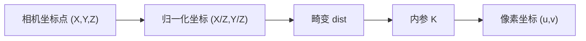

# 第 1 章 相机模型：三维点如何落到像素上

> [!NOTE]
> **预计阅读时间**：45 分钟 · **前置知识**：无（本篇第 1 章）
>
> 本章只解决一个核心问题：**给定相机坐标系中的一个 3D 点 $(X,Y,Z)$，如何预测它会落到图像里的哪个像素 $(u,v)$？**
>
> 读完本章后，你应该能说清楚这条链路：$X_{cam} \to (X/Z,Y/Z) \to dist \to K \to pixel$。也就是先做透视除法得到归一化坐标，再在归一化平面上加入畸变，最后用内参矩阵 $K$ 变成像素坐标。

---

## 1.1 本章目标

3D 视觉里很多任务看起来很不一样：单目深度估计要从一张图里猜深度，双目匹配要用两张图恢复距离，3D Gaussian Splatting 要把三维点投到很多张照片上渲染。但它们底层都绕不开同一个正向模型：

> 给定一个相机坐标系中的三维点，它应该出现在图像的哪个像素？

如果这个正向模型错了，后面的算法会一起歪掉。双目里，对极线会对不齐；SLAM 里，重投影误差会异常；3DGS 里，高斯会投到错误位置，画面就会发糊或漂移。

本章先不讨论相机在世界里的位置，也不讨论相机怎么运动。我们把问题固定在最小闭环里：

```text
相机坐标系中的 3D 点  ->  图像上的 2D 像素
```

外参 $[R|t]$、世界坐标系、相机姿态会在下一章「坐标系转换」里加入。这里先把相机自身的几何成像模型讲清楚。



你可以把本章看成后续所有章节的“投影接口说明书”。输入是相机坐标系下的点，输出是像素位置；中间每一步都有明确的物理意义和工程接口。

---

## 1.2 真实相机与几何抽象

真实相机当然不只是一个数学矩阵。它有镜头、光圈、快门、传感器，还有对焦、曝光、景深、噪声。但对 3D 视觉来说，我们首先关心的是其中一部分：**哪些因素会改变“点落在哪个像素”，哪些因素主要影响“这个像素有多亮、多清晰”。**

### 1.2.1 真实相机里哪些东西和几何有关

一台相机的光路可以粗略拆成四个部件：

- **镜头（Lens）**：把来自场景点的光线重新汇聚到传感器上。镜头的焦距、对焦状态和畸变会直接影响几何投影。
- **光圈（Aperture）**：控制通过镜头的光束宽度。它主要影响进光量和景深，对理想几何投影位置不是主变量。
- **快门（Shutter）**：控制曝光时间。它影响亮度和运动模糊，不改变静态点的理想投影公式。
- **传感器（Sensor）**：把光变成像素。传感器尺寸、像素密度、主点位置会进入内参矩阵 $K$。


*镜头剖面示意图。真实镜头用多片镜片和光圈把光线组织起来；几何模型只抽取其中“中心投影”和“畸变”这两个最重要的关系。*


*CMOS 图像传感器芯片。传感器把连续成像平面采样成像素网格，因此内参矩阵必须把几何坐标换算成像素坐标。*

### 1.2.2 焦距、对焦和像素焦距

**光学焦距** $f_{opt}$ 不是简单的“镜头到传感器的距离”。严格地说，它由镜片曲率和折射率决定；对焦到无穷远时，传感器到后主平面的距离近似等于它。入门时可以先把它理解成：决定视角宽窄的核心参数。

视场角（Field of View, FOV）可以用下面的近似公式理解：

$$FOV = 2 \cdot \arctan\left(\frac{d}{2f}\right)$$

其中 $d$ 是传感器在某个方向上的物理长度，$f$ 是对应的焦距或像距。焦距越长，视场角越窄；焦距越短，视场角越宽。

拧对焦环时，真实镜头内部的某些镜片组会移动，改变像距 $v$，让某个物距处的点成像清晰。高斯成像公式给出这个关系：

$$\frac{1}{u} + \frac{1}{v} = \frac{1}{f_{opt}}$$

其中 $u$ 是物距，$v$ 是像距。对焦在无穷远时，$v \approx f_{opt}$；对焦在近处时，$v > f_{opt}$。

### 1.2.3 光圈、景深和针孔模型的边界

光圈用 f 值表示，例如 f/1.4、f/2.8、f/16。f 值越小，孔径越大，进光越多，景深越浅；f 值越大，孔径越小，进光越少，景深越深。


*光圈刻度示意图。光圈会影响亮度和景深，但不是针孔投影公式里的内参矩阵。*

景深（Depth of Field, DoF）描述的是：物体离开焦平面多远后仍然“看起来清晰”。离焦点在传感器上不再是锐利点，而是一个模糊光斑，这个光斑叫**弥散圆**（Circle of Confusion）。


*景深示意图。景深解释的是“清不清楚”，而本章的几何模型先回答“落在哪里”。*

> [!NOTE]
> 针孔模型是一个**几何抽象**，不是“小光圈”的同义词。它假设三维点、光学中心、像点三者共线，因此能预测像点位置；它不描述离焦模糊、曝光、噪声、衍射、色差和眩光。

真实镜头用多片镜片把从同一个物点出发的多条光线重新汇聚到传感器上的同一点。针孔模型不追踪这些折射路径，只保留一个等效关系：这个物点看起来像是沿着穿过某个固定点的直线投到成像平面上。这个固定点可以理解为理想化的光学中心。

因此本章的分工很清楚：

| 进入几何模型 | 暂时不进入几何模型 |
|-------------|------------------|
| 中心投影 | 曝光亮度 |
| 像素焦距和主点 | ISO 噪声 |
| 镜头畸变 | 离焦模糊 |
| 传感器像素坐标 | 快门导致的运动模糊 |
| 特殊相机模型 | 色差、眩光、暗角 |

---

## 1.3 针孔模型：从 3D 点到归一化坐标

现在进入核心任务：给定相机坐标系中的三维点

$$X_{cam} = (X,Y,Z)^T$$

其中相机中心是原点，$Z$ 轴朝前。这个点在图像上会落在哪里？

### 1.3.1 小孔成像的直觉

想象一个不透光的盒子，正面只有一个针尖小孔，背面是感光平面。场景中一个点发出的光线只有穿过小孔的那一条能到达感光平面，所以三维点、小孔、成像点必然共线。


*针孔相机几何示意图。点 $X$ 经相机中心 $C$ 投影到图像平面 $x$。（H&Z Figure 6.1）*

> [!NOTE]
> 物理小孔相机的成像平面在小孔后方，图像会上下左右倒置。计算机视觉通常使用位于相机前方的**虚拟成像平面**，这样投影公式可以写成正号：$x=fX/Z$、$y=fY/Z$。虚拟平面不改变几何对应关系，只让公式更干净。

### 1.3.2 中心投影和透视除法

针孔相机做的事可以用一句话概括：**把三维点沿着穿过相机中心的直线映射到一个平面上**。这个过程叫中心投影（Central Projection）。

先把焦距归一化为 1，也就是把成像平面放在 $Z=1$ 处。根据相似三角形：

$$x = \frac{X}{Z}, \qquad y = \frac{Y}{Z}$$

$(x,y)$ 叫**归一化图像坐标**。它没有像素单位，也没有主点偏移，只表达一件事：这个三维点从相机中心看过去，对应哪条方向射线。

> [!TIP]
> 除以 $Z$ 是透视效果的根源。同样的 $X$，如果 $Z$ 更大，$X/Z$ 就更小，所以远处物体看起来更靠近主点、更小。这就是“近大远小”。

到这里，我们还没有相机品牌、分辨率、像素大小这些信息。归一化坐标是所有针孔相机共享的中间层，后面的畸变和内参都会接在它后面。

---

## 1.4 内参矩阵 K：从归一化坐标到像素

归一化坐标 $(x,y)$ 还不是图像里的像素。像素坐标需要回答三个工程问题：

1. 一个归一化单位对应多少像素？
2. 光轴打在图像上的哪个像素？
3. 像素网格有没有偏斜或非正方形？

这些信息被打包进内参矩阵 $K$。

### 1.4.1 主点和像素焦距

真实图像坐标通常以左上角为原点，向右是 $u$，向下是 $v$。光轴和成像平面的交点叫**主点**（Principal Point），记作 $(x_0,y_0)$。理想情况下它接近图像中心，但真实装配会有偏移。


*相机坐标系与图像坐标系的关系。主点 $\mathbf{p}$ 是光轴在成像平面上的交点。（H&Z Figure 6.2）*

从归一化坐标到像素坐标，最常见的无偏斜形式是：

$$u = \alpha_x x + x_0, \qquad v = \alpha_y y + y_0$$

代入 $x=X/Z$、$y=Y/Z$，得到：

$$u = \frac{\alpha_x X}{Z} + x_0, \qquad v = \frac{\alpha_y Y}{Z} + y_0$$

其中 $\alpha_x,\alpha_y$ 是**像素焦距**。如果传感器每毫米有 $m_x,m_y$ 个像素，当前像距是 $v_{img}$，那么：

$$\alpha_x = v_{img} \cdot m_x, \qquad \alpha_y = v_{img} \cdot m_y$$

> [!TIP]
> $K$ 里存的是“用像素量出来的焦距”。一台手机的光学焦距可能是 4.2 mm，但如果像素密度是 100 pixel/mm，对应的像素焦距就是约 420 pixel。

### 1.4.2 K 矩阵的形式

更一般地，如果像素网格存在偏斜参数 $s$，投影可以写成：

$$u = \alpha_x x + s y + x_0, \qquad v = \alpha_y y + y_0$$

这里有一个很容易混淆的点：$K$ 不是直接作用在三维点 $(X,Y,Z)$ 上得到最终像素，而是作用在**归一化图像点的齐次形式**上。

先把归一化坐标写成齐次形式：

$$\tilde{x}_n = \begin{bmatrix} x \cr y \cr 1 \end{bmatrix} = \begin{bmatrix} X/Z \cr Y/Z \cr 1 \end{bmatrix}$$

> [!TIP]
> **齐次坐标（homogeneous coordinates）这个名字确实有点怪。** 这里先把它当成一种“多写一个数的坐标记法”：二维点 $(x,y)$ 可以写成 $(x,y,1)$，也可以写成 $(2x,2y,2)$、$(10x,10y,10)$。这些写法都表示同一个点，因为最后都要除以第三个数变回 $(x,y)$。
>
> 它的意义是把“先乘矩阵、再除一次”的透视投影写得很整齐。比如 $(\bar{u},\bar{v},\bar{w})$ 最后变成 $(\bar{u}/\bar{w},\bar{v}/\bar{w})$。多出来的那个 $\bar{w}$ 就负责保存“还没除掉的尺度”。第 3 章会系统讲齐次坐标；本章只需要知道它是投影公式的记账方式。

然后用内参矩阵把它变成像素坐标的齐次形式：

$$\tilde{x}_{pixel} = \begin{bmatrix} u \cr v \cr 1 \end{bmatrix} = K\tilde{x}_n = \begin{bmatrix} \alpha_x & s & x_0 \cr 0 & \alpha_y & y_0 \cr 0 & 0 & 1 \end{bmatrix}\begin{bmatrix} x \cr y \cr 1 \end{bmatrix}$$

展开后就是前面的两条式子：

$$u = \alpha_x x + s y + x_0, \qquad v = \alpha_y y + y_0$$

> [!TIP]
> 这一步没有再除以深度，因为深度已经在 $x=X/Z$、$y=Y/Z$ 里被消掉了。$K$ 做的是单位转换和坐标平移：把“方向坐标”换成“像素坐标”。

| 参数 | 含义 | 常见情况 |
|------|------|---------|
| $\alpha_x$ | x 方向像素焦距 | 几百到几千 pixel |
| $\alpha_y$ | y 方向像素焦距 | 通常接近 $\alpha_x$ |
| $x_0,y_0$ | 主点坐标 | 接近图像中心 |
| $s$ | 偏斜参数 | 现代相机基本为 0 |

> [!TIP]
> $K$ 描述相机“怎么看”：焦距有多长、主点在哪里、像素网格是什么样。外参 $[R|t]$ 描述相机“在哪、朝哪看”。本章先固定外参，只研究 $K$。

### 1.4.3 无畸变投影的完整链路

到目前为止，我们得到的是**无畸变针孔模型**：

```text
(X,Y,Z) -> (x,y)=(X/Z,Y/Z) -> K -> (u,v)
```

把这条链路完整写出来：

第一步，输入是相机坐标系中的三维点：

$$X_{cam} = \begin{bmatrix} X \cr Y \cr Z \end{bmatrix}, \qquad Z > 0$$

第二步，做透视除法，得到归一化坐标：

$$x = X/Z, \qquad y = Y/Z$$

第三步，用 $K$ 把归一化坐标换成像素坐标：

$$\begin{bmatrix} u \cr v \cr 1 \end{bmatrix} = K\begin{bmatrix} x \cr y \cr 1 \end{bmatrix}$$

如果你想把“除以 $Z$”和“乘 $K$”压成一行，也可以写成齐次比例关系：

$$\lambda\begin{bmatrix} u \cr v \cr 1 \end{bmatrix} = K\begin{bmatrix} X \cr Y \cr Z \end{bmatrix}, \qquad \lambda = Z$$

这句话的意思是：先算

$$\begin{bmatrix} \bar{u} \cr \bar{v} \cr \bar{w} \end{bmatrix} = K\begin{bmatrix} X \cr Y \cr Z \end{bmatrix}$$

再做反齐次化：

$$u = \bar{u}/\bar{w}, \qquad v = \bar{v}/\bar{w}$$

因为 $K$ 的第三行是 $(0,0,1)$，所以 $\bar{w}=Z$。这就是为什么代码里可以先算 `K @ X_cam`，再除以第三个分量。

> [!TIP]
> 两种写法说的是同一件事。教学上更清楚的是三步写法：先除以 $Z$ 得到归一化坐标，再乘 $K$ 得到像素。实现上常用齐次写法：先算 $KX_{cam}$，最后除以第三个分量。

---

## 1.5 畸变：真实镜头偏离针孔模型的主要方式

无畸变针孔模型假设直线仍然成直线。但真实镜头尤其是广角镜头，会让图像边缘的直线弯曲。这种偏离叫**镜头畸变**（Lens Distortion）。

畸变最重要的工程规则是：

> 畸变加在归一化平面上，不加在像素平面上。

也就是说，含畸变的流程是：

```text
(X,Y,Z) -> (x,y)=(X/Z,Y/Z) -> (x_d,y_d)=dist(x,y) -> K -> (u,v)
```

对应公式：

先做透视除法：

$$x = X/Z, \qquad y = Y/Z$$

再在归一化平面上施加畸变：

$$(x_d, y_d) = \operatorname{dist}(x,y)$$

最后用内参矩阵变成像素：

$$\begin{bmatrix} u \cr v \cr 1 \end{bmatrix} = K\begin{bmatrix} x_d \cr y_d \cr 1 \end{bmatrix}$$

> [!TIP]
> 畸变来自镜头的光学形状，应该先在“焦距为 1、主点在原点”的归一化空间里描述。之后再用 $K$ 换算到具体相机的像素网格。这样畸变参数不会随着图像分辨率变化而失去意义。

### 1.5.1 径向畸变

径向畸变（Radial Distortion）只和点到主点的距离有关。越靠近图像边缘，偏移通常越明显。


*短焦距广角镜头拍摄的室内场景。边缘直线明显弯曲。（H&Z Figure 7.4a）*


*同一位置用长焦距镜头拍摄，边缘直线更接近理想针孔模型。（H&Z Figure 7.4b）*

OpenCV 常用的径向模型是：

$$ (x_r, y_r)^T = (1 + k_1 r^2 + k_2 r^4 + k_3 r^6)(x,y)^T $$

其中 $r^2=x^2+y^2$。$k_1,k_2,k_3$ 是径向畸变系数。

| 类型 | 常见符号 | 视觉效果 | 常见于 |
|------|---------|---------|--------|
| 桶形畸变（Barrel） | $k_1 < 0$ | 边缘向外鼓 | 广角、手机超广角、安防 |
| 枕形畸变（Pincushion） | $k_1 > 0$ | 边缘向内凹 | 长焦、部分老镜头 |

OpenCV 还支持有理模型：

$$ factor = \frac{1 + k_1 r^2 + k_2 r^4 + k_3 r^6}{1 + k_4 r^2 + k_5 r^4 + k_6 r^6} $$

一般镜头先用 $k_1,k_2,p_1,p_2$ 就够；强广角或鱼眼才考虑更多参数。参数越多，越容易过拟合。

### 1.5.2 切向畸变

切向畸变（Tangential Distortion）主要来自镜头和传感器没有完美平行，或者镜片装配存在微小偏心。它不是从中心向外均匀拉伸，而是在某些方向上把图像“拉扯”。

OpenCV 常用形式是：

$$ x_t = x + 2p_1xy + p_2(r^2 + 2x^2), \qquad y_t = y + p_1(r^2 + 2y^2) + 2p_2xy $$

$p_1,p_2$ 是切向畸变系数。真实实现中，径向和切向会一起叠加，最终得到 $(x_d,y_d)$。

### 1.5.3 去畸变和工程判断

在 OpenCV 的投影和去畸变接口里，畸变参数通常打包成 `distCoeffs`：

```text
(k1, k2, p1, p2[, k3[, k4, k5, k6[, s1, s2, s3, s4[, tau_x, tau_y]]]])
```

| 参数个数 | 包含内容 | 适用场景 |
|---------|---------|---------|
| 4 | $k_1,k_2,p_1,p_2$ | 大多数普通镜头 |
| 5 | 加 $k_3$ | 畸变较明显的广角 |
| 8 | 加 $k_4,k_5,k_6$ | 强畸变广角 |
| 14 | 加薄棱镜和 tilted model | 特殊工业/移轴场景 |

不是所有任务都必须显式矫正畸变：

| 场景 | 建议 |
|------|------|
| 工业定焦镜头，FOV < 60° | 可能可忽略，但要看误差要求 |
| 手机主摄，只用中心区域 | 通常影响较小 |
| 手机超广角或鱼眼 | 必须建模或去畸变 |
| 双目匹配 | 通常必须先矫正畸变 |
| AR/VR 虚实叠加 | 必须精确处理 |

去畸变的代码入口：

```python
import cv2

# K: 相机内参矩阵 (3x3)
# dist: 畸变系数，如 (k1, k2, p1, p2, k3)
# img: 原始畸变图像

undistorted = cv2.undistort(img, K, dist)

# 视频流里更常用：先预计算映射，再逐帧 remap
map1, map2 = cv2.initUndistortRectifyMap(
    K, dist, None, K, (width, height), cv2.CV_16SC2
)
undistorted = cv2.remap(img, map1, map2, cv2.INTER_LINEAR)
```

> [!TIP]
> `initUndistortRectifyMap` 先算好“目标图像中的每个像素应该去原图哪里采样”。视频每帧只查表和插值，比每次重新计算畸变反函数更快。


*原始畸变图像。右侧书架和天花板明显弯曲。（H&Z Figure 7.6a）*


*去畸变后的图像。直线被拉直，但边界会出现无效区域。（H&Z Figure 7.6b）*


*畸变校正的几何示意图。（H&Z Figure 7.5）*

---

## 1.6 工程接口与代码验证

这一节把公式落到代码上。我们只做相机坐标系到像素的投影，因此没有外参。

### 1.6.1 NumPy 实现无畸变投影

```python
import numpy as np


def project_camera_to_pixel(K, X_cam):
    """
    Project 3D points in CAMERA coordinates to 2D pixel coordinates.

    Parameters
    ----------
    K : np.ndarray, shape (3, 3)
        Intrinsic calibration matrix.
    X_cam : np.ndarray, shape (N, 3) or (3,)
        3D points in camera coordinates.

    Returns
    -------
    pixels : np.ndarray, shape (N, 2)
        Pixel coordinates (u, v).
    """
    X_cam = np.asarray(X_cam, dtype=np.float64)
    if X_cam.ndim == 1:
        X_cam = X_cam.reshape(1, 3)

    X = X_cam[:, 0]
    Y = X_cam[:, 1]
    Z = X_cam[:, 2]

    if np.any(Z <= 0):
        raise ValueError("All points must be in front of the camera: Z > 0")

    x = X / Z
    y = Y / Z

    fx, skew, cx = K[0, 0], K[0, 1], K[0, 2]
    fy, cy = K[1, 1], K[1, 2]

    u = fx * x + skew * y + cx
    v = fy * y + cy
    return np.column_stack([u, v])


def project_camera_to_pixel_homogeneous(K, X_cam):
    """
    Same projection in homogeneous form:
    [ubar, vbar, wbar]^T = K @ [X, Y, Z]^T, then u=ubar/wbar, v=vbar/wbar.
    """
    X_cam = np.asarray(X_cam, dtype=np.float64)
    if X_cam.ndim == 1:
        X_cam = X_cam.reshape(1, 3)

    x_homo = (K @ X_cam.T).T
    u = x_homo[:, 0] / x_homo[:, 2]
    v = x_homo[:, 1] / x_homo[:, 2]
    return np.column_stack([u, v])


fx, fy = 800.0, 800.0
cx, cy = 320.0, 240.0

K = np.array([
    [fx, 0.0, cx],
    [0.0, fy, cy],
    [0.0, 0.0, 1.0],
])

points_cam = np.array([
    [0.0,  0.0,  5.0],
    [1.0,  1.0,  5.0],
    [2.0, -1.0, 10.0],
])

pixels = project_camera_to_pixel(K, points_cam)
pixels_homo = project_camera_to_pixel_homogeneous(K, points_cam)

assert np.allclose(pixels, pixels_homo)

for pt, pix in zip(points_cam, pixels):
    print(f"{pt} -> {pix}")
```

> [!TIP]
> 第一种写法展示了投影链路：先除以 $Z$ 得到归一化坐标，再乘 $K$ 得到像素。第二种写法展示了齐次坐标的压缩形式：先算 $KX_{cam}$ 得到 $(\bar{u},\bar{v},\bar{w})$，再用 $(\bar{u}/\bar{w},\bar{v}/\bar{w})$ 反齐次化。两者在无畸变情况下完全等价。


*相机坐标系下的透视投影可视化。离相机更远的点，即使横向坐标更大，投影也可能更靠近主点。*

### 1.6.2 OpenCV 的 `projectPoints`

工程里通常直接用 OpenCV：

```python
import cv2
import numpy as np

K = np.array([
    [800.0, 0.0, 320.0],
    [0.0, 800.0, 240.0],
    [0.0, 0.0, 1.0],
])

points_cam = np.array([
    [0.0,  0.0,  5.0],
    [1.0,  1.0,  5.0],
    [2.0, -1.0, 10.0],
], dtype=np.float64)

# 已经是相机坐标系，所以外参用 R=I, t=0。
rvec = np.zeros(3)
tvec = np.zeros(3)
dist = None

pixels, _ = cv2.projectPoints(points_cam, rvec, tvec, K, dist)
pixels = pixels.reshape(-1, 2)
print(pixels)
```

`cv2.projectPoints` 的常见参数：

| 参数 | 含义 |
|------|------|
| `objectPoints` | 三维点，形状 `(N, 3)` |
| `rvec` | Rodrigues 旋转向量 |
| `tvec` | 平移向量 |
| `cameraMatrix` | 内参矩阵 $K$ |
| `distCoeffs` | 畸变系数，可传 `None` |

这里传 `rvec=0,tvec=0`，是因为输入点已经在相机坐标系下。下一章引入世界坐标系后，`rvec,tvec` 才会表示世界到相机的外参。

## 1.7 模型边界：透视、仿射、移轴

针孔模型是最常用的有限透视相机模型，但不是所有成像设备都严格使用这一种模型。本节只做边界说明，目的是让你知道什么时候该怀疑默认模型。

### 1.7.1 透视相机和仿射相机

透视相机保留 $Z$ 的影响：点越远，投影越小。仿射相机把深度变化近似掉，投影变成线性映射。

| 特性 | 透视相机 | 仿射相机 |
|------|---------|---------|
| 投影 | 需要除以 $Z$ | 近似线性 |
| 近大远小 | 有 | 无或很弱 |
| 平行线 | 可能汇聚到消失点 | 保持平行 |
| 适用 | 普通相机、手机、机器人 | 远距离、长焦、卫星、显微 |

当物体自身深度变化 $\Delta Z$ 远小于平均距离 $\bar{Z}$ 时，仿射近似可能成立。例如卫星看地面、显微镜看薄样本、长焦远距离拍建筑。


*透视投影与弱透视近似的对比。（H&Z Figure 6.8）*

### 1.7.2 移轴相机

移轴相机（Tilt-Shift Camera）通过让镜头相对传感器平移或倾斜，控制透视和焦平面。


*移轴相机镜头结构。Shift 是平移镜头，Tilt 是倾斜镜头。*

**Shift** 主要改变成像区域，工程上可以理解为改变主点位置：

$$K_{shift} = ((\alpha_x, s, x_0+s_x), (0, \alpha_y, y_0+s_y), (0, 0, 1))$$

它常用于建筑摄影：保持相机不仰拍，通过镜头平移拍到高楼上部，减少“楼向后倒”的视觉效果。

**Tilt** 改变的是焦平面和传感器平面的相对关系，不能简单理解成“把整台相机转了一下”。在更完整的相机模型里，它可以表示为归一化坐标上的额外透视变换，通常用 $\tau_x,\tau_y$ 这类参数描述。


*Scheimpflug 原理示意图。镜头平面、传感器平面和被摄平面的延长线相交于同一条线时，被摄平面可以整体清晰。*


*移轴镜头拍摄的微缩模型效果。真实场景因为焦平面很窄而看起来像模型。*

> [!CAUTION]
> 普通手机、单反和工业相机通常不需要 tilted model。如果物理上没有传感器倾斜，额外参数可能只是拟合噪声，反而让模型不稳定。

---

## 1.8 本章速查、问题与练习

### 1.8.1 最重要的三句话

1. 无畸变针孔投影是：$(X,Y,Z) \to (X/Z,Y/Z) \to K \to (u,v)$。
2. 畸变加在归一化平面：$(X/Z,Y/Z) \to (x_d,y_d)$，然后才乘 $K$。
3. 几何模型回答“落在哪个像素”，不回答“这个像素有多亮、多清晰”。

### 1.8.2 符号速查

| 符号 | 含义 | 单位/维度 |
|------|------|-----------|
| $X_{cam}=(X,Y,Z)^T$ | 相机坐标系中的三维点 | m 或 mm |
| $(x,y)$ | 归一化坐标 $(X/Z,Y/Z)$ | 无量纲 |
| $(x_d,y_d)$ | 畸变后的归一化坐标 | 无量纲 |
| $(u,v)$ | 像素坐标 | pixel |
| $K$ | 内参矩阵 | $3 \times 3$ |
| $\alpha_x,\alpha_y$ | 像素焦距 | pixel |
| $x_0,y_0$ | 主点坐标 | pixel |
| $s$ | 偏斜参数 | pixel |
| $f_{opt}$ | 光学焦距 | mm |
| $v$ | 像距，随对焦变化 | mm |
| $k_1,k_2,k_3$ | 径向畸变系数 | 无量纲 |
| $p_1,p_2$ | 切向畸变系数 | 无量纲 |

### 1.8.3 苏格拉底时刻

1. 如果一个点的相机坐标是 $(1,0,5)$，另一个是 $(2,0,10)$，它们的归一化横坐标分别是多少？为什么它们会投到同一条竖线上？

2. 如果把同一个镜头从 640×480 相机换到 4K 相机上，为什么畸变模型应该先写在归一化坐标里，而不是直接写在像素坐标里？

3. 如果一个系统在运行中开启自动对焦，为什么固定的 $K$ 可能失效？这里变化的是光学焦距 $f_{opt}$，还是像距 $v$？

4. `cv2.projectPoints(points, rvec, tvec, K, dist)` 里，如果 `points` 已经是相机坐标系，`rvec` 和 `tvec` 应该怎么填？

### 1.8.4 实操练习

**练习 1：手算一次投影**

设：

$$K = ((800,0,320),(0,800,240),(0,0,1))$$

计算点 $(0,0,5)$、$(1,1,5)$、$(2,-1,10)$ 的像素坐标。再用 1.6 的 NumPy 代码验证。

**练习 2：观察手机超广角畸变**

找一扇门框或瓷砖墙，用手机主摄和超广角分别拍摄。观察图像边缘的直线是否弯曲，判断更像桶形畸变还是枕形畸变。再思考：如果做双目匹配，为什么这种弯曲会破坏对极约束？

### 1.8.5 延伸阅读

- 本书内：[[第 2 章 坐标系转换]] · [[第 3 章 投影几何]] · [[第 4 章 多视图几何入门]]
- Hartley & Zisserman, *Multiple View Geometry in Computer Vision*, Ch.6：有限相机、内参矩阵和仿射相机
- Hartley & Zisserman, Ch.7 §7.4：径向畸变与利用直线估计畸变
- OpenCV `calib3d` 文档：`projectPoints`、`undistort` 和畸变模型
