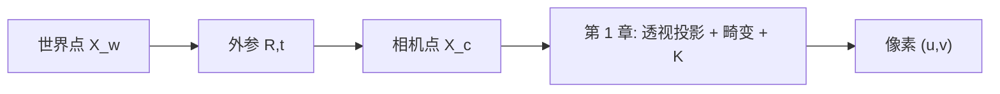

# 第 2 章 坐标系转换：相机在世界里的位置

> [!NOTE]
> **预计阅读时间**：50 分钟 · **前置知识**：第 1 章（相机模型）
>
> 第 1 章只回答了“相机坐标系中的 3D 点如何落到像素”。本章补上前半段：**世界坐标系中的点，如何先变成相机坐标系中的点**。读完后，你应该能说清楚 $R,t,C$ 的关系，理解 OpenCV 里的 `rvec/tvec`，知道标定和 PnP 分别在求什么。

---

## 2.1 本章目标

第 1 章的输入是：

$$X_{cam}=(X_c,Y_c,Z_c)^T$$

但真实项目里，一个点通常不是一开始就用相机坐标表示的。它可能来自：

- 棋盘格坐标系：角点在棋盘格平面上的位置。
- 机器人坐标系：物体相对于机械臂基座的位置。
- LiDAR 坐标系：点云相对于激光雷达的位置。
- 世界坐标系：场景地图里某个路标点的位置。

所以完整投影链应该是：

```text
X_world -> 外参 R,t -> X_cam -> 归一化坐标 -> 畸变 -> K -> 像素
```

本章只新增第一段：

```text
X_world -> X_cam
```

也就是回答：**相机在哪里，朝哪里看？**

---

## 2.2 坐标系不是物理物体，而是描述方式

同一个点可以有很多组坐标。杯子在房间里可能是 $(3,0.8,2)$，在相机眼里可能是 $(0.5,-0.3,2.1)$。杯子没有移动，变的是参考系。

### 2.2.1 常见坐标系

| 坐标系 | 原点 | 坐标含义 |
|--------|------|---------|
| 世界坐标系 | 人为指定 | 场景、地图、棋盘格、机器人基座里的位置 |
| 相机坐标系 | 相机光心 | 点相对于相机的左右、上下、前后 |
| 归一化图像坐标 | 光轴与成像平面交点 | 去掉焦距和像素单位后的方向坐标 |
| 像素坐标系 | 图像左上角 | 图像数组里的列号 $u$ 和行号 $v$ |

OpenCV 里常用的相机坐标约定是：

| 轴 | 方向 |
|----|------|
| $X_c$ | 向右 |
| $Y_c$ | 向下 |
| $Z_c$ | 向前，远离相机 |

> [!TIP]
> 坐标系转换不是在移动物体，而是在换一种语言描述同一个物体。世界坐标回答“它在场景哪里”，相机坐标回答“它在相机眼前哪里”。

### 2.2.2 一条完整链路



本章会反复使用下面这条式子：

$$X_c = R X_w + t$$

其中 $R$ 是旋转，$t$ 是平移。它们合起来叫**外参**（extrinsics）：相机相对于世界的位置和姿态。

---

## 2.3 外参：$R,t,C$ 到底是什么

### 2.3.1 两种等价写法

设世界坐标系中的点为 $X_w$，相机坐标系中的点为 $X_c$。

最常见的外参写法是：

$$X_c = R X_w + t$$

另一种更直观的写法是：

$$X_c = R(X_w - C)$$

这里 $C$ 是**相机中心在世界坐标系中的位置**。两式等价，因为：

$$t = -RC$$

反过来：

$$C = -R^Tt$$

> [!TIP]
> $t$ 不是“相机在世界里的位置”。$t$ 是世界原点在相机坐标系里的位置。真正的相机中心世界坐标是 $C=-R^Tt$。这是初学外参时最常见的混淆。

### 2.3.2 齐次形式：把旋转和平移拼成一个矩阵

为了让旋转和平移一次矩阵乘法完成，我们把世界点写成齐次坐标：

$$\tilde{X}_w = \begin{bmatrix} X_w \cr Y_w \cr Z_w \cr 1 \end{bmatrix}$$

外参矩阵是：

$$[R|t] = \begin{bmatrix} r_{11} & r_{12} & r_{13} & t_x \cr r_{21} & r_{22} & r_{23} & t_y \cr r_{31} & r_{32} & r_{33} & t_z \end{bmatrix}$$

于是：

$$X_c = [R|t]\tilde{X}_w$$

再接上第 1 章的无畸变投影：

$$\lambda\begin{bmatrix} u \cr v \cr 1 \end{bmatrix} = K[R|t]\begin{bmatrix} X_w \cr Y_w \cr Z_w \cr 1 \end{bmatrix}$$

这就是完整相机矩阵：

$$P = K[R|t]$$

> [!TIP]
> $P$ 是一个把世界点直接投到像素齐次坐标的“总矩阵”。但理解时不要跳过中间步骤：先 $X_w \to X_c$，再按第 1 章做 $X_c \to pixel$。

---

## 2.4 旋转怎么表示：矩阵、轴角、四元数

平移很好表示，就是三个数。旋转麻烦得多，因为它不是普通向量加法。工程里你会遇到至少四种表示。

### 2.4.1 旋转矩阵 $R$

旋转矩阵是 $3 \times 3$ 矩阵，直接作用在 3D 点上：

$$X'_c = R X_c$$

它有 9 个数，但只有 3 个自由度，因为它必须满足：

$$R^TR=I, \qquad \det(R)=1$$

优点是变换点很方便；缺点是做优化时不方便，因为你不能随便改这 9 个数，否则它就不再是合法旋转。

### 2.4.2 Rodrigues 轴角：OpenCV 的 `rvec`

OpenCV 的 `solvePnP`、`calibrateCamera`、`projectPoints` 都喜欢用 `rvec`。它不是欧拉角，而是 **Rodrigues 旋转向量**：

- 方向：旋转轴
- 长度：旋转角度，单位 rad

例如 `rvec = (0,0,pi/2)` 表示绕 z 轴旋转 90 度。

```python
import cv2
import numpy as np

rvec = np.array([0.0, 0.0, np.pi / 2])
R, _ = cv2.Rodrigues(rvec)

rvec_back, _ = cv2.Rodrigues(R)
print(R)
print(rvec_back.ravel())
```

> [!TIP]
> `rvec` 适合优化，因为它只用 3 个数表示旋转；$R$ 适合变换点，因为矩阵乘法直接。OpenCV 让你输入 `rvec`，内部需要时再转成 $R$。

### 2.4.3 欧拉角：直观但不适合做核心表示

欧拉角用 yaw/pitch/roll 这类角度描述旋转，直观，适合给人看。但它有两个问题：

- 旋转顺序不同，结果不同。
- 会遇到万向锁（gimbal lock）。

所以工程里常用欧拉角做界面显示，不建议作为优化变量。

### 2.4.4 四元数：机器人和图形引擎常见

四元数用四个数表示旋转，常写成：

$$q=(w,x,y,z)$$

它比旋转矩阵紧凑，比欧拉角稳定，适合姿态插值。因此 ROS、Unity、机器人系统里经常出现四元数。

| 表示 | 数量 | 优点 | 注意 |
|------|------|------|------|
| 旋转矩阵 $R$ | 9 | 直接变换点 | 有正交约束 |
| Rodrigues `rvec` | 3 | OpenCV 常用，适合优化 | 不是欧拉角 |
| 欧拉角 | 3 | 人类直观 | 顺序敏感，有万向锁 |
| 四元数 | 4 | 稳定，适合插值 | 需要单位长度约束 |

---

## 2.5 正向投影代码：从世界点到像素

下面的代码把本章和第 1 章连起来：先用外参得到相机坐标，再投影到像素。

```python
import numpy as np


def world_to_camera(X_world, R, t):
    """Transform 3D points from world frame to camera frame."""
    X_world = np.asarray(X_world, dtype=np.float64)
    if X_world.ndim == 1:
        X_world = X_world.reshape(1, 3)
    return (R @ X_world.T + t.reshape(3, 1)).T


def camera_to_pixel(X_cam, K):
    """Project camera-frame points to pixels without distortion."""
    X = X_cam[:, 0]
    Y = X_cam[:, 1]
    Z = X_cam[:, 2]
    if np.any(Z <= 0):
        raise ValueError("Some points are behind the camera: Z <= 0")

    x = X / Z
    y = Y / Z
    u = K[0, 0] * x + K[0, 1] * y + K[0, 2]
    v = K[1, 1] * y + K[1, 2]
    return np.column_stack([u, v])


K = np.array([
    [800.0, 0.0, 320.0],
    [0.0, 800.0, 240.0],
    [0.0, 0.0, 1.0],
])

R = np.eye(3)
t = np.array([0.0, 0.0, 0.0])

points_world = np.array([
    [0.0, 0.0, 5.0],
    [1.0, 1.0, 5.0],
    [2.0, -1.0, 10.0],
])

points_cam = world_to_camera(points_world, R, t)
pixels = camera_to_pixel(points_cam, K)
print(pixels)
```

如果你想写成一行矩阵，也可以：

```python
Rt = np.column_stack([R, t])
points_h = np.column_stack([points_world, np.ones(len(points_world))])
x_h = (K @ Rt @ points_h.T).T
pixels = x_h[:, :2] / x_h[:, 2:3]
```

> [!TIP]
> 一行写法适合代码实现，分步写法适合理解和调试。实际项目里一旦投影错了，第一件事就是分别检查 $X_c$ 的符号、$Z_c$ 是否大于 0、像素是否落在图像范围内。

---

## 2.6 反方向：一个像素对应一条射线

从世界到像素是确定的。但从一个像素反推三维点时，深度丢了。

已知像素 $(u,v)$ 和内参 $K$，可以先反推归一化方向：

$$\begin{bmatrix} x \cr y \cr 1 \end{bmatrix} = K^{-1}\begin{bmatrix} u \cr v \cr 1 \end{bmatrix}$$

这表示相机坐标系中的一条射线：

$$X_c(\lambda)=\lambda\begin{bmatrix} x \cr y \cr 1 \end{bmatrix}, \qquad \lambda>0$$

如果还知道外参，可以把这条射线转回世界坐标：

$$X_w(\lambda)=C+\lambda R^T\begin{bmatrix} x \cr y \cr 1 \end{bmatrix}$$

> [!TIP]
> 单个像素不能唯一确定 3D 点，只能确定一条从相机中心发出的射线。双目、三角测量、深度传感器，本质上都是在给这条射线补上深度。

---

## 2.7 PnP：已知 3D-2D 对应，求相机位姿

现在正向链路已经清楚了：

```text
给定 K, R, t, X_w -> 预测像素 (u,v)
```

PnP（Perspective-n-Point）解决逆问题：

```text
给定 K、若干 3D 世界点、它们的 2D 像素位置 -> 求 R,t
```

典型场景：

- AR：识别桌面上的标记点后，求手机相机相对于桌面的位姿。
- 机器人：已知物体模型上的 3D 点和图像检测点，求物体/相机姿态。
- SLAM 重定位：已知地图中的 3D 路标，求当前帧相机位姿。

```python
import cv2
import numpy as np

object_points = np.array([
    [0, 0, 0],
    [1, 0, 0],
    [1, 1, 0],
    [0, 1, 0],
], dtype=np.float32)

image_points = np.array([
    [320, 240],
    [420, 240],
    [420, 340],
    [320, 340],
], dtype=np.float32)

K = np.array([
    [800, 0, 320],
    [0, 800, 240],
    [0, 0, 1],
], dtype=np.float32)

success, rvec, tvec = cv2.solvePnP(
    object_points, image_points, K, None,
    flags=cv2.SOLVEPNP_ITERATIVE
)

if success:
    R, _ = cv2.Rodrigues(rvec)
    print("rvec:", rvec.ravel())
    print("R:\n", R)
    print("t:", tvec.ravel())
```

> [!TIP]
> PnP 默认内参 $K$ 已知，只求当前相机外参。它不是标定；它更像“定位”。如果 3D 点里有误匹配，实际工程里通常用 `cv2.solvePnPRansac`。

---

## 2.8 标定在求什么：先看输出，不急着推导

本章可以讲标定，但只讲到“它在求什么”和“输出怎么用”。张氏标定法为什么能从平面棋盘格求 $K$，放到第 3 章讲。

相机标定的输入通常是：

- 多张棋盘格图片。
- 棋盘格角点在棋盘格坐标系中的 3D 坐标，通常 $Z=0$。
- 这些角点在图像中的 2D 像素坐标。

标定的输出通常是：

| 输出 | 含义 | 后续用途 |
|------|------|---------|
| $K$ | 内参矩阵 | 投影、反投影、PnP、去畸变 |
| `distCoeffs` | 畸变参数 | 去畸变、精确投影 |
| `rvecs` | 每张标定图的旋转 | 棋盘格坐标系到相机坐标系 |
| `tvecs` | 每张标定图的平移 | 棋盘格坐标系到相机坐标系 |

OpenCV 入口长这样：

```python
ret, K, dist, rvecs, tvecs = cv2.calibrateCamera(
    object_points, image_points, image_size, None, None
)
```

这一行背后的几何关系是：

$$\lambda x = K[R|t]X$$

其中每张棋盘格图都有自己的 $R,t$，但所有图片共享同一个 $K$ 和畸变参数。

> [!TIP]
> 标定不是只求一个 $K$。它同时求：相机内参、畸变、每张图片中棋盘格相对于相机的姿态。第 3 章会解释为什么“平面棋盘格 + 多个姿态”足够约束 $K$。

---

## 2.9 工程坐标约定：OpenCV、OpenGL、Unity

不同系统对坐标轴方向的约定不同，最容易导致图像上下颠倒、物体跑到相机后方、旋转方向反了。

| 系统 | 常见约定 |
|------|---------|
| OpenCV | $X$ 右，$Y$ 下，$Z$ 前 |
| OpenGL | $X$ 右，$Y$ 上，视线常沿 $-Z$ |
| Unity | $X$ 右，$Y$ 上，$Z$ 前，左手系 |
| ROS 常见机器人基座 | $X$ 前，$Y$ 左，$Z$ 上 |

检查方法很朴素：放三个单位向量，看它们投影到图像哪里。比背转换公式可靠。

> [!CAUTION]
> 不要只看矩阵形状对不对。坐标约定错了，矩阵仍然能乘，但结果会系统性错误。尤其是 OpenCV 和图形引擎之间传姿态时，必须确认轴方向、手性、图像原点和单位。

---

## 2.10 本章小结、问题与练习

本章的主线是：

```text
世界点 X_w --R,t--> 相机点 X_c --第 1 章投影模型--> 像素 (u,v)
```

最重要的三件事：

1. $X_c=RX_w+t$ 和 $X_c=R(X_w-C)$ 等价，且 $t=-RC$。
2. OpenCV 的 `rvec` 是 Rodrigues 轴角，不是欧拉角。
3. PnP 求的是外参；标定同时求内参、畸变和每张图的外参。

### 苏格拉底时刻

1. 为什么 $t$ 不是相机中心的世界坐标？如果给你 $R,t$，怎么求 $C$？
2. 如果一个点投影后的 $u,v$ 是负数，它一定在相机后方吗？还需要检查什么？
3. `solvePnP` 和 `calibrateCamera` 都会输出 `rvec/tvec`，它们分别表示谁相对于谁的位姿？
4. 一个像素反投影后为什么是一条射线，而不是一个 3D 点？

### 实操练习

**练习 1：手写完整投影链**

设 $K$ 已知，$R=I$，$t=(0,0,0)^T$。分别投影点 $(0,0,5)$、$(1,1,5)$。然后把 $t$ 改成 $(0,0,1)^T$，观察像素位置如何变化。

**练习 2：理解 `rvec`**

用 `cv2.Rodrigues` 把 `rvec=(0,0,pi/2)` 转成旋转矩阵。拿点 $(1,0,0)$ 左乘这个矩阵，观察它转到了哪里。

**练习 3：像素反投影**

已知 $K=((800,0,320),(0,800,240),(0,0,1))$，计算像素 $(320,240)$ 和 $(400,240)$ 在相机坐标系下对应的射线方向。

### 延伸阅读

- 本书内：[[第 1 章 相机模型]] · [[第 3 章 投影几何]] · [[第 5 章 深度表示]]
- Hartley & Zisserman, *Multiple View Geometry*, Ch.6.1：有限相机模型
- OpenCV `solvePnP` / `projectPoints` / `calibrateCamera` 文档
