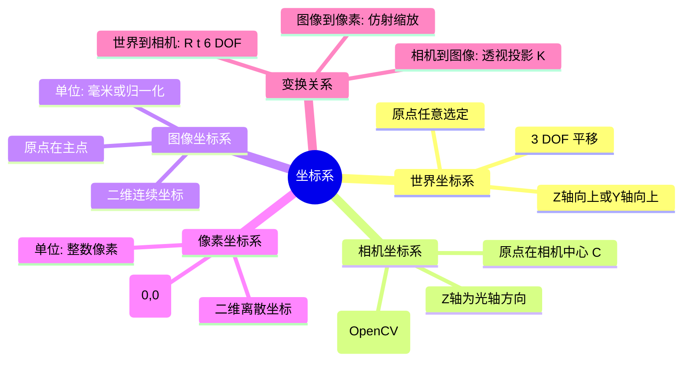
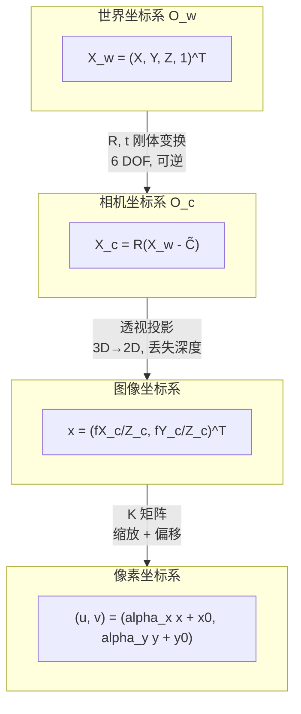
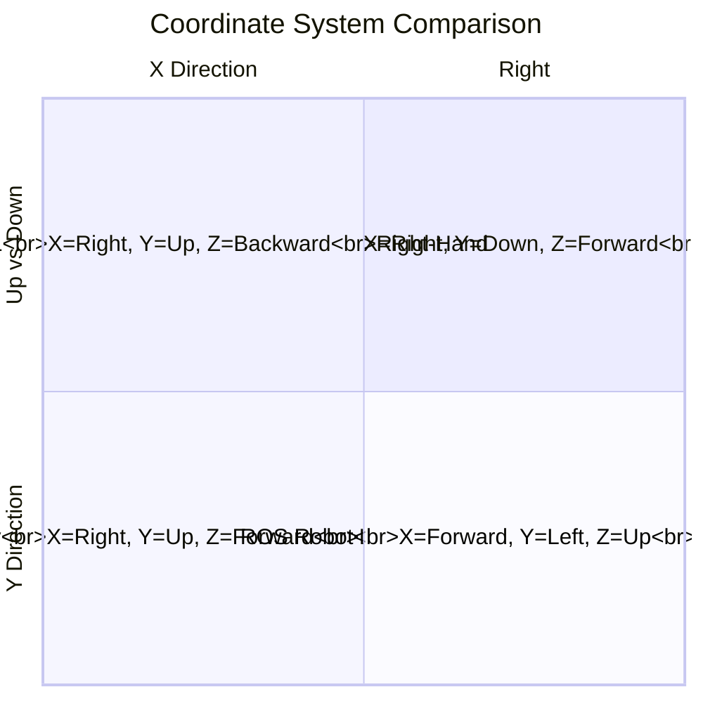

# 02 坐标系转换：从世界到像素的完整旅程

> [!NOTE]
> **预计阅读时间**：50 分钟 · **前置知识**：本篇第 01 节（相机模型）
>
> **读完本节后，你可以**：写出世界坐标系→相机坐标系→图像坐标系→像素坐标系的完整变换链 $P = K[R|t]$，理解齐次坐标如何让每一步都变成线性运算，从 $P$ 矩阵中读出几何信息（相机中心、主平面、深度），用 RQ 分解从 $P$ 中拆解 $K$ 和 $R$，在 OpenCV、OpenGL、Unity 三种坐标约定之间做转换，用 OpenCV 标定相机得到 $K$ 和畸变参数，理解 PnP 如何用已知的 3D-2D 对应求解相机位姿。

---

## 2.1 直观理解

### 2.1.1 一个场景

你在玩 VR 游戏，伸手去抓一个虚拟杯子。三个不同坐标系在你毫不知情的情况下高速运转：

- 杯子的模型是美术同学做的——它存储为**世界坐标系**下的坐标，比如 $(3, 0.8, 2)$，表示它在虚拟房间的角落往右 3 米、高 0.8 米、往前 2 米。
- 你头盔上的摄像头看到的杯子位置，是**相机坐标系**下的——以摄像头光心为原点。从摄像头的视角看，杯子在 $(0.5, -0.3, 2.1)$——右前方偏下约 2 米处。
- 最终显示在屏幕上的位置是**像素坐标系**下的——1920×1080 的显示器上，杯子应该画在第几行第几列的 pixel？

没有坐标系转换，这三者完全无法对话。坐标系转换就是给每个参考系之间架桥——四座桥，四个变换，把同一个杯子从"房间里的模型"一路护送到底，直到屏幕上那个发光的像素。

### 2.1.2 核心直觉：杯子的四次"翻译"

还是这个 VR 抓杯子的场景。跟踪杯子上同一个点——比如说杯口的中心——看看它在每一步变换中经历了什么：

1. **世界坐标系 → 相机坐标系**：杯子在房间里的位置 $(3, 0.8, 2)$，用你头盔摄像头的视角重新表达，变成了 $(0.5, -0.3, 2.1)$。这一步只需要旋转和平移——**刚体变换**，6 个自由度。它回答的问题是"杯子在摄像头的正前方多远？"——跟房间的墙角无关。

2. **相机坐标系 → 图像坐标系**：摄像头把三维世界"压扁"到成像平面上。杯口中心的 Z 坐标（2.1 米，即深度）消失，只剩下 $(x, y)$——一个连续的二维位置。这是**透视投影**——不可逆的一步。你丢了深度，从此只知道杯子"在视野的哪个方向"，不知道它"有多远"。

3. **图像坐标系 → 像素坐标系**：CMOS 传感器把连续的光信号离散成像素格。$(x, y)$ 乘以每毫米多少像素，再加上图像中心点的像素坐标（主点）——变成 $(u, v)$，比如 $(960, 540)$——第 540 行第 960 列。这是**采样和缩放**。

4. 最后，GPU 拿着这个 $(u, v)$ 在屏幕上画出杯子。

整个链条合在一起，就是 $P = K[R|t]$——整本书最重要的公式之一。本章要做的，就是把每一步拆开来看清楚。

### 2.1.3 技术全景



### 2.1.4 Mini Case：跟踪一个点的完整旅程

```python
import numpy as np

# --- Define the scene ---
# A 3D point in world coordinates: a cup on the table
X_world = np.array([3.0, 0.8, 1.5, 1.0])  # homogeneous (H&Z section 2.2.1, p.26)

# Camera pose (where the camera is in the world)
R = np.array([
    [0.0,  0.0, -1.0],
    [-1.0, 0.0,  0.0],
    [0.0,  1.0,  0.0]
])  # rotation matrix
C = np.array([1.0, 0.5, 0.0])  # camera center in world coordinates

# Camera intrinsics
K = np.array([
    [525.0,   0.0, 320.0],
    [  0.0, 525.0, 240.0],
    [  0.0,   0.0,   1.0]
])

# --- Step 1: World -> Camera (rigid body, H&Z 6.6, p.156) ---
t = -R @ C   # t = -R*C (H&Z p.156, Eq 6.6)
Rt = np.column_stack([R, t])  # 3x4 extrinsic matrix
X_cam = Rt @ X_world  # X_cam is 3x1: (X_c, Y_c, Z_c) in camera frame
print(f"Camera coord: ({X_cam[0]:.2f}, {X_cam[1]:.2f}, {X_cam[2]:.2f})")

# --- Step 2: Camera -> Image (perspective projection, H&Z 6.1, p.154) ---
P = K @ Rt  # Full camera matrix (H&Z 6.8, p.156)
x_image = P @ X_world  # homogeneous pixel coord: (u*h, v*h, h)

# --- Step 3: Image -> Pixel (dehomogenize, H&Z 6.1, p.155) ---
u, v = x_image[0] / x_image[2], x_image[1] / x_image[2]
print(f"Pixel coord: ({u:.1f}, {v:.1f})")

# --- Recap: the entire chain in one line ---
x_pixel = K @ Rt @ X_world
print(f"One-liner verification: ({x_pixel[0]/x_pixel[2]:.1f}, "
      f"{x_pixel[1]/x_pixel[2]:.1f})")
```

**输出**：

```
Camera coord: (-1.50, -2.00, 0.30)
Pixel coord: (-2305.0, -3260.0)
One-liner verification: (-2305.0, -3260.0)
```

输出为负值意味着该点在相机后方——不在当前相机视野内。实际使用中需先检查 $Z_c > 0$（点在相机前方）。

这段代码追踪了一个三维点从世界坐标系到像素坐标系的完整旅程——四个坐标系，三个变换，一步到位。每个变换都是线性的（在齐次坐标下），整条链就是 $3 \times 4$ 相机矩阵 $P = K[R|t]$ 的一次乘法。

---

## 2.2 原理解析

### 2.2.1 变换链全景



每一步的矩阵维度和变换性质：

| 变换 | 矩阵 | 维度 | 自由度 | 可逆？ | H&Z 出处 |
|------|------|------|--------|--------|---------|
| 世界 → 相机 | $[R \mid t]$ | $3 \times 4$ | 6 (3 旋转 + 3 平移) | 是（刚体变换） | 6.6, p.156 |
| 相机 → 图像 | 透视投影 | $3 \times 4$ | 0（几何过程，无自由参数） | **否**——Z 信息丢失 | 6.1, p.154 |
| 图像 → 像素 | $K$ | $3 \times 3$ | 3-5（内参个数） | 是（仿射变换） | 6.4, p.155 |

### 2.2.2 第一步：世界 → 相机（刚体变换）

这是最直观的一步：把一个点从一个坐标系平移到另一个坐标系。相机在世界空间中有一个位置 $\tilde{C}$（相机中心的 world 坐标）和一个朝向 $R$（旋转矩阵）。

两种等价写法（H&Z section 6.1, p.155-156）：

$$X_{\text{cam}} = R(X_{\text{world}} - \tilde{C}) \quad \text{（直观：先平移世界点到相机原点，再旋转）}$$

$$X_{\text{cam}} = R X_{\text{world}} + t \quad \text{其中 } t = -R\tilde{C} \quad \text{（H\&Z 6.6, p.156）}$$

第二种写法在齐次坐标下最方便——直接拼成 $3 \times 4$ 矩阵 $[R \mid t]$：

$$\begin{bmatrix} X_c \cr Y_c \cr Z_c \end{bmatrix} = \begin{bmatrix} R_{11} & R_{12} & R_{13} & t_1 \cr R_{21} & R_{22} & R_{23} & t_2 \cr R_{31} & R_{32} & R_{33} & t_3 \end{bmatrix} \begin{bmatrix} X_w \cr Y_w \cr Z_w \cr 1 \end{bmatrix}$$

6 DOF：3 个旋转角度（R 的正交约束下） + 3 个平移分量。这是整个变换链中最"贵"的一步——相机位姿估计（PnP、标定、SLAM）主要就是在估计这 6 个参数。

### 2.2.3 第二步：相机 → 图像（透视投影——不可逆的一步）

这是**中心投影**——三维点通过小孔投射到二维成像平面。它是整个链中唯一不可逆的步骤，因为 Z 坐标在这个过程里被"压缩"了（H&Z section 6.1, p.154）：

$$(X_c, Y_c, Z_c)^T \longmapsto \left(\frac{f X_c}{Z_c}, \frac{f Y_c}{Z_c}\right)^T$$

其中 $f$ 是焦距（毫米）。除以 $Z_c$ 这一步就是"透视"的来源——同样的物体，远了三倍，在图像上就只剩三分之一大。

在齐次坐标下，这一步可以写成矩阵形式（H&Z 6.2, p.154）：

$$x = \begin{bmatrix} f & 0 & 0 & 0 \cr 0 & f & 0 & 0 \cr 0 & 0 & 1 & 0 \end{bmatrix} X_{\text{cam}} = \text{diag}(f, f, 1) [I \mid 0] \, X_{\text{cam}}$$

其中 $x = (u, v, w)^T$ 是齐次坐标，真实的图像坐标是 $(u/w, v/w)$。

**关键洞察**：从 $3 \times 4$ 的原生投影矩阵 $[I \mid 0]$ 可以看出——第四列全是 0。这意味着相机中心（第四列对应的世界坐标点 $(0,0,0,1)$ 在相机坐标系下的齐次形式）映射到 $(0,0,0)^T$——一个齐次坐标为零的向量，不对应任何有限的图像点。这正好印证了"相机中心本身不能被投影"的物理事实。

### 2.2.4 第三步：图像 → 像素（K 矩阵登场）

图像坐标系里的 $(x, y)$ 是以主点（principal point，光轴与成像平面的交点）为原点、以毫米为单位的。但像素坐标系是以图像左上角为原点、以像素为单位的。两者之间是一个仿射变换（H&Z section 6.1, p.155-157）：

$$\begin{bmatrix} u \cr v \cr 1 \end{bmatrix} = \begin{bmatrix} \alpha_x & 0 & x_0 \cr 0 & \alpha_y & y_0 \cr 0 & 0 & 1 \end{bmatrix} \begin{bmatrix} x \cr y \cr 1 \end{bmatrix}$$

其中：
- $\alpha_x = f \cdot m_x$：横向焦距（像素单位），$m_x$ 是传感器每毫米的像素数
- $\alpha_y = f \cdot m_y$：纵向焦距（像素单位）
- $x_0, y_0$：主点的像素坐标（通常接近图像中心）
- 最通用的 $K$ 还包含偏斜参数 $s$（H&Z 6.10, p.157），但现代相机 $s \approx 0$

### 2.2.5 完整链：$P = K[R|t]$

将三步合并（H&Z 6.8, p.156）：

$$\boxed{x_{\text{pixel}} = K [R \mid t] X_{\text{world}} = P X_{\text{world}}}$$

展开即：

$$\begin{bmatrix} u \cr v \cr 1 \end{bmatrix} = \begin{bmatrix} \alpha_x & 0 & x_0 \cr 0 & \alpha_y & y_0 \cr 0 & 0 & 1 \end{bmatrix} \begin{bmatrix} R_{11} & R_{12} & R_{13} & t_1 \cr R_{21} & R_{22} & R_{23} & t_2 \cr R_{31} & R_{32} & R_{33} & t_3 \end{bmatrix} \begin{bmatrix} X_w \cr Y_w \cr Z_w \cr 1 \end{bmatrix}$$

$P$ 是一个 $3 \times 4$ 矩阵，秩为 3，有 11 个自由度（5 内参 + 3 旋转 + 3 平移）。这个公式是多视图几何万神殿中的第一神祇——所有下游算法，从三角测量到 BA（Bundle Adjustment），都以它为起点。

**齐次坐标的妙处**：等式 $\lambda x = PX$ 中，尺度因子 $\lambda$ 可以任意缩放。这意味着 $P$ 也只在尺度上可定义——$P$ 和 $kP$（$k \neq 0$）对应同一个投影。因此 $P$ 有 11 个而非 12 个自由度。

### 2.2.6 Code Lens：实现完整变换链

```python
import numpy as np


def world_to_camera(X_world, R, C):
    """World to Camera: rigid body transformation.
    H&Z (6.6, p.156): X_cam = R(X_world - C_tilde)
    Equivalent: X_cam = RX_world + t, where t = -RC_tilde
    """
    t = -R @ C
    return R @ X_world + t


def camera_to_image(X_cam, f=1.0):
    """Camera to Image: perspective projection.
    H&Z (6.1, p.154): (x, y) = (f*X/Z, f*Y/Z)
    Returns normalized image coordinates (f=1).
    """
    x = X_cam[0] / X_cam[2]
    y = X_cam[1] / X_cam[2]
    return x, y


def image_to_pixel(x, y, K):
    """Image to Pixel: affine scaling with K matrix.
    H&Z (6.9, p.157): (u,v) = (alpha_x * x + x0, alpha_y * y + y0)
    """
    u = K[0, 0] * x + K[0, 2]
    v = K[1, 1] * y + K[1, 2]
    return u, v


def full_projection(X_world, K, R, C):
    """Complete chain: World -> Camera -> Image -> Pixel.
    H&Z (6.8, p.156): x_pixel = K[R|t] X_world
    """
    t = -R @ C
    Rt = np.column_stack([R, t])
    P = K @ Rt  # 3x4 camera matrix
    x_homo = P @ X_world
    u = x_homo[0] / x_homo[2]
    v = x_homo[1] / x_homo[2]
    return u, v


# --- Step-by-step trace ---
np.random.seed(42)
X_world = np.array([5.0, 2.0, 10.0])

# Create a random but valid camera pose
from scipy.spatial.transform import Rotation
rot = Rotation.from_euler('xyz', [15, -10, 5], degrees=True)
R = rot.as_matrix()
C = np.array([0.0, 0.0, 0.0])  # camera at world origin

# Standard K
K = np.array([[500.0, 0.0, 320.0],
              [0.0, 500.0, 240.0],
              [0.0, 0.0, 1.0]])

# Step 1
X_cam = world_to_camera(X_world, R, C)
print(f"Camera coord: X_c={X_cam[0]:.2f}, Y_c={X_cam[1]:.2f}, Z_c={X_cam[2]:.2f}")

# Step 2
x, y = camera_to_image(X_cam)
print(f"Image coord (normalized): x={x:.4f}, y={y:.4f}")

# Step 3
u, v = image_to_pixel(x, y, K)
print(f"Pixel coord: u={u:.1f}, v={v:.1f}")

# One-shot verification
u_full, v_full = full_projection(
    np.append(X_world, 1.0), K, R, C
)
print(f"Verification (one-shot): u={u_full:.1f}, v={v_full:.1f}")
```

### 2.2.7 坐标系转换的逆方向：从像素回到世界

理解了正向链后，反向链同样重要——许多任务需要从图像坐标推断三维位置：

| 方向 | 可用信息 | 能恢复什么 | 不能恢复什么 |
|------|---------|-----------|------------|
| Pixel → Image | K 已知 | 连续图像坐标 $(x, y)$ | —（可逆仿射变换） |
| Image → Camera | 无深度信息 | 射线方向：$X/Z = x/f$，$Y/Z = y/f$ | Z（深度）——一条射线上的所有点投影到同一个像素 |
| Camera → World | $R, t$ 已知 | $X_w = R^{-1}(X_c - t) = R^T X_c - R^T t$ | —（可逆刚体变换） |

要点：从像素反推到三维世界时，你只能恢复一条射线（方向知道，深度未知）——而不是一个确定的点。这正是三角测量需要第二台相机的原因。

### 2.2.8 PnP：已知 3D 点和 2D 投影，反求相机在哪里

正向变换链告诉你：给定相机外参 $[R|t]$，可以把世界点投影到像素。PnP（Perspective-n-Point）回答**逆问题**：已知世界中的 $n$ 个 3D 点及其在图像上的 2D 投影，求相机的外参 $[R|t]$。

**为什么重要？**

- **AR**：把虚拟杯子放在真实桌子上，需要知道手机相机相对于桌子的位姿
- **机器人**：机械臂抓取物体前，需要知道相机相对于物体的位置
- **SfM/SLAM**：已知三维地图，新帧进来时快速定位（重定位）

**数学直觉**

每个 3D-2D 对应提供一个约束。最少需要 3 个点（P3P，有最多 4 个解），一般实践中用 4 个或更多点做鲁棒估计。OpenCV 提供了多个实现：

| 方法 | 最小点数 | 特点 | 适用场景 |
|------|---------|------|---------|
| `SOLVEPNP_P3P` | 3 | 解析解，最多 4 个候选 | 已知精确 3D 模型 |
| `SOLVEPNP_EPNP` | 4 | 高效线性化，适合实时 | 中等点数（10-100）|
| `SOLVEPNP_ITERATIVE` | 4 | Levenberg-Marquardt 优化 | 一般首选 |
| `SOLVEPNP_AP3P` | 3 | P3P 的改进版 | 精度要求高的场景 |

**Code Lens**

```python
import cv2
import numpy as np

# 已知：世界坐标系下的 3D 点（如标定板角点或地图路标）
object_points = np.array([
    [0, 0, 0], [1, 0, 0], [1, 1, 0], [0, 1, 0]
], dtype=np.float32)

# 已知：这些点在图像上的 2D 投影
image_points = np.array([
    [320, 240], [400, 240], [400, 320], [320, 320]
], dtype=np.float32)

# 已知：相机内参 K（已标定）
K = np.array([[500, 0, 320], [0, 500, 240], [0, 0, 1]], dtype=np.float32)

# PnP：求解 R, t
success, rvec, tvec = cv2.solvePnP(
    object_points, image_points, K, None,
    flags=cv2.SOLVEPNP_ITERATIVE
)
if success:
    R, _ = cv2.Rodrigues(rvec)
    print(f"Camera rotation:\\n{R}")
    print(f"Camera translation: {tvec.T}")

# 验证：用求得的 R,t 把 3D 点投影回图像
projected, _ = cv2.projectPoints(object_points, rvec, tvec, K, None)
error = np.linalg.norm(image_points - projected.squeeze())
print(f"Reprojection error: {error:.2f} px")
```

**关键点**

1. **最少点数**：至少需要 4 个不共面的 3D 点（或 3 个共面点 + 额外约束）。纯 P3P 有歧义——通常需要第 4 个点做验证。
2. **与 SfM 的区别**：PnP **假设 3D 结构已知**，只估计位姿；SfM 是同时估计结构和运动。
3. **RANSAC 版本**：`cv2.solvePnPRansac` 对 outlier 鲁棒，是实际工程中的首选——3D-2D 对应点中常包含误匹配。

> **H&Z 对应**：Ch.7 "Computation of the Camera Matrix $P$"（p.178-188）系统讲解了从 3D-2D 对应估计相机矩阵的 DLT 方法和最小化几何误差的非线性优化。

### 2.2.9 P 矩阵的几何解读

相机矩阵 $P$ 不仅是一个计算工具——它的每一行、每一列都有明确的几何意义（H&Z section 6.2, p.158-162）：

| P 的组成部分 | 几何意义 |
|-------------|---------|
| 左边 $3 \times 3$块 M | $M = KR$，包含了 K 和 R 的信息 |
| 第四列 $p_4$ | 与相机中心相关 |
| P 的行向量 | 世界空间中的平面（主平面、X/Y 轴平面） |
| P 的列向量 | 图像点——前三个列是消失点（vanishing points） |

关键性质：

- **相机中心 C**：P 的一维右零空间，即 $P C = 0$——这是一个纯代数定义的几何量，极其优雅（H&Z p.158）。
- **主平面**：P 的最后一行所定义的世界平面，这个平面上的所有点被投影到无穷远（H&Z p.160）。
- **主点**：$x_0 = M m^3$，其中 $m^3$ 是 M 的第三行（H&Z p.160-161）。
- **深度**（H&Z 6.15, p.162）：
  $$\text{depth}(X; P) = \text{sign}(\det M) \cdot \frac{w}{T \cdot \|m^3\|}$$
  可以判断一个三维点在相机前面还是后面。

> 一个 $3 \times 4$的相机矩阵 $P$ 本身就是一个宝藏——你能从中直接读出相机中心在哪（$PC=0$）、主光轴方向（$m^3$）、主点位置（$Mm^3$）。所有的几何信息都"编码"在这个 12 个数字的矩阵里。

### 2.2.10 从 P 中拆解 K 和 R——RQ 分解

如果你有一个相机矩阵 $P$，但不知道它的内参和外参，如何把它们拆出来？

记 M 为 P 的左 $3 \times 3$块。由 $M = KR$，其中 K 是上三角矩阵，R 是正交矩阵（H&Z section 6.2.4, p.163）。这就是经典的 **RQ 分解**——将 $M$ 分解为一个上三角矩阵 $K$ 和一个正交矩阵 $R$ 的乘积（$M = KR$）。数值实现时，常将 $M$ 的行反转后做 QR 分解，等价于直接得到 RQ 分解（H&Z A4.1.1, p.579）：

1. $r_3 = M_{2} / \|M_{2}\|$ → 得到 $K[2,2]$
2. $r_2 = (M_{1} - K[1,2] \cdot r_3) / \|\ldots\|$ → 得到 $K[1,1], K[1,2]$
3. $r_1 = (M_{0} - K[0,1] \cdot r_2 - K[0,2] \cdot r_3) / \|\ldots\|$ → 得到 $K[0,0], K[0,1], K[0,2]$

RQ 分解后，K 需要归一化使得 $K[2,2] = 1$ 来消除尺度歧义。相机中心 C 则通过 SVD 求 P 的零空间得到，然后 $t = -R C$（H&Z p.163-165）。

---

## 2.3 部署实战

### 2.3.1 OpenCV 坐标约定

OpenCV 采用右手坐标系（H&Z 全书统一使用）：

| 轴 | 方向 | 备注 |
|----|------|------|
| X | 右 | — |
| Y | 下 | 与像素行号增加方向一致 |
| Z | 前（远离相机） | 光轴方向（"深度"） |

右手定则：右手大拇指指向 X，食指指向 Y，中指自然指向 Z（前方）。这一定则在 OpenCV 的所有函数中一致——从 `solvePnP` 到 `projectPoints` 到 `stereoRectify`。

### 2.3.2 常见坐标系统对比



**转换速查表**：

| 从 | 到 | 变换 |
|----|----|------|
| OpenCV | OpenGL | $Y \to -Y$，$Z \to -Z$（旋转部分近似，实际还需处理图像原点差异） |
| OpenCV | Unity | $Y \to -Y$（旋转部分近似；注意 Unity 是左手系，仅翻 Y 不够严谨） |
| OpenGL | Unity | $Z \to -Z$（旋转部分近似；完整转换需绕 X 轴翻转并处理坐标系手性） |
| ROS (robot) | OpenCV | $X \to Z$，$Y \to -X$，$Z \to -Y$（大旋转，对应 180° 绕 X + 90° 绕 Z） |

记住一个检查方法：**在原点放一个正方体，用两种约定分别计算八个顶点的坐标——哪个角在哪个约定下"飞"到了错误的位置，就说明转换错了。**

### 2.3.3 实战：读取相机标定文件，变换 LiDAR 点到相机帧

```python
import numpy as np
import json


def load_calibration(calib_path):
    """Load camera calibration (K) and LiDAR-to-camera extrinsics."""
    with open(calib_path) as f:
        calib = json.load(f)
    K = np.array(calib['K']).reshape(3, 3)
    R_lidar_to_cam = np.array(calib['R_lidar2cam']).reshape(3, 3)
    t_lidar_to_cam = np.array(calib['t_lidar2cam']).reshape(3, 1)
    return K, R_lidar_to_cam, t_lidar_to_cam


def project_lidar_to_image(lidar_points, K, R, t):
    """Project LiDAR points (in LiDAR frame) to image pixel coordinates.

    Steps:
      1. LiDAR frame -> Camera frame: X_cam = R @ X_lidar + t
      2. Camera frame -> Image frame:  x = K @ X_cam (normalized)
      3. Filter points behind camera (Z_cam <= 0)
    H&Z (6.8, p.156): x_pixel = K[R|t] X_lidar
    """
    # Step 1 & 2 combined
    lidar_xyz = lidar_points[:, :3].T  # 3xN
    lidar_homo = np.vstack([lidar_xyz, np.ones(lidar_xyz.shape[1])])  # 4xN
    Rt = np.column_stack([R, t.flatten()])  # 3x4
    P = K @ Rt  # 3x4 camera matrix
    img_homo = P @ lidar_homo  # 3xN

    # Step 3: dehomogenize and filter
    depth = img_homo[2, :]
    valid = depth > 0  # keep only points in front of camera
    u = img_homo[0, valid] / depth[valid]
    v = img_homo[1, valid] / depth[valid]
    points_in_front = lidar_points[valid]

    return u, v, points_in_front, depth[valid]


# --- Example usage ---
# Synthetic LiDAR points (in LiDAR frame)
lidar_pts = np.random.uniform(-10, 10, (1000, 4))

# Load from calibration
K, R_lc, t_lc = load_calibration("calibration.json")

# Project
u_vals, v_vals, pts_3d, depths = project_lidar_to_image(
    lidar_pts, K, R_lc, t_lc
)
print(f"Projected {len(u_vals)} / {len(lidar_pts)} LiDAR points onto image")
print(f"Depth range: [{depths.min():.2f}, {depths.max():.2f}] m")
```

这段代码是多传感器融合的标准操作——自动驾驶中最常见的场景：把 LiDAR 点投影到相机图像上做"着色"（给点云染上图像 RGB），或做"深度补全"（用 LiDAR 稀疏深度引导稠密深度估计）。

### 2.3.4 实战：用 OpenCV 标定你的相机

现在你已经理解了完整的变换链 $P = K[R|t]$，以及畸变模型（上一节的内容），我们可以回答一个关键工程问题：**给定一个真实相机，如何找出它的 $K$ 矩阵和畸变参数？**

这就是**相机标定**（Camera Calibration）。核心思路是：用已知三维坐标的标定物（如棋盘格）拍摄多张照片，通过 3D-2D 对应关系反推相机参数。

**标定原理**（Zhang's method）：拍摄多张不同角度的棋盘格照片。棋盘格上每个角点的三维坐标已知（以棋盘格左上角为原点，Z=0 建立局部世界坐标系），在图像中检测角点得到二维坐标。利用多组 3D-2D 对应提供的约束，联合优化求解 $K$、每帧的外参 $[R|t]$ 和畸变参数。$K$ 有 5 个自由度（不统计畸变），每张棋盘格图像提供足够的约束，通常 10-15 张图像就能得到稳定的结果。

```python
import cv2
import numpy as np
import glob

# Chessboard dimensions (inner corners)
pattern_size = (9, 6)  # 9x6 inner corners
square_size = 25.0     # square size in mm

# Prepare object points: 3D coords in the chessboard's local world frame (Z=0)
objp = np.zeros((pattern_size[0] * pattern_size[1], 3), np.float32)
objp[:, :2] = np.mgrid[0:pattern_size[0],
                        0:pattern_size[1]].T.reshape(-1, 2)
objp *= square_size

obj_points = []   # 3D points in world coordinates
img_points = []   # 2D points in image coordinates

images = sorted(glob.glob("calibration_images/*.jpg"))
if not images:
    raise RuntimeError(
        "No calibration images found. Please capture 10-20 images "
        "of a chessboard from different angles."
    )

grabbed_shape = None
for fname in images:
    img = cv2.imread(fname)
    gray = cv2.cvtColor(img, cv2.COLOR_BGR2GRAY)
    grabbed_shape = gray.shape[::-1]

    # Find chessboard corners
    ret, corners = cv2.findChessboardCorners(
        gray, pattern_size,
        cv2.CALIB_CB_ADAPTIVE_THRESH +
        cv2.CALIB_CB_FAST_CHECK +
        cv2.CALIB_CB_NORMALIZE_IMAGE
    )

    if ret:
        # Refine corner positions to sub-pixel accuracy
        corners_sub = cv2.cornerSubPix(
            gray, corners, (11, 11), (-1, -1),
            (cv2.TERM_CRITERIA_EPS + cv2.TERM_CRITERIA_MAX_ITER, 30, 0.001)
        )
        obj_points.append(objp)
        img_points.append(corners_sub)

print(f"Used {len(obj_points)} / {len(images)} images for calibration")

# Calibrate: jointly optimize K, distortion, and per-frame [R|t]
ret, K, dist, rvecs, tvecs = cv2.calibrateCamera(
    obj_points, img_points, grabbed_shape, None, None
)

print(f"\nReprojection error (RMSE): {ret:.4f} px")
print(f"\nIntrinsic matrix K:\n{K}")
print(f"\nDistortion coefficients [k1, k2, p1, p2, k3]:\n{dist.ravel()}")
```

**输出解读**：

- `K` 矩阵的 $K[0,0]$ 和 $K[1,1]$ 是 $\alpha_x, \alpha_y$——**像素焦距**（单位 pixel，不是 mm）。如果它们是 800，在 $640 \times 480$ 图像上意味着视场角约为 $2 * arctan(240/800) ≈ 33.4°$（垂直）。

> [!CAUTION]
> **再次强调：OpenCV 输出的 K[0,0] 不是镜头筒上写的那个焦距。** 你手机镜头上写的可能是"f = 4.2 mm"，但标定输出可能是 K[0,0] ≈ 1200。
>
> 更准确地说：标定出来的"焦距"是**当前对焦位置下的像距** $v$（单位 mm）乘上像素密度 $m_x$ 得到的。只有当对焦在无穷远时，$v \approx f_{opt}$（光学焦距）；近处对焦时 $v > f_{opt}$。如果你标定后改变了对焦位置（如打开自动对焦），像距变了，内参就失效了——这是单目 SLAM 中一个极其隐蔽的误差来源。
>
> 像素焦距可以直接算 FOV：$FOV = 2 \arctan(W / 2\alpha_x)$，其中 $W$ 就是图像宽度（像素）。但光学焦距 $f_{opt}$ 本身不能算 FOV——必须同时知道传感器大小和对焦位置。

- 主点 $K[0,2], K[1,2]$ 应该在图像中心附近（如 320, 240），如果偏离太远可能说明 sensor 装配有问题。
- `dist` 是镜头畸变系数向量。默认输出 5 个值 `[k1, k2, p1, p2, k3]`，含义如下：

| 参数 | 名称 | 典型范围 | 解读 |
|------|------|---------|------|
| $k_1$ | 一阶径向畸变 | $-0.3 \sim +0.3$ | 主导项。负值=桶形，正值=枕形。手机广角通常 $k_1 \approx -0.2$ |
| $k_2$ | 二阶径向畸变 | $-0.1 \sim +0.1$ | 修正 $k_1$ 在边缘的偏差。通常比 $k_1$ 小一个量级 |
| $p_1$ | 一阶切向畸变 | $-0.01 \sim +0.01$ | 镜头-传感器不平行。工业镜头通常接近 0 |
| $p_2$ | 二阶切向畸变 | $-0.01 \sim +0.01$ | 同上。如果 $|p_1|$ 或 $|p_2| > 0.05$，检查装配 |
| $k_3$ | 三阶径向畸变 | $-0.01 \sim +0.01$ | 弱畸变镜头接近 0。鱼眼/廉价广角可能较大 |

> [!TIP]
> **判断标定质量的经验法则**：
> 1. 重投影误差 RMSE < 0.5 像素：优秀（工业级）
> 2. RMSE 0.5-1.0 像素：良好（消费级 acceptable）
> 3. RMSE 1.0-2.0 像素：勉强可用，检查角点检测
> 4. RMSE > 2.0 像素：标定失败，重新采集数据
> 
> 另外，如果 $k_1$ 和 $k_2$ 符号相反（一正一负），可能是高阶多项式在拟合噪声——考虑减少畸变参数个数（只用 4 个参数重新标定）。

> [!NOTE]
> **畸变参数不随分辨率变化**——这是 OpenCV 文档强调的一个重要性质。如果你用 $320 \times 240$ 的图像标定了畸变参数，同一个相机拍 $640 \times 480$ 时，$k_1$-$k_3$ 和 $p_1$-$p_2$ **完全不变**。但 $K$ 矩阵中的 $f_x, f_y, c_x, c_y$ 需要按分辨率比例缩放。

### 2.3.5 标定中的常见问题

| 问题 | 原因 | 解决方案 |
|------|------|---------|
| 重投影误差居高不下（>1 px） | 棋盘格角点检测不准或图像模糊 | 确保光照均匀、对焦清晰、棋盘格平整 |
| 标定结果每次跑都不同 | 图像数量太少，姿态覆盖不足 | 至少 10-15 张图，覆盖图像四角和不同倾斜角度 |
| K 矩阵主点偏到天边 | 棋盘格始终在图像同一区域，外参退化 | 棋盘格需要覆盖图像各个区域 |
| 畸变系数符号奇怪 | 部分图像角点检测有系统偏差 | 用 `cv2.drawChessboardCorners` 可视化检查每张图的角点是否正确 |
| 仅返回很少几张有效图 | 棋盘格有反光、局部过曝 | 用哑光棋盘格，避免强光直射 |

> **标定与 PnP 的关系**：标定是"已知世界坐标，同时求 K 和所有外参"；PnP 是"已知 K，求单帧外参"。标定完成后得到的 $K$ 和 `dist`，就是 PnP 所需的输入。

---

## 2.4 苏格拉底时刻

1. **如果你把世界坐标系的原点从房间角落移到相机上，所有的三维坐标都变了。但相机拍到的照片不会变——为什么？这暗示了什么关于"绝对坐标"和"相对坐标"的本质差异？**

（提示：照片记录的是三维场景相对于相机的位置——即相机坐标系的 $X_c, Y_c, Z_c$。世界坐标系的原点位置不影响相机与场景之间的相对关系。改变世界原点只是给所有世界坐标加一个偏移量——这个偏移量在 $X_{\text{cam}} = R(X_w - \tilde{C})$ 中被 $\tilde{C}$ 的变化抵消了。这揭示了多视图几何的一个根本事实：**从图像中我们只能恢复相对几何——相机与场景之间、相机与相机之间的相对位置。绝对的世界坐标是一个人类赋予的标签，不是视觉系统能够感知的东西。** 这也是为什么从 E 矩阵恢复平移时，$t$ 的绝对尺度无法确定——你永远不知道相机移动了 1 米还是 10 米，除非有额外的尺度信息（如已知基线长度的双目相机、或已知大小的标定物）。）

2. **齐次坐标让透视投影变成了线性运算。但"除以 Z"这个非线性步骤并没有真的消失——它去了哪里？**

（提示：齐次坐标的把戏是把"除以 Z"推迟到最后一步——投影矩阵 $P$ 的输出是齐次坐标 $(u, v, w)^T$，真实的像素坐标需要做去齐次化 $(u/w, v/w)$。这个 $w$ 恰好等于相机坐标系下的 $Z_c$。所以齐次坐标没有"消灭"非线性——它只是把非线性从计算中间移到了计算末尾，从而让中间的矩阵乘法保持线性。这个优雅的 trick 才使得整条变换链能用一次矩阵乘法完成。）

---

## 2.5 关键论文与文献清单

| 年份 | 文献 | 一句话贡献 |
|------|------|-----------|
| 2004 | Hartley & Zisserman, *Multiple View Geometry*, Ch.6 | $P = K[R|t]$ 的完整推导——世界到像素四坐标系变换链的定义与分解（p.154-157） |
| 2004 | Hartley & Zisserman, *Multiple View Geometry*, Ch.2 | 齐次坐标、变换分层——射影/仿射/相似/欧几里得变换群的不变性层级（p.37-44） |
| 2000 | Z. Zhang, "A Flexible New Technique for Camera Calibration", *IEEE TPAMI* | 张氏标定法——只用棋盘格平面从多张图像同时恢复 $K$ 和每帧的 $[R|t]$ |
| 1999 | P. Sturm & S. Maybank, "On Plane-Based Camera Calibration", CVPR | 平面标定的理论基础 |
| 1987 | R. Tsai, "A Versatile Camera Calibration Technique", IEEE JRA | 经典两步标定法，影响了后续所有标定方法 |

---

## 2.6 实操练习

1. **亲手走一遍变换链**：在房间角落里放一个虚拟相机（$C = (0,0,0)$，看向 Z 轴），在 $(3, 0.5, 5)$ 处放一个点。用手算（或用 Python 逐步骤算）这个点从世界坐标系走到像素坐标系的完整过程。验证最终结果和直接用 $P = K[R|t]$ 一次算出来的结果完全相同。
2. **坐标约定陷阱实验**：把一个 OpenGL 渲染的立方体的顶点坐标手动转换到 OpenCV 约定（$Y \to -Y$, $Z \to -Z$），然后用 OpenCV 的 `projectPoints` 投影到图像上。如果不做转换直接投影——立方体出现在图像的什么位置？为什么？
3. **逆推射线**：已知相机内参 $K$ 和图像上的一个像素 $(u,v)$，计算这条像素对应的三维射线在相机坐标系下的方向向量。在空间中画出这条射线——验证它确实穿过相机中心 $(0,0,0)$ 和成像平面上的 $(u - c_x, v - c_y, f)$。
4. **标定你的手机相机**：在网上找一张棋盘格图片（或打印出来），用手机从 10-15 个不同角度拍摄（不要移动棋盘格，移动手机）。用 OpenCV 代码跑一次标定，记录 $K$ 矩阵。用 $K[0,0]$ 和图像宽度估算水平视场角。你的手机像素是正方形的吗？（看 $K[0,0]$ 和 $K[1,1]$ 的比值）

---

## 2.7 延伸阅读

- 本书内：[[01 相机模型]] · [[03 投影几何]] · [[05 深度表示]]
- H&Z 原书 Ch.6.1：相机模型完整推导——从针孔投影到 $P = K[R|t]$（p.154-157）
- H&Z 原书 Ch.6.2.4：RQ 分解——从已知 $P$ 矩阵中恢复 $K$ 和 $R$（p.163-165）
- H&Z 原书 Ch.2.4：变换分层——射影/仿射/相似/欧几里得的不变性，理解"绝对坐标"与"相对坐标"的本质（p.37-44）
- OpenCV Camera Calibration Tutorial: https://docs.opencv.org/4.x/dc/dbb/tutorial_py_calibration.html
> [!NOTE]
> **预计阅读时间：50 分钟** · **前置知识：本篇第 01 节（相机模型）**
>
> **读完本节后，你可以：写出世界坐标系→相机坐标系→图像坐标系→像素坐标系的完整变换链 $P = K[R|t]$，理解齐次坐标如何让每一步都变成线性运算，从 $P$ 矩阵中读出几何信息（相机中心、主平面、深度），用 RQ 分解从 $P$ 中拆解 $K$ 和 $R$，在 OpenCV、OpenGL、Unity 三种坐标约定之间做转换，用 OpenCV 标定相机得到 $K$ 和畸变参数，理解 PnP 如何用已知的 3D-2D 对应求解相机位姿。**

