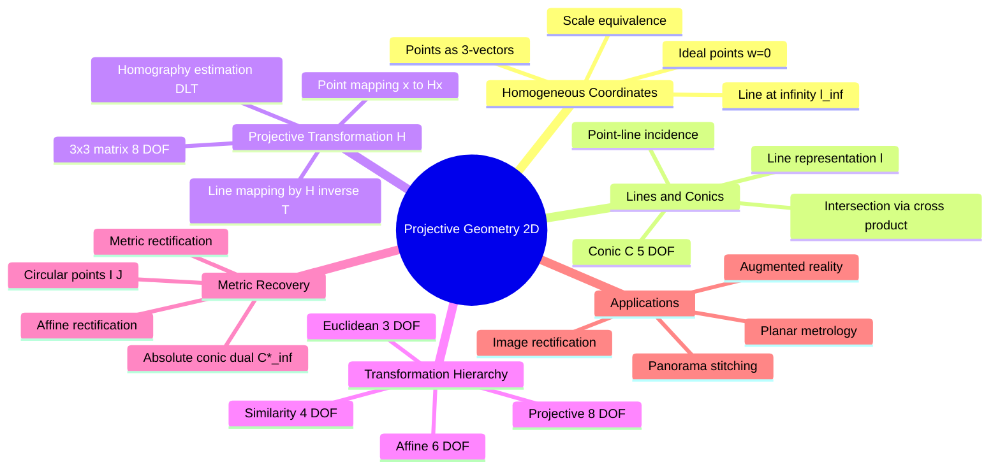
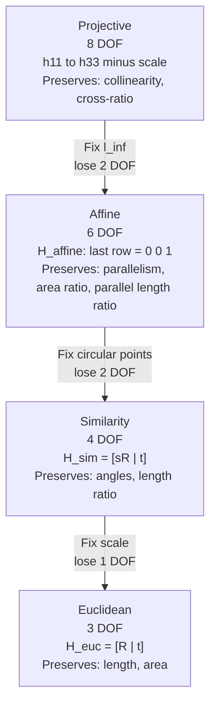

# 02 投影几何：透视变换的数学语言

> 预计阅读时间：45 分钟
> 前置知识：本篇第 01 节（相机模型）
> 读完本节后，你可以：用齐次坐标描述二维平面上的点和线，理解单应矩阵 H 的 8 个自由度从哪来，说出射影/仿射/相似/欧几里得四层变换各保持什么性质，并对一张歪斜的照片做"去透视"矫正。

---

## 2.1 第一阶：直观理解

### 2.1.1 一个场景

你用投影仪把 PPT 投到幕布上。幕布不平整，画面会变形——正方形变成了任意四边形，圆形变成了椭圆。但这个变形不是随机的：原来在同一条直线上的内容，变形后依然在同一条直线上。从某个角度看，它"乱了"；从另一个角度看，它又"有规律"。

三维世界变成二维照片，本质上也是这样一种投影——只不过方向相反。世界是三维的，照片是二维的。你需要一种数学语言，精确地描述"什么变了，什么没变"。

**射影几何（Projective Geometry）**就是这门语言。

### 2.1.2 核心直觉：为什么需要齐次坐标？

高中几何课上你学过：平面上任意两条直线有一个交点——除非它们平行。平行线的"例外"让几何证明变得繁琐：每次你都要分"相交"和"平行"两种情况讨论。

再举一个场景：你站在铁轨中间往前看，两条平行的铁轨在远处交汇于一点。这一点在现实世界中并不存在，但在你的照片里它确实有坐标。它叫什么？它在哪？

齐次坐标的回答是：**给每个普通点加一个"第三维"坐标**。普通坐标 $(x, y)$ 的齐次形式是 $(x, y, 1)$。平行线不是没有交点——它们的交点是 $(a, b, 0)$，即第三维坐标为零的点，称为**无穷远点（ideal point）**。所有无穷远点躺在一条**无穷远线（line at infinity）**上——它是世界的"地平线"。

这样一来，几何学中一个最令人舒服的性质恢复了：

> **两点定一直线，两线定一点——不再有例外。**

这就是齐次坐标的核心动机：它把透视几何从一个"到处是例外"的体系，变成一个统一、简洁的体系。

齐次坐标还带来了另一个好处：透视投影中那个讨厌的"除以 Z"（$x = fX/Z$, $y = fY/Z$），在齐次坐标下变成了纯粹的线性矩阵乘法——做完矩阵乘法之后，只要把结果的前两个分量除以第三个分量即可。用一个额外的维度，换来了线性的优雅。

### 2.1.3 技术全景



### 2.1.4 十年关键突破


从文艺复兴时期的透视绘画，到 19 世纪的抽象几何体系，再到现代计算机视觉的算法工具箱——射影几何是一根贯穿了 500 年的线。

---

## 2.2 第二阶：原理解析

### 2.2.1 第一性原理：齐次坐标——用三维向量表示二维点

二维平面上的一个点 $(x, y)$，在齐次坐标下写成三维向量 $(x_1, x_2, x_3)^T$。从齐次坐标回到笛卡尔坐标只需除以第三个分量（H&Z section 2.2.1, p.26）：

$$(x, y) = \left(\frac{x_1}{x_3}, \frac{x_2}{x_3}\right)$$

这里有三个关键性质：

**性质 1：尺度等价。** $(x_1, x_2, x_3)^T$ 和 $k(x_1, x_2, x_3)^T$（$k \neq 0$）代表同一个点。这是齐次坐标最核心的特性——因为当你做除法 $x_1/x_3$ 和 $x_2/x_3$ 时，因子 $k$ 会被约掉。

**性质 2：点和线的对偶性。** 一条直线 $l$ 也是一个三维向量 $l = (a, b, c)^T$。方程 $ax + by + c = 0$ 在齐次坐标下写成（H&Z p.27）：

$$x^T l = 0$$

这个等式对称到了令人愉悦的程度——你把点换成线、线换成点，等式不变。这就是射影几何中的"对偶原理"（duality）：点和线互换后，所有定理依然成立。

**性质 3：交点和连线都用叉积。**（H&Z p.27-28）

- 两条直线 $l$ 和 $l'$ 的交点：$x = l \times l'$
- 两个点 $x$ 和 $x'$ 的连线：$l = x \times x'$

这种简洁对称在非齐次坐标下是不可能的。

### 2.2.2 无穷远点与无穷远线——平行线的归宿

当齐次坐标的第三个分量为零，即 $(x_1, x_2, 0)^T$，这个点对应的笛卡尔坐标是 $(x_1/0, x_2/0)$——无穷远。这种点称为**理想点（ideal point）**或**无穷远点（point at infinity）**（H&Z section 2.2.2, p.28）。

理想点的几何意义是方向。$(1, 0, 0)^T$ 代表横向无穷远（x 轴方向），$(0, 1, 0)^T$ 代表纵向无穷远（y 轴方向），$(a, b, 0)^T$ 代表斜向无穷远——所有斜率为 $b/a$ 的平行线都交汇于此。

所有理想点的集合构成一条直线：**无穷远线（line at infinity）**（H&Z p.28）：

$$l_\infty = (0, 0, 1)^T$$

验证：任意理想点 $(x_1, x_2, 0)^T$ 都满足 $(x_1, x_2, 0)(0, 0, 1)^T = 0$。

> **人话翻译**：无穷远线就是世界的"地平线"——所有方向的"尽头"都在上面。两条平行线不是不相交，而是交在这条线上（用同一个理想点表征线的方向）。站在铁轨中间拍照时，两条铁轨在远处汇聚到的那一点，就是铁轨方向对应的理想点在照片上的像。

$l_\infty$ 是区分**仿射几何**和**射影几何**的关键：在仿射变换下，$l_\infty$ 保持不变（作为集合）；在射影变换下，$l_\infty$ 可能被映射到有限远的位置。这就是为什么透视照片中平行线会"交汇"——无穷远线被"拉"到了有限远。

### 2.2.3 射影变换 H——平面到平面的透视映射

#### 定义与自由度

射影变换（projectivity / homography）是一个从 $\mathbb{P}^2$ 到 $\mathbb{P}^2$ 的可逆映射，由一个 $3 \times 3$ 非奇异矩阵 $H$ 表示（H&Z section 2.3, p.33）：

$$x' = Hx$$

其中 $x$ 和 $x'$ 是变换前后的齐次坐标。$H$ 有 9 个元素，但只有 8 个自由度——因为整体缩放不影响映射结果（$H$ 和 $kH$ 代表同一个变换）。

**H 就是"平面到平面的透视变换"**。你拍了一本书的封面（本来是一个矩形），书在照片里是歪的（变成了任意四边形）。封面平面和图像平面之间的几何关系，就是一个 H。

#### 不同几何对象的变换规则

同一变换 H 对不同几何对象有不同的作用方式（H&Z p.36-37）：

| 对象 | 变换规则 | H&Z 出处 |
|------|---------|---------|
| 点 $x$ | $x' = Hx$ | (2.5), p.33 |
| 直线 $l$ | $l' = H^{-T} l$ | (2.6), p.36 |
| 圆锥曲线 $C$ | $C' = H^{-T} C H^{-1}$ | p.37 |
| 对偶圆锥 $C^*$ | $C^{*\prime} = H C^* H^T$ | p.37 |

直线的逆转置变换 $H^{-T}$ 保证了点在直线上这个关系在变换后依然成立：$x^T l = 0 \iff x'^T l' = 0$。

> **人话翻译**：如果你拿到了 H，你就拿到了"变形秘籍"——不光知道点怎么变，还知道线怎么变、椭圆怎么变。这意味着你可以把歪扭扭的照片里的任何几何元素"矫正"回正视图。

#### 用 DLT 从点对应求解 H

给定四对对应点 $x_i \leftrightarrow x'_i$，如何计算它们之间的 H？（H&Z section 4.1, p.88-91）

约束来源于：$x'_i$ 和 $Hx_i$ 方向相同，即 $x'_i \times Hx_i = 0$。将 H 展开为一个 9 维向量 $h = (h_1, h_2, \dots, h_9)^T$，每个点对应提供两个线性独立的方程。4 个点对应恰好提供 8 个方程，求解超定齐次方程组 $Ah = 0$（通过 SVD 取最小奇异值对应的向量），即得到 H。

这就是 **DLT（Direct Linear Transformation）算法**——最直接、最常用的 H 求解方法。它的优点是简单到只需要一次 SVD；缺点是它最小化的是代数误差（没有几何意义），通常只用作初值。（H&Z section 4.1, p.88-91）

### 2.2.4 变换分层：从捏橡皮泥到拼积木

射影变换是最一般的二维映射——它把正方形变成任意四边形。但在很多实际问题中，我们不需要这么"自由"的变换。根据我们保留了哪些约束，可以定义四个层级（H&Z section 2.4, p.37-44）：



**各层级的形式和约束**（H&Z Table 2.1, p.44）：

| 变换类型 | 矩阵形式 | DOF | 保持不变的性质 | 丢失的性质 |
|---------|---------|-----|--------------|-----------|
| 射影 Projective | $$\begin{pmatrix} h_{11} & h_{12} & h_{13} \cr h_{21} & h_{22} & h_{23} \cr h_{31} & h_{32} & h_{33} \end{pmatrix}$$ | 8 | 共线性（collinearity）、交比（cross-ratio） | 平行性、角度、长度 |
| 仿射 Affine | $$\begin{pmatrix} a_{11} & a_{12} & t_x \cr a_{21} & a_{22} & t_y \cr 0 & 0 & 1 \end{pmatrix}$$ | 6 | 平行性、面积比、平行线段长度比 | 角度、绝对长度 |
| 相似 Similarity | $$\begin{pmatrix} s r_{11} & s r_{12} & t_x \cr s r_{21} & s r_{22} & t_y \cr 0 & 0 & 1 \end{pmatrix}$$ | 4 | 角度、任意线段长度比 | 绝对长度 |
| 欧几里得 Euclidean | $$\begin{pmatrix} r_{11} & r_{12} & t_x \cr r_{21} & r_{22} & t_y \cr 0 & 0 & 1 \end{pmatrix}$$ | 3 | 长度、面积、角度 | — |

> **人话翻译**：这四个层级就像从"自由到严格"的变形操作：
> - **射影变换**：像捏橡皮泥——正方形可以变任意四边形，直线还是直线，但平行线可能相交，角度全乱。
> - **仿射变换**：正方形可以变平行四边形，但梯形不行——平行线始终平行。最后一行固定为 $(0,0,1)$，即固定了 $l_\infty$。
> - **相似变换**：正方形只能变正方形——旋转、平移、均匀缩放。角度完全保留，形状不变。
> - **欧几里得变换**：连缩放都不能——只能旋转和平移。对刚体最准确的描述。
>
> 从射影降到欧几里得，靠的是**逐步添加约束**：先固定 $l_\infty$（2 个约束），再固定圆环点（2 个约束），最后固定绝对尺度（1 个约束）。

### 2.2.5 从图像恢复仿射和度量性质

一张透视照片里的世界是"射影层面"的——正方形变成了梯形，角度和长度都被扭曲。但照片里仍然藏着真实世界的"度量线索"。如何把它们恢复出来？（H&Z section 2.7, p.47-58）

#### 分层矫正策略

**第一步：仿射矫正——找回平行性。** 只要你能在图像中识别出 $l_\infty$ 的像，就能用一个射影变换把它"送回"它应该在的位置 $(0, 0, 1)^T$（H&Z 2.19, p.49）。

在照片中如何找到 $l_\infty$？利用一个事实：两组平行线的两个消失点确定了 $l_\infty$ 的方向。实践中，找到照片里两组原本平行的线（如建筑物立面的水平线和竖直线），每组的交点就是一个消失点。两个消失点的连线，就是 $l_\infty$ 在图像中的位置。

**第二步：度量矫正——找回角度和比例。** 仿射矫正之后，平行线恢复了平行，但角度依然不对（正方形可以变菱形）。要进一步矫正到相似变换，需要识别**圆环点（circular points）**（H&Z p.52）：

$$I = (1, i, 0)^T, \quad J = (1, -i, 0)^T$$

这两个点位于 $l_\infty$ 上，是所有圆的交点。一旦在图像中识别了它们的位置，就能完成度量矫正。

但 I 和 J 的坐标含复数，不直观。更实用的工具是它们的"打包形式"——**绝对二次曲线的对偶 $C^*_\infty$**（H&Z 2.20, p.53）：

$$C^*_\infty = IJ^T + JI^T$$

在欧几里得坐标系下，$C^*_\infty = \text{diag}(1, 1, 0)$。在射影框架下，可以用它来测量任意两条直线 $l$ 和 $m$ 之间的角度（H&Z 2.22, p.54）：

$$\cos\theta = \frac{l^T C^*_\infty m}{\sqrt{(l^T C^*_\infty l)(m^T C^*_\infty m)}}$$

> **人话翻译**：一张歪歪扭扭的建筑物照片，要把它"校正"成正视图，分两步走：
> 1. 找到两条水平平行线的消失点 + 两条垂直平行线的消失点 → 连起来就是 $l_\infty$ → 做仿射矫正。此时梯形变成平行四边形。
> 2. 如果你知道照片里哪些线原本是正交的（如门的横边和竖边），就可以确定 $C^*_\infty$ → 做度量矫正。平行四边形最终变成真正的矩形。
>
> $l_\infty$（2 个约束）决定仿射矫正；$C^*_\infty$（2 个约束）决定度量矫正。加起来 4 个约束，刚好把 8 DOF 的射影变换拉到 4 DOF 的相似变换。

### 2.2.6 圆锥曲线在射影几何中的统一视角

在高中数学中，椭圆、抛物线、双曲线是不同的东西。但在射影几何中，它们是同一个东西——都是**圆经过射影变换后的像**（H&Z section 2.2.3, p.30-32）。

圆锥曲线由一个 $3 \times 3$ 对称矩阵 $C$ 表示，方程 $x^T C x = 0$，有 5 个自由度。圆锥的类型由它与 $l_\infty$ 的交点数量决定（H&Z p.31）：

| 与 $l_\infty$ 的交点 | 圆锥类型 | 举例 |
|---------------------|---------|------|
| 0 个（实交点） | 椭圆 Ellipse | 圆 |
| 1 个（相切） | 抛物线 Parabola | $y = x^2$ |
| 2 个（实交点） | 双曲线 Hyperbola | $xy = 1$ |

圆经过射影变换变成椭圆——圆与 $l_\infty$ 交于 I 和 J（两个虚点），变换后的椭圆与变换后的 $l_\infty$ 仍然交于变换后的 I 和 J。

> **人话翻译**：你透过玻璃窗看桌面上的一个圆形杯垫——因为视角倾斜，你看到的是一个椭圆。你换个角度看，椭圆的长短轴比例会变。极端情况下，如果杯垫的边缘与你的视线方向平行，你会看到一条线段。圆、椭圆、抛物线、双曲线本质上都是"同一个东西在不同视角下的形状"。区别只是它们跟无穷远线怎么相交。

### 2.2.7 Code Lens：用 OpenCV 计算和应用单应矩阵

以下代码演示了从 4 个点对应计算 H，然后对整张图像做透视变换：

```python
import cv2
import numpy as np


def compute_homography(src_pts, dst_pts):
    """
    Compute homography H from >= 4 point correspondences.
    H&Z section 4.1 (p.88-91): DLT algorithm via SVD.
    x' = Hx  ->  x'_i x H x_i = 0 (cross product constraint).

    Parameters
    ----------
    src_pts, dst_pts : np.ndarray, shape (N, 2)
        Corresponding points in source and destination images.

    Returns
    -------
    H : np.ndarray, shape (3, 3)
        Homography matrix.
    """
    # OpenCV's findHomography wraps DLT + RANSAC
    H, mask = cv2.findHomography(
        src_pts, dst_pts, method=cv2.RANSAC, ransacReprojThreshold=3.0
    )
    return H


def apply_homography(image, H, output_size):
    """
    Apply a homography to warp an image.
    H&Z (2.5, p.33): x' = Hx.

    For each pixel (u',v') in the output, its source location is
    computed via H^{-1}, then bilinear interpolation is used.
    """
    warped = cv2.warpPerspective(image, H, output_size)
    return warped


# --- Example: rectify a slanted book cover ---
# Suppose you have a photo of a book cover that should be a
# rectangle in the rectified view.
# Four corners of the book cover in the original photo (source):
src_points = np.array([
    [120,  80],   # top-left
    [580, 100],   # top-right
    [100, 420],   # bottom-left
    [560, 440],   # bottom-right
], dtype=np.float32)

# Corresponding corners in the desired rectified view (destination):
# e.g. a 400x300 rectangle
dst_points = np.array([
    [0,   0],
    [400, 0],
    [0, 300],
    [400, 300],
], dtype=np.float32)

H = compute_homography(src_points, dst_points)
print("Homography H (8 DOF, scale-normalized):")
print(H)
print(f"Rank: {np.linalg.matrix_rank(H)}")  # should be 3

# --- Verify: H maps source corners to destination corners ---
for i, (s, d) in enumerate(zip(src_points, dst_points)):
    s_homo = np.array([s[0], s[1], 1.0])
    d_pred = H @ s_homo
    d_pred = d_pred / d_pred[2]  # dehomogenize (H&Z p.26)
    print(f"  Corner {i}: ({s[0]:.0f},{s[1]:.0f}) "
          f"-> predicted ({d_pred[0]:.1f},{d_pred[1]:.1f}), "
          f"expected ({d[0]:.0f},{d[1]:.0f})")

# To actually warp: apply_homography(image, H, (400, 300))
```

**代码解读**：

1. `cv2.findHomography` 内部实现了 DLT（H&Z section 4.1, p.88-91）：将 $x'_i \times Hx_i = 0$ 展开成线性方程组 $Ah = 0$，通过 SVD 求解。`RANSAC` 参数让它能抵抗错误匹配点（H&Z section 4.7, p.116-123）。
2. `cv2.warpPerspective` 对每个输出像素，用 $H^{-1}$ 反算出它在原图中的位置，然后用双线性插值获取颜色值。
3. 验证步骤确认了 4 个角点的映射关系——它们被精确地映射到了目标位置。因为 4 个点对恰好约束了 H 的 8 个自由度，所以是"刚好确定"的解。

---

## 2.3 第三阶：部署实战

### 2.3.1 为什么这套东西能工作？

一套纯几何的理论，为什么在计算机视觉中如此重要？两个标志性应用：

**1. 图像矫正（Image Rectification）。** 你拍了一张歪歪扭扭的建筑立面照片，想得到正视图——找四个角，算 H，做变换。这就是 Google Street View 中建筑立面"摆正"的数学基础。

**2. 全景拼接（Panorama Stitching）。** 你手持相机旋转拍摄一组照片，相邻两张图之间相机的运动是一个纯旋转（没有平移）。纯旋转下，两张图像之间的几何关系正好是一个单应矩阵 H。把每张图用对应的 H 变换到同一个参考平面，就完成了拼接。

### 2.3.2 实战：纯 Numpy 实现 DLT

以下是 DLT 的"裸写"实现——不用 OpenCV 的高级封装，看清求解过程每一步：

```python
import numpy as np


def dlt_homography(src, dst):
    """
    Direct Linear Transform for homography estimation.
    H&Z Algorithm 4.1 (p.89): build A matrix, solve Ah = 0 via SVD.

    Each point correspondence (x, y) <-> (x', y') gives two equations:
      [0^T  -w'*x^T   y'*x^T ] h = 0
      [w'*x^T  0^T    -x'*x^T] h = 0

    Parameters
    ----------
    src, dst : np.ndarray, shape (N, 2)
        N >= 4 point correspondences.

    Returns
    -------
    H : np.ndarray, shape (3, 3)
        Homography matrix.
    """
    N = src.shape[0]
    A = np.zeros((2 * N, 9))

    for i in range(N):
        x, y = src[i]
        xp, yp = dst[i]
        # Each row uses homogeneous representation w=1 (H&Z p.89)
        A[2 * i]     = [0, 0, 0, -x, -y, -1,  yp * x,  yp * y,  yp]
        A[2 * i + 1] = [x, y, 1,  0,  0,  0, -xp * x, -xp * y, -xp]

    # Solve Ah = 0 via SVD: h is the last column of V
    # (singular vector with smallest singular value)
    _, _, Vt = np.linalg.svd(A)
    h = Vt[-1]            # last row of Vt = last column of V
    H = h.reshape(3, 3)

    # Normalize so H[2,2] = 1 for readability
    H = H / H[2, 2]
    return H


# --- Test with the same 4-point example ---
src = np.array([[120, 80], [580, 100], [100, 420], [560, 440]],
               dtype=np.float64)
dst = np.array([[0, 0], [400, 0], [0, 300], [400, 300]],
               dtype=np.float64)

H_dlt = dlt_homography(src, dst)
print("DLT Homography:")
print(np.round(H_dlt, 4))

# Verify
for (s, d) in zip(src, dst):
    s_h = np.array([s[0], s[1], 1.0])
    d_h = H_dlt @ s_h
    d_h = d_h / d_h[2]
    print(f"  ({s[0]:.0f},{s[1]:.0f}) -> "
          f"({d_h[0]:.2f},{d_h[1]:.2f}), expected ({d[0]:.0f},{d[1]:.0f})")
```

这段代码比 `cv2.findHomography` 慢（没做归一化），而且没有 RANSAC 去外点——但它让你看到 DLT 的本质：**9 个未知数，每个点给 2 个方程，至少 4 个点，解超定齐次方程组，一把 SVD 出结果**。

### 2.3.3 常见陷阱：退化配置

| 陷阱 | 原因 | 解决方案 |
|------|------|---------|
| 4 个点中有 3 个共线 | 三个共线点提供的 6 个方程中包含冗余约束，方程组秩不足，H 退化 | 确保 4 个点中任意 3 个不共线——理想情况是选择矩形的四个角 |
| 点在图像边缘+噪声大 | 边缘点的坐标对噪声更敏感（梯度变化大），导致 H 不稳定 | 对坐标做归一化（平移使质心在原点 + 缩放到平均距离 sqrt(2)），即归一化 DLT（H&Z section 4.4, p.107） |
| 所有点在同一个小平面上 | 当物体自身三维起伏相对于到相机的距离不可忽略时，H 假设（平面到平面）被破坏 | H 仅适用于**平面场景**或**纯旋转相机运动**。三维场景需要基础矩阵 F（后续章节） |
| 4 对点中有错误匹配 | 一个 outlier 的破坏力极强——DLT 对 outlier 零容忍 | 使用 RANSAC：随机抽 4 对 → 算 H → 数 inlier → 选最多 inlier 的 H → 用所有 inlier 精修 H（H&Z section 4.7, p.116-123） |

### 2.3.4 归一化 DLT 的必要性

原始 DLT 对坐标系敏感——如果点的坐标很大（比如像素坐标 1000+），构建出的矩阵 A 的各行可能相差几个数量级，导致 SVD 的数值精度下降。**归一化 DLT**（H&Z section 4.4, p.107-110）是实践中不可缺少的一步：

1. 将源点平移，使质心位于原点
2. 缩放到平均距离为 $\sqrt{2}$
3. 对目标点做同样的归一化
4. 在这两个归一化坐标系下求 $\tilde{H}$
5. 撤销归一化：$H = T'^{-1} \tilde{H} T$

这一步让 DLT 的数值稳定性提升数个数量级——本质上是对数据做"白化"预处理。

---

## 2.4 苏格拉底时刻

1. **如果投影变换丢失了长度和角度信息，那计算机视觉中那些需要"测量"的任务（如单目深度估计、三维测距）是在什么假设下工作的？**

   （提示：思考相机标定——标定之后，K 是已知的，这恰好固定了 $C^*_\infty$ 的像。已知 K 等价于已知 5 个内参约束，把射影重建变成了度量重建。换句话说，"测量"类任务不是在射影空间中做的——它们要么依赖已知的相机内参（校准过的相机），要么依赖已知的场景约束（如"这面墙是竖直的"、"这两条边是正交的"）。这些额外信息恰好弥补了投影变换丢失的那 4 个自由度。）

2. **你给朋友发了一张照片，照片里有一把尺子。朋友能量出尺子的真实长度吗？如果不能，他还需要什么信息？**

   （提示：一张照片只有射影信息——从像素坐标可以推断出"尺子的两个端点在空间中的方向"，但绝对尺度（尺子到底多长）完全丢失。即便知道相机内参 K，也只能恢复到相似重建——知道"这根尺子的两倍长"、"这根尺子跟那张桌子一样长"这类相对关系。要得到绝对长度，必须知道一个参考物——尺子旁边有一个已知尺寸的物体，或者知道尺子到相机的精确距离。这个事实引出了计算机视觉中一个最根本的定理：**单目图像的无歧义度量重建不可能**——除非你有额外的尺度信息。）

---

## 2.5 关键论文清单

| 年份   | 论文/书籍                                                                                                                                       | 一句话贡献                                          |
| ---- | ------------------------------------------------------------------------------------------------------------------------------------------- | ---------------------------------------------- |
| 2004 | Hartley & Zisserman, *Multiple View Geometry in Computer Vision* (2nd Ed.)                                                                  | 本章主要参考 Ch.2（投影几何）和 Ch.4（估计），建立了变换分层与 DLT 的完整框架 |
| 1971 | Y. I. Abdel-Aziz & H. M. Karara, "Direct Linear Transformation from Comparator Coordinates into Object Space Coordinates", ASP/UI Symposium | DLT 算法的原始提出——用线性方法求解摄影测量中的投影关系                 |
| 1981 | M. A. Fischler & R. C. Bolles, "Random Sample Consensus: A Paradigm for Model Fitting", Comm. ACM                                           | RANSAC——对抗 outlier 的经典方法，成为所有几何估计算法的标配         |
| 1998 | D. Liebowitz & A. Zisserman, "Metric Rectification for Perspective Images of Planes", CVPR                                                  | 平面图像的度量矫正——从单张照片恢复真实世界的角度和比例                   |
| 1999 | P. Sturm & S. Maybank, "On Plane-Based Camera Calibration: A General Algorithm, Singularities and Applications", CVPR                       | 平面标定的理论基础，利用平面场景中的 H 矩阵推导相机内参                  |

---

## 2.6 实操练习

**练习 1：亲手验证齐次坐标的对偶性**

1. 在纸上画两条不平行的直线，写出它们的非齐次方程，用叉积法求交点。
2. 再画两条平行线——在笛卡尔坐标中它们没有交点。写出它们的齐次方程并求交点。验证交点是否在 $l_\infty = (0,0,1)^T$ 上（即第三分量为 0）。
3. 思考：如果你把这两条平行线的方程中的常数项改成不同的值，交点会移到哪里？

**练习 2：四角矫正——从照片出发的完整流程**

1. 用手机拍一本书的封面，保持书本与相机有一定倾斜角度（不要让书正对相机）。
2. 在代码中标注书中封面的四个角点的像素坐标。
3. 设定目标矩形的尺寸（比如 $400 \times 300$ 像素），用 DLT 计算 H。
4. 用 `cv2.warpPerspective` 做透视变换。观察矫正后的书封面是否接近正视图。
5. **故意让 3 个角点共线**（比如选择左上、左下、右下三个角，把第四个点放到这三点构成的直线上），重新计算 H——观察会发生什么？为什么 DLT 失败了？

**练习 3：体验变换层级的区别**

1. 定义一个单位正方形 $[(0,0), (1,0), (1,1), (0,1)]$。
2. 自己构造一个仿射矩阵（最后一行是 $[0,0,1]$）和一个射影矩阵（最后一行不是 $[0,0,1]$），分别对四个角点做变换。
3. 比较结果：仿射变换后，原来平行的对边还是否平行？射影变换后呢？
4. 用这个直观结果，解释为什么仿射矩阵比射影矩阵少了 2 个自由度——那 2 个自由度对应了什么"变形能力"？

---

## 2.7 延伸阅读

- 本书内：[[01 相机模型]] · [[03 多视图几何入门]] · [[06 优化基础]]
- H&Z 原书 Ch.2：完整覆盖了从齐次坐标到度量矫正的所有细节，包括极点-极线关系（§2.8）
- H&Z 原书 Ch.4：DLT 的数值细节、归一化、代价函数的选择、RANSAC 的完整推导
- Marc Pollefeys, "Visual 3D Modeling from Images" (Tutorial Notes): 分层重建策略的经典教程，将 Ch.2 → Ch.10 的链条串联起来讲
- OpenCV Homography Tutorial: https://docs.opencv.org/4.x/d9/dab/tutorial_homography.html
