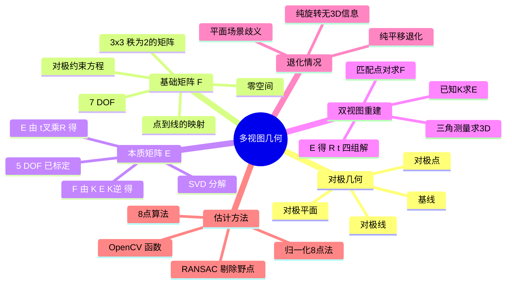
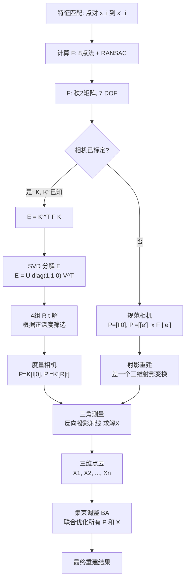

# 03 多视图几何入门：两张照片如何重建三维世界

> 预计阅读时间：55 分钟
> 前置知识：本篇第 01 节（相机模型）、第 02 节（投影几何）
> 读完本节后，你可以：写出对极约束 $x'^T F x = 0$，理解 F 矩阵 7 个自由度从哪来，用 8 点法从两张图的对应点算出 F，区分 F 和 E（本质矩阵），并理解从两张照片重建三维场景的完整管线。

---

## 3.1 第一阶：直观理解

### 3.1.1 一个场景

你有两只眼睛。闭上左眼，只用右眼看世界；再闭上右眼，只用左眼看——同一个场景，两幅不同的画面。你的大脑利用这两幅画面之间的微妙差异来判断物体的远近。这个差异就叫**视差（parallax）**，是人类立体视觉的基础。

计算机视觉中的多视图几何，本质上是同一件事：用两台相机（或一台相机在不同位置拍的两张照片），从二维图像中恢复三维世界。两张图像的对应关系不是随机的——它们被一套严格的几何约束锁在一起。这套约束就是**对极几何（Epipolar Geometry）**。

### 3.1.2 核心直觉：任何点都落在一条线上

想象两台相机对着同一个三维点 X 拍照。三个点——两台相机的中心和那个三维点——确定了一个平面，叫**对极平面（epipolar plane）**。

这个平面与两张图像平面的交线，就是**对极线（epipolar line）**。

这意味着：**左图中的任意一个点 x，在右图中对应的点 x' 一定落在某条确定的线上——这条线就是对极线。** 你不需要在整个右图中搜索 x'，只需要沿着这条线找。搜索空间从"整个图"缩小到"一条线"——这是立体匹配最核心的加速原理。

两台相机中心的连线与图像平面的交点，叫**对极点（epipole）**。在左图中，e 是右相机中心在左图中的投影（你看右眼时，左眼视野里那个"盲区"就是 e）；在右图中，e' 是左相机中心在右图中的投影。所有对极线都经过对极点。

对极几何最深刻的性质是：**它与场景内容无关——只取决于两个相机的内参和相对位姿。** 相机位置摆好，对极几何就固定了，无论你在拍一座山还是一杯咖啡。（H&Z section 9.1, p.239-241）

### 3.1.3 技术全景



### 3.1.4 Mini Case：用 OpenCV 在一对立体图像上画对极线

以下代码在一对立体图像中选取关键点，计算基础矩阵，然后画出对应的对极线：

```python
import cv2
import numpy as np

# Read stereo pair
imgL = cv2.imread("stereo_left.jpg")
imgR = cv2.imread("stereo_right.jpg")

# Detect SIFT features and compute matches
sift = cv2.SIFT_create()
kpL, desL = sift.detectAndCompute(imgL, None)
kpR, desR = sift.detectAndCompute(imgR, None)

bf = cv2.BFMatcher()
matches = bf.knnMatch(desL, desR, k=2)

# Lowe's ratio test
good_matches = []
for m, n in matches:
    if m.distance < 0.75 * n.distance:
        good_matches.append(m)

# Extract point correspondences
ptsL = np.float32([kpL[m.queryIdx].pt for m in good_matches])
ptsR = np.float32([kpR[m.trainIdx].pt for m in good_matches])

# Compute Fundamental Matrix with RANSAC
F, mask = cv2.findFundamentalMat(ptsL, ptsR, method=cv2.FM_RANSAC,
                                  ransacReprojThreshold=1.0, confidence=0.99)
print("Fundamental Matrix F:\n", F)
print("Rank of F:", np.linalg.matrix_rank(F))  # should be 2

# Select inlier points only
inlier_ptsL = ptsL[mask.ravel() == 1]
inlier_ptsR = ptsR[mask.ravel() == 1]
print(f"Inliers: {len(inlier_ptsL)} / {len(ptsL)}")

# Draw epipolar lines for a chosen point
def draw_epipolar_lines(imgL, imgR, F, ptL):
    """Draw the epipolar line corresponding to ptL on the right image."""
    imgR_lines = imgR.copy()
    ptL_homo = np.array([ptL[0], ptL[1], 1.0])
    lR = F @ ptL_homo   # epipolar line in right image (H&Z p.245)
    # Normalize for visible line drawing
    a, b, c = lR
    h, w = imgR_lines.shape[:2]
    # Draw line: ax + by + c = 0
    x0, y0 = 0, int(-c / b) if b != 0 else 0
    x1, y1 = w, int(-(c + a * w) / b) if b != 0 else h
    cv2.line(imgR_lines, (x0, y0), (x1, y1), (0, 255, 0), 2)
    return imgR_lines

# Pick 5 inlier points and visualize their epipolar lines
for i in range(min(5, len(inlier_ptsL))):
    pt = inlier_ptsL[i]
    pt_disp = imgL.copy()
    cv2.circle(pt_disp, (int(pt[0]), int(pt[1])), 8, (0, 0, 255), -1)
    cv2.putText(pt_disp, f"pt {i}", (int(pt[0])+10, int(pt[1])-10),
                cv2.FONT_HERSHEY_SIMPLEX, 0.6, (0, 0, 255), 2)
    imgR_epi = draw_epipolar_lines(imgL, imgR, F, pt)
    combined = np.hstack([pt_disp, imgR_epi])
    cv2.imshow(f"Epipolar line {i}", combined)
    cv2.waitKey(0)
cv2.destroyAllWindows()
```

这段代码让你看到对极几何的物理表现：左图选一个点，右图出现一条绿色直线——右图中匹配点一定落在这条线上（或非常接近，因为噪声）。

---

## 3.2 第二阶：原理解析

### 3.2.1 第一性原理：两个投影射线的共面约束

对极几何的本质可以用一句话概括：**两个相机中心和它们看到的那个三维点，三点确定一个平面。** 这个物理事实翻译成代数，就是对极约束。

考虑两台相机，投影矩阵分别为 $P$ 和 $P'$。设它们的相机中心为 $C$ 和 $C'$（$PC = 0$, $P'C' = 0$）。三维点 $X$ 在左图投影在 $x$，在右图投影在 $x'$。

从 $C$ 出发穿过 $x$ 的射线，其上的点表示为：

$$X(\lambda) = P^+ x + \lambda C$$

其中 $P^+$ 是 $P$ 的伪逆。这两条射线在右图中的投影——$P'P^+ x$ 和 $P'C = e'$，恰好定义一个对极点 $e'$。$x'$ 必须落在 $e'$ 和 $P'P^+ x$ 的连线上——这条线就是对极线 $l'$（H&Z section 9.1, p.239-241）。

所有的代数都在描述同一个几何事实：

> **从两个不同位置看同一个点，这两条视线必须在空间中相交——不能交错。** 这个"必须相交"的约束，就是 $x'^T F x = 0$。

### 3.2.2 对极几何的五个关键元素


设两台相机的相机中心分别为 $C$ 和 $C'$，三维点为 $X$：

| 元素 | 记法 | 定义 | H&Z 出处 |
|------|------|------|---------|
| 基线 baseline | $b$ | 连接 $C$ 和 $C'$ 的直线 | p.239 |
| 对极点 epipole | $e$, $e'$ | $C'$ 在左图的投影（$e = PC'$），$C$ 在右图的投影（$e' = P'C$） | p.239 |
| 对极平面 epipolar plane | $\pi$ | 由 $C$, $C'$, $X$ 三点确定的平面 | p.240 |
| 对极线 epipolar line | $l$, $l'$ | 对极平面与左图/右图像平面的交线 | p.240 |
| 点对应 correspondence | $x \leftrightarrow x'$ | 同一个三维点 $X$ 在两个图像中的投影 | p.240 |

关键约束：**所有对极线都经过对极点**——相当于纸扇的扇骨汇聚于扇轴。

### 3.2.3 基础矩阵 F——两张图的"关系证明书"

#### 定义与几何推导

基础矩阵 $F$ 是一个 $3 \times 3$ 矩阵，满足（H&Z 9.5, p.245）：

$$\boxed{x'^T F x = 0}$$

这是**对极约束（epipolar constraint）** 的核心方程：左图的点 $x$ 和右图的对应点 $x'$ 必须满足这个等式。注意 $x$ 和 $x'$ 都是齐次坐标（3-向量）。

$F$ 的几何推导：通过空间中任意平面 $\pi$ 的二维单应 $H_\pi$，可以将 $x$ 映射到右图中的点 $H_\pi x$。在这个点和 $e'$ 的连线上，$x'$ 必定存在——因此 $x'$ 落在以 $e'$ 和 $H_\pi x$ 为端点的直线上。用叉积表示这条线，得到（H&Z p.243）：

$$F = [e']_\times H_\pi$$

其中 $[e']_\times$ 是 $e'$ 的反对称矩阵。

#### F 的核心功能

**功能 1：点-点约束。** $x'^T F x = 0$——判断两个点是不是同一个三维点的投影（H&Z 9.5, p.245）。

**功能 2：点-线映射。** $F$ 将点 $x$ 映射到对极线 $l'$（H&Z p.245）：

$$l' = Fx \quad \text{（右图中的对极线，对应左图的点 x）}$$
$$l = F^T x' \quad \text{（左图中的对极线，对应右图的点 x'）}$$

这是 $F$ 最强大的功能：给定左图的一个点，$F$ 直接告诉你右图中这条线——匹配点一定在这条线上。

**功能 3：对极点的零空间。** 对极点 $e$ 和 $e'$ 分别藏在 $F$ 的零空间中（H&Z p.245）：

$$Fe = 0, \quad F^T e' = 0$$

因为对极点是 $F$ 的左右零向量，可以直接通过 SVD 从 $F$ 中提取它们——不需要知道相机参数。

#### F 的自由度：为什么是 7？

$F$ 是一个 $3 \times 3$ 矩阵，有 9 个元素。但只有 **7 个自由度**（H&Z section 9.2.4, p.245-246）：

- 减去 1：齐次矩阵的**整体缩放等价**——$F$ 和 $kF$（$k \neq 0$）代表同一个对极约束。
- 减去 1：$\det(F) = 0$——$F$ 必须是**秩为 2** 的矩阵。这是一个内约束——不是数据约束，而是对极几何本身要求的。

秩为 2 意味着 $F$ 有一个零空间，而这个零空间恰好是对极点所在——物理上对应"一个相机中心在另一个图像上的投影"。

> **人话翻译**：基础矩阵 F 就像一个两口之家的"户口本"——它编码了两个相机之间的所有几何关系。你能从中读出：(1) 每张图的"盲区"（对极点，零空间方向）；(2) 任意一个点在另一张图中对应的"搜索线"（对极线）；(3) 两个相机之间的相对射影关系。而且这一切都不需要知道相机的焦距、主点等参数——只要有足够多的匹配点对就能算出来。

### 3.2.4 本质矩阵 E——戴了眼镜的 F

#### 校准坐标系下的对极约束

当两个相机都经过校准（内参矩阵 $K$ 和 $K'$ 已知），我们可以将图像坐标 $x$ 转换到"归一化坐标"：

$$\hat{x} = K^{-1} x, \quad \hat{x}' = K'^{-1} x'$$

归一化坐标可以理解为"在焦距为 1 的理想相机下，三维点在图像平面上的坐标"。

在归一化坐标系下，对极约束变为（H&Z section 9.6, p.257）：

$$\boxed{\hat{x}'^T E \hat{x} = 0}$$

这就是**本质矩阵 $E$（Essential Matrix）**。

#### F 与 E 的关系

将 $\hat{x} = K^{-1} x$, $\hat{x}' = K'^{-1} x'$ 代入 $\hat{x}'^T E \hat{x} = 0$：

$$(K'^{-1} x')^T E (K^{-1} x) = 0$$
$$x'^T (K'^{-T} E K^{-1}) x = 0$$

因此（H&Z p.257）：

$$\boxed{F = K'^{-T} E K^{-1}}$$

等价地：

$$E = K'^T F K$$

#### E 的定义与性质

$E$ 的定义为（H&Z p.257）：

$$E = [t]_\times R$$

其中 $R$ 和 $t$ 是两台相机之间的旋转和平移。$[t]_\times$ 是 $t$ 的反对称矩阵。

$E$ 有 **5 个自由度**（3 个旋转 + 3 个平移 - 1 个整体尺度——平移向量的绝对长度无法恢复）。

$E$ 的 SVD 形式（H&Z p.258）：

$$E = U \begin{bmatrix}1 & 0 & 0 \cr 0 & 1 & 0 \cr 0 & 0 & 0 \end{bmatrix} V^T$$

**核心约束**：$E$ 的两个非零奇异值**相等**。这个约束比 $\det(F) = 0$ 更强——它反映了校准后的几何关系。

> **人话翻译**：F 和 E 的关系就像"近视眼看世界"和"戴了眼镜看世界"。F 是未校准相机的产物——你不知道焦距、主点等参数，所以 F 含混一些（7 DOF）。E 是校准后的产物——你知道 K 和 K'，可以从像素坐标反推出归一化坐标，得到的 E 干净很多（5 DOF）。最少只需 5 个点对应就能唯一确定 E，而 F 最少要 7 个。

#### 从 E 恢复相机运动——四个解只有一个在相机前面

给定 $E = U \text{diag}(1,1,0) V^T$，两台相机的投影矩阵有两种可能的旋转和两种可能的平移方向，组合出四种可能解（H&Z section 9.6.2, p.258-259）：

| 解 | R | t |
|---|----|---|
| 1 | $U W V^T$ | $+u_3$ |
| 2 | $U W V^T$ | $-u_3$ |
| 3 | $U W^T V^T$ | $+u_3$ |
| 4 | $U W^T V^T$ | $-u_3$ |

其中 $W = \begin{bmatrix} 0 & -1 & 0 \cr 1 & 0 & 0 \cr 0 & 0 & 1 \end{bmatrix}$，$u_3$ 是 $U$ 的第三列。

四个解对应四种相机几何配置。**只有一种解让重建出的三维点同时出现在两个相机前面**（深度为正）。这提供了一个自然的选解准则：对每一对相机，三角化一个测试点，检查它的深度在两个相机中是否都为正（H&Z p.259）。

### 3.2.5 从 F/E 构造相机矩阵

#### 未校准情形：从 F 构造射影重建

给定 $F$，可以选择一个规范形式（H&Z Result 9.14, p.255）：

$$P = [I \mid 0], \quad P' = [[e']_\times F \mid e']$$

这构造了一对相机，其基础矩阵恰好是 $F$。这对相机与真实的相机只差一个三维射影变换——这正是**射影重建定理**的基础（见下方）。

#### 校准情形：从 E 构造度量重建

给定 $E$ 并选择了正确的 $(R, t)$ 解后：

$$P = K[I \mid 0], \quad P' = K'[R \mid t]$$

这给出的是度量重建——保留了角度和相对比例。

### 3.2.6 三角测量——从两条射线反推三维点

这是整个多视图几何中最"物理"的一步。前面几节你算出了 F、E、R、t——它们描述了两个相机在空间中的位置关系。现在回到最初的问题：给定两个相机和一个匹配点对 $(x, x')$，**这个点在三维空间的哪里**？

#### 直觉：两条视线在空间中相交

从相机中心 $C$ 出发，穿过图像点 $x$ 引一条射线——三维点 $X$ 一定在这条射线上。从 $C'$ 出发穿过 $x'$ 引另一条射线——$X$ 也一定在这条射线上。**两条射线的交点就是 $X$。**


在理想情况下（无噪声、对极约束精确满足），两条射线严格相交。真实数据中它们只会"几乎相交"——所以三角测量本质上是一个**找最优近似交点**的问题。

#### 数学：把"射线相交"翻译成方程

设三维点 $X = (X_w, Y_w, Z_w, 1)^T$（齐次世界坐标，4-向量）。$x = (u, v, 1)^T$ 和 $x' = (u', v', 1)^T$ 是左右图中的像素坐标（齐次，3-向量）。已知两个 $3 \times 4$ 相机矩阵：

$$P = \begin{bmatrix} p_{11} & p_{12} & p_{13} & p_{14} \cr p_{21} & p_{22} & p_{23} & p_{24} \cr p_{31} & p_{32} & p_{33} & p_{34} \end{bmatrix}, \quad P' = \begin{bmatrix} p'_{11} & p'_{12} & p'_{13} & p'_{14} \cr p'_{21} & p'_{22} & p'_{23} & p'_{24} \cr p'_{31} & p'_{32} & p'_{33} & p'_{34} \end{bmatrix}$$

投影方程 $x = PX$ 用分量写出（略去齐次尺度因子 $\lambda$）：

$$u = \frac{p_{11} X_w + p_{12} Y_w + p_{13} Z_w + p_{14}}{p_{31} X_w + p_{32} Y_w + p_{33} Z_w + p_{34}}, \quad v = \frac{p_{21} X_w + p_{22} Y_w + p_{23} Z_w + p_{24}}{p_{31} X_w + p_{32} Y_w + p_{33} Z_w + p_{34}}$$

整理成 $X$ 的**线性方程组**。一个做法是利用 $x \times (PX) = 0$（叉积为零意味着 $x$ 和 $PX$ 共线——它们在齐次意义下是同一个点）。对第一个相机，展开叉积得（H&Z eq. 10.1, p.263）：

$$\begin{aligned} u(p_{3} \cdot X) - (p_{1} \cdot X) &= 0 \\ v(p_{3} \cdot X) - (p_{2} \cdot X) &= 0 \\ u(p_{2} \cdot X) - v(p_{1} \cdot X) &= 0 \end{aligned}$$

其中 $p_i$ 是 $P$ 的第 $i$ 行（行向量）。第三个方程是前两个的线性组合（线性相关），所以**每个相机只贡献 2 个独立方程**。两个相机共 4 个方程，而 $X$ 是齐次 4-向量（3 DOF）：

$$\begin{bmatrix} u p_{3} - p_{1} \\ v p_{3} - p_{2} \\ u' p'_{3} - p'_{1} \\ v' p'_{3} - p'_{2} \end{bmatrix}_{4 \times 4} X_{4 \times 1} = 0$$

这个 $4 \times 4$ 方程组 $AX = 0$ 是**齐次超定**的——在无噪声时 $A$ 的秩为 3，零空间 1 维，$X$ 唯一确定。

#### 求解：SVD（又是老朋友）

有噪声时 $AX \neq 0$，我们对 $A$ 做 SVD：$A = U \Sigma V^T$。最小化 $|AX|$ 且 $|X| = 1$ 的解是 **$V$ 的最后一列**（最小奇异值对应的右奇异向量）——这和 DLT 用 SVD 取最后一列完全一样。（H&Z §10.1, p.264）

然后除以第四分量回到笛卡尔坐标：$(X_w, Y_w, Z_w) = (X_1/X_4, X_2/X_4, X_3/X_4)$。

#### 几何解释：距离最近的两条三维直线

在没有噪声时，两条反向投影射线严格交于 $X$。有噪声时它们不交——三角测量等价于找空间中一个点 $X$，使它到两条射线的**距离之和最小**。DLT（代数法）最小化的是代数误差，换一种求解方式可以最小化重投影误差或三维欧氏距离。实践中 SVD 法已经足够好，且一步到位。

#### 需要注意什么

1. **秩为 2 的检查**：$F$ 的秩必须为 2——如果它退化，三角测量结果无意义。SVD 算 $F$ 后强制把第三个奇异值设零就能修补。
2. **正深度检查**：三角测量之后必须验证 $X$ 在两个相机中的深度都 > 0——$X$ 必须在两个相机**前方**，否则就是镜像解。
3. **角度要足够大**：两个相机离得太近（基线短），三角测量对像素噪声敏感——就像你用两只眼睛看远处的东西，很难判断距离。基线与深度的比值（baseline-to-depth ratio）越大越好。

#### 代码

后面 3.3.3 节会用 OpenCV 的 `triangulatePoints` 函数做三角测量，同时自动处理正深度筛选。



### 3.2.7 射影重建定理——不需要标定也能重建三维

这是未校准多视图几何中最重要的结果（H&Z Theorem 10.1, p.266）：

> 如果从点对应中唯一确定了基础矩阵 $F$，那么场景和相机可以从这些对应中重建出来。任何两个这样的重建之间只差一个三维射影变换。

这意味着：**即使你完全不知道相机参数——焦距多少、主点在哪——只要你有足够多的匹配点对，你就能重建场景的三维结构。** 当然，这个重建是"射影层面"的——像被哈哈镜扭曲过，但共线性、相交性等射影性质都被保留了。

通过添加额外约束，可以将射影重建逐步升级：
- **射影 → 仿射**：识别无穷远平面 $\pi_\infty$（如通过纯平移运动或已知的三组平行线）（H&Z p.267）
- **仿射 → 度量**：识别绝对二次曲面 $\Omega_\infty$ 的像（如已知相机内参或正交场景约束）（H&Z p.270）

这就是**分层重建策略**（Projective → Affine → Metric）（H&Z section 10.4, p.267-273）。

### 3.2.8 特殊运动——退化和简化

两种特殊的相机运动产生简化的对极几何（H&Z section 9.3, p.247-250）：

| 运动类型 | F 的性质 | 对极线的表现 | 三维重建 |
|---------|---------|------------|---------|
| **纯平移** Pure translation | $F = [e]_\times = [e']_\times$（反对称矩阵） | 所有对极线平行，交于同一个方向上的无穷远点 | 可重建，但对极点退化为无穷远——仿射重建 |
| **纯旋转** Pure rotation | $F$ 无法从点对应计算 | 无对极线 | **不可能做三角测量**——因为没有视差 |

**直觉解读**：
- 纯平移（如你在火车上朝侧面拍照）：两张图之间的变换是一个反对称映射，对极线会变成平行线——这就是为什么在某种情况下它变成了仿射问题。


- 纯旋转（你原地转圈拍照）：两张图像之间实际上是一个单应变换（H 矩阵），没有三维信息——因为相机没移动，就没有视差。这就是为什么全景拼接用 H 矩阵就够了——纯旋转情况下不需要 F。

### 3.2.9 Code Lens：用 NumPy 实现归一化 8 点算法

以下代码从至少 8 个点对应计算基础矩阵 $F$，基于 Hartley 1997 的归一化 8 点算法：

```python
import numpy as np


def normalize_points(pts):
    """
    Normalize points so centroid is at origin and RMS distance = sqrt(2).
    Hartley 1997: normalized 8-point algorithm.
    H&Z section 4.4 (p.107-110): normalization improves numerical stability.
    """
    centroid = pts.mean(axis=0)
    shifted = pts - centroid
    rms = np.sqrt(np.mean(shifted[:, 0]**2 + shifted[:, 1]**2))
    scale = np.sqrt(2) / rms

    T = np.array([
        [scale, 0,      -scale * centroid[0]],
        [0,     scale,  -scale * centroid[1]],
        [0,     0,       1]
    ])
    pts_homo = np.column_stack([pts, np.ones(len(pts))])
    pts_norm = (T @ pts_homo.T).T
    return pts_norm[:, :2], T


def compute_fundamental_matrix_8pt(ptsL, ptsR):
    """
    Compute Fundamental Matrix F using normalized 8-point algorithm.
    Hartley 1997; H&Z Algorithm 9.1 (p.262) for normalized 8-point.

    Constraint: x'^T F x = 0  (H&Z 9.5, p.245)
    F: 3x3, rank 2, 7 DOF (H&Z section 9.2.4, p.245-246)

    Parameters
    ----------
    ptsL, ptsR : np.ndarray, shape (N, 2)
        N >= 8 point correspondences.

    Returns
    -------
    F : np.ndarray, shape (3, 3)
        Fundamental matrix.
    """
    assert len(ptsL) >= 8 and len(ptsR) >= 8

    # Step 1: Normalize point coordinates (Hartley 1997)
    ptsL_norm, TL = normalize_points(ptsL)
    ptsR_norm, TR = normalize_points(ptsR)

    # Step 2: Build the design matrix A from x'^T F x = 0
    # Each correspondence (x,y,1) <-> (x',y',1) gives one equation:
    #   x'*x*f11 + x'*y*f12 + x'*f13 + y'*x*f21 + y'*y*f22
    #   + y'*f23 + x*f31 + y*f32 + f33 = 0
    N = len(ptsL_norm)
    A = np.zeros((N, 9))
    for i in range(N):
        x, y = ptsL_norm[i]
        xp, yp = ptsR_norm[i]
        A[i] = [xp*x, xp*y, xp,  yp*x, yp*y, yp,  x, y, 1]

    # Step 3: Solve Af = 0 via SVD
    # f is the singular vector corresponding to smallest singular value
    _, _, Vt = np.linalg.svd(A)
    f = Vt[-1]  # last row of Vt = last column of V
    F_norm = f.reshape(3, 3)

    # Step 4: Enforce rank-2 constraint (H&Z section 9.2.4, p.245-246)
    # Replace F with closest rank-2 matrix by zeroing smallest singular value
    U, S_diag, Vt_F = np.linalg.svd(F_norm)
    S_diag[2] = 0  # det(F) = 0
    F_norm = U @ np.diag(S_diag) @ Vt_F

    # Step 5: Denormalize
    F = TR.T @ F_norm @ TL

    # Optional: normalize so F[2,2] = 1 or ||F|| = 1
    return F / np.linalg.norm(F)


def epipolar_error(F, ptsL, ptsR):
    """
    Compute Sampson error (first-order geometric error) for F.
    H&Z (4.10, p.99).
    """
    N = len(ptsL)
    ptsL_h = np.column_stack([ptsL, np.ones(N)])
    ptsR_h = np.column_stack([ptsR, np.ones(N)])

    errors = []
    for i in range(N):
        x = ptsL_h[i]
        xp = ptsR_h[i]
        grad = F @ x
        grad_t = F.T @ xp
        error = (xp @ F @ x)**2 / (grad[0]**2 + grad[1]**2 +
                                    grad_t[0]**2 + grad_t[1]**2)
        errors.append(error)
    return np.array(errors)


# --- Example: 8 synthetic correspondences ---
np.random.seed(42)
# Generate a random ground-truth F (rank 2)
F_true = np.random.randn(3, 3)
U, S, Vt = np.linalg.svd(F_true)
S[2] = 0
F_true = U @ np.diag(S) @ Vt
F_true = F_true / np.linalg.norm(F_true)

# Generate 20 random point pairs satisfying x'^T F x = 0
N = 20
ptsL_true = np.random.rand(N, 2) * 500
ptsR_true = np.zeros((N, 2))
for i in range(N):
    x_homo = np.array([ptsL_true[i][0], ptsL_true[i][1], 1.0])
    lR = F_true @ x_homo  # epipolar line in right image
    # Choose a point on this line
    a, b, c = lR
    xp = -c / a if abs(a) > 1e-6 else 0
    ptsR_true[i] = [xp, 0]
    # Add small noise
    ptsR_true[i] += np.random.randn(2) * 0.5

F_est = compute_fundamental_matrix_8pt(ptsL_true, ptsR_true)
print("Estimated F:\n", np.round(F_est, 4))
print("Rank of estimated F:", np.linalg.matrix_rank(F_est))

# Verify epipolar constraint on data
errs = epipolar_error(F_est, ptsL_true, ptsR_true)
print(f"Mean Sampson error: {np.mean(errs):.6f}")

# Verify Fe = 0 (left epipole is null space of F)
_, _, Vt_F = np.linalg.svd(F_est)
e = Vt_F[-1]  # right null vector
e = e / e[2] if abs(e[2]) > 1e-6 else e
print(f"Left epipole e (null space of F): ({e[0]:.1f}, {e[1]:.1f})")
print(f"F @ e =\n{np.round(F_est @ e, 6)}")
```

**代码解读**：

1. **归一化**（`normalize_points`）：将点平移到质心在原点、缩放到 RMS 距离为 $\sqrt{2}$。这是 Hartley 1997 的核心贡献——不做这一步，8 点算法在数值上极不稳定（H&Z section 4.4, p.107-110）。

2. **构建矩阵 A**：从 $x'^T F x = 0$ 展开，每个点对给一行方程，$N$ 个点对给出 $N \times 9$ 的矩阵 $A$，求解 $Af = 0$（H&Z 9.5, p.245）。

3. **秩二约束**：SVD 解法得到的 $\tilde{F}$ 通常是满秩的（秩为 3）。将对角矩阵 $S$ 的最小奇异值设为零，再重组，得到最近的秩二矩阵——强制 $\det(F) = 0$（H&Z section 9.2.4, p.245-246）。

4. **去归一化**：$F = T'^T \tilde{F} T$——因为 $\tilde{F}$ 是在归一化坐标系下计算的，需要变换回原始坐标系。

5. **零空间验证**：$F$ 的右零空间向量 $e$ 就是左图的対极点——右相机中心在左图的投影。

---

## 3.3 第三阶：部署实战

### 3.3.1 从点对应到 F——完整实战流程

在实际项目中，计算 $F$ 的标准流程为：

1. **特征提取与匹配**：SIFT / ORB / SuperPoint 提取特征点 + 匹配器（BFMatcher 或 FLANN）建立初步对应。
2. **比率测试（Lowe's ratio test）**：剔除模糊匹配——最近邻与次近邻距离比 > 0.75 的匹配被丢弃。
3. **RANSAC 鲁棒估计**：用 `cv2.findFundamentalMat` 的 `FM_RANSAC` 模式。随机抽取 8 对点 → 计算 F → 统计内点（Sampson 误差 < 阈值的匹配）→ 选内点最多的 F → 用所有内点精修 F。
4. **秩二强制**：RANSAC 初解后，OpenCV 内部会用所有内点精修，并强制 $\det(F) = 0$。
5. **对极线验证**：对采样点画出对极线，目视检查——匹配点是否确实在对极线上。

### 3.3.2 OpenCV 关键 API

```python
# Compute F with RANSAC
F, mask = cv2.findFundamentalMat(
    ptsL, ptsR,
    method=cv2.FM_RANSAC,
    ransacReprojThreshold=1.0,  # Sampson error threshold (pixels)
    confidence=0.99              # RANSAC confidence level
)

# Compute Essential Matrix (requires camera matrices K1, K2)
E, mask_E = cv2.findEssentialMat(
    ptsL, ptsR,
    cameraMatrix1=K1,
    cameraMatrix2=K2,
    method=cv2.RANSAC,
    prob=0.999,
    threshold=1.0
)

# Recover relative camera pose from E
_, R, t, mask_pose = cv2.recoverPose(
    E, ptsL, ptsR,
    cameraMatrix1=K1,
    cameraMatrix2=K2
)

# Draw epipolar lines for a given point
lines = cv2.computeCorrespondEpilines(
    ptsL.reshape(-1, 1, 2), whichImage=1, F=F
)
```

### 3.3.3 立体矫正（Stereo Rectification）

对极几何的一个直接应用是**立体矫正**：将一对图像变形，使得所有对极线变成水平且共线。矫正后，对应点在两张图的行坐标相同——立体匹配从二维搜索变成一维搜索。

```python
# Stereo rectification (requires both camera matrices and distortion coeffs)
R1, R2, P1, P2, Q, _, _ = cv2.stereoRectify(
    K1, dist1, K2, dist2, img_size,
    R, T,  # relative rotation and translation between cameras
    flags=cv2.CALIB_ZERO_DISPARITY, alpha=0
)

# Compute rectification maps
map1x, map1y = cv2.initUndistortRectifyMap(
    K1, dist1, R1, P1, img_size, cv2.CV_32FC1
)
map2x, map2y = cv2.initUndistortRectifyMap(
    K2, dist2, R2, P2, img_size, cv2.CV_32FC1
)

# Apply rectification
rectL = cv2.remap(imgL, map1x, map1y, cv2.INTER_LINEAR)
rectR = cv2.remap(imgR, map2x, map2y, cv2.INTER_LINEAR)
```

矫正后图像的特点：任意一个三维点在左图和右图中的投影**在同一个水平行上**——这意味着你可以逐行做立体匹配，而不需要在整个图像中搜索。

### 3.3.4 常见陷阱与对策

| 陷阱 | 表现 | 原因 | 解决方案 |
|------|------|------|---------|
| **平面场景** Planar scene | 任意三个点对都能满足某个 F，F 不唯一 | 所有三维点在一个平面上时，点对应之间满足一个 H 关系，H 与 F 退化解耦合 | 检测场景是否退化：尝试用 H 拟合内点。如果 H 的内点几乎和 F 一样多，场景可能是平面的。在场景中引入非平面特征 |
| **纯旋转** Pure rotation | `findFundamentalMat` 返回的 F 内点数极低；三角测量失败（所有点深度接近零） | 相机没有平移就没有视差，两张图之间是单应关系（H），不存在对极约束 | 检查相机是否移动：如果连续两帧之间旋转大而平移小，跳过这帧对。使用 IMU 辅助判断 |
| **特征点集中在图像一隅** | F 的零空间（対极点）不稳定，偏到天边 | 点对分布不覆盖足够的图像区域，A 矩阵的行高度相关 | 确保特征点覆盖整个图像区域——特别是四个角。如果用 SIFT/ORB，调整检测参数以获得更均匀的分布 |
| **匹配中有大量 outlier** | RANSAC 后内点率极低（< 30%） | 纹理重复区域（如砖墙、草地）产生大量错误匹配 | 1) 降低比率测试阈值（如 0.6）；2) 使用交叉验证匹配（cross-check）；3) 使用更好的特征（SuperPoint + LightGlue） |
| **使用原始像素坐标** | F 估计极不稳定，每次运行结果差异大 | 像素坐标可达数千，矩阵 A 的列范数差异巨大，SVD 数值精度崩塌 | **永远使用归一化 8 点算法**。或直接用 `cv2.findFundamentalMat`——OpenCV 内部已经做了归一化 |
| **未强制秩二约束** | $\det(F) \neq 0$，对极线不经过对极点 | SVD 初始解通常满秩 | 计算 F 后手动验证 $\det(F)$ 是否接近 0。如果不，用 SVD 将最小奇异值置零后重组 |

### 3.3.5 RANSAC 的参数怎么调？

RANSAC 是计算 F 时对抗 outlier 的核心手段（H&Z section 4.7, p.116-123）：

- **距离阈值 $t$（ransacReprojThreshold）**：判断一个点对是内点的 Sampson 误差上限。典型值 1.0-3.0 像素。太小 → 内点太少；太大 → outlier 混入。
- **置信度（confidence）**：RANSAC 至少采样一次的保证概率。典型值 0.99-0.999。越高 → 迭代次数越多。
- **最少采样数**：对于 F，最少 8 个点对（8 点算法）。也可以用 7 个（7 点算法，F 的极小配置）——7 个点更省迭代，但对噪声更敏感。

RANSAC 会基于置信度和期望内点比例自动计算迭代次数。如果内点率太低，迭代次数可能不够——观察到内点率 < 30% 时，考虑提高置信度到 0.999 或更多。

---

## 3.4 苏格拉底时刻

1. **F 矩阵的秩为 2 意味着什么物理约束？如果三维世界中的一个物体刚好在一个平面上，F 矩阵还能唯一确定吗？**

   （提示：秩为 2 意味着 F 有一个零空间——这个零空间恰好对应一个相机的中心在另一个图像上的投影（対极点）。物理上，秩二对应的是"两条反向投影射线必须相交"——当两条射线共面且不平行时它们必然相交于一点。秩二不是额外的数据约束，而是对极几何本身的内部一致性要求。当所有三维点在一个平面上时，点对应的约束退化——任意多个点对都可能满足不同的 F，因为此时点对应首先满足一个单应矩阵 H，而 H 无法唯一约束 F。这在工程上表现为：`findFundamentalMat` 的 F 矩阵每次跑都不一样，但它们在数据上的拟合误差都很低。这就是为什么立体匹配算法通常要求场景有足够的深度变化。）

2. **如果你用校准过的相机拍了两张照片，但没有做任何特征匹配，你还能恢复两张照片之间的对极几何吗？**

   （提示：不能。校准让你知道每个像素在归一化坐标下的位置（$K^{-1} x$），但归一化坐标的物理意义是"从相机中心出发的方向向量"。你知道了每个像素对应现实中哪个方向，但不知道左图的哪个像素和右图的哪个像素对应同一个三维点。换句话说，校准让你知道了"可能的关系"（即 $E$ 的约束形式），但要算出具体的 $E$，还是需要点对应来"填数"。如果你完全不做特征匹配，你只是在不同方向拍了两张无关联的照片——就像你左眼和右眼看到的东西如果不做"大脑融合"，就只是两张不相关的图。）

---

## 3.5 关键论文清单

| 年份 | 论文/书籍 | 一句话贡献 |
|------|----------|-----------|
| 2004 | Hartley & Zisserman, *Multiple View Geometry in Computer Vision* (2nd Ed.) | 本章主要参考 Ch.9（对极几何与 F 矩阵）、Ch.10（三维重建）、Ch.4（估计），建立了多视图几何的理论框架 |
| 1981 | H. C. Longuet-Higgins, "A Computer Algorithm for Reconstructing a Scene from Two Projections", *Nature* | **本质矩阵的原始提出**——首次揭示了校准后两视图之间 3x3 矩阵约束，5 DOF 的性质 |
| 1997 | R. Hartley, "In Defense of the Eight-Point Algorithm", *IEEE TPAMI* | **归一化 8 点算法**——证明了 8 点算法在坐标归一化后数值稳定性可与迭代法媲美，使 F 的鲁棒估计成为可能 |
| 1981 | M. A. Fischler & R. C. Bolles, "Random Sample Consensus", *Comm. ACM* | RANSAC 的原始提出——使得在有大量错误匹配的现实中计算 F 成为可能 |
| 1992 | R. Hartley, "Estimation of Relative Camera Positions for Uncalibrated Cameras", *ECCV* | 首次证明：未校准相机也能从 F 中恢复射影重建——奠定了未校准 3D 重建的基础 |
| 2002 | D. Nister, "An Efficient Solution to the Five-Point Relative Pose Problem", *IEEE TPAMI* | 5 点算法——从 5 个点对应直接求解 E（校准情形的极小配置），被 OpenCV 的 `findEssentialMat` 采用 |

---

## 3.6 实操练习

**练习 1：亲手体验 F 的 8 点法**

1. 用手机在同一个场景拍两张照片，确保相机有足够平移（移动 10-20 厘米），且两张照片有足够重叠（至少 60% 的景物重叠）。
2. 用 SIFT 或 ORB 提取特征点并做匹配。画出 20 对匹配点。
3. 用上面的 NumPy 归一化 8 点算法计算 F。验证 `np.linalg.matrix_rank(F)` 是否为 2。
4. 选 5 个左图的关键点，画出它们在右图中的对极线。检查——右图中的匹配点是否确实在对极线上？
5. **让相机原地旋转（不移动）再拍两张。** 用同样的流程计算 F——会发生什么？`findFundamentalMat` 能成功吗？内点率高吗？这验证了什么退化条件？

**练习 2：用立体矫正做视差估计**

1. 用 OpenCV 的 `stereoRectify` 对一对立体图像做矫正。
2. 矫正后，在左图选一个点（比如花瓶的边缘），用鼠标悬停在右图的同一行上——看看对应点是否确实大约在同一行？
3. 思考：为什么立体矫正后的图像中，视差（同一三维点在左右图中的列坐标差）与深度成反比？

**练习 3：从 E 恢复相机运动**

1. 假设你的手机相机已经标定（可以用第 01 节的标定方法得到 K 矩阵）。
2. 拍摄两张不同位置的照片。用 `cv2.findEssentialMat` 计算 E。
3. 用 `cv2.recoverPose` 恢复 R 和 t。t 向量的绝对长度是多少？（提示：是 1——平移的绝对尺度无法从两张图像中恢复。）
4. 用恢复的 R 和 t，结合 K 矩阵，对一对匹配点做三角测量。验证重建出的三维点的深度是否在两张图中都为正。

---

## 3.7 延伸阅读

- 本书内：[[01 相机模型]] · [[02 投影几何]] · [[04 特征点与匹配]]
- H&Z 原书 Ch.9：对极几何的完整推导，包括代数推导（p.242-243）和几何推导（p.243-244）、F 的 7 DOF 参数化（p.245-246）、退化配置
- H&Z 原书 Ch.10：三角测量、射影重建定理、分层重建策略
- H&Z 原书 Ch.11：三视图张量（Trifocal Tensor）——从两视图扩展到三视图
- R. Hartley, "In Defense of the Eight-Point Algorithm" (1997)：归一化 8 点算法的必读论文——理解为什么"简单的归一化"能拯救整个算法
- OpenCV Epipolar Geometry Tutorial：https://docs.opencv.org/4.x/da/de9/tutorial_py_epipolar_geometry.html
