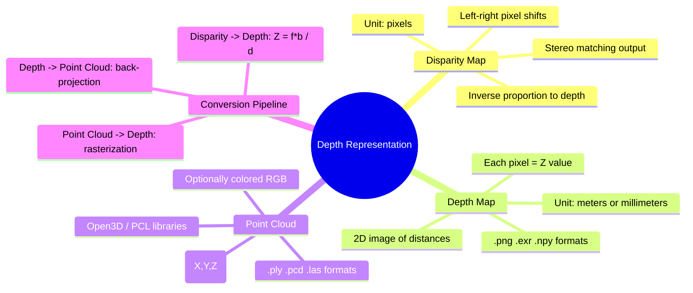
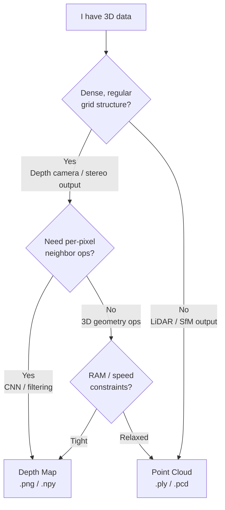

# 04 深度表示：三维数据到底长什么样

> 预计阅读时间：35 分钟
> 前置知识：本篇第 01 节（相机模型）、第 03 节（多视图几何入门）
> 读完本节后，你可以：区分视差图、深度图和点云，理解三者之间的转换关系，用 NumPy 实现深度图与点云的互转，知道什么场景用哪种表示。

---

## 第一阶：直观理解

### 一个场景

你已经学会了从两张照片算出三维点——三角测量的原理、基础矩阵的作用，你都清楚了。但算出来的这个"三维"到底长什么样？

是一张图？一堆点？还是一串数字？

答案是：三种形式都有，而且它们是同一份信息的不同"容器"。你在论文里看到的"深度估计"、在数据集里下载的 `.ply` 文件、在 ROS 里订阅的 `/depth_image` 话题——本质上都是三维几何的不同表达。搞清楚它们的区别和联系，是进入 3D 视觉工程实践的第一步。

### 核心直觉："深度"可以是一张图，也可以是一团点

想象你站在窗前看外面的建筑。你感知到的"远近"有两种自然的表达方式：

1. **画在地面上**——把建筑物每个位置离你有多远，画成一张图。近处偏暗，远处偏亮。这就是**深度图**。
2. **撒在空中**——把建筑物表面每个可见点独立标注为 $(X,Y,Z)$ 坐标，像一团悬浮的粉尘。这就是**点云**。

这两种表达之间，靠相机的几何关系来转换——知道焦距和主点位置，就能把深度图的每个像素"反投影"成三维空间的一个点。反之，把点云"投影"回图像平面，就得到深度图。

它们之间的第三种表示——**视差图**——只在双目/多目系统中有意义。它是左图和右图中对应点之间的像素偏移量。视差越大，物体越近；视差越小，物体越远。

### 技术全景



### 三种表示对比

| 表示 | 数据类型 | 存储开销 | 优点 | 缺点 |
|------|---------|---------|------|------|
| **视差图 Disparity Map** | 2D 图像，像素值 = 左右图列坐标差 | 低（单通道图像） | 立体匹配算法的直接输出；在矫正过的双目对中，视差与深度呈简单反比 | 无相机参数时自身无物理意义；受遮挡影响（左图看得到右图看不到的地方没有视差） |
| **深度图 Depth Map** | 2D 图像，像素值 = 沿光轴的距离 Z | 低（单通道图像） | 物理意义明确（单位是米）；与 RGB 图像天然对齐（逐像素对应）；便于送入 CNN | 2.5D 表示——只能看到相机前方的表面，背面/侧面不可见；单张深度图不包含完整的物体背面信息 |
| **点云 Point Cloud** | 无序 $(X,Y,Z)$ 点集，可能带 RGB | 高（每个点需 3-4 个 float） | 完整的 3D 表达——可以在空间中任意旋转、剖切；适合几何处理（配准、分割、曲面重建） | 无拓扑信息（点之间没有连接关系）；点数多时计算开销大；不是规则网格，CNN 不能直接用 |

### Mini Case：加载一张深度图，用热力图和点云两种方式看它

```python
import numpy as np
from PIL import Image
import matplotlib.pyplot as plt

# Load a 16-bit depth map (Middlebury or any dataset)
# 16-bit PNG: pixel values in millimeters
depth_png = np.array(Image.open("depth_map.png")).astype(np.float32)

# Convert to meters
depth_meters = depth_png / 1000.0

# --- Visualization 1: Heatmap ---
plt.figure(figsize=(12, 5))
plt.subplot(1, 2, 1)
plt.imshow(depth_meters, cmap='plasma')
plt.colorbar(label='Depth (meters)')
plt.title('Depth Map as Heatmap')

# Mask out zero/invalid depths
valid_mask = depth_meters > 0

plt.subplot(1, 2, 2)
plt.hist(depth_meters[valid_mask].ravel(), bins=100, color='steelblue', edgecolor='white')
plt.xlabel('Depth (meters)')
plt.ylabel('Pixel Count')
plt.title('Depth Distribution')
plt.tight_layout()
plt.show()

# --- Visualization 2: Convert to point cloud ---
H, W = depth_meters.shape
fx, fy = 525.0, 525.0   # example focal lengths (pixels)
cx, cy = W / 2, H / 2   # principal point at image center

u, v = np.meshgrid(np.arange(W), np.arange(H))
u = u[valid_mask]
v = v[valid_mask]
Z = depth_meters[valid_mask]

X = (u - cx) * Z / fx
Y = (v - cy) * Z / fy

points = np.stack([X, Y, Z], axis=-1)
print(f"Point cloud: {points.shape[0]} points")
print(f"X range: [{X.min():.2f}, {X.max():.2f}] m")
print(f"Y range: [{Y.min():.2f}, {Y.max():.2f}] m")
print(f"Z range: [{Z.min():.2f}, {Z.max():.2f}] m")

# Optional: view in Open3D
# import open3d as o3d
# pcd = o3d.geometry.PointCloud()
# pcd.points = o3d.utility.Vector3dVector(points)
# o3d.visualization.draw_geometries([pcd])
```

这段代码让你看到：同一份三维数据，既可以是色彩斑斓的热力图（一眼看出远近分布），也可以是悬浮在空间中的点团（旋转视角观察完整形状）。两种表示之间的桥梁，就是相机的内参。

---

## 第二阶：原理解析

### 视差图——从两张照片到距离

在**矫正过的双目系统**中，左图和右图的对极线被对齐为水平行。同一个三维点在左图和右图中的投影，行坐标相同（$v_L = v_R$），只有列坐标不同。这个列坐标之差就是**视差（disparity）**：

$$d = u_L - u_R$$

视差 $d$ 与深度 $Z$ 呈反比例关系。由相似三角形可得：

$$\boxed{Z = \frac{f \cdot b}{d}}$$

其中 $f$ 是矫正后的焦距（像素单位），$b$ 是两台相机光心之间的距离（基线，单位米）。这个公式是所有双目深度计算的基础。

**直觉**：把手指放在鼻子前，交替闭左右眼——手指"跳来跳去"的幅度很大（视差大）。把手指伸到手臂远处再试——跳动的幅度变小了（视差小）。这就是 $Z = fb/d$ 的物理直觉：**近处物体视差大，远处物体视差小。** 当物体在无穷远处（如天上的云），左右眼的视差趋近于零——相机位置的变化对无穷远物体的投影位置几乎无影响。

公式还揭示了一个工程约束：在给定焦距和基线时，视差每减小 1 个像素，对应的深度变化是不同的。设 $d=16$ 像素和 $d=15$ 像素分别对应 $Z_1$ 和 $Z_2$，则 $\Delta Z = Z_2 - Z_1 = fb/(15) - fb/(16) = fb/240$。设 $d=4$ 像素和 $d=3$ 像素分别对应 $Z_3$ 和 $Z_4$，则 $\Delta Z = fb/(3) - fb/(4) = fb/12$——相差 20 倍。这意味着**双目系统对近处物体的深度分辨率远高于远处**。这是几何本质决定的，不是工程缺陷。

### 深度图——每个像素都是一把"尺子"

深度图（depth map）是一张二维图像。但跟普通照片记录颜色不同，深度图的每个像素记录的不是 RGB，而是一个距离值——从相机光心出发、沿光轴方向、到该像素对应的三维表面的距离。

在透视相机模型下，这个"沿着光轴的距离"就是三维点 $X$ 在相机坐标系下的 $Z$ 坐标。因此深度图的数学定义极其简洁：

$$\text{DepthMap}(u, v) = Z_{\text{cam}}$$

其中 $(u, v)$ 是像素坐标，$Z_{\text{cam}}$ 是该像素对应的三维点在相机坐标系下的 $Z$ 分量。深度图与 RGB 图逐像素对齐——第 $i$ 行第 $j$ 列的 RGB 像素和第 $i$ 行第 $j$ 列的深度值，描述的是同一个表面点的颜色和距离。

**单位约定**：
- **毫米（mm）** 用于 16 位无符号整数存储（$\text{uint16}$，范围 0-65535，覆盖 0-65.5 米）——几乎所有消费级深度相机（Kinect、RealSense）都用这个约定
- **米（m）** 用于 32 位浮点数存储（$\text{float32}$）——精度更高，计算中无需单位换算

**工程约定**：深度值为 0 通常表示"无效深度"（如超出量程、被遮挡、或落在天空等无穷远区域）。处理深度图时，应在所有计算前先做 $mask = depth > 0$。

### 点云——三维点的不羁集合

点云（point cloud）是无序的 $(X, Y, Z)$ 点的集合，可选地携带颜色 $(R, G, B)$、法向量 $(n_x, n_y, n_z)$ 等属性。每个点独立存在——没有"谁在谁上面"的网格拓扑，没有"谁连着谁"的邻接关系。

#### 从深度图到点云：反投影（Back-Projection）

给定深度图 $D(u, v)$ 和相机内参矩阵 $K$，每个像素可以反投影为一个三维点。这是透视投影的逆运算（H&Z section 6.1, p.154-155）：

$$\boxed{X = \frac{(u - c_x) \cdot Z}{f_x}, \quad Y = \frac{(v - c_y) \cdot Z}{f_y}, \quad Z = D(u, v)}$$

其中 $f_x, f_y$ 是像素单位的焦距（$\alpha_x, \alpha_y$，来自 $K$ 矩阵的前两个对角元——H&Z 6.9, p.157），$c_x, c_y$ 是主点坐标。

**推导**：从透视投影公式 $(u, v) = (\frac{f_x X}{Z} + c_x, \frac{f_y Y}{Z} + c_y)$ 反解即可。反投影的本质是：已知深度 $Z$ 和投影几何，倒推 $X$ 和 $Y$。

#### 从点云到深度图：光栅化（Rasterization）

反向操作需要"把三维点画回二维网格"——对每个 $(X,Y,Z)$ 点，计算其像素坐标 $(u,v)$：

$$u = \frac{f_x X}{Z} + c_x, \quad v = \frac{f_y Y}{Z} + c_y$$

然后把深度值 $Z$ 填入 $(u,v)$ 位置。这里有一个工程细节：多个三维点可能落在同一个像素（前景遮挡背景时）——此时应取最小 $Z$（最近的那个），因为只有它能被相机看到。这也暴露了深度图的 2.5D 本质：点云中相机看不到的那些背面、侧面点，无法被存入深度图。

### 2.5D 的宿命：深度图看得到什么，看不到什么

深度图被称为 **2.5D 表示**——不是完全的二维（它有距离信息），也不是真正的三维（它只能从一个视角记录可见表面）。

在一张深度图中：
- 你能看到一个立方体的**正面**——那是朝向相机的面
- 你看不到它的**背面**——相机拍不到
- 它的**侧面**落在深度图的边缘，与背景混在一起

这个限制不是工程实现的问题，而是透视投影本身的物理事实：每个像素对应一条从相机中心出发的射线，这条射线击中场景的第一个表面后就被遮挡了——射线背后的一切都不可见。因此，单张深度图完全无法推理出完整的三维几何——就像你看着一个人的正面照片，不可能知道他后脑勺长什么样。

这对下游任务有直接影响：如果需要从任意角度观察一个物体，或者需要知道物体背面的几何（如机器人从不同方向抓取），单张深度图是不够的。多视角深度图融合（TSDF、Surfel）或直接输出完整几何的表示（如 NeRF、3DGS）才能解决这个问题。

### Code Lens：深度图与点云的 NumPy 互转

以下代码实现了深度图到点云的转换（带颜色），以及点到点云到深度图的投影（光栅化）：

```python
import numpy as np


def depth_to_pointcloud(depth, K, rgb=None):
    """
    Convert a depth map to a point cloud in camera coordinate frame.

    Parameters
    ----------
    depth : np.ndarray, shape (H, W), float32
        Depth map in meters. Zeros treated as invalid.
    K : np.ndarray, shape (3, 3), float32
        Camera intrinsic matrix: [[fx, 0, cx], [0, fy, cy], [0, 0, 1]]
        H&Z (6.9, p.157)
    rgb : np.ndarray, shape (H, W, 3), optional
        Aligned RGB image for colored point cloud.

    Returns
    -------
    points : np.ndarray, shape (N, 3), float32
        (X, Y, Z) coordinates in camera frame.
    colors : np.ndarray, shape (N, 3), float32, or None
        (R, G, B) values if rgb provided.
    """
    fx, fy = K[0, 0], K[1, 1]
    cx, cy = K[0, 2], K[1, 2]
    H, W = depth.shape

    u, v = np.meshgrid(np.arange(W), np.arange(H))
    valid = depth > 0

    Z = depth[valid]
    X = (u[valid] - cx) * Z / fx   # H&Z (6.1, p.154) inverted
    Y = (v[valid] - cy) * Z / fy

    points = np.stack([X, Y, Z], axis=-1)
    colors = rgb[valid] if rgb is not None else None
    return points, colors


def pointcloud_to_depth(points, K, H, W):
    """
    Project a point cloud back to a depth map (rasterization).

    Parameters
    ----------
    points : np.ndarray, shape (N, 3), float32
        (X, Y, Z) in camera frame.
    K : np.ndarray, shape (3, 3), float32
        Camera intrinsic matrix.
    H, W : int
        Image height and width.

    Returns
    -------
    depth : np.ndarray, shape (H, W), float32
        Rasterized depth map. When multiple points project to the
        same pixel, the minimum depth (closest to camera) is kept.
    """
    fx, fy = K[0, 0], K[1, 1]
    cx, cy = K[0, 2], K[1, 2]

    X, Y, Z = points[:, 0], points[:, 1], points[:, 2]
    mask = Z > 0  # points behind camera are invalid

    u = np.round(fx * X[mask] / Z[mask] + cx).astype(np.int32)
    v = np.round(fy * Y[mask] / Z[mask] + cy).astype(np.int32)
    Z_valid = Z[mask]

    in_bounds = (u >= 0) & (u < W) & (v >= 0) & (v < H)
    u, v, Z_valid = u[in_bounds], v[in_bounds], Z_valid[in_bounds]

    depth = np.zeros((H, W), dtype=np.float32)
    # For pixels with multiple projections, keep the smallest Z
    for i in range(len(u)):
        ui, vi = u[i], v[i]
        if depth[vi, ui] == 0 or Z_valid[i] < depth[vi, ui]:
            depth[vi, ui] = Z_valid[i]

    return depth
```

### 坐标约定：哪个轴是"前方"？

三种常见的坐标约定：

| 坐标约定 | X 轴 | Y 轴 | Z 轴（深度/前方） | 手掌定则 | 使用场景 |
|---------|------|------|------------------|---------|---------|
| **OpenCV** | 右 | 下 | 前 | 右手 | OpenCV, COLMAP, 多数学术代码 |
| **OpenGL** | 右 | 上 | 后（或前，可配置） | 右手 | 渲染引擎、3DGS 可视化 |
| **Unity** | 右 | 上 | 前 | 左手 | Unity 游戏引擎 |

不一致的坐标约定是多传感器融合中最常见的 bug 来源之一。把 LiDAR 坐标系的点和相机坐标系的点画在一起之前，先确认 Z 轴的方向和左右手定则是否一致。

---

## 第三阶：部署实战

### 文件格式——三维数据怎么存

**深度图文件格式**：

| 格式 | 数据类型 | 典型用途 | 注意事项 |
|------|---------|---------|---------|
| 16-bit PNG | uint16, mm 单位 | 数据集发布（Middlebury, NYUv2） | 范围 0-65535 mm；0 = 无效。精度 1 mm |
| EXR | float32 或 float16 | 高质量合成数据、Blender 渲染输出 | 支持 HDR，存储真实米制深度 |
| NPY/NPZ | float32 | Python 生态中间存储 | 原始数组，无压缩，无元数据 |

**点云文件格式**：

| 格式 | 二进制/文本 | 扩展性 | 使用场景 |
|------|-----------|--------|---------|
| **PLY** (Stanford) | 两者皆可 | 好——可存储 RGB、法向量、自定义属性 | 学术研究、3D 重建输出。Open3D 原生支持 |
| **PCD** (PCL) | 两者皆可 | 好——PCL 功能矩阵（滤波、配准、分割）全面 | PCL 生态。ROS 中常用 $sensor_msgs::PointCloud2$ |
| **LAS/LAZ** | 二进制 | 可存储分类、强度、回波数 | 测绘/遥感领域 LiDAR 标准格式 |

### 什么时候用哪种表示？



**经验法则**：
- 输入是深度相机 → 保持深度图，直到需要 3D 变换
- 需要对距离做 CNN → 深度图（规则网格）
- 需要旋转、配准、切割 → 点云
- 需要发布到 ROS → `PointCloud2` 消息
- 多帧融合 → 先转点云，配准后转 TSDF 体素网格

### 常见工具

| 工具 | 语言 | 核心能力 |
|------|------|---------|
| **Open3D** | Python/C++ | 点云读写、可视化、配准（ICP）、体素降采样、法向量估计、三角面重建 |
| **PCL** (Point Cloud Library) | C++ | 滤波、特征提取、分割、配准、曲面重建——点云处理的"OpenCV" |
| **CloudCompare** | GUI | 点云和网格的可视化对比、差异分析、手动对齐——质检神器 |
| **PDAL** | C++/Python | 面向地理空间点云数据的流式处理管道 |

```python
# Open3D quick start
import open3d as o3d

# Read a point cloud
pcd = o3d.io.read_point_cloud("scene.ply")
print(f"Loaded {len(pcd.points)} points")

# Downsample with voxel grid
pcd_down = pcd.voxel_down_sample(voxel_size=0.01)

# Estimate normals (needed for many algorithms)
pcd_down.estimate_normals(
    o3d.geometry.KDTreeSearchParamHybrid(radius=0.02, max_nn=30)
)

# Visualize
o3d.visualization.draw_geometries([pcd_down])
```

---

## 苏格拉底时刻

1. **深度图本质上是一个 2.5D 表示——它只能看到相机前方的表面。如果一个机器人抓取系统使用深度图作为唯一的三维输入，它永远无法推理物体背面。这对抓取策略意味着什么？它需要满足什么条件才能成功抓取？**

（提示：机器人需要从多个角度拍摄深度图并融合成完整的三维模型；或者依赖先验知识（如"杯子总是有一个背面，即使我看不到"）来补全几何。这正是为什么现代机器人系统使用 TSDF 融合或 NeRF 类方法来做完整的三维重建——而不是依赖单帧深度图。但也存在例外：对于平放在桌上的扁平物体（如信用卡、盘子），单张深度图足以确定抓取点的三维坐标——因为抓取点就在可见表面上。）

2. **视差 = 0 意味着什么？深度 = 0 又意味着什么？这两个"零"分别对应什么物理情况？**

（提示：视差 = 0 意味着物体在无穷远处——平行光路，立体基线失去作用。深度 = 0 在工程约定中通常表示"无效深度"——可能是被遮挡区域、超出量程、或是天空/镜面等测距失效的表面。但在物理上，深度 = 0 意味着点在相机光心上——这不可能，因为物点不可能与光心重合。因此工程实践中深度 = 0 作为掩码标志，而非物理真实值。）

---

## 关键论文与文献清单

| 年份 | 文献 | 一句话贡献 |
|------|------|-----------|
| 2004 | Hartley & Zisserman, *Multiple View Geometry*, Ch.10 | 三角测量原理、射影重建定理、分层重建策略——从两视图恢复到三维点的理论框架（p.262-273） |
| 2004 | Hartley & Zisserman, *Multiple View Geometry*, Ch.6 | 深度公式 $\text{depth}(X; P)$（6.15, p.162），相机内参矩阵 K 的定义与参数化（p.155-157） |
| 2012 | D. Scharstein & R. Szeliski, "A Taxonomy and Evaluation of Dense Two-Frame Stereo Correspondence Algorithms", *IJCV* | Middlebury 立体评估基准——定义了视差图/深度图的标准化评测方法，建立了从视差到深度的转换管道 |

---

## 实操练习

1. **深度图 → 点云 → 深度图往返**：下载 Middlebury 数据集的任意一张深度图，用 `depth_to_pointcloud` 转成点云，再用 `pointcloud_to_depth` 投影回来。比较原始深度图和往返后深度图的差异——哪些位置的深度值丢失了？为什么？
2. **多视角融合的直观实验**：用手机（或模拟数据）从两个不同角度拍同一场景的深度图，都转成点云，在 Open3D 中同时可视化两个点云——观察两个视角如何互补地覆盖物体的不同表面。然后尝试用 ICP（`pcd.icp()`）把它们对齐。
3. **用 CloudCompare 做质检**：下载两个重建方法（如 COLMAP 和 NeRF）对同一场景产生的点云，在 CloudCompare 中加载，计算它们之间的点到点距离——哪些区域差异最大？（提示：通常是边缘和纹理稀疏的区域。）

---

## 延伸阅读

- 本书内：[[03 多视图几何入门]] · [[05 坐标系转换]] · [[06 优化基础]]
- H&Z 原书 Ch.10：三角测量（p.262-264）、射影重建定理（p.266-267）、分层重建（p.267-273）——深度表示的两视图几何理论基础
- H&Z 原书 Ch.6.2.3：深度公式 $\text{depth}(X; P)$（p.162-163）——从相机矩阵直接读出深度
- Middlebury Stereo Evaluation: https://vision.middlebury.edu/stereo/ —— 视差图/深度图的标准评测平台与数据集
- Open3D 教程: http://www.open3d.org/docs/release/tutorial/geometry/pointcloud.html
