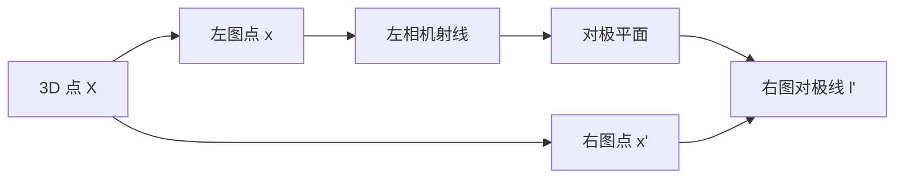

# 第 4 章 多视图几何入门：两张图如何恢复三维

> [!NOTE]
> **预计阅读时间**：55 分钟 · **前置知识**：第 1-3 章
>
> 单张图像把深度压没了；两张从不同位置拍的图像，可以把深度找回来。本章讲清楚这条链：**像素匹配 -> 对极约束 -> F/E 矩阵 -> 相机相对位姿 -> 三角测量 -> 3D 点**。

---

## 4.1 本章目标

第 2 章说，一个像素只能反推出一条射线。那如果同一个三维点在两张图里都被看到了呢？

```text
左图像素 -> 左相机射线
右图像素 -> 右相机射线
两条射线在空间中相交 -> 3D 点
```

这就是多视图几何的核心。两张图不是简单多了一张照片，而是多了一条几何约束。

本章回答四个问题：

1. 已知左图一个点，为什么右图对应点只能落在一条线上？
2. 基础矩阵 $F$ 和本质矩阵 $E$ 分别是什么？
3. 如何从匹配点恢复相机相对运动？
4. 如何用三角测量恢复 3D 点？

---

## 4.2 对极几何：点变成线

设三维点 $X$ 被两个相机看到，在左图像中是 $x$，右图像中是 $x'$。

左图像中的 $x$ 对应左相机的一条空间射线。这条射线和两个相机中心 $C,C'$ 共同确定一个平面，叫**对极平面**（epipolar plane）。这个平面与右图像平面相交成一条线，叫右图中的**对极线**（epipolar line）。

所以：

> 左图一个点 $x$，在右图中的匹配点 $x'$ 不需要全图搜索，只需要沿着一条对极线搜索。

这句话很重要，因为它把一个二维搜索问题降成了一维搜索问题。没有对极几何时，左图一个角点在右图可能出现在任意位置；有了两台相机的相对几何后，它只能出现在一条线上。双目匹配、SfM 特征匹配过滤、立体矫正，本质上都在利用这件事。



对极几何的五个对象：

| 对象 | 含义 |
|------|------|
| $C,C'$ | 两个相机中心 |
| $X$ | 空间三维点 |
| $x,x'$ | 两张图中的对应像素 |
| $e,e'$ | 对极点，另一个相机中心在本图中的投影 |
| $l,l'$ | 对极线 |

---

## 4.3 基础矩阵 F：未标定图像之间的约束

基础矩阵（Fundamental Matrix）把左图点映射成右图对极线：

$$l' = Fx$$

对应点必须满足：

$$x'^T F x = 0$$

这里 $x,x'$ 是像素齐次坐标：

$$x=\begin{bmatrix}u \cr v \cr 1\end{bmatrix}, \qquad x'=\begin{bmatrix}u' \cr v' \cr 1\end{bmatrix}$$

这条公式的输入输出可以这样读：

```text
输入：左图像素 x
输出：右图中的一条直线 l' = F x
验证：右图候选点 x' 是否在这条线上，即 x'^T l' 是否接近 0
```

所以 $F$ 不是直接告诉你“右图匹配点在哪里”，它只告诉你“匹配点应该在哪条线上”。真正找到匹配点，还需要图像纹理、特征描述子或立体匹配算法。

$F$ 的性质：

| 性质 | 说明 |
|------|------|
| 维度 | $3 \times 3$ |
| 自由度 | 7 |
| 秩 | 2 |
| 输入 | 像素坐标 |
| 需要内参吗 | 不需要 |

为什么 $F$ 是 7 自由度？$3 \times 3$ 有 9 个数，整体尺度不重要减 1，秩为 2 的约束再减 1，所以是 7。

> [!TIP]
> $F$ 不知道真实相机的焦距和主点，它只描述“两张像素图之间的对极线关系”。所以 $F$ 适合未标定图像，但它恢复出的三维结构最多是射影意义下的。

---

## 4.4 本质矩阵 E：已标定相机之间的约束

如果相机内参 $K,K'$ 已知，可以把像素点变成归一化坐标：

$$\hat{x}=K^{-1}x,\qquad \hat{x}'=K'^{-1}x'$$

在归一化坐标里，对极约束写成：

$$\hat{x}'^T E \hat{x}=0$$

这个 $E$ 叫**本质矩阵**（Essential Matrix）：

$$E=[t]_\times R$$

其中 $R,t$ 是右相机相对于左相机的旋转和平移方向，$[t]_\times$ 是把叉乘写成矩阵的形式。

$F$ 和 $E$ 的关系是：

$$E=K'^T F K$$

或反过来：

$$F=K'^{-T} E K^{-1}$$

| 矩阵 | 坐标输入 | 是否需要内参 | 能恢复什么 |
|------|---------|-------------|-----------|
| $F$ | 像素坐标 | 不需要 | 未标定两图几何 |
| $E$ | 归一化坐标 | 需要 | 相机相对旋转和平移方向 |

> [!TIP]
> $E$ 比 $F$ 更“几何”，因为内参已经被剥掉了。它直接编码两台相机之间的相对姿态。

可以把二者的关系理解成：

```text
F：像素世界里的对极约束，适合“我只有两张图”的场景。
E：相机归一化平面里的对极约束，适合“我知道相机内参，想恢复相对位姿”的场景。
```

如果你要做三维重建，通常更关心 $E$，因为它能进一步分解出 $R,t$。如果你只是想做图像匹配过滤或图像拼接前的几何验证，$F$ 也很有用。

---

## 4.5 从 E 恢复相机相对位姿

从匹配点估计出 $E$ 后，可以分解出 $R$ 和 $t$。这里的 $t$ 只有方向，没有绝对尺度。

为什么尺度丢了？如果两台相机相距 10 cm 或 1 m，只要整个场景按同样比例缩放，图像投影可以完全一样。没有额外尺度信息，单靠两张图无法知道真实距离单位。

OpenCV 中：

```python
import cv2

E, inliers = cv2.findEssentialMat(
    pts1, pts2, K,
    method=cv2.RANSAC,
    prob=0.999,
    threshold=1.0,
)

_, R, t, pose_inliers = cv2.recoverPose(E, pts1, pts2, K)
```

`recoverPose` 内部会从四个候选解中选一个：让最多三维点同时落在两个相机前方的解。这叫**正深度约束**（cheirality check）。

---

## 4.6 三角测量：两条射线求 3D 点

有了两个相机矩阵：

$$P_1=K[I|0],\qquad P_2=K'[R|t]$$

以及对应点 $x,x'$，就可以求空间点 $X$：

$$x \sim P_1X,\qquad x' \sim P_2X$$

实际中两条射线因为噪声不会完美相交，三角测量求的是“最符合两个投影观测”的 3D 点。

实验时你至少需要三类输入：

| 输入 | 含义 |
|------|------|
| $K,K'$ | 两台相机内参 |
| $R,t$ | 右相机相对于左相机的位姿 |
| $x,x'$ | 同一个 3D 点在两张图中的像素匹配 |

输出是一个三维点，通常先在左相机坐标系下表示。如果还要放到机器人或世界坐标系，就继续使用第 2 章的外参变换。

OpenCV 入口：

```python
import cv2
import numpy as np

P1 = K @ np.hstack([np.eye(3), np.zeros((3, 1))])
P2 = K @ np.hstack([R, t])

points4d = cv2.triangulatePoints(P1, P2, pts1.T, pts2.T)
points3d = (points4d[:3] / points4d[3]).T
```

> [!CAUTION]
> 三角测量对匹配误差和基线很敏感。两台相机太近、点太远、匹配点误差太大，都会让深度非常不稳定。

---

## 4.7 8 点法：从匹配点估计 F

对极约束：

$$x'^TFx=0$$

把 $F$ 的 9 个元素展开，每对匹配点给一条线性方程。至少 8 对点可以求出 $F$，这就是**8 点法**。

实践流程：

1. 收集匹配点。
2. 对点坐标做归一化，改善数值稳定性。
3. 构造线性方程 $Af=0$。
4. SVD 求 $f$，reshape 成 $F$。
5. 强制 $F$ 秩为 2。
6. 反归一化。
7. 用 RANSAC 排除错误匹配。

OpenCV 入口：

```python
F, mask = cv2.findFundamentalMat(
    pts1, pts2,
    method=cv2.FM_RANSAC,
    ransacReprojThreshold=1.0,
    confidence=0.999,
)
```

> [!TIP]
> 真实图像匹配里 outlier 很常见，所以“8 点法 + RANSAC”比裸 8 点法重要得多。第 6 章会专门讲 RANSAC 和误差函数。

---

## 4.8 立体矫正：让对极线变成水平线

双目立体匹配希望把搜索从“沿任意对极线”变成“沿同一行水平搜索”。这一步叫**立体矫正**（stereo rectification）。

矫正后：

- 左右图对应点在同一行。
- 视差 $d=u_L-u_R$。
- 深度可以用简单公式计算：

$$Z=\frac{fB}{d}$$

其中 $f$ 是像素焦距，$B$ 是双目基线，$d$ 是视差。

OpenCV 常见流程：

```python
R1, R2, P1, P2, Q, roi1, roi2 = cv2.stereoRectify(
    K1, dist1, K2, dist2, image_size, R, T
)

map1x, map1y = cv2.initUndistortRectifyMap(
    K1, dist1, R1, P1, image_size, cv2.CV_32FC1
)
map2x, map2y = cv2.initUndistortRectifyMap(
    K2, dist2, R2, P2, image_size, cv2.CV_32FC1
)

left_rect = cv2.remap(left, map1x, map1y, cv2.INTER_LINEAR)
right_rect = cv2.remap(right, map2x, map2y, cv2.INTER_LINEAR)
```

> [!TIP]
> 双目标定给你两个相机的内参、畸变和相对位姿；立体矫正把这些参数变成两张“行对齐”的图。后面的立体匹配模块就是在矫正图上估计视差。

---

## 4.9 常见退化和陷阱

| 问题 | 后果 | 处理 |
|------|------|------|
| 纯旋转，没有平移 | 没有三角测量基线，不能恢复深度 | 只适合全景拼接，不适合重建 |
| 场景几乎全是平面 | $F$ 估计容易和单应矩阵混淆 | 检查平面退化，增加视角和非平面结构 |
| 基线太小 | 深度误差很大 | 增大基线或使用更多视角 |
| 重复纹理 | 匹配 outlier 多 | RANSAC、更强特征、几何验证 |
| 未去畸变 | 对极线弯曲，匹配失败 | 标定并去畸变/矫正 |

---

## 4.10 本章小结、问题与练习

主线：

```text
匹配点 -> F/E -> 相对位姿 R,t -> 三角测量 -> 3D 点
```

最重要的三句话：

1. 对极几何把右图搜索范围从整张图缩成一条线。
2. $F$ 用像素坐标，$E$ 用归一化坐标；已知内参后优先用 $E$。
3. 两视图可以恢复相对结构，但平移尺度需要额外信息。

### 苏格拉底时刻

1. 为什么左图一个点在右图里对应一条线，而不是一个点？
2. 为什么从 $E$ 恢复的 $t$ 没有绝对尺度？
3. 如果两张图只有纯旋转，为什么不能三角测量出深度？
4. 立体矫正为什么能把搜索变成同一行？

### 实操练习

**练习 1：画对极线**

用两张有重叠视野的照片，提取 SIFT/ORB 匹配点，用 `cv2.findFundamentalMat` 估计 $F$，再用 `cv2.computeCorrespondEpilines` 画出对极线。

**练习 2：从 E 恢复位姿**

假设相机内参 $K$ 已知，用 `cv2.findEssentialMat` 和 `cv2.recoverPose` 恢复两张图之间的 $R,t$，观察 $t$ 的长度是否有物理意义。

**练习 3：三角测量**

用恢复出的 $R,t$ 构造 $P_1,P_2$，对内点做三角测量。检查有多少点的深度在两个相机前方。

### 延伸阅读

- 本书内：[[第 2 章 坐标系转换]] · [[第 3 章 投影几何]] · [[第 6 章 优化基础]]
- Hartley & Zisserman, Ch.9：对极几何与基础矩阵
- Hartley & Zisserman, Ch.10：三角测量
- Hartley & Zisserman, Ch.11：基础矩阵计算与图像矫正
