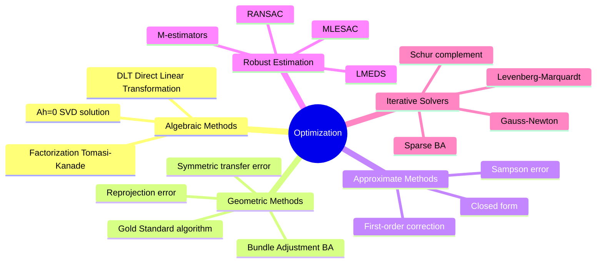
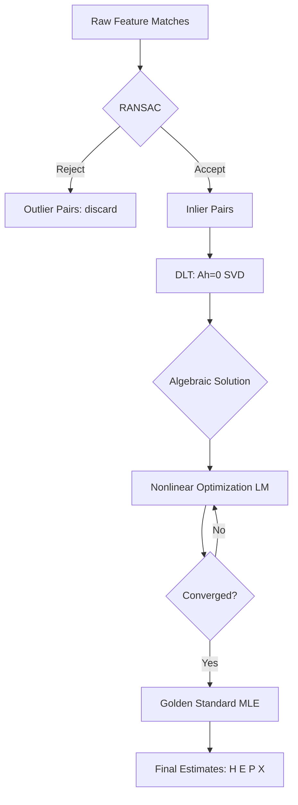

# 06 优化基础：从有噪声的数据中得到最好的估计

> 预计阅读时间：40 分钟
> 前置知识：基础篇第 01-05 节
> 读完本节后，你可以：理解 DLT、几何误差、RANSAC、Bundle Adjustment 的基本原理，知道何时用何种方法，能用 NumPy 实现 DLT 和简单 RANSAC。

---

## 第一阶：直观理解

### 一个场景

前面的五节教你了一套完整的"几何语言"——你知道如何用 `P = K[R|t]` 描述相机，知道两张图之间的对极约束 `x'^T F x = 0`，知道三角测量可以从两个视角恢复 3D 点。

但这一切都建立在一个假设上：你测量到的像素坐标是**精确的**。

现实中不是这样。你手动点选的对应点会有像素偏差，自动特征匹配也有误配，甚至传感器本身也有噪声。如果你把有噪声的测量直接扔进 `x'^T F x = 0`，方程两边很可能不等于零——它不是 0，而是某个小量。

**问题来了：当数据有噪声时，如何仍然得到最好的估计？**

这就是优化的用武之地。优化不是 3D 视觉的特产，而是贯穿整个领域的"底层工具"——从最简单的直线拟合，到上千张图片的全局 Bundle Adjustment，本质上都是在回答同一个问题：在数据不完美的情况下，怎么找到最接近真相的解。

### 核心直觉：三种估计范式

3D 视觉中的参数估计方法可以按"精度 vs 速度"分成三种范式：

1. **代数方法（Algebraic）**——快，但粗糙。把约束改写成线性方程组 `Ah = 0`，用 SVD 一步出解。代价函数（代数误差）没有几何意义，但胜在不需要迭代，是绝佳的初始值来源。

2. **几何方法（Geometric）**——准，但需要迭代。直接最小化图像上像素距离的平方和（重投影误差），有明确的物理意义。在假设高斯噪声的前提下，这是**最大似然估计**——统计意义上的最优解。

3. **鲁棒方法（Robust）**——抗干扰。真实数据里总有一些"错得离谱"的匹配（outlier）。RANSAC 的思路是"少数服从多数"——反复随机采样最小子集算出模型，看哪个模型能得到最多数据的支持。

实践中，这三者通常是串联使用的：**RANSAC 剔除 outlier → DLT 给出初值 → 几何优化精细打磨**。这是 3D 视觉中最常见的估计流水线。

### 技术全景



### Mini Case：用最小二乘法拟合一条直线

先忘掉 3D 和相机。最简单的问题：平面上有一堆带噪声的点，你想找到穿过它们的"最佳直线"。

```python
import numpy as np
import matplotlib.pyplot as plt

# Generate noisy points along line y = 2x + 1
np.random.seed(42)
x = np.linspace(0, 10, 50)
y_true = 2 * x + 1
y_obs = y_true + np.random.normal(0, 1.5, size=len(x))  # Add Gaussian noise

# Least squares: minimize ||Ax - b||^2
# For line y = ax + b, each point gives: x_i * a + 1 * b = y_i
A = np.column_stack([x, np.ones_like(x)])  # Design matrix
b = y_obs

# Normal equation: (A^T A) theta = A^T b
theta = np.linalg.solve(A.T @ A, A.T @ b)
a_hat, b_hat = theta
print(f"True:      y = 2.00x + 1.00")
print(f"Estimated: y = {a_hat:.2f}x + {b_hat:.2f}")
```

这个简单的直线拟合包含了优化的所有核心要素：

- **模型**：直线 `y = ax + b`（就像 `x'^T F x = 0`）
- **观测量**：50 个带噪声的点（就像 50 对特征匹配点）
- **代价函数**：所有点误差的平方和 `Σ(y_obs_i - (a·x_i + b))^2`
- **求解**：找到使代价函数最小的参数 a, b

从直线拟合到 Bundle Adjustment，本质上只是**模型变复杂了、参数变多了、代价函数从直线距离变成了像素距离**罢了。

---

## 第二阶：原理解析

### 第一性原理：问题的本质是什么？

3D 视觉中的估计问题，本质上都是**从含噪声的观测量中推断隐藏的几何参数**。观测量是图像坐标（可测量的像素位置），隐藏参数可能是单应矩阵 H、相机位姿 R/t、三维点坐标 X。

噪声来自哪里？
- **特征检测不精确**：SIFT、ORB 等检测到的特征点位置有亚像素级别的误差
- **传感器噪声**：CMOS 的暗电流、量化误差
- **镜头畸变残差**：即使标定过，畸变校正也不会完美

在数学上，我们假设观测噪声服从某种概率分布（最常见的是均值为零的高斯分布），然后问：**给定这些有噪声的观测，最可能的"真实参数"是什么？** 这就是参数估计的核心问题。

### 长链推演：从线性代数到全局优化

#### 步骤 1：DLT —— 把非线性约束变成线性方程组

以估计单应矩阵 H 为例。已知四组或更多对应点 `x_i = (x_i, y_i, 1)^T` 和 `x'_i = (x'_i, y'_i, 1)^T`，满足 `x'_i = H x_i`。

这是一个非线性关系（齐次坐标下 H 有 9 个未知数）。DLT（Direct Linear Transformation）的妙处是把约束改写为：

$$x'_i \times H x_i = 0$$

展开后，每个点对提供两个独立的线性方程（第三个是前两个的线性组合）。把所有点对的方程堆在一起，得到：

$$A h = 0$$

其中 h 是 H 的 9 个元素排成的列向量，A 是 2n x 9 的系数矩阵。（H&Z §4.1, p.88-89）

**求解**：`h` 是 A 的最小奇异值对应的右奇异向量——也就是对 A 做 SVD，`A = U Σ V^T`，取 V 的最后一行。（H&Z §4.1, p.90）

为什么用 SVD？因为 `||Ah||` 在 `||h|| = 1` 约束下的极小值就是最小奇异值，对应的 h 就是解。这个解最小化的是**代数误差** `||Ah||`——它度量的是"方程两边离零有多远"，而不是"投影点离测量点有多少像素"。这就是"代数"二字的含义。

#### 步骤 2：代价函数升级 —— 从代数到几何

**代数误差**（H&Z §4.2, p.91-92）：
$$\epsilon_{alg} = ||Ah||$$

优点：有闭合解，计算极快。缺点：没有几何意义——如果把图像坐标放大 10 倍，代数误差也变 10 倍，但几何关系没变。它不代表像素距离。

**几何误差 —— 单边转移误差**（H&Z §4.2.3, p.94-95）：
$$\epsilon_{geo} = \sum_i d(x'_i, H\bar{x}_i)^2$$

其中 `d(·,·)` 是图像平面上的欧几里得距离（像素距离），`H\bar{x}_i` 是将第一幅图的测量点投影到第二幅图的位置。这有明确的物理意义——"我算出来的投影位置和实际看到的位置差了多少像素"。

**几何误差 —— 对称转移误差**（H&Z §4.2.3, p.95, eq 4.8）：
$$\epsilon_{sym} = \sum_i d(x_i, \hat{x}_i)^2 + d(x'_i, \hat{x}'_i)^2$$

同时考虑两个方向的重投影误差——不是单向转移，而是找一个完美匹配的对应对 `(x̂_i, x̂'_i)`，使它们既满足 `x̂'_i = H x̂_i`，又分别离各自的测量点最近。

**Sampson 误差**（H&Z §4.2.6, p.98-99, eq 4.10）：代数误差和几何误差之间的实用折中。它用一阶导数对代数误差做了几何修正，有闭合形式，不需要迭代：

$$\epsilon_{Sampson} = \sum_i \frac{(x'^T_i F x_i)^2}{(F x_i)_x^2 + (F x_i)_y^2 + (F^T x'_i)_x^2 + (F^T x'_i)_y^2}$$

在很多情况下，Sampson 误差的优化结果跟完全几何误差几乎一样好——但不需要迭代。（H&Z §4.2.6, p.99）

**代价函数总结：**

| 代价函数 | 类型 | 几何意义 | 需要迭代 | 精度 | 用途 |
|---------|------|---------|---------|------|------|
| 代数误差 | 代数 | 无 | 否 | 低 | 初始化 |
| Sampson 误差 | 一阶近似 | 近似有 | 否 | 中 | 快速估计 |
| 几何误差 | 几何 | 有（像素） | 是 | 高 | 最终优化 |

#### 步骤 3：MLE —— 为什么最小化几何误差是"最优"的

如果测量噪声服从均值为零、方差为 σ^2 的独立高斯分布，那么观测值的**似然函数**是：

$$p(\{x_i, x'_i\} | H) = \prod_i \frac{1}{2\pi\sigma^2} \exp\left(-\frac{d(x_i, \hat{x}_i)^2 + d(x'_i, \hat{x}'_i)^2}{2\sigma^2}\right)$$

**最大化这个似然函数，等价于最小化几何误差** `Σ d(x_i, x̂_i)^2 + d(x'_i, x̂'_i)^2`。（H&Z §4.3, p.102-108）

这就是为什么几何误差的 Gold Standard 算法（Algorithm 4.3, p.114）被当作基准——在常见噪声假设下，它给出了统计意义上的最优估计。

**这一原理贯穿全书**：Bundle Adjustment 最小化重投影误差，本质上就是在做最大似然估计。这个"底座"让所有优化方法有了统计学的正当性。

#### 步骤 4：RANSAC —— 对抗 outlier

前面的方法都假设噪声是"小且均匀"的（inlier）。但真实数据中总有一些匹配是**完全错误的**（outlier）——比如把左边桌角的 SIFT 特征错配到了右边窗户上。

RANSAC 的核心思想（H&Z §4.7, p.116-119）：

1. **随机采样**：随机选取求解模型所需的最少数据点（如算 H 需要 4 对）
2. **拟合模型**：用这最少数据点计算模型参数
3. **统计共识**：计算在所有数据点中，有多少点"同意"这个模型（内点数量）
4. **迭代**：重复 N 次
5. **输出**：选择共识最大的模型，并对所有内点重新拟合最终模型

**迭代次数公式**（H&Z §4.7, p.119）：

$$N = \frac{\log(1-p)}{\log(1-(1-\varepsilon)^s)}$$

其中 `p` 是期望的成功概率（通常设 0.99），`ε` 是 outlier 比例（需要估计），`s` 是采样点数量（算 H 用 4，算 F 用 7 或 8）。

**人话翻译**：假设数据里 30% 是错配，采样 4 个点，要想 99% 把握至少有一次全是好点——需要多少次尝试？公式告诉你答案。

RANSAC 不是优化的替代品，而是优化**之前**的"清洗步骤"——先用 RANSAC 把 outlier 过滤掉，再用几何优化在干净数据上精细调整。

#### 步骤 5：Bundle Adjustment —— 全局最优的"最后一步"

当你有多张图片和很多 3D 点，前面几步给了你初始的相机参数和 3D 点位置，但每个量都不太准。Bundle Adjustment 的做法是：**把所有的相机参数和所有的 3D 点同时优化，使重投影误差的总和最小**。

（H&Z §18.1, p.434-436）

$$\min_{P^i, X_j} \sum_{i,j} d(P^i \hat{X}_j, x^i_j)^2$$

这句话的含义：对于第 `i` 个相机和第 `j` 个 3D 点，如果这个 3D 点在第 `i` 张图中可见（有对应像素 `x^i_j`），就计算"把 `X_j` 投影到第 `i` 张图上得到的像素"与"实际观测到的像素 `x^i_j`"之间的距离。把所有这样的距离的平方加起来，调整所有的相机矩阵 `P^i` 和 3D 点 `X_j`，使这个和最小。

**问题的规模**：m 个相机，n 个 3D 点 → 3n + 11m 个参数（每个 3D 点 3 DOF，每个透视相机 11 DOF）。

**为什么能解**：这时候你可能会问——几千个未知数，怎么优化？答案在于**稀疏性**。每个重投影误差只涉及一个相机和一个 3D 点，与其他的相机和点**无关**。这意味着 Hessian 矩阵（二阶导数矩阵）具有"块对角 + 低秩边缘"的结构。

利用这个结构，可以用 **Schur 补**（也叫 Marginalization）把 3D 点参数"消去"，先解相机参数（规模小得多），再回代解 3D 点。（H&Z Appendix 6, p.597）

**人话翻译**：几千个未知数的优化问题看起来不可能，但因为相机和点之间的交互是"稀疏的"（不是每对相机-点都相关），可以用线性代数技巧把大问题分解成几个小问题。这就是 BA 在实践中有用的原因。

#### 步骤 6：因子分解法 —— 仿射相机下的优雅解法

在仿射相机的假设下，有一个不需要迭代的全局方法——Tomasi-Kanade 因子分解法。

把所有观测点坐标（减均值后）堆成一个 2m x n 的**测量矩阵 W**。在仿射相机下，W 可以分解为：

$$W = M X$$

其中 M（2m x 3）包含所有相机的运动信息，X（3 x n）包含所有 3D 点的结构信息。对 W 做 SVD 取前 3 个奇异值，就同时得到了运动和结构。（H&Z §18.2, p.436-440）

这是整个 3D 视觉中最优雅的算法之一——不需要迭代，SVD 一步到位；在等方差各向同性高斯噪声假设下，它是最大似然估计。（H&Z §18.2, p.439）可惜它要求仿射相机假设和稠密对应（每个点在每个视图中都被观测到），限制了它的实际应用。

### 完整流程：从原始匹配到最终解



### Code Lens：用 NumPy 实现 DLT 和简单 RANSAC

```python
import numpy as np
from numpy.linalg import svd, norm


def normalise_2d(pts):
    """Normalise 2D points for numerical stability (H&Z section 4.4, p.107-109).

    Translate centroid to origin, scale so mean distance = sqrt(2).
    """
    pts = np.asarray(pts)
    centroid = pts.mean(axis=0)
    shifted = pts - centroid
    mean_dist = norm(shifted, axis=1).mean()
    scale = np.sqrt(2) / mean_dist
    T = np.array([[scale, 0, -scale * centroid[0]],
                  [0, scale, -scale * centroid[1]],
                  [0, 0, 1]])
    normalised = (T @ np.column_stack([pts, np.ones(len(pts))]).T).T
    return normalised[:, :2], T


def dlt_homography(pts1, pts2):
    """Estimate homography H using DLT (H&Z Algorithm 4.2, p.109).

    Args:
        pts1, pts2: (N, 2) arrays of corresponding points.

    Returns:
        H: 3x3 homography matrix.
    """
    assert len(pts1) >= 4, "Need at least 4 point pairs"

    # Normalise for numerical stability (H&Z section 4.4.3)
    n1, T1 = normalise_2d(pts1)
    n2, T2 = normalise_2d(pts2)

    # Build matrix A from constraints: x' x Hx = 0 (H&Z eq 4.1, p.89)
    A = []
    for (x, y), (xp, yp) in zip(n1, n2):
        A.append([0, 0, 0, -x, -y, -1, yp * x, yp * y, yp])
        A.append([x, y, 1, 0, 0, 0, -xp * x, -xp * y, -xp])
    A = np.array(A)

    # Solution is the last column of V (H&Z p.90)
    _, _, Vt = svd(A)
    h = Vt[-1]  # nullspace of A
    H_norm = h.reshape(3, 3)

    # Denormalise (H&Z Algorithm 4.2 step v, p.109)
    H = np.linalg.inv(T2) @ H_norm @ T1
    return H / H[2, 2]


def ransac_homography(pts1, pts2, n_iters=2000, threshold=3.0):
    """RANSAC for homography estimation (H&Z section 4.7, Algorithm 4.6, p.121).

    Args:
        pts1, pts2: (N, 2) arrays.
        n_iters: max iterations.
        threshold: inlier distance threshold in pixels.

    Returns:
        best_H: best homography found.
        best_inliers: boolean mask of inliers.
    """
    N = len(pts1)
    best_inliers = np.zeros(N, dtype=bool)
    best_count = 0
    s = 4  # minimal sample size for H (H&Z p.117)

    for _ in range(n_iters):
        # 1. Random sample
        idx = np.random.choice(N, s, replace=False)

        # 2. Fit model on sample
        try:
            H = dlt_homography(pts1[idx], pts2[idx])
        except Exception:
            continue

        # 3. Compute consensus: symmetric transfer error (H&Z eq 4.8, p.95)
        pts1_h = np.column_stack([pts1, np.ones(N)])
        pts2_h = np.column_stack([pts2, np.ones(N)])

        proj_forward = (H @ pts1_h.T).T
        proj_forward = proj_forward[:, :2] / proj_forward[:, 2:]

        H_inv = np.linalg.inv(H)
        proj_backward = (H_inv @ pts2_h.T).T
        proj_backward = proj_backward[:, :2] / proj_backward[:, 2:]

        error = np.sum((pts2 - proj_forward) ** 2, axis=1) + \
                np.sum((pts1 - proj_backward) ** 2, axis=1)

        inliers = error < threshold ** 2
        count = inliers.sum()

        # 4. Keep best
        if count > best_count:
            best_count = count
            best_inliers = inliers
            best_H = H

    # 5. Re-fit on all inliers
    if best_inliers.sum() >= 4:
        best_H = dlt_homography(pts1[best_inliers], pts2[best_inliers])

    return best_H, best_inliers


# ---- Demo with synthetic data ----
if __name__ == "__main__":
    # Generate ground truth homography
    H_true = np.array([[1.2, -0.3, 25.0],
                       [0.1, 1.1, -15.0],
                       [0.0, 0.0, 1.0]])

    # Generate 50 inlier points
    np.random.seed(0)
    pts1 = np.random.rand(50, 2) * 200
    pts1_h = np.column_stack([pts1, np.ones(50)])
    pts2_true = (H_true @ pts1_h.T).T
    pts2_true = pts2_true[:, :2] / pts2_true[:, 2:]

    # Add Gaussian noise to inliers
    pts2 = pts2_true + np.random.normal(0, 1.0, pts2_true.shape)

    # Add 10 outliers
    pts2[-10:] = np.random.rand(10, 2) * 200

    # Run RANSAC + DLT
    H_est, inliers = ransac_homography(pts1, pts2, n_iters=500)
    print(f"Inliers found: {inliers.sum()} / {len(pts1)}")
    print(f"True H:\n{H_true}")
    print(f"Estimated H:\n{H_est.round(2)}")
```

---

## 第三阶：部署实战

### 方法选型：何时用 DLT，何时用几何优化

| 场景 | 推荐方法 | 理由 |
|------|---------|------|
| 快速原型验证 | DLT | 闭合解，无初始化问题 |
| 实时系统（SLAM） | DLT + 少量迭代 | 速度优先，精度够用 |
| 离线 SfM | DLT → BA | 精度优先，时间充裕 |
| 数据有 outlier | RANSAC → DLT → 优化 | 先清洗再迭代 |
| 仿射相机场景（卫星图） | 因子分解法 | SVD 一步到位 |

**速度 vs 精度权衡**：DLT 可以在微秒级完成（SVD 很快），但精度有限；完整的几何优化可能需要秒级甚至分钟级（取决于数据量），但精度最优。实践中绝大多数系统采用"DLT 初始化 + 几步 Levenberg-Marquardt 迭代"的折中方案。

### RANSAC 参数调优

选择正确的参数是 RANSAC 成败的关键：

- **内点距离阈值**（H&Z §4.7.1, p.118）：对图像特征匹配，典型值是 **1-3 像素**。设得太大会把 outlier 也纳入内点，设得太小会把真实内点排除。可根据特征点定位精度（通常 0.5-2 像素级的 SIFT）来设定。
- **置信概率 p**：通常设为 **0.99**。这确保有 99% 的概率至少有一次采样全都是真正的 inlier。
- **最少采样数 s**：取决于模型——H 需 4 对（H&Z §4.1, p.88），F 需 7 或 8 对（H&Z §9.2, p.245），E 在校准情形下只需 5 对（H&Z §9.6, p.258）。
- **最大迭代次数 N**：用公式 `N = log(1-p) / log(1-(1-ε)^s)` 计算，或设一个保守的上界（如 2000）。在实践中常做一个 **adaptive** 版本：每当发现更好的模型时，根据当前估计的 outlier 比例更新 N，可以提前终止。

### 实践中的函数

在 OpenCV 中，许多关键函数内部都使用了 DLT + RANSAC 的组合：

```python
import cv2

# Find fundamental matrix with RANSAC (H&Z section 9.2)
F, mask = cv2.findFundamentalMat(pts1, pts2,
                                   method=cv2.FM_RANSAC,
                                   ransacReprojThreshold=3.0,
                                   confidence=0.99)

# Find essential matrix with RANSAC (H&Z section 9.6)
E, mask = cv2.findEssentialMat(pts1, pts2,
                                 cameraMatrix=K,
                                 method=cv2.RANSAC,
                                 prob=0.999,
                                 threshold=1.0)

# PnP: solve camera pose from 2D-3D correspondences
ret, rvec, tvec, inliers = cv2.solvePnPRansac(
    objectPoints, imagePoints, K, distCoeffs=None)
```

这些函数的底层都遵循"RANSAC 选内点 + DLT 初始化 + 迭代优化"的范式。

### Bundle Adjustment 在实践中的工具

大型 BA 问题需要专门的求解器来利用稀疏结构：

- **Ceres Solver**（Google）：C++ 库，COLMAP 使用它做 BA。支持自动微分，建模灵活。Google 的街景重建也依赖它。
- **g2o**（General Graph Optimization）：C++ 图优化框架，广泛应用于 SLAM（ORB-SLAM 等）。将 BA 问题建模为图（节点是参数，边是约束）。
- **COLMAP**：完整的 SfM + MVS 流程，内部使用 Ceres 做 BA。
- **SciPy / PyTorch**：对于小规模问题（< 100 个参数），`scipy.optimize.least_squares` 或 PyTorch 的 autograd 也完全可用。

### 常见陷阱

1. **局部极小值**：非线性优化（Levenberg-Marquardt）从差初值出发很容易收敛到局部极小而不是全局最优。**解决方案**：永远用 DLT 或类似方法提供好的初值。（H&Z §4.3, p.103-104）

2. **退化配置**：所有点共面、相机纯旋转无平移、所有点都在一条线上——这些退化情况导致约束不足，解不唯一。**解决方案**：检查矩阵的条件数，退化时主动切换到更稳定的求解策略。

3. **参数化问题**：旋转矩阵 R 有 9 个元素但只有 3 DOF——直接在 9 个数上优化会破坏正交性。**解决方案**：用轴角表示（3 参数）、四元数（4 参数+单位范数约束）或李代数 se(3) 来参数化旋转。

4. **尺度漂移**：在未标定的 SfM 中，不同部分的尺度可能不一致（因为 t 只有方向没有大小）。**解决方案**：BA 时可以添加尺度一致性约束，或者在标定相机后用 E 而非 F。

5. **缺失数据**：因子分解法要求稠密矩阵（每个点在每个视图都出现），现实中很多特征点只在局部视图中可见。**解决方案**：用增量式 SfM 框架（如 COLMAP），对缺失观测进行局部 BA。

---

## 苏格拉底时刻

1. **BA 同时优化相机和三维点——但如果所有的相机位置都错了，三维点也错了，你怎么知道"真值"是什么？优化方法在什么意义上保证收敛到正确解？**

   （提示：思考 BA 的代价函数是重投影误差——它只关心"投影回去跟观测是否一致"，而不关心"绝对坐标是否对"。一个整体的射影变换会同时改变所有相机参数和 3D 点，但重投影误差不变。这就是"未标定重建最多到射影等价"的深层原因——你需要额外的约束（已知内参、已知距离等）来固定这个"规范自由度"。）

2. **如果把 RANSAC 的内点阈值设得非常大，算法会退化成什么？如果设得非常小呢？**

   （提示：阈值无穷大 → 所有点都是内点 → RANSAC 退化为直接在所有数据上用最小二乘，无法排除 outlier。阈值无穷小 → 几乎所有点都是外点 → 几乎没有共识 → 算法找不到模型。RANSAC 的有效性依赖于"大多数内点形成共识"这个假设。）

---

## 关键论文清单

| 年份 | 论文 | 一句话贡献 |
|------|------|-----------|
| 1981 | Fischler & Bolles, "Random Sample Consensus" | RANSAC 的原始论文，引入鲁棒估计范式 |
| 1992 | Tomasi & Kanade, "Shape and Motion from Image Streams under Orthography" | 因子分解法，SVD 一步到位重建仿射场景 |
| 1999 | Lowe, "Object Recognition from Local Scale-Invariant Features" | SIFT 特征，为 RANSAC 提供了高质量的输入匹配 |
| 2000 | Triggs et al., "Bundle Adjustment — A Modern Synthesis" | BA 的全面综述，稀疏求解的完整论述 |
| 2005 | Nister, "An Efficient Solution to the Five-Point Relative Pose Problem" | 5 点法解本质矩阵，RANSAC 的最小配置可降至 5 |
| 2010 | Agarwal et al., "Building Rome in a Day" | 大规模 SfM，将 RANSAC + BA 扩展到城市场景 |
| 2016 | Schonberger & Frahm, "Structure-from-Motion Revisited" | COLMAP 论文，SfM 实践中 RANSAC + BA 的标准流程 |

---

## 实操练习

1. **用上面的 Code Lens 代码，生成 20 对对应点（带 0.5 像素高斯噪声），验证 DLT 能恢复 H。再混入 5 个随机 outlier，看纯 DLT（不用 RANSAC）的误差有多大，加上 RANSAC 后能恢复到什么程度。**

2. **取两张你自己拍的照片（从不同角度拍同一个物体），手动标注 8 对对应点，用 OpenCV 的 `findFundamentalMat`（FM_8POINT vs FM_RANSAC）对比，观察 RANSAC 版本是否更稳定。**

3. **思考：如果你只有 4 对对应点（恰好够解 H），RANSAC 还有用吗？为什么？（提示：4 对就是最小配置，无法从内部分出 inlier 和 outlier。）**

---

## 延伸阅读

- 本书内：[[03 多视图几何入门]]（F 矩阵的 8 点法就是 DLT 的具体应用）、[[01 相机模型]]（BA 中优化的相机参数来源）
- H&Z 原书：第 4 章（DLT、代价函数、MLE、RANSAC）、第 18 章（BA 和因子分解法）、附录 6（稀疏 BA 的 Schur 补推导）
- Triggs et al., "Bundle Adjustment — A Modern Synthesis": BA 的经典综述，涵盖稀疏求解、协方差估计、规范自由度处理
- Ceres Solver 官方教程：http://ceres-solver.org/tutorial.html — 手把手教你建模和求解 BA 问题
