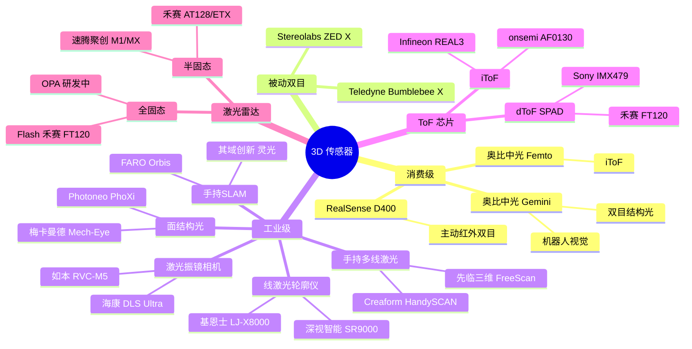
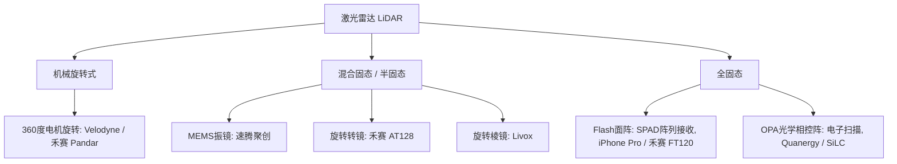
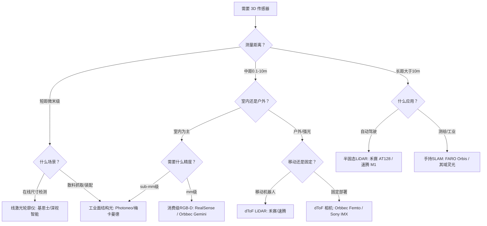

# 3D 相机与传感器

## 7.1 从数学到硬件：为什么你需要这一节

前面七章，你建立了一套 3D 视觉的数学工具箱：

- 你知道针孔相机如何将 3D 世界投影到 2D 图像——**$P = K[R \mid t]$**
- 你理解了两张图像之间的对极几何约束——**$x'^T F x = 0$**
- 你学会了三角测量——从两个视角的对应点恢复 3D 坐标
- 你掌握了在噪声数据中做最优估计——**Bundle Adjustment**

理论上，这些工具足够你从多张 2D 图像重建出 3D 场景。实际上也的确可以——这就是后续模块 A/B/C 要讲的内容。

**但一个现实问题是**：你每次都要从零手写重建管线吗？

前面的数学工具箱确实能让你从多张图像重建出 3D 场景。但如果你面对一个实际项目——比如给机器人装个"眼睛"让它知道面前是什么——你未必要从自己搭双目匹配开始。

**很多 3D 传感器已经在内部实现了这套数学。** 一台 RealSense 开机就给你深度图——它里面跑的就是一个微型的双目匹配算法。一台禾赛激光雷达输出的稀疏点云——它里面就在做逐点脉冲飞行计时。这些传感器本质上是把前面七章的数学**封装进了硬件**。

**但不是所有传感器的原理都出自前七章。** 比如线激光轮廓仪依赖激光三角测量和 Scheimpflug 光学，手持 SLAM 依赖惯性导航和图优化，ToF 芯片涉及调制解调电路和 SPAD 工艺——这些已经超出了基础篇的几何框架。本章对它们做**补充介绍**，帮你建立完整的传感器品类地图，但深度上点到为止——因为我们这本书的核心永远是**算法**，不是硬件选型。

这意味着两件事：

1. **你可以直接买，不用重复造轮子**。了解市面上有什么传感器、它们分别做到了什么精度和距离，是在项目初期就该做的功课。
2. **但你不能把它当黑盒**。知道一台传感器在用什么原理获取深度——是三角测量？是相位分析？还是脉冲计时？——你才能理解它的数据会在什么场景下出问题，以及后续算法为什么要在这种数据上做某些设计取舍。

> 举个例子：Kinect v1 投射的是红外散斑，在阳光下会失效——因为它依赖主动投影图案，阳光里的红外分量把它淹没了。你不需要深入 Light Coding 算法的细节就能理解这一点，但你得知道它"做了什么"。这就是本章要给你的。

**真实世界的 3D 项目，传感器选型决定了你的天花板。** 不同的传感器用不同的物理原理来获取深度——而这个物理原理，往往就是你前面七章学过的数学的硬件化。理解它们，你才能：

1. 拿到一个新传感器时，知道它的数据长什么样、噪声从哪来
2. 在预算、精度、距离、环境之间做合理的取舍
3. 选错算法之前先选对传感器——因为换传感器的代价远大于换算法

> [!NOTE]
> **一句话**：相机模型回答了"图像怎么来的"，本章回答"深度怎么来的"——选错传感器的代价远大于选错算法。

## 7.2 概述

人眼通过双目视差感知深度，机器则有更多选择：主动投射红外光斑、发射激光脉冲、旋转扫描、甚至靠单帧照片推断距离。

按测距原理，主流 3D 传感器可以分为以下几条技术路线：

| 技术路线 | 测距原理 | 典型距离 | 精度 | 头部厂商（两家） |
|---------|---------|---------|------|----------------|
| 主动红外双目 | 双目立体匹配 + 红外散斑增强纹理 | 0.1–10 m | mm 级（近距） | **Intel RealSense**、**奥比中光 Orbbec** |
| 被动双目（纯立体视觉） | 纯图像特征匹配，无主动投影 | 0.3–20+ m | cm 级 | **Stereolabs**（ZED X）、**Teledyne FLIR**（Bumblebee X） |
| 结构光（编码） | 投射已知编码图案，三角测量 | 0.1–5 m | sub-mm 级 | **Apple**（Face ID）、**奥比中光**（Astra） |
| iToF | 调制红外光的相位差 | 0.1–10 m | mm 级 | **Orbbec**（Femto）、**Infineon+pmd**（REAL3） |
| dToF / Flash | 脉冲激光的飞行时间 | 0.1–300+ m | cm 级 | **Sony**（IMX479）、**禾赛**（FT120 Flash） |
| 线激光轮廓 | 激光三角测量，逐行扫描 | 0.01–1 m | μm 级 | **基恩士 Keyence**（LJ-X8000）、**深视智能 CNSSZN**（SR9000） |
| 面结构光（工业） | 投射多幅条纹图案，相位解算 | 0.1–3 m | μm–mm 级 | **Photoneo**（PhoXi）、**梅卡曼德**（Mech-Eye） |
| 激光振镜 | 振镜反射激光动态扫描，三角测量 | 0.3–2 m | sub-mm 级 | **海康机器人**（DLS Ultra）、**如本科技**（RVC-M5） |
| 手持多线激光 | 多束交叉激光 + 反射靶自定位 | 0.05–15 m | 0.01–0.05 mm | **Creaform**（HandySCAN）、**先临三维**（FreeScan） |
| 手持 SLAM | LiDAR + IMU + SLAM 实时定位建图 | 1–300 m | cm 级 | **FARO**（Orbis）、**其域创新**（灵光 L2 Pro） |
| 激光雷达（LiDAR） | 扫描式脉冲 ToF | 1–300+ m | cm 级 | **禾赛**（AT128/ETX）、**速腾聚创**（M1/MX） |



## 7.3 消费级 RGB-D 相机

消费级 3D 相机的共同特点：价格亲民（$150–$500）、体积小、即插即用、适合室内场景。核心技术路线分两类：主动红外双目（RealSense）和 ToF（奥比中光 Femto）。

### 7.3.1 Intel RealSense D400 系列

RealSense D400 系列采用**主动红外双目**（Active Stereo）方案：两个红外相机做双目匹配，一个红外点阵投射器向场景投射随机散斑，增强无纹理区域的匹配能力。

| 型号 | 特点 | 基线 | 推荐范围 |
|------|------|------|---------|
| **D415** | 标准 FOV、卷帘快门 | 55 mm | 0.5–3 m |
| **D435** | 宽 FOV、全局快门 | 50 mm | 0.3–3 m |
| **D435i** | D435 + 内置 IMU | 50 mm | 0.3–3 m |
| **D455** | 更长基线、更远距离 | 95 mm | 0.6–6 m |

**⚠️ 重要提醒**：2024 年 5 月，Intel 停止了 D400 系列的 UWP 驱动更新。但 D400 系列硬件本身仍在销售，且 RealSense 业务已于 2025 年 7 月从 Intel 独立为 **RealSense AI** 公司，完成 5000 万美元融资并继续推进立体视觉产品线（如 2025 年推出的 D555）。因此 D400 系列不是完全意义上的 EOL，但需注意其长期支持主体已从 Intel 变为独立公司。

### 7.3.2 奥比中光（Orbbec）

奥比中光是国内 RGB-D 相机的绝对龙头，也是目前**唯一能在消费级市场全面对标 RealSense**的国产厂商。产品矩阵覆盖结构光、双目、ToF 三条路线：

| 系列 | 技术路线 | 代表型号 | 定位 |
|------|---------|---------|------|
| **Gemini 330** | 双目结构光 + MX6800 自研芯片 | 335/336/335L/336L | **主力产品**，全场景机器人视觉 |
| **Femto** | iToF | Femto Bolt/Mega | 替代 Azure Kinect，Microsoft 官方推荐 |

Gemini 330 系列的亮点：搭载自研 ASIC 芯片 MX6800，覆盖 USB3 / GMSL2 / 以太网三大接口，IP65–IP67 防护等级，是机器人视觉的高性价比选择。

Femto Bolt 与 Azure Kinect 使用**相同的 1MP iToF 深度传感器**，但体积更小、RGB 相机带 HDR、出厂标定更好，价格约 $378–$444，是目前 Azure Kinect 的官方替代方案。

## 7.4 被动双目相机：纯视觉立体匹配

上一节介绍的 RealSense 和 Orbbec Gemini 虽然也基于双目立体匹配，但都依赖额外的红外投影器向场景投射纹理。而**被动双目**（Passive Stereo）什么都不投——它和你的眼睛一样，纯粹靠两个相机拍到的自然纹理做匹配。

这种"纯粹"带来了两个核心优势：

| 优势 | 为什么重要 |
|------|-----------|
| **不受光照干扰** | 没有主动光源，不会在强阳光下被"淹没"——这是户外场景的关键 |
| **无多机干扰** | 多台设备同时工作时不会互相干扰（而主动投影器会） |
| **功耗更低** | 不需要驱动投影器或激光器 |
| **距离更远** | 基线可以做得很大（十几到二十几厘米），理论上探测距离不受光源功率限制 |

代价也很明显：在**无纹理场景**（白墙、黑夜）下完全失效——这是主动方案永远不会遇到的问题。

### 7.4.1 头部产品

**Stereolabs ZED 系列**——被动双目领域技术最激进的厂商：

| 型号 | 基线 | 最大深度 | 传感器 | 亮点 |
|------|------|---------|--------|------|
| **ZED X** | 5 cm | 20 m | 1920×1200 GS, 3 μm | IP67, GMSL2, Neural Depth Engine 2 |
| **ZED X Max HDR** (2025) | 17 cm | 23 m | Sony ISX031, 120 dB HDR | 大基线远距，IP69K |

ZED 系列不做片上视差计算——深度估计依赖主机端的 **Neural Depth Engine 2**（AI 深度估计），需要 NVIDIA Jetson 或同等 GPU。这是它的技术前瞻性所在：用神经网络替代传统立体匹配，在弱纹理和重复纹理区域表现远超传统方法。

**Teledyne FLIR Bumblebee X**（2024 年发布）——工业级传统立体匹配的标杆：

| 参数 | 规格 |
|------|------|
| 传感器 | 3 MP 全局快门 CMOS，3.45 μm |
| 基线 | **24 cm**（同类最长之一） |
| 最大深度 | 20 m |
| 片上处理 | ✅ 板载视差计算，直接输出深度图 + 彩色点云 |
| 防护 | IP67 |
| 接口 | 1/5 GigE PoE，GigE Vision v2.0 |

Bumblebee X 采用传统立体匹配（非 AI），不需要 GPU，算力需求低。24 cm 超大基线 + 片上处理，非常适合工厂自动化场景。Teledyne FLIR（前身为 Point Grey Research）在立体视觉领域有 25 年以上经验。

### 7.4.2 被动 vs 主动双目

| 维度 | 主动双目（RealSense/Gemini） | 被动双目（ZED X/Bumblebee X） |
|------|---------------------------|-------------------------------|
| 投影器 | ✅ 红外散斑/纹理投影 | ❌ 无 |
| 弱纹理表现 | ✅ 强（投影器补纹理） | ❌ 失效 |
| 强光户外 | ❌ 投影被阳光淹没 | ✅ 不受影响 |
| 多机共存 | ❌ 投影互相干扰 | ✅ 无干扰 |
| 最远距离 | 3–10 m | 20–35 m |
| 基线灵活性 | 小基线（紧凑设计） | 可做大基线（10–24 cm） |
| 片上处理 | 部分支持 | 部分支持 |
| 成本 | 低–中（$150–$500） | 中–高（$500–$5,000） |

> [!TIP]
> **选型口诀**：室内、弱纹理、预算有限 → 主动双目。户外、远距、多台协同 → 被动双目。两者不是替代关系，而是场景互补。

## 7.5 工业级 3D 传感器

工业场景对精度的要求比消费级高 1–3 个数量级（μm 而非 mm），同时对防护等级、热稳定性、环境光抗性有严格要求。

### 7.5.1 线激光轮廓仪

**原理**：一条激光线投射到物体表面，CMOS 从另一个角度拍摄激光线的形变，通过**激光三角测量**（Laser Triangulation）计算高度剖面。物体或传感器做一维运动时，剖面逐行拼接成完整 3D 点云。

> **[TODO: 图] 激光三角测量原理图**——激光器投射线激光到物体表面，相机从另一角度拍摄激光线的形变，通过三角法计算高度。需要从工业测量教材或设备厂商技术文档截取。

**关键：激光面聚焦与 Scheimpflug 原理**

上面这个简图省略了一个问题：激光线在物体表面是一条细线，但相机是从旁边斜着看的——如果镜头光轴与 CMOS 平面平行，只有激光线上**一个点**能清晰成像，其余位置都会离焦模糊。

这恰好是第 1 节移轴相机里讲过的 **Scheimpflug 原理**。线激光轮廓仪的相机镜头必须**倾斜安装**，使得镜头平面、CMOS 平面和激光平面的延长线相交于同一条线：

```
    镜头平面            CMOS（倾斜安装）
       │                   ／
       │                 ／
       │               ／
───────┼─────────────┼──────────── 激光平面
       │            ／
       │          ／   三者延长线交于一点
       │        ／     → 整个激光线都清晰
```

通过 Scheimpflug 倾斜，激光线在整个 Z 轴测量范围内都保持清晰对焦。这就是为什么线激光轮廓仪能达到 μm 级精度——它解决了"斜着看线"的离焦问题。但这个倾斜也意味着针孔模型不再适用——标定必须用专门的倾斜镜头模型（如 HALCON 的 `tilt` 模型或同形矩阵法）。

**基恩士（Keyence）LJ-X8000 系列**（全球龙头）：

| 参数 | 规格 |
|------|------|
| X 轴分辨率 | 3200 points/profile |
| 采样速度 | 最高 16 kHz |
| Z 轴重复精度 | 最低 0.3 μm |
| 激光光源 | 405 nm 蓝色半导体激光 |
| 防护等级 | IP67 |
| 特色功能 | 单帧 HDR（同时测黑色和光泽面）、轮廓对齐补偿 |

**深视智能（CNSSZN）**——国产线激光龙头：

| 系列 | 特点 |
|------|------|
| **SR9000** | **X 轴 6400 点**，Z 轴重复精度 0.1 μm，线性精度 ±0.02% F.S. |
| **SR8000** | **采样速度 67 kHz**，重复精度 0.2 μm |

深视智能在速度和精度上与基恩士对标，且实现了全链条自主研发，供货周期和本地化服务有天然优势。应用领域覆盖 3C 电子、新能源（比亚迪/宁德时代）、半导体封装等。

### 7.5.2 面结构光（工业级）

与消费级结构光不同，工业面结构光投射的是**多幅编码条纹图案**（而非单幅散斑），通过相位解算（Phase Shifting）获得比消费级高得多的精度。

**Photoneo（斯洛伐克）**——并行结构光先驱：

- 核心技术：**并行结构光**（Parallel Structured Light），单帧即可完成 3D 重建
- 2024 年新一代 PhoXi：内置 NVIDIA Jetson TX2 GPU，扫描速度提升 40%，IP65 防护
- **2024 年底被 Zebra Technologies 收购**，技术将整合进 Zebra 的机器视觉产品线
- 全球部署 8,000+ 套，是料箱拣选、拆垛、装配等场景的标杆产品

**梅卡曼德（Mech-Mind）**——国产工业 3D 视觉龙头：

- 核心技术：**自研结构光算法 + 深度学习 AI**，在反光/深色等困难表面表现优异
- 2024 年发布 SDK 2.3，镜面反光金属点云缺失减少 95%
- Mech-Eye Welding：DLP 结构光焊接专用相机，视野比同类大 100%，分辨率提高 230%
- 覆盖汽车制造全流程（冲压/焊装/总装/电池），在散料取件、焊接、涂胶等场景有深厚积累

**面结构光 vs 线激光轮廓仪**：

| 维度 | 面结构光 | 线激光轮廓仪 |
|------|---------|-------------|
| 成像方式 | 面阵单/多次投影 | 线扫描 + 运动机构 |
| 数据密度 | 百万级点云/帧 | 数千点/轮廓线 |
| 精度 | μm–mm（中短距） | μm 级（极致精度） |
| 检测速度 | 快（全局成像） | 慢（需扫描） |
| 典型应用 | 料箱拣选、散料抓取、装配 | 在线尺寸检测、平整度、高度测量 |

**TL;DR**：追求极致精度选线激光，追求完整面阵信息选面结构光。

### 7.5.3 激光振镜相机：动态扫描的工业之眼

激光振镜（Galvanometer）是一种通过电磁线圈驱动反射镜高速偏转的装置。在 3D 成像中，激光振镜相机将一束激光经振镜反射后扫过物体表面，配合 CMOS 拍摄激光线的形变，通过三角测量获取深度——本质上是对线激光轮廓仪的**动态加速版**：一个扫描周期的 3D 点云只需 0.3–1 秒即可获取。

| 厂商 | 产品 | 核心参数 | 定位 |
|------|------|---------|------|
| **海康机器人** | DLS Ultra 系列 | 深度图 500 万像素 + RGB 1200 万像素，亚毫米精度，振镜 + 多线激光 | 机器人引导、无序抓取 |
| **如本科技** | RVC-M5 系列 | 一机三模（面阵+摆线+固定线扫），抗 60 万 lux 强光，10 m 级大视野 | 机器人引导、焊接/激光引导、大型结构扫描 |

与固定式线激光相比，振镜相机不依赖外部运动机构就可以完成面阵扫描，部署更灵活、速度更快。精度虽然不如极致线激光（μm 级），但在机器人引导等场景（mm 级就够）中，是性价比极高的选择。

### 7.5.4 手持多线激光扫描仪：逆向工程的标配

手持多线激光扫描仪是 3D 逆向工程和工业检测的经典工具。操作者手持扫描仪在物体周围移动，扫描仪投射多束交叉激光线，通过机身上的多个相机实时捕获激光线的形变，同时通过黏贴在物体表面的**反射靶点**（Target Points）实现自定位——无需外部追踪系统。

**Creaform（形创，加拿大，AMETEK 旗下）**——全球手持激光扫描仪的绝对龙头：

| 型号 | 激光线数 | 体积精度 | 最大部件 | 定位 |
|------|---------|---------|---------|------|
| **BLACK+ \| Elite** | 多条蓝光 | 0.020 mm + 0.015 mm/m | 0.05–4 m | **计量级**旗舰 |
| **MAX** | 38 条蓝光 | 0.075 mm + 0.010 mm/m | **1–15 m** | 超大部件 |

根据 Global Info Research 2025 年报告，Creaform 在全球手持式三维激光扫描仪市场的占有率约为 **30%**，是第二名到第五名之和。配套 **C-Track 光学追踪系统 + MetraSCAN 3D** 可进一步提升精度至 0.025 mm（180 万次测量/秒）。

**先临三维（SHINING 3D，杭州，科创板 688607）**——中国 3D 数字化的国家级制造业单项冠军：

先临三维 2025 年营收超 **15 亿元**，业务遍及全球 100+ 个国家和地区。在高精度工业 3D 扫描领域，它是**唯一能同时覆盖手持激光、跟踪式激光、固定式蓝光三大产品系列的国产品牌**。

| 系列 | 核心参数 | 技术前沿性 |
|------|---------|-----------|
| **FreeScan Trak Nova** | 双核无线跟踪激光系统，单站跟踪范围 **128 m³**，无需贴点 | 无线 + 光学追踪，国产唯一 |
| **FreeScan Omni** | 无线一体式手持三维扫描测量仪，精度 0.02 mm | 无线化、便携化趋势代表 |
| **FreeScan Combo** | 双光源（激光+LED结构光），计量级精度，2024 年获德国红点奖 | 多光源融合，适配复杂表面 |
| **OptimScan Q12 HD** | 固定式蓝光，精度 **0.004 mm**，1300 万像素工业相机 | 国产固定式结构光精度标杆 |

先临三维的核心竞争力在于**全链条自主研发**（从光学系统、算法到软件 ExScan Pro），且已通过德国 PTB 计量精度双重认证和 CNAS 认可精度实验室认证。在手持激光扫描仪领域，它与 Creaform、思看科技共同构成全球前五的竞争格局，是**中国该领域营收规模最大、技术积累最深**的厂商。

手持激光扫描仪的核心优势：不需要搬动部件、不受空间限制、大物体可以分多次扫描后拼接。代价是需要在物体表面贴反射靶点（先临的 Trak 系列已支持无贴点跟踪），操作熟练度对扫描质量有影响。

### 7.5.5 手持 SLAM 扫描仪：边走边扫的建筑级精度

手持 SLAM 扫描仪是过去五年发展最快的 3D 传感品类。它将 LiDAR + IMU + 全景相机集成在一个手持设备中，通过 **SLAM** 算法在移动过程中实时重建周围环境的 3D 点云。

| 厂商 | 产品 | 核心参数 | 特点 |
|------|------|---------|------|
| **FARO** | **Orbis Premium** | 120 m 测程，移动精度 5 mm / Flash 固定 2 mm，7200 万像素全景 | **混合扫描**：SLAM + 定点 Flash，技术路线最独特 |
| **其域创新 XGRIDS** | **灵光 L2 Pro** | 300 m 测程，±1.2 cm 精度，64 万点/秒，**1.7 kg** | 国产高性价比，入驻德国测量技术博物馆 |

FARO Orbis 的"混合扫描"模式是技术上的重要创新：移动时用 SLAM 快速覆盖大场景，遇到需要高精度的区域时自动切换为定点 Flash 扫描（类似架站仪），兼顾效率与精度。

其域创新（深圳）是国内手持 SLAM 领域的黑马，配套 **Lixel CyberColor** 是首款集成 SLAM + 3DGS 的内容生成软件。

手持 SLAM 的核心使用场景：建筑 BIM 建模、地下空间测绘、矿业测量、事故现场重建、数字孪生。不适合需要微米级精度的工业检测——SLAM 的误差累积无法避免。

### 7.5.6 三种"手持"的区别

| 维度 | 手持多线激光扫描仪 | 手持 SLAM 扫描仪 | 激光振镜相机 |
|------|------------------|-----------------|-------------|
| 核心技术 | 多线激光三角测量 + 反射靶自定位 | LiDAR SLAM + IMU 融合 | 振镜动态扫描 + 三角测量 |
| 精度 | 0.01–0.05 mm（计量级） | 1–3 cm（建筑级） | 0.3–0.5 mm（工业级） |
| 是否需要贴靶点 | 通常需要（近年有免贴趋势） | 不需要 | 不需要 |
| 扫描速度 | 慢（逐区域扫描） | **快**（边走边扫） | 快（0.3–1 秒/帧） |
| 适用场景 | 逆向工程、精密检测 | 建筑测绘、数字孪生 | 机器人引导、在线检测 |
| 部署方式 | 手持移动 | 手持/背包/车载 | 固定安装 |
| 代表品牌 | Creaform、先临三维 | FARO、其域创新 | 海康、如本 |

> [!NOTE]
> **一句话区分**：手持多线激光是"慢工出细活"的计量工具，手持 SLAM 是"快走快出图"的测绘工具，激光振镜相机是"站在产线上不动"的检测工具。

## 7.6 ToF 相机：iToF vs dToF

ToF（Time of Flight）相机测距的基本公式：

$$d = \frac{c \cdot \Delta t}{2}$$

其中 $c$ 是光速，$\Delta t$ 是光的飞行时间。**"如何测量 $\Delta t$"** 直接区分了 iToF 和 dToF 两大流派。

### 7.6.1 iToF（间接飞行时间）

<mark>**核心思想：不直接测量时间，而是测量相位差。**</mark>

原理：发射**连续调制**的红外光（正弦波或方波），光从物体反射回来后，相位已经偏移。通过 4 个不同相位的积分窗口（sampling window）采集反射光的电荷量 $Q_1, Q_2, Q_3, Q_4$，计算相位差：

$$\Delta\phi = \arctan\left(\frac{Q_3 - Q_4}{Q_1 - Q_2}\right)$$

然后由相位差计算距离：

$$d = \frac{c}{2} \cdot \frac{\Delta\phi}{2\pi f}$$

其中 $f$ 是调制频率。更高的调制频率 → 更高的深度精度，但无歧义距离（unambiguous range）更短。

| 优点 | 缺点 |
|------|------|
| ✅ 分辨率高（VGA–1.2 MP） | ❌ 多路径反射干扰严重（相位混合难解） |
| ✅ CMOS 工艺成熟，成本低 | ❌ 环境光抗性中等（强光下信噪比退化） |
| ✅ 近距精度高（sub-mm 级） | ❌ 功耗较高（连续调制发光） |
| ✅ 帧率高（30–120 fps） | ❌ 距离有歧义（受调制频率限制） |

### 7.6.2 dToF（直接飞行时间）

<mark>**核心思想：直接给光子计时。**</mark>

原理：发射**超短激光脉冲**（ns–ps 级），SPAD（单光子雪崩二极管）检测单个返回光子，TDC（时间数字转换器）记录光子到达时间。一帧内发射 N 个脉冲，统计所有回波时间，构建**直方图**（histogram），峰值对应最可能的飞行时间。

$$d = \frac{c \cdot t_{peak}}{2}$$

| 优点 | 缺点 |
|------|------|
| ✅ 环境光抗性极强（SPAD 单光子灵敏度） | ❌ 分辨率低（SPAD 阵列像素有限，通常 < QVGA） |
| ✅ 多路径处理能力强（直方图可分离多个回波） | ❌ 成本较高（SPAD + TDC 电路复杂） |
| ✅ 功耗低（脉冲工作，占空比低） | ❌ 测距精度不如近距 iToF |
| ✅ 距离远（可达数百米） | ❌ 直方图处理有计算开销 |

### 7.6.3 iToF vs dToF 对比

| 维度 | iToF | dToF |
|------|------|------|
| 测量方式 | 调制光相位差 | 脉冲飞行时间 |
| 光源 | 连续调制 VCSEL | 脉冲 VCSEL（ns 级） |
| 接收器 | 面阵 CMOS 解调像素 | SPAD 阵列 + TDC |
| 分辨率 | VGA–1.2 MP | < QVGA（SPAD 像素） |
| 距离 | 0.1–10 m | 0.1–300+ m |
| 近距精度 | ⭐⭐⭐⭐⭐ (sub-mm) | ⭐⭐⭐ (mm–cm) |
| 远距能力 | ⭐⭐ | ⭐⭐⭐⭐⭐ |
| 环境光抗性 | ⭐⭐⭐ | ⭐⭐⭐⭐⭐ |
| 多路径处理 | ⭐⭐ | ⭐⭐⭐⭐ |
| 成本 | ⭐⭐⭐⭐⭐（低） | ⭐⭐⭐（中–高） |
| 典型应用 | 人脸识别、手势、室内 SLAM | 车载 LiDAR、户外机器人、手机 AR |
| 调制频率 | 10–200 MHz | 不适用（脉冲模式） |

### 7.6.4 ToF 传感器芯片（前沿两家）

**Infineon + pmd（英飞凌 + PMD）**——iToF 嵌入式路线全球第一：

- REAL3™ 系列最新款 **IRS2976C**：VGA 分辨率，量子效率 30%+，探测距离 10 m+，芯片面积仅 23 mm²
- 独家 **SBI（背景光抑制）**技术——每个像素内建电路抑制环境光，室外性能业界最强
- 主导手机市场（人脸认证、AR），也用于支付终端、智能锁、服务机器人

**onsemi（安森美）**——iToF 高分辨率路线代表：

| 芯片 | 类型 | 分辨率 | 亮点 |
|------|------|--------|------|
| **AF0130** | iToF | **1.2 MP (1280×960)** | 片上深度 ASIC，200 MHz 调制，3.5 μm BSI，全局快门 |

AF0130 是目前分辨率最高的 iToF 传感器，1.2 MP + 200 MHz 调制频率，面向机器人/工业 AGV/手势识别等中短距场景。

**Sony（索尼）**——dToF SPAD 路线标杆：

| 芯片 | 类型 | 分辨率 | 年份 | 亮点 |
|------|------|--------|------|------|
| **IMX479** | **dToF SPAD** | **520 dToF 像素 (16.4 万 SPAD)** | **2025** | 1 英寸，PDE 37% @ 940 nm，300 m，20 fps |

Sony IMX479（2025 年 6 月发布）是目前最强的车载 SPAD 深度传感器：300 米探测、5 cm 距离分辨率、0.05° 垂直角分辨率。样品 2025 年秋季出货，单价约 ¥35,000。

Azure Kinect 已于 2023 年停产，其技术通过 **Orbbec Femto Bolt** 延续（相同的 1MP iToF 传感器、相同的 SDK 兼容性）。Ti（德州仪器）的 OPT8241 已停产 EVM，不推荐新设计。

## 7.7 激光雷达（LiDAR）

### 7.7.1 LiDAR 与 ToF 相机的关系

一个常见的误解："LiDAR 和 ToF 是不同的东西。"实际上：

- **ToF（Time of Flight）是测距原理**——发射光、接收光、测量飞行时间
- **LiDAR（Light Detection and Ranging）是一种系统形态**——传统上指带有扫描机构的远距脉冲 ToF 系统
- **iToF 相机是另一种系统形态**——面阵全局成像的中短距连续波 ToF 系统

两者都在使用"飞行时间"测距，区别在于**扫描方式、探测距离和应用场景**。而且这个边界正在模糊：iPhone Pro 上的"LiDAR Scanner"本质上是一个 **Flash 全固态 dToF 相机**。

### 7.7.2 按扫描架构分类

激光雷达的核心分水岭是**有没有机械运动部件**：



#### 机械旋转式

电机驱动激光收发模块 360° 旋转，是 LiDAR 最原始的形态。

| 优点 | 缺点 |
|------|------|
| 360° 全视场角 | 体积大、笨重 |
| 探测距离远（200+ m） | 成本极高（早期 >$70,000） |
| 技术成熟 | 机械磨损、寿命有限、难过车规 |

代表：Velodyne HDL-64、禾赛 Pandar 系列。2024 年自动驾驶市场份额降至 ~18%，主要用于 Robotaxi 测试车，乘用车已极少采用。但在工业三维建模中仍占 72% 渗透率。

#### 半固态（混合固态）

**当前车载量产的绝对主力**。有 MEMS 振镜和旋转转镜两种主流方案：

| 方案 | 原理 | 代表 | 特点 |
|------|------|------|------|
| **MEMS 振镜** | 微机电振镜反射激光实现二维扫描 | 速腾聚创 M1/MX | 体积小、成本低（<$200），但 FOV 有限、怕振动 |
| **旋转转镜** | 电机驱动多面反射镜偏转光束 | 禾赛 AT128/AT512 | 车规可靠、寿命长，但扫描线数受限 |

速腾聚创的 MX 系列和禾赛的 AT128 是 L2+/L3 乘用车上最常见的激光雷达。禾赛 2024 年交付量 50.19 万台（同比 +126%），成为全球首家**全年盈利**的激光雷达厂商。

#### 全固态

**无任何机械运动部件**，是未来方向：

**Flash 面阵式**（已量产）：类似相机闪光灯，VCSEL 面阵单次照亮整个视场，SPAD 阵列全局接收。

- 优点：零运动模糊、芯片化、低成本、可压缩至 5 cm³
- 缺点：距离受限于功率密度（人眼安全限制），2024 年突破至 150 m
- 代表：iPhone Pro LiDAR Scanner、禾赛 FT120

**OPA 光学相控阵**（研发中）：通过控制 VCSEL 阵列单元的相位差实现电子式扫描。

- 优点：扫描速度极快（>100 kHz）、全固态、精确可控
- 缺点：旁瓣效应、技术难度极高、量产困难（预计 2027+）
- OPA + FMCW（调频连续波）被视为最有潜力的远距离全固态方案

### 7.7.3 头部厂商（两家）

| 厂商 | 技术路线 | 代表产品 | 2024–2025 动态 |
|------|---------|---------|---------------|
| **禾赛科技** | 转镜半固态 + Flash 全固态 + 自研 SPAD-SoC | AT128/AT512/FT120/ETX | 全球首家盈利 LiDAR 厂商，51% 市占率，奔驰/小米/比亚迪定点 |
| **速腾聚创** | MEMS 半固态 + 自研 SPAD-SoC 数字化 | M1/MX/E1R/EM4 | 32 家车企定点，EM4 在极氪 9X 量产，机器人激光雷达爆发 |

**速腾 vs 禾赛**的竞争格局：速腾走 MEMS + 自研 SPAD-SoC 路线，禾赛走转镜 + 自研 SPAD-SoC 路线。双方都在发力机器人第二曲线（割草机、配送机器人等），都在向下游芯片化垂直整合。大疆 Livox（旋转棱镜）在工业无人机领域有稳定份额，但车载市场已边缘化；Ouster（Flash 全固态）曾与 Velodyne 合并，目前在乘用车领域影响力有限。

## 7.8 最新进展

### 7.8.1 禾赛"毕加索"——全球首款 6D 全彩 SPAD-SoC（2026 年 4 月）

禾赛在第五代自研芯片平台上发布了 **"毕加索 SPAD-SoC"**。这是**全球首款在单颗芯片上实现三维空间感知（XYZ）与物体色彩（RGB）原生融合的激光雷达芯片**。

| 指标 | 规格 |
|------|------|
| 感知维度 | **6D**（XYZ + RGB，原生彩色点云） |
| 光子探测效率（PDE） | **突破 40%**，接近 Sony 45% 的国际顶尖水平 |
| 搭载平台 | ETX 系列激光雷达 |
| 最高线数 | **4320 线**（4K 分辨率：3840×2160） |
| 最远测距 | 600 m（10% 反射率下 400 m） |
| 小目标识别 | 300 m 内水马、280 m 内小动物、150 m 内 15×25 cm 木块 |

**为什么重要**：传统方案需要激光雷达测深度 + 摄像头拍颜色，再通过标定将 RGB 投影到点云上。这个过程有两大问题——空间对齐误差（两个传感器视角不同）和时间同步误差。毕加索在单颗芯片上同时完成 XYZ 和 RGB 的测量，每个点从生成那一刻就自带颜色，不需要外部拼接。

搭载毕加索芯片的 ETX 系列将在 2026 年下半年量产交付，标志着禾赛从"空间感知"向"空间智能"的战略升维。

### 7.8.2 趋势小结

1. **dToF SPAD 正在吃掉 iToF 的市场**——SPAD 的探测效率和分辨率在快速追赶 CMOS iToF，同时带来更强的环境光抗性和更远的距离。短距用面阵 Flash dToF，远距用扫描式 dToF，二者共享 SPAD-SoC 技术底座。
2. **LiDAR 在芯片化**——从分立器件（EEL + APD）到 VCSEL + SPAD-SoC 单芯片，成本从 $70,000 降到 $200，体积从行李箱缩到扑克牌。
3. **RGB + XYZ 原生融合**——毕加索芯片和 Apple 的持续投入都在推动这个方向：未来的 3D 传感器不需要后期配准，直接输出彩色点云。
4. **工业 3D 在追赶消费级的价格**——深视智能、梅卡曼德等国产厂商把 μm 级精度传感器的价格拉到进口的三分之一到一半，推动了在线全检的普及。
5. **手持激光扫描仪进入无线时代**——先临三维 FreeScan Trak Nova、思看 SIMSCAN-E 等新品全面转向无线传输 + 光学追踪，摆脱了线缆和靶点的束缚。

## 7.9 选型指南



**快速决策表**：

| 你的需求 | 推荐方案 | 参考价格 |
|---------|---------|---------|
| 室内机器人导航、避障 | Orbbec Gemini 335 | ¥2,000–5,000 |
| 3D 扫描、物体重建 | Orbbec Femto Bolt | $378–$444 |
| 户外机器人、远距感知 | Stereolabs ZED X / Bumblebee X | $500–$3,000 |
| 室内弱纹理、低成本双目 | RealSense D435 | $314（UWP驱动已停，硬件仍售） |
| 工业在线尺寸检测、μm 级 | 深视智能 SR9000 / 基恩士 LJ-X8000 | ¥5 万–30 万 |
| 料箱拣选、散乱工件抓取 | 梅卡曼德 Mech-Eye / Photoneo PhoXi | ¥3 万–15 万 |
| 机器人无序抓取引导 | 海康 DLS Ultra / 如本 RVC-M5 | ¥2 万–8 万 |
| 逆向工程、精密检测（计量级） | Creaform HandySCAN / 先临三维 FreeScan | ¥10 万–50 万 |
| 建筑测绘、地下空间扫描 | FARO Orbis / 其域灵光 L2 Pro | ¥20 万–60 万 |
| 自动驾驶 L2+/L3 | 禾赛 AT128 / 速腾聚创 M1 | $200–$500 |
| 户外机器人远距感知 | Livox Mid360 / 禾赛 JT 系列 | ¥3,000–8,000 |

> [!TIP]
> **一句话选型口诀**：近距离要精度选结构光，室内弱纹理选主动双目，户外远距选被动双目，中距离要密度选 iToF，远距离要抗干扰选 dToF 扫描，工业检测要微米级选线激光，逆向工程要计量级选手持激光，建筑测绘要快速选 SLAM。
