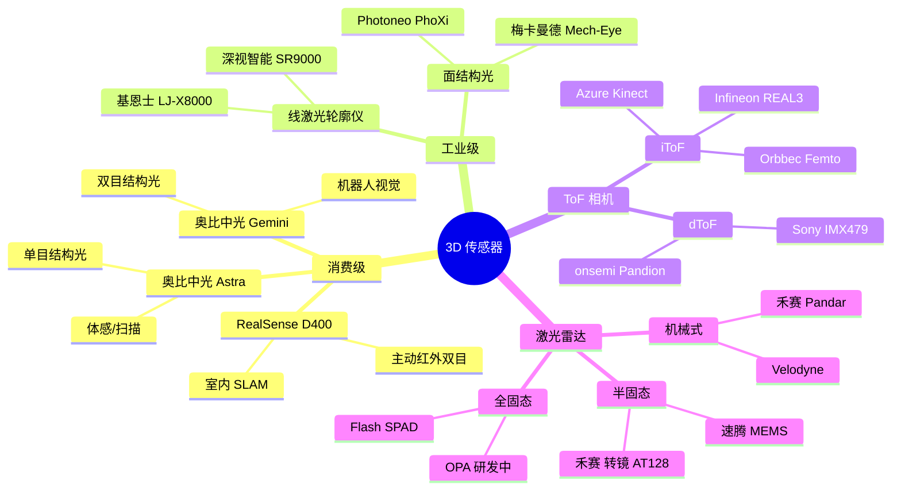
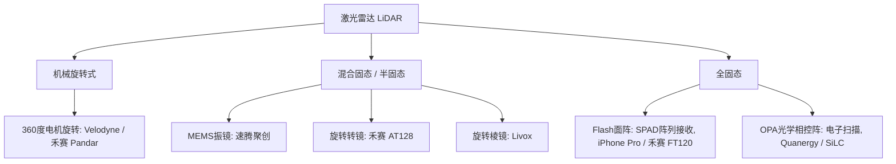
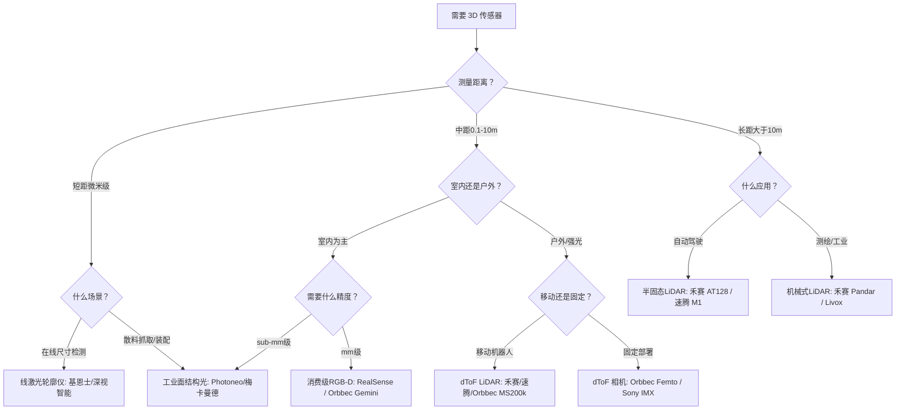

# 3D 相机与传感器

## 从数学到硬件：为什么你需要这一节

前面六章，你建立了一套 3D 视觉的数学工具箱：

- 你知道针孔相机如何将 3D 世界投影到 2D 图像——**$P = K[R \mid t]$**
- 你理解了两张图像之间的对极几何约束——**$x'^T F x = 0$**
- 你学会了三角测量——从两个视角的对应点恢复 3D 坐标
- 你掌握了在噪声数据中做最优估计——**Bundle Adjustment**

理论上，这些工具足够你从多张 2D 图像重建出 3D 场景。实际上也的确可以——这就是后续模块 A/B/C 要讲的内容。

**但有一个现实问题**：你的输入从哪来？

如果输入是两张光线昏暗、噪声满屏、纹理贫瘠的照片，再好的数学工具也无能为力。而如果你有精确、干净、稠密的深度数据——比如一个工业级 3D 扫描仪的输出——重建问题几乎不存在。

**真实世界的 3D 项目，传感器选型决定了你的天花板。** 不同的传感器用不同的物理原理来获取深度：有的投射红外光斑、有的发射纳秒激光脉冲、有的把一个光点扫成整幅图像。理解这些原理，你才能：

1. 知道每种传感器的数据和噪声特性，选择正确的算法
2. 理解为什么模块 B（双目匹配）的算法在 Kinect 的数据上表现不同
3. 在预算、精度、距离、环境之间做合理的取舍

> **一句话**：相机模型回答了"图像怎么来的"，本章回答"深度怎么来的"——选错传感器的代价远大于选错算法。

## 概述

人眼通过双目视差感知深度，机器则有更多选择：主动投射红外光斑、发射激光脉冲、旋转扫描、甚至靠单帧照片推断距离。

按测距原理，主流 3D 传感器可以分为以下几条技术路线：

| 技术路线 | 测距原理 | 典型距离 | 精度 | 代表产品 |
|---------|---------|---------|------|---------|
| 主动红外双目 | 双目立体匹配 + 红外散斑增强纹理 | 0.1–10 m | mm 级（近距） | Intel RealSense D400 系列 |
| 结构光（编码） | 投射已知编码图案，三角测量 | 0.1–5 m | sub-mm 级 | 奥比中光 Astra、iPhone Face ID |
| iToF | 调制红外光的相位差 | 0.1–10 m | mm 级 | Azure Kinect、Orbbec Femto |
| dToF | 脉冲激光的飞行时间 | 0.1–300+ m | cm 级 | iPhone LiDAR、禾赛 AT128 |
| 线激光轮廓 | 激光三角测量，逐行扫描 | 0.01–1 m | μm 级 | 基恩士 LJ-X8000 |
| 面结构光（工业） | 投射多幅条纹图案，相位解算 | 0.1–3 m | μm–mm 级 | Photoneo PhoXi、梅卡曼德 |
| 激光雷达（LiDAR） | 扫描式脉冲 ToF | 1–300+ m | cm 级 | 禾赛、速腾、Velodyne |



## 消费级 RGB-D 相机

消费级 3D 相机的共同特点：价格亲民（$150–$500）、体积小、即插即用、适合室内场景。核心技术路线分三类：主动红外双目（RealSense）、结构光（奥比中光 Astra）、ToF（Azure Kinect / Femto）。

### Intel RealSense D400 系列

RealSense D400 系列采用**主动红外双目**（Active Stereo）方案：两个红外相机做双目匹配，一个红外点阵投射器（projector）向场景投射随机散斑，增强无纹理区域（如白墙）的匹配能力。

| 型号 | 特点 | 基线 | 推荐范围 |
|------|------|------|---------|
| **D415** | 标准 FOV、卷帘快门 | 55 mm | 0.5–3 m |
| **D435** | 宽 FOV、全局快门 | 50 mm | 0.3–3 m |
| **D435i** | D435 + 内置 IMU | 50 mm | 0.3–3 m |
| **D455** | 更长基线、更远距离 | 95 mm | 0.6–6 m |

**⚠️ 重要提醒**：2024 年 5 月，Intel 宣布停止 D400 系列 UWP 驱动更新，D400 平台已进入 **end-of-life** 阶段。新项目不建议选用。

### 奥比中光（Orbbec）

奥比中光是国内 RGB-D 相机的龙头，产品矩阵覆盖结构光、双目、ToF 三条路线：

| 系列 | 技术路线 | 代表型号 | 定位 |
|------|---------|---------|------|
| **Astra** | 单目结构光 | Astra 2 | 室内体积测量、体感交互 |
| **Gemini 330** | 双目结构光 + MX6800 自研芯片 | 335/336/335L/336L | **主力产品**，全场景机器人视觉 |
| **Gemini 2** | 红外增强双目 | Gemini 2/2L/2XL | 长距离户外感知（最远 20 m+） |
| **Femto** | iToF | Femto Bolt/Mega | 替代 Azure Kinect，Microsoft 官方推荐 |

Gemini 330 系列的亮点：搭载自研 ASIC 芯片 MX6800，覆盖 USB3 / GMSL2 / 以太网三大接口，IP65–IP67 防护等级，是机器人视觉的高性价比选择。

Femto Bolt 与 Azure Kinect 使用**相同的 1MP iToF 深度传感器**，但体积更小、RGB 相机带 HDR、出厂标定更好，价格约 $378–$444，是目前 Azure Kinect 的官方替代方案。

## 工业级 3D 传感器

工业场景对精度的要求比消费级高 1–3 个数量级（μm 而非 mm），同时对防护等级、热稳定性、环境光抗性有严格要求。

### 线激光轮廓仪

**原理**：一条激光线投射到物体表面，CMOS 从另一个角度拍摄激光线的形变，通过**激光三角测量**（Laser Triangulation）计算高度剖面。物体或传感器做一维运动时，剖面逐行拼接成完整 3D 点云。

```
      激光器
       │＼
       │  ＼ 激光线
       │    ＼──────────
       │      ＼        │ 物体表面
       │        ＼      │ ↑ 高度变化
       │          ＼    │
       │            ＼──
       │  相机       ↑
       │ /   ←三角法→
       │/
```

**基恩士（Keyence）LJ-X8000 系列**（旗舰级）：

| 参数 | 规格 |
|------|------|
| X 轴分辨率 | 3200 points/profile |
| 采样速度 | 最高 16 kHz |
| Z 轴重复精度 | 最低 0.3 μm |
| 激光光源 | 405 nm 蓝色半导体激光 |
| 防护等级 | IP67 |
| 特色功能 | 单帧 HDR（同时测黑色和光泽面）、轮廓对齐补偿 |

LJ-S8000 系列（2024 年新品）更进一步——内置无刷直驱电机做扫描运动，无需外部运动机构即可完成 3D 成像，最快 0.2 秒/次。

**深视智能（CNSSZN）**——国产线激光龙头：

| 系列 | 特点 |
|------|------|
| SR9000（旗舰） | **全球首款 X 轴 6400 点**线激光传感器，Z 轴重复精度 0.1 μm，线性精度 ±0.02% F.S. |
| SR8000 | **行业最高采样速度 67 kHz**，重复精度 0.2 μm |
| SR7000 | 一体式集成，性价比之选 |

深视智能在速度和精度上与基恩士对标，且实现了全链条自主研发，供货周期和本地化服务有天然优势。应用领域覆盖 3C 电子（苹果/华为/小米供应链）、新能源（比亚迪/宁德时代）、半导体封装等。

### 面结构光（工业级）

与消费级结构光不同，工业面结构光投射的是**多幅编码条纹图案**（而非单幅散斑），通过相位解算（Phase Shifting）获得比消费级高得多的精度。

**Photoneo（斯洛伐克）**——PhoXi 系列：

- 核心技术：**并行结构光**（Parallel Structured Light），单帧即可完成 3D 重建
- 2024 年新一代 PhoXi：内置 NVIDIA Jetson TX2 GPU，扫描速度提升 40%，IP65 防护
- 超/高/标清系列：针对不同精度和视野需求
- **2024 年底被 Zebra Technologies 收购**，技术将整合进 Zebra 的机器视觉产品线
- 全球部署 8,000+ 套，是料箱拣选、拆垛、装配等场景的标杆产品

**梅卡曼德（Mech-Mind）**——国产结构光龙头：

- 核心技术：**自研结构光算法 + 深度学习 AI**，在反光/深色等困难表面表现优异
- 2024 年发布 SDK 2.3，镜面反光金属点云缺失减少 95%
- Mech-Eye Welding：DLP 结构光焊接专用相机，视野比同类大 100%，分辨率提高 230%
- Mech-Eye UHP-140：微米级精度，单点测量 2 秒完成
- 覆盖汽车制造全流程（冲压/焊装/总装/电池），在散料取件、焊接、涂胶等场景有深厚积累

**面结构光 vs 线激光轮廓仪**：

| 维度 | 面结构光 | 线激光轮廓仪 |
|------|---------|-------------|
| 成像方式 | 面阵单/多次投影 | 线扫描 + 运动机构 |
| 数据密度 | 百万级点云/帧 | 数千点/轮廓线 |
| 精度 | μm–mm（中短距） | μm 级（极致精度） |
| 检测速度 | 快（全局成像） | 慢（需扫描） |
| 典型应用 | 料箱拣选、散料抓取、装配 | 在线尺寸检测、平整度、高度测量 |

**TL;DR**：追求极致精度选线激光，追求完整面阵信息选面结构光。

## ToF 相机：iToF vs dToF

ToF（Time of Flight）相机测距的基本公式：

$$d = \frac{c \cdot \Delta t}{2}$$

其中 $c$ 是光速，$\Delta t$ 是光的飞行时间。**"如何测量 $\Delta t$"** 直接区分了 iToF 和 dToF 两大流派。

### iToF（间接飞行时间）

<mark>**核心思想：不直接测量时间，而是测量相位差。**</mark>

原理：发射**连续调制**的红外光（正弦波或方波），光从物体反射回来后，相位已经偏移。通过 4 个不同相位的积分窗口（sampling window）采集反射光的电荷量 $Q_1, Q_2, Q_3, Q_4$，计算相位差：

$$\Delta\phi = \arctan\left(\frac{Q_3 - Q_4}{Q_1 - Q_2}\right)$$

然后由相位差计算距离：

$$d = \frac{c}{2} \cdot \frac{\Delta\phi}{2\pi f}$$

其中 $f$ 是调制频率。更高的调制频率 → 更高的深度精度，但无歧义距离（unambiguous range）更短。

| 优点 | 缺点 |
|------|------|
| ✅ 分辨率高（VGA–1.2 MP） | ❌ 多路径反射干扰严重（相位混合难解） |
| ✅ CMOS 工艺成熟，成本低 | ❌ 环境光抗性中等（强光下信噪比退化） |
| ✅ 近距精度高（sub-mm 级） | ❌ 功耗较高（连续调制发光） |
| ✅ 帧率高（30–120 fps） | ❌ 距离有歧义（受调制频率限制） |

### dToF（直接飞行时间）

<mark>**核心思想：直接给光子计时。**</mark>

原理：发射**超短激光脉冲**（ns–ps 级），SPAD（单光子雪崩二极管）检测单个返回光子，TDC（时间数字转换器）记录光子到达时间。一帧内发射 N 个脉冲，统计所有回波时间，构建**直方图**（histogram），峰值对应最可能的飞行时间。

$$d = \frac{c \cdot t_{peak}}{2}$$

| 优点 | 缺点 |
|------|------|
| ✅ 环境光抗性极强（SPAD 单光子灵敏度） | ❌ 分辨率低（SPAD 阵列像素有限，通常 < QVGA） |
| ✅ 多路径处理能力强（直方图可分离多个回波） | ❌ 成本较高（SPAD + TDC 电路复杂） |
| ✅ 功耗低（脉冲工作，占空比低） | ❌ 测距精度不如近距 iToF |
| ✅ 距离远（可达数百米） | ❌ 直方图处理有计算开销 |

### iToF vs dToF 对比

| 维度 | iToF | dToF |
|------|------|------|
| 测量方式 | 调制光相位差 | 脉冲飞行时间 |
| 光源 | 连续调制 VCSEL | 脉冲 VCSEL（ns 级） |
| 接收器 | 面阵 CMOS 解调像素 | SPAD 阵列 + TDC |
| 分辨率 | VGA–1.2 MP | < QVGA（SPAD 像素） |
| 距离 | 0.1–10 m | 0.1–300+ m |
| 近距精度 | ⭐⭐⭐⭐⭐ (sub-mm) | ⭐⭐⭐ (mm–cm) |
| 远距能力 | ⭐⭐ | ⭐⭐⭐⭐⭐ |
| 环境光抗性 | ⭐⭐⭐ | ⭐⭐⭐⭐⭐ |
| 多路径处理 | ⭐⭐ | ⭐⭐⭐⭐ |
| 成本 | ⭐⭐⭐⭐⭐（低） | ⭐⭐⭐（中–高） |
| 典型应用 | 人脸识别、手势、室内 SLAM | 车载 LiDAR、户外机器人、手机 AR |
| 调制频率 | 10–200 MHz | 不适用（脉冲模式） |

### ToF 传感器芯片

**Sony（索尼）**——dToF SPAD 路线：

| 芯片 | 类型 | 分辨率 | 年份 | 亮点 |
|------|------|--------|------|------|
| IMX456QL | iToF | VGA (640×480) | 2017 | 背照式，120 fps，10 μm 像素 |
| IMX459 | dToF SPAD | ~10 万 SPAD 像素 | ~2020 | 1/2.9 英寸，车载前代 |
| **IMX479** | **dToF SPAD** | **520 dToF 像素 (16.4 万 SPAD)** | **2025** | 1 英寸，PDE 37% @ 940 nm，300 m，20 fps |

Sony IMX479（2025 年 6 月发布）是目前最强的车载 SPAD 深度传感器：300 米探测、5 cm 距离分辨率、0.05° 垂直角分辨率，**直接对标激光雷达性能**。量产时间为 2025 年秋季。

**onsemi（安森美）**——iToF 高分辨率路线：

| 芯片 | 类型 | 分辨率 | 亮点 |
|------|------|--------|------|
| **AF0130** | iToF | **1.2 MP (1280×960)** | 片上深度 ASIC，200 MHz 调制，3.5 μm BSI，<1% 精度 |
| AF0131 | iToF | 1.2 MP (1280×960) | 同 AF0130 但无片上处理 |
| Pandion | dToF SPAD | 400×100 SPAD | 线扫描 dToF + Flash 模式，暗计数 5 Hz |

onsemi 的 AF0130 是目前分辨率最高的 iToF 传感器，1.2 MP + 200 MHz 调制频率，面向机器人/工业 AGV/手势识别等中短距场景，精度 <1%。

**Infineon + pmd（英飞凌 + PMD）**——iToF 嵌入式路线：

- REAL3™ 系列：IRS2976C（最新 VGA，量子效率 30%+，10 m+，仅 23 mm²）
- 独家 SBI（背景光抑制）技术——每个像素内建电路抑制环境光，室外性能业界最强
- 主导手机市场（人脸认证、AR），也用于支付终端、智能锁、服务机器人

**Ti（德州仪器）**——OPT8241（iToF、QVGA），已停产 EVM，不推荐新设计。Ti 已转向单点 ToF（OPT3101）等低成本方向。

Azure Kinect 已于 2023 年停产，其技术通过 **Orbbec Femto Bolt** 延续（相同的 1MP iToF 传感器、相同的 SDK 兼容性）。

## 激光雷达（LiDAR）

### LiDAR 与 ToF 相机的关系

一个常见的误解："LiDAR 和 ToF 是不同的东西。"实际上：

- **ToF（Time of Flight）是测距原理**——发射光、接收光、测量飞行时间
- **LiDAR（Light Detection and Ranging）是一种系统形态**——传统上指带有扫描机构的远距脉冲 ToF 系统
- **iToF 相机是另一种系统形态**——面阵全局成像的中短距连续波 ToF 系统

两者都在使用"飞行时间"测距，区别在于**扫描方式、探测距离和应用场景**。而且这个边界正在模糊：iPhone Pro 上的"LiDAR Scanner"本质上是一个 **Flash 全固态 dToF 相机**。

### 按扫描架构分类

激光雷达的核心分水岭是**有没有机械运动部件**：



#### 机械旋转式

电机驱动激光收发模块 360° 旋转，是 LiDAR 最原始的形态。

| 优点 | 缺点 |
|------|------|
| 360° 全视场角 | 体积大、笨重 |
| 探测距离远（200+ m） | 成本极高（早期 >$70,000） |
| 技术成熟 | 机械磨损、寿命有限、难过车规 |

代表：Velodyne HDL-64、禾赛 Pandar 系列。2024 年自动驾驶市场份额降至 ~18%，主要用于 Robotaxi 测试车，乘用车已极少采用。但在工业三维建模中仍占 72% 渗透率。

#### 半固态（混合固态）

**当前车载量产的绝对主力**。有 MEMS 振镜和旋转转镜两种主流方案：

| 方案 | 原理 | 代表 | 特点 |
|------|------|------|------|
| **MEMS 振镜** | 微机电振镜反射激光实现二维扫描 | 速腾聚创 M1/MX | 体积小、成本低（<$200），但 FOV 有限、怕振动 |
| **旋转转镜** | 电机驱动多面反射镜偏转光束 | 禾赛 AT128/AT512 | 车规可靠、寿命长，但扫描线数受限 |
| **旋转棱镜** | 双楔形棱镜旋转改变光路 | 大疆 Livox Mid360 | 非重复扫描，近 100% 覆盖率，需算法适配 |

速腾聚创的 MX 系列和禾赛的 AT128 是 L2+/L3 乘用车上最常见的激光雷达。禾赛 2024 年交付量 50.19 万台（同比 +126%），成为全球首家**全年盈利**的激光雷达厂商。

#### 全固态

**无任何机械运动部件**，是未来方向：

**Flash 面阵式**（已量产）：类似相机闪光灯，VCSEL 面阵单次照亮整个视场，SPAD 阵列全局接收。

- 优点：零运动模糊、芯片化、低成本、可压缩至 5 cm³
- 缺点：距离受限于功率密度（人眼安全限制），2024 年突破至 150 m
- 代表：iPhone Pro LiDAR Scanner、禾赛 FT120、Ouster Flash

**OPA 光学相控阵**（研发中）：通过控制 VCSEL 阵列单元的相位差实现电子式扫描。

- 优点：扫描速度极快（>100 kHz）、全固态、精确可控
- 缺点：旁瓣效应、技术难度极高、量产困难（预计 2027+）
- OPA + FMCW（调频连续波）被视为最有潜力的远距离全固态方案

### 主要厂商

| 厂商 | 技术路线 | 代表产品 | 2024–2025 动态 |
|------|---------|---------|---------------|
| **禾赛科技** | 转镜半固态 + Flash 全固态 | AT128/AT512/FT120/ETX | 全球首家盈利 LiDAR 厂商，51% 市占率，奔驰/小米/比亚迪定点 |
| **速腾聚创** | MEMS 半固态 + 数字化全固态 | M1/MX/E1R/EM4 | 32 家车企定点，EM4 在极氪 9X 量产，机器人激光雷达爆发 |
| **大疆 Livox** | 旋转棱镜 | Mid40/Mid360 | 工业无人机主力 |
| **Ouster** | Flash 全固态 | OS 系列 | 全球全固态 LiDAR 先行者 |
| **Sony** | SPAD 传感器芯片 | IMX479 | 向 LiDAR 厂商供货，非整机 |

**速腾 vs 禾赛**的竞争格局：速腾走 MEMS + 自研 SPAD-SoC 路线，禾赛走转镜 + 自研 SPAD-SoC 路线。双方都在发力机器人第二曲线（割草机、配送机器人等），都在向下游芯片化垂直整合。

## 最新进展

### 禾赛"毕加索"——全球首款 6D 全彩 SPAD-SoC（2026 年 4 月）

禾赛在第五代自研芯片平台上发布了 **"毕加索 SPAD-SoC"**。这是**全球首款在单颗芯片上实现三维空间感知（XYZ）与物体色彩（RGB）原生融合的激光雷达芯片**。

| 指标 | 规格 |
|------|------|
| 感知维度 | **6D**（XYZ + RGB，原生彩色点云） |
| 光子探测效率（PDE） | **突破 40%**，接近 Sony 45% 的国际顶尖水平 |
| 搭载平台 | ETX 系列激光雷达 |
| 最高线数 | **4320 线**（4K 分辨率：3840×2160） |
| 最远测距 | 600 m（10% 反射率下 400 m） |
| 小目标识别 | 300 m 内水马、280 m 内小动物、150 m 内 15×25 cm 木块 |

**为什么重要**：传统方案需要激光雷达测深度 + 摄像头拍颜色，再通过标定将 RGB 投影到点云上。这个过程有两大问题——空间对齐误差（两个传感器视角不同）和时间同步误差。毕加索在单颗芯片上同时完成 XYZ 和 RGB 的测量，每个点从生成那一刻就自带颜色，不需要外部拼接。

搭载毕加索芯片的 ETX 系列将在 2026 年下半年量产交付，标志着禾赛从"空间感知"向"空间智能"的战略升维。

### 趋势小结

1. **dToF SPAD 正在吃掉 iToF 的市场**——SPAD 的探测效率和分辨率在快速追赶 CMOS iToF，同时带来更强的环境光抗性和更远的距离。短距用面阵 Flash dToF，远距用扫描式 dToF，二者共享 SPAD-SoC 技术底座。
2. **LiDAR 在芯片化**——从分立器件（EEL + APD）到 VCSEL + SPAD-SoC 单芯片，成本从 $70,000 降到 $200，体积从行李箱缩到扑克牌。
3. **RGB + XYZ 原生融合**——毕加索芯片和 Apple 的持续投入都在推动这个方向：未来的 3D 传感器不需要后期配准，直接输出彩色点云。
4. **工业 3D 在追赶消费级的价格**——深视智能、梅卡曼德等国产厂商把 μm 级精度传感器的价格拉到进口的三分之一到一半，推动了在线全检的普及。

## 选型指南



**快速决策表**：

| 你的需求 | 推荐方案 | 参考价格 |
|---------|---------|---------|
| 室内机器人导航、避障 | Orbbec Gemini 335 | ¥2,000–5,000 |
| 3D 扫描、物体重建 | Orbbec Femto Bolt | $378–$444 |
| 工业在线尺寸检测、μm 级 | 深视智能 SR9000 / 基恩士 LJ-X8000 | ¥5 万–30 万 |
| 料箱拣选、散乱工件抓取 | 梅卡曼德 Mech-Eye / Photoneo PhoXi | ¥3 万–15 万 |
| 服务机器人避障（低成本） | dToF 单线雷达 Orbbec MS200k | ¥500–1,500 |
| 自动驾驶 L2+/L3 | 禾赛 AT128 / 速腾聚创 M1 | $200–$500 |
| 户外机器人远距感知 | Livox Mid360 / 禾赛 JT 系列 | ¥3,000–8,000 |

> **一句话选型口诀**：近距离要精度选结构光，中距离要密度选 iToF，远距离要抗干扰选 dToF 扫描，工业检测要微米级选线激光。
