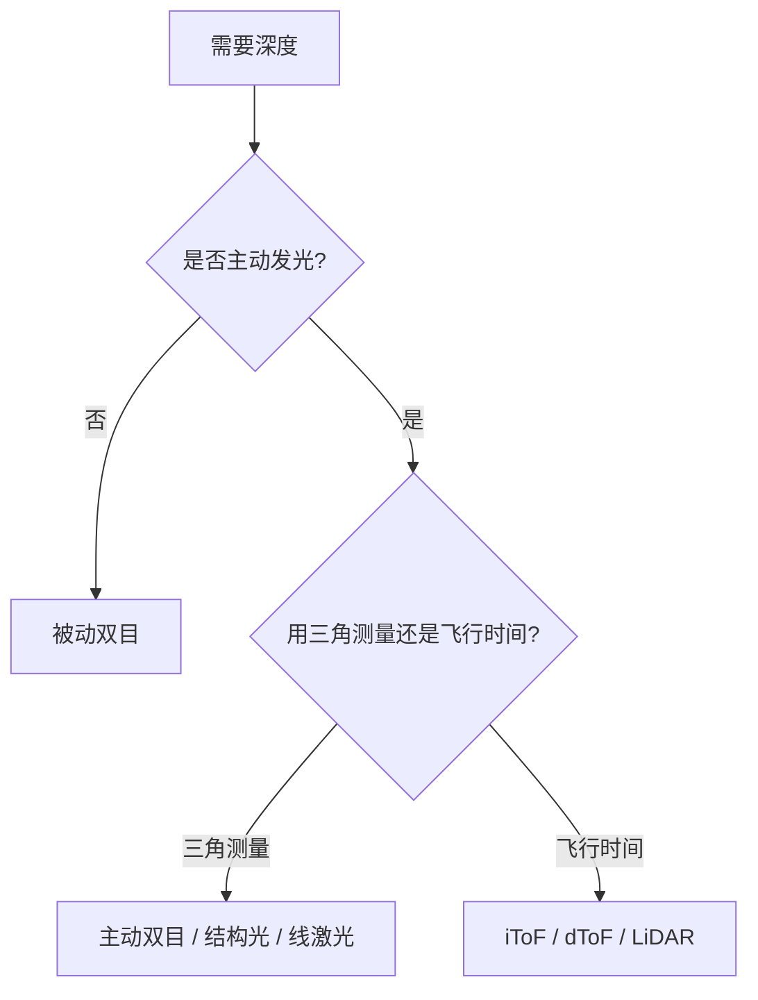

# 第 7 章 3D 相机与传感器：深度从哪里来

> [!NOTE]
> **预计阅读时间**：45 分钟 · **前置知识**：基础篇第 1-6 章
>
> 前面几章讲的是“如何从图像和几何关系恢复 3D”。本章回到硬件：真实产品里，深度可以来自双目、结构光、ToF、LiDAR、线激光、工业结构光。理解传感器原理，是为了知道数据什么时候可信、什么时候会失效。

---

## 7.1 本章目标

3D 视觉项目里，传感器选型往往决定上限。算法再强，也很难弥补错误传感器带来的物理缺陷。

本章回答：

1. 主流 3D 传感器如何获得深度？
2. 它们输出什么数据？
3. 各自容易在哪些场景失效？
4. 选型时应该看哪些指标？

---

## 7.2 深度获取的几条路线

| 路线 | 核心原理 | 输出 | 典型场景 |
|------|---------|------|---------|
| 被动双目 | 两个相机匹配视差 | 视差图/深度图 | 户外、机器人、自动驾驶 |
| 主动双目 | 双目 + 投射纹理 | 深度图 | 室内弱纹理 |
| 结构光 | 投射已知图案，三角测量 | 深度图/点云 | 近距高精度 |
| iToF | 调制光相位差 | 深度图 | RGB-D、手势、机器人 |
| dToF/LiDAR | 脉冲飞行时间 | 点云/深度图 | 远距、户外 |
| 线激光 | 激光三角测量扫描剖面 | 轮廓/点云 | 工业测量 |
| 工业面结构光 | 多幅条纹相位解算 | 高精点云 | 抓取、检测、扫描 |



> [!NOTE]
> 本章的品牌和型号是**截至 2026-05-01 的实用参考**，不是永久推荐榜。传感器产品更新很快，真正采购前要查官方 datasheet、SDK 支持状态、供货周期和本地技术支持。

---

## 7.3 双目：用视差算深度

双目的核心公式来自第 4 章：

$$Z=\frac{fB}{d}$$

其中 $B$ 是基线，$f$ 是像素焦距，$d$ 是视差。

双目的输入通常是两张同步图像：

```text
左图 + 右图 + 双目标定参数 -> 矫正图 -> 视差图 -> 深度图/点云
```

这里最难的一步是“视差图”。算法要判断左图某个像素在右图对应哪个像素。如果图像上有清楚纹理，这件事相对容易；如果是白墙、纯黑塑料、重复栅格，算法就很难知道哪个点和哪个点对应。

### 被动双目

被动双目不主动投光，只靠自然纹理匹配。

优点：

- 户外强光下可用。
- 多设备之间不会主动光干扰。
- 可以做较大基线，适合远距。

缺点：

- 白墙、黑色物体、重复纹理上匹配困难。
- 夜间和低照度下性能下降。
- 需要较强的匹配算法。

### 主动双目

主动双目会投射红外散斑或纹理，让白墙也有可匹配纹理。

优点：

- 室内弱纹理表现好。
- 近距离深度较稳定。

缺点：

- 户外阳光会淹没红外投影。
- 多台设备可能互相干扰。
- 投影距离有限。

> [!TIP]
> 主动双目的“主动”不是直接测距，而是给双目匹配补纹理。深度仍然主要来自视差三角测量，所以基线、焦距、匹配误差仍然决定精度。

双目方案的选型重点：

| 指标 | 怎么理解 |
|------|---------|
| 基线 | 影响远距精度；基线大更适合远处，但近处遮挡更多 |
| 全局快门 | 运动场景更稳定，滚动快门会引入几何畸变 |
| 主机算力 | 被动双目常把深度计算放在主机或 GPU 上 |
| 红外投影 | 室内弱纹理有帮助，户外强光下效果下降 |
| 同步接口 | 多相机、机器人、IMU 融合时很关键 |

### 代表品牌和型号

| 类型 | 品牌/型号 | 适合场景 | 备注 |
|------|-----------|----------|------|
| 主动双目 / RGB-D | RealSense D400 系列 | 室内机器人、近距 RGB-D | 生态成熟；RealSense 已从 Intel 独立，采购前确认 SDK/供货状态 |
| 主动/被动融合双目 | Orbbec Gemini 330 系列 | 机器人视觉、室内外混合 | 内置深度引擎 ASIC，强调低主机算力和多机同步 |
| 被动双目 | Stereolabs ZED X / ZED X Mini | 户外、移动机器人、Jetson 平台 | Neural Stereo Depth，需要主机算力；ZED X 可到 20-35 m 级深度范围（取决于镜头） |
| 工业被动双目 | Teledyne FLIR Bumblebee 系列 | 工业双目、固定部署 | 工业相机背景强，适合稳定工程系统 |

---

## 7.4 结构光：投一个已知图案

结构光主动投射已知图案，例如散斑、条纹、编码光栅。相机看到图案变形后，通过三角测量恢复深度。

典型流程：

```text
投射图案 -> 相机拍摄变形图案 -> 解码对应关系 -> 三角测量 -> 深度
```

结构光和主动双目都用到了“投影”，但重点不同：

```text
主动双目：投影是为了增加纹理，核心仍是双目匹配。
结构光：投影图案本身带编码，核心是解码投影仪点和相机点的对应关系。
```

可以把投影仪理解成一个“反过来的相机”。相机知道图案落在图像哪里，系统再推断它来自投影仪的哪个位置；相机射线和投影仪射线相交，就得到三维点。

结构光又可以粗分为两类：

| 类型 | 特点 | 适合 |
|------|------|------|
| 单帧散斑/编码图案 | 一次曝光可得到深度，速度快，精度中等 | RGB-D、动态人体、普通机器人 |
| 多帧条纹/相移 | 多张图解相位，精度高，但要求静止 | 工业检测、逆向扫描、精密定位 |

结构光适合：

- 近距离扫描
- 人脸/物体建模
- 工业抓取
- 室内 RGB-D

常见失效：

| 场景 | 原因 |
|------|------|
| 强阳光 | 红外/投影图案被环境光淹没 |
| 透明/反光物体 | 图案反射路径不稳定 |
| 黑色吸光表面 | 投影信号太弱 |
| 多设备同时工作 | 投影图案互相干扰 |

> [!CAUTION]
> 结构光宣传里的“精度”通常是在特定距离、材质、曝光和标定条件下测得的。真正项目里要拿自己的样件测试：黑色塑料、金属高光、透明包装、边缘薄片，往往比白色标准块难很多。

---

## 7.5 ToF：测光飞行时间

ToF（Time of Flight）直接测光从发射到返回的时间或相位差。

### iToF：间接飞行时间

iToF 发射调制光，通过相位差估计距离：

$$d=\frac{c\Delta\phi}{4\pi f_m}$$

其中 $c$ 是光速，$f_m$ 是调制频率，$\Delta\phi$ 是相位差。

优点：

- 可以输出较稠密深度图。
- 结构紧凑，适合室内 RGB-D。

缺点：

- 有相位缠绕，距离存在歧义。
- 多径反射会造成错误深度。
- 强环境光会降低信噪比。

iToF 相机通常还会输出 amplitude、confidence 或 infrared 图。它们不是装饰信息，而是判断深度可信度的重要线索：返回光太弱、过曝、多径严重时，深度值可能看起来有数字，但实际并不可靠。

> [!TIP]
> ToF 的多径问题可以理解成“一个像素收到了多条光路的混合回波”。比如墙角、杯子内壁、镜面附近，光可能先打到 A 再反到 B，传感器收到的是混合信号，最后算出的距离就会偏离真实表面。

### dToF：直接飞行时间

dToF 发射短脉冲，直接测返回时间：

$$d=\frac{c\Delta t}{2}$$

优点：

- 适合远距离。
- 抗干扰能力较强。
- 是很多 LiDAR 的基础。

缺点：

- 高精度计时硬件复杂。
- 稠密度和成本受限。

### 代表品牌和型号

| 类型 | 品牌/型号 | 适合场景 | 备注 |
|------|-----------|----------|------|
| iToF RGB-D | Orbbec Femto Bolt / Femto Mega | 室内 RGB-D、人体/机器人、Azure Kinect 替代 | Femto Bolt 使用 1MP ToF，深度模式最高 1024×1024@15fps 或 640×576@30fps |
| iToF 模组/芯片 | Infineon/pmd REAL3、onsemi ToF | 手机、嵌入式模组 | 更多是模组/芯片级选择 |
| dToF/Flash | Sony SPAD/ToF 传感器、部分 Flash LiDAR | 短中距稠密 ToF | 关注阳光、反射、多径和同步 |

---

## 7.6 LiDAR：扫描式 ToF 点云

LiDAR 通常发射激光并扫描空间，输出稀疏但远距的点云。每个点常包含：

```text
(x, y, z, intensity, timestamp)
```

这几个字段分别有实际意义：

| 字段 | 含义 |
|------|------|
| $(x,y,z)$ | LiDAR 坐标系下的三维点 |
| intensity | 回波强度，和材质、距离、入射角有关 |
| timestamp | 该点被扫描到的时间，用于运动补偿和多传感器同步 |

LiDAR 和普通深度相机的一个区别是：很多 LiDAR 不是“同一时刻拍下一整张深度图”，而是在一段时间内扫描出一帧点云。如果平台在运动，点云里不同点对应的相机/车体姿态并不完全相同，这就是运动畸变。

按扫描方式可分为：

| 类型 | 特点 |
|------|------|
| 机械旋转 | 视场大，结构复杂 |
| 半固态 | 用 MEMS/棱镜等方式减少机械结构 |
| Flash | 一次照亮整个视场，类似 dToF 相机 |
| 固态扫描 | 结构紧凑，是长期方向 |

LiDAR 常见误差：

- 雨雾尘造成回波异常。
- 黑色物体反射弱。
- 玻璃和镜面反射路径复杂。
- 运动扫描会带来时间畸变，需要运动补偿。

选 LiDAR 时不要只看最远探测距离，还要看：

| 指标 | 为什么重要 |
|------|-----------|
| 10% 反射率距离 | 比“高反射率最远距离”更接近黑车、暗物体等难场景 |
| 垂直视场角 | 决定近处地面、台阶、高处障碍能不能看到 |
| 点频/线数 | 影响点云稠密度和小目标可见性 |
| 时间同步 | 和相机、IMU、车辆里程计融合时必须可靠 |
| ROS/SDK/驱动 | 决定工程接入成本 |

### 代表品牌和型号

| 类型 | 品牌/型号 | 适合场景 | 备注 |
|------|-----------|----------|------|
| 机器人环视 LiDAR | Livox Mid-360 / Mid-360S | 移动机器人、SLAM、避障 | 360°×59° FOV，40 m @10% 反射率，约 20 万点/秒 |
| 车规长距 LiDAR | Hesai AT128 | ADAS、Robotaxi、远距感知 | 120°×25.4° FOV，210 m @10% 反射率，约 153.6 万点/秒 |
| 车规/机器人 LiDAR | RoboSense M 系列、速腾聚创产品线 | 自动驾驶、机器人 | 采购前重点看 FOV、点频、SDK、同步和车规要求 |

---

## 7.7 线激光和工业结构光

### 线激光轮廓仪

线激光投射一条激光线，相机从侧面观察激光线在物体表面的形变，通过三角测量得到一条高度剖面。物体移动或传感器扫描后，剖面拼成 3D。

线激光不是一次得到完整 3D，而是先得到“一条剖面”。要得到面，需要有一个可控运动：

```text
每一帧激光剖面 + 物体/传感器运动位移 -> 多条剖面拼接 -> 3D 高度图或点云
```

因此线激光系统里，传感器本身只是答案的一半。另一半是运动机构、编码器、触发同步和安装刚性。

适合：

- 在线尺寸检测
- 焊缝检测
- 高度/轮廓测量
- 高速产线

特点：

- 精度可达微米到亚毫米级。
- 视场较窄。
- 对安装、标定、运动同步要求高。

### 工业面结构光

工业面结构光通常投射多幅条纹，通过相位解算获得高精度点云。

多幅条纹为什么能提高精度？因为它不是只判断“这个亮点像哪个点”，而是通过多张相位变化来估计更连续、更细的对应关系。代价是采集期间目标最好不要动，否则不同条纹图之间对应不上。

适合：

- 料箱抓取
- 零件检测
- 逆向工程
- 近距离高精扫描

局限：

- 通常需要物体静止。
- 对反光、透明、黑色物体困难。
- 多帧投影会受运动影响。

### 代表品牌和型号

| 类型 | 品牌/型号 | 适合场景 | 备注 |
|------|-----------|----------|------|
| 线激光轮廓仪 | Keyence LJ-X8000 系列 | 在线尺寸检测、高速产线 | 官方规格显示可到 3200 points/profile，部分测头 Z 重复精度可到亚微米级 |
| 工业面结构光 | Photoneo PhoXi | 静态高精点云、机器人定位 | 结构光点云，官方给出 25-500 μm 级 accuracy 范围 |
| 工业 3D 相机 | Mech-Mind Mech-Eye | 机器人抓取、检测、装配 | 型号覆盖近距高精到大 FOV；UHP-140 可到微米级 Z 重复性，常规 V3 型号多在 0.05-0.5 mm 量级 |

国产工业 3D 相机和线激光也值得单独调研，尤其在供货、技术支持、软件集成、现场响应上可能更适合国内项目。选型时不要只比较英文 datasheet 的最高指标，要把 SDK、现场调试工具、标定工具、售后响应一起算进去。

---

## 7.8 传感器输出和标定

不同传感器输出不同，但最后都会进入前几章的表示体系：

| 传感器 | 常见输出 |
|--------|---------|
| RGB-D | RGB 图 + 深度图 + 内参 |
| 双目相机 | 左右图 + 双目参数 + 可选视差图 |
| LiDAR | 点云 + 时间戳 + 反射强度 |
| 工业结构光 | 点云/mesh + 置信度 |
| 线激光 | 轮廓线/高度图 |

多传感器系统还需要外参：

```text
LiDAR 坐标系 -> 相机坐标系
相机坐标系 -> 机器人基座坐标系
IMU 坐标系 -> 相机坐标系
```

这就是第 2 章的 $R,t$ 在硬件系统中的实际用法。

> [!CAUTION]
> 很多项目失败不是算法错，而是标定、同步、坐标约定或单位错。检查数据时先确认：单位是米还是毫米？深度是 $Z$ 还是欧氏距离？点云在哪个坐标系？时间戳是否对齐？

---

## 7.9 选型指标

选传感器时，不要只看“精度”一个指标。

| 指标 | 要问的问题 |
|------|-----------|
| 工作距离 | 最近/最远距离是多少？ |
| 精度 | 是绝对精度、重复精度，还是深度噪声？ |
| 分辨率 | 深度图多密？点云多稠密？ |
| 帧率 | 是否满足运动速度？ |
| 视场角 | 能否覆盖目标区域？ |
| 光照 | 室内、户外、强阳光？ |
| 材质 | 黑色、反光、透明、金属？ |
| 同步 | 是否需要和相机/IMU/机械臂同步？ |
| 算力 | 是否需要 GPU？是否有片上深度？ |
| 接口 | USB、GigE、GMSL、以太网、ROS？ |
| 标定 | 是否出厂标定？是否容易重标定？ |

其中“精度”最容易被误读。至少要区分：

| 名称 | 含义 |
|------|------|
| 深度噪声 | 同一个点反复测量时的随机波动 |
| 重复精度 | 同一条件多次测量能否稳定重复 |
| 绝对精度 | 测出来的尺寸/距离和真实值差多少 |
| 平面度误差 | 测一个标准平面时，点云离理想平面的偏差 |
| 边缘误差 | 物体边界、遮挡处的深度拖影和飞点 |

很多项目真正卡住的不是中心区域的深度噪声，而是边缘、黑色、反光、运动、多机干扰和温漂。

快速建议：

| 场景 | 优先考虑 |
|------|---------|
| 室内机器人避障 | RGB-D、主动双目、iToF |
| 户外移动机器人 | 被动双目、LiDAR |
| 近距离高精扫描 | 结构光、工业面结构光 |
| 在线尺寸检测 | 线激光轮廓仪 |
| 自动驾驶/远距感知 | LiDAR + camera |
| 透明/反光物体 | 需要专门光学方案，普通深度相机通常困难 |

### 品牌速查表

| 需求 | 可先调研的品牌/型号 |
|------|--------------------|
| 室内低成本 RGB-D | RealSense D435/D455、Orbbec Gemini |
| Azure Kinect 替代 / iToF RGB-D | Orbbec Femto Bolt / Femto Mega |
| 户外双目 / Jetson 平台 | Stereolabs ZED X / ZED X Mini |
| 工业双目 | Teledyne FLIR Bumblebee |
| 机器人 360° LiDAR | Livox Mid-360 / Mid-360S |
| 车规远距 LiDAR | Hesai AT128、RoboSense M 系列 |
| 工业线激光 | Keyence LJ-X8000、深视智能等国产线激光 |
| 工业结构光 / 机器人抓取 | Photoneo PhoXi、Mech-Mind Mech-Eye、Mech-Mind 生态 |

> [!CAUTION]
> 这张表是“调研入口”，不是采购结论。最终选择要用你的样件做实测，尤其是黑色、反光、透明、强光、运动、多机干扰这些场景。

### 选型实验怎么做

如果要做一次负责任的选型实验，建议至少准备这些输入：

| 输入 | 例子 |
|------|------|
| 真实样件 | 包括最难的材质：黑色、反光、透明、细小边缘 |
| 工作距离范围 | 最近、最远、典型距离都要测 |
| 光照条件 | 室内、强光、暗光、现场灯光闪烁 |
| 运动条件 | 目标运动、相机运动、机械臂抓取节拍 |
| 评价标准 | 无效点比例、边缘噪声、重复精度、帧率、延迟 |
| 系统约束 | 算力、接口、安装空间、同步、预算、供货 |

测试时不要只看厂商 demo 软件里的彩色深度图。要导出原始深度/点云，统计无效点比例、平面噪声、边缘飞点、同一位置多帧标准差，并在你的算法链路里跑一遍。

---

## 7.10 本章小结、问题与练习

最重要的三句话：

1. 双目和结构光本质上依赖三角测量；ToF 和 LiDAR 依赖光飞行时间。
2. 传感器的物理原理决定了失效场景。
3. 真实系统里，标定、同步、坐标系和单位和算法同样重要。

### 苏格拉底时刻

1. 为什么主动双目在白墙上比被动双目更容易得到深度？
2. 为什么 ToF 在玻璃、镜面和墙角附近容易出错？
3. 为什么远距离双目需要更大的基线？
4. 如果 LiDAR 点投到图像上整体偏移，可能是哪些环节出错？

### 实操练习

**练习 1：传感器失效分析**

列出你的项目场景：距离、光照、材质、精度、帧率。根据本章表格判断哪些传感器可能失效。

**练习 2：深度数据检查清单**

拿一份 RGB-D 或 LiDAR 数据，确认单位、坐标系、无效值编码、时间戳、内外参来源。

**练习 3：选型比较**

为“室内机械臂抓取黑色零件”和“户外机器人 20 m 避障”分别写出传感器选择理由。

### 延伸阅读

- 本书内：[[第 5 章 深度表示]] · [[第 6 章 优化基础]]
- Szeliski, *Computer Vision: Algorithms and Applications*，Stereo 与 3D sensing 章节
- KinectFusion, 2011
- 厂商资料入口：RealSense / Orbbec / Stereolabs / Teledyne FLIR / Keyence / Photoneo / Mech-Mind / Livox / Hesai / RoboSense 的 datasheet、SDK 文档和 application notes
