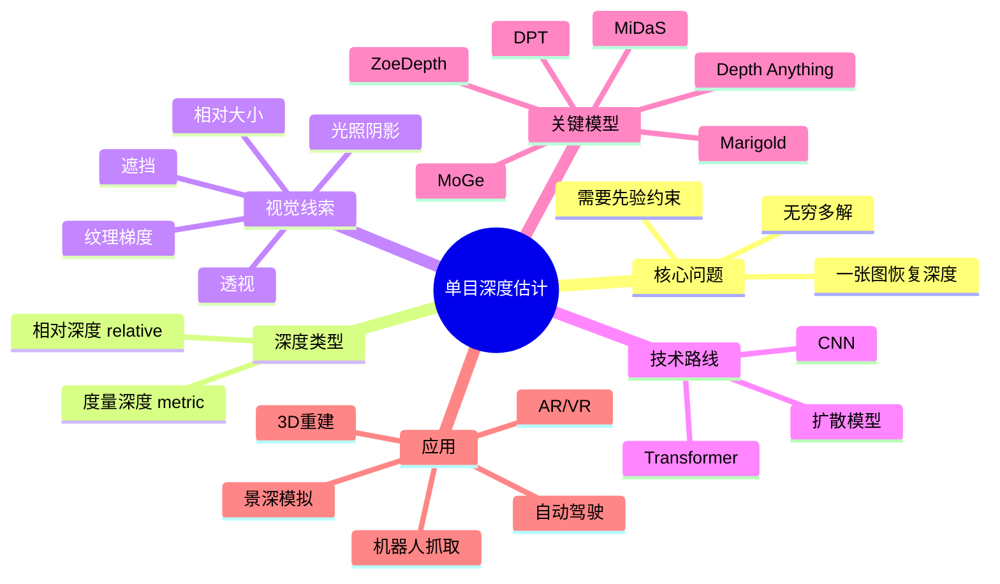

# A.1 直观理解

> **要回答的问题**：为什么从一张照片猜距离在数学上是"无解的"？深度学习模型是怎么绕过这个无解的？relative depth 和 metric depth 到底差在哪？

## 一个场景

你看到一张照片：一只咖啡杯放在白色桌面上，旁边有一本书，背景是一面浅灰色的墙。

你看一眼就知道：杯子离相机大约 30 厘米，书在杯子右边 10 厘米处，墙在整张桌子后面大约 1.5 米远。

你只用了**一张二维图像**——没有激光雷达、没有第二台相机、没有走到桌前拿尺子量——就判断出了物体之间的距离。你的大脑做了单目深度估计。

但把同一张照片喂给 2015 年的任何计算机视觉算法，它说不出来。**为什么人类可以，算法不行？**

## 核心矛盾：无穷多个 3D 场景可以生成同一张 2D 照片

这就是单目深度估计被称作 **ill-posed（病态）** 问题的根本原因。

回顾基础篇学的针孔模型：$x_{pixel} = K \cdot \operatorname{dist}(X/Z, Y/Z)$。投影过程中，$X$ 和 $Y$ 都被除以 $Z$。一个远的、较大的物体，和一个近的、较小的物体，在图像上会投影到**完全相同的一组像素**。

```
近处小桌子                   远处大桌子
     ■                           ■■■
    /|\                         / | \
   / | \                       /  |  \
  /  |  \                     /   |   \
 ○  相机  ○                 ○   相机    ○
     相同像素！                  相同像素！
```

这就意味着：单独一张 RGB 图像，**没有任何数学上可倒推的深度解**。你需要额外的信息——要么来自另一个视角（双目），要么来自对世界的先验知识。

人类靠的就是"先验知识"。你知道一本正常的书大约 20 厘米宽，一个咖啡杯大约 10 厘米高，桌面是平的，墙壁是竖的。你的大脑积累了数十年的"世界长什么样"的数据库，在看到一个场景的瞬间，用这些先验去约束那个 ill-posed 问题。

**深度学习模型做的，本质上也是这件事**——只不过它"积累经验"的方式是用几百万到几千万张标注过的深度图像做训练。

## relative depth vs metric depth

这是单目深度估计领域最重要的区分，直接影响你能拿深度图做什么。

**Relative Depth（相对深度）** 回答："A 比 B 离相机更近，但不知道近几厘米。"

- 深度值之间保持正确的**大小顺序**，但没有物理单位
- 如果对整个深度图做 $d \mapsto a \cdot d + b$（线性缩放+平移），新图和旧图都算是"正确的" relative depth
- 能做：景深模糊、背景替换、视觉排序
- 不能做：机器人抓取、3D 重建、测量

**Metric Depth（度量深度）** 回答："这个像素对应的物体距离相机 0.47 米，误差在 2 厘米以内。"

- 深度值有物理单位（米或毫米），并且和真实世界的尺度一致
- 如果对深度图做 $d \mapsto a \cdot d + b$，除非 $(a=1, b=0)$，否则就"不对"
- 能做：所有事情

> [!TIP]
> relative vs metric 不是两种算法，而是两种**要求**。同一个模型完全可以做到 relative 深度精准但 metric 深度不准。工程上最常见的方案是"先做 relative，再用少量 metric 数据拟合一个 scale/shift 对齐"。

为什么 metric 难？回头看基础篇 $x_{pixel} = K \cdot \operatorname{dist}(X/Z, Y/Z)$。一张图像里没有任何关于"绝对尺度"的信息——一台微单和一台手机，用不同的焦距拍同一个场景，可以得到几乎完全相同的 RGB 图像，但它们的物理 $Z$ 差了数十倍。**单目深度估计要恢复 metric 深度，就要从 RGB 里反向推断相机的内参和场景的物理尺度**——这是极其困难的多对一映射。

## 核心直觉：模型从数据里学到了什么"线索"

深度学习模型并不是"解方程"算出深度。它在训练数据中学会了利用以下视觉线索：

| 线索 | 例子 | 有效性 |
|------|------|--------|
| **透视** | 平行线在远处交汇（铁轨） | 强——几何本质 |
| **纹理梯度** | 远处的草地纹理更密 | 中等——依赖场景 |
| **遮挡** | A 挡 B → A 比 B 近 | 强——但只给相对关系 |
| **相对大小** | 远处的车看起来更小 | 中等——需要知道"正常大小" |
| **光照和阴影** | 阴影投射在物体上暗示空间关系 | 弱但有用 |
| **大气散射** | 远山更蓝更模糊 | 只在户外远距有效 |
| **运动视差** | 近处物体移动更快 | 仅视频中有用 |

> [!TIP]
> 有趣的是：**没有任何一个线索单独能解决深度问题**。透视告诉你"线往哪汇"，但不说"汇点多远"。相对大小告诉你"哪个车更远"，但不说"那辆车离你多少米"。模型的本质工作是：**学会融合所有线索，在某些场景下甚至比几何方法更鲁棒**——因为有纹理时它靠纹理，没纹理时靠语义先验（"我知道杯子一般多大"）。

## 技术全景



## 为什么 2023 年以后这个领域突然爆发

2019-2022 年，单目深度估计的主要进展是 CNN 架构改进（MiDaS → DPT）。精度在涨，但泛化能力有限——在 NYU（室内）上训的模型，扔到 KITTI（室外自动驾驶）上基本不能用。

2023 年以后，三个变化叠加催生了爆发：

1. **大规模混合数据集训练（MiDaS 范式）**：不再只用单一数据集的几千张图训练，而是混合 10+ 个数据集的几百万张图，让模型看到足够多的场景、相机和光照变化。效果：跨域泛化能力跃升。
2. **Transformer 和 diffusion 架构**：DPT 证明了 Vision Transformer 在密集预测任务上远超 CNN；Marigold 证明了 Stable Diffusion 里"锁着"的世界知识可以直接迁移给深度任务。
3. **基础模型思维**：不再把深度估计看作"一个任务训练一个模型"，而是"先训一个什么都懂的大模型，再针对具体场景微调"。Depth Anything V2 用 62M 到 1.3B 参数的模型在不同规模上验证了 scaling law——越大越准、泛化越好。

> 现在的主流范式：**一个预训练的基础模型 → zero-shot 迁移到任何场景 → 按需微调（可选）**。这个范式还在快速迭代中。下一节会拆解这些模型的具体设计。
