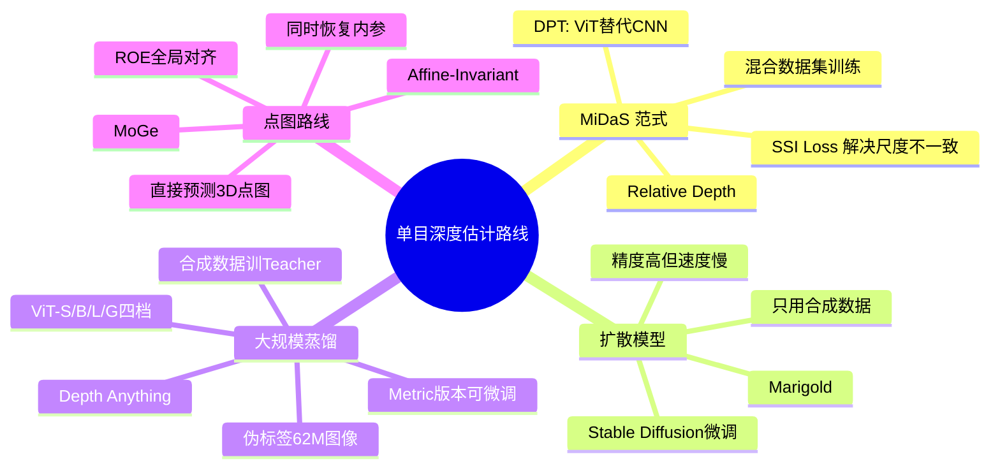

# A.2 原理解析

> **目标**：理解三条技术路线的核心设计——CNN 混合训练（MiDaS 范式）、扩散模型嫁接（Marigold）、大规模蒸馏（Depth Anything）。知道它们各自的关键公式、训练策略和适用场景。

单目深度估计在 2019-2025 年间经历了三条技术路线的快速迭代。本节按时间线拆解代表性模型的设计动机和关键技术选择。

## CNN + 混合数据集训练：MiDaS 范式

**核心问题**：2019 年之前，单目深度估计模型在一个数据集上训练、在同一个数据集上测试。换一个相机、换一个场景类型，精度就崩塌。

Ranftl 等人在 2019 年的 MiDaS（*Towards Robust Monocular Depth Estimation: Mixing Datasets for Zero-shot Cross-dataset Transfer*）中提出了一个简单但根本性的方案：**把多个不同数据集的深度标注混合在一起训练同一个 CNN**。

但这里有一个技术障碍：不同数据集有完全不同的深度尺度。NYU v2 的深度值是 0-10 米（室内），KITTI 是 0-80 米（室外自动驾驶），而 ReDWeb 是来自网络的相对立体深度——单位不统一，零深度的含义也不同。

**Scale- and Shift-Invariant Loss（SSI Loss）**

MiDaS 的核心贡献是 SSI 损失函数。在计算 loss 之前，先对每个训练样本求解最优的 scale $a$ 和 shift $b$，使预测深度与 GT 深度在最小二乘意义上对齐：

$$\mathcal{L}_{SSI} = \frac{1}{N} \sum_i \rho\left( \log \tilde{y}_i - \log(a \cdot \hat{y}_i + b) \right)$$

其中 $\tilde{y}_i$ 是 GT 深度，$\hat{y}_i$ 是预测深度，$a, b$ 通过闭式最小二乘求解（每个样本独立计算），$\rho$ 是鲁棒损失函数（L1 或其变体）。在 log 空间中计算，因为深度误差更符合对数正态分布。

**效果**：模型不再被强迫学习"这个像素距离 3.47 米"，而是学习"这个像素比那个像素近，近的程度大约是它的 1.5 倍"——relative depth。换一个数据集、换一种相机、换一个场景类型，这种"相对关系"的泛化能力远超 metric 深度。

**DPT（2021）：把 ViT 接进来**

Ranftl 等人在 DPT（*Vision Transformers for Dense Prediction*, ICCV 2021）中验证了一个关键假设：Vision Transformer 比 CNN 更适合密集预测任务。DPT 用 ViT 作为编码器提取多尺度特征，通过 Reassemble + Fusion 模块把 token 特征重新组装成像素级预测。DPT 替换 MiDaS 的 CNN 骨干后，在 zero-shot 深度估计上取得了约 20% 的精度提升。

## 扩散模型路线：Marigold

Ke 等人在 2024 年 CVPR（Oral）发表的 Marigold，思路完全不同：**不给深度任务从头训练一个模型，而是把 Stable Diffusion 已经学会的视觉知识"借"过来**。

**核心洞察**：Stable Diffusion v2 在数十亿张图像上预训练，其内部特征已经编码了非常丰富的场景几何信息（遮挡、透视、物体形状、表面朝向）。微调一个深度预测头，比从头训练一个完整的深度模型，能更好地利用这些"锁在"扩散模型里的先验。

**训练方式**：
- 冻结 Stable Diffusion v2 的 VAE 和 UNet 大部分层
- 只微调 UNet 的一小部分参数
- **只用合成数据集训练**（没有用任何真实深度数据）
- 在单张 GPU 上训练几天

**推理过程**：输入一张 RGB 图，加噪声后通过微调过的扩散 UNet 多步去噪（DDIM scheduler，1-4 步推理），输出 affine-invariant 深度图。

**关键数据**：Marigold 在多个 zero-shot 基准上比之前最好的方法（当时的 Depth Anything V1）有 >20% 的相对提升。但代价是推理速度——扩散模型的多步去噪比 CNN 的直接前向推理慢 10 倍以上。

> [!NOTE]
> Marigold 的续作 Marigold v2 将同一思路扩展到表面法向量估计和 intrinsic image decomposition，证明了"扩散模型先验可迁移"不是深度估计的特例。

## 大规模蒸馏路线：Depth Anything 系列

Depth Anything 是 2024 年影响最大的单目深度估计工作之一。第一作者李贺阳（HKU / TikTok），发表于 NeurIPS 2024。

### V1：用无标签数据扩展

**核心公式**：Depth Anything V1 的 SSI 损失（基于 MiDaS）：

$$\mathcal{L}_{ssi} = \frac{1}{N} \sum_i \rho( \log d_i^* - \log d_i )$$

其中 $d_i^*$ 是 GT 深度，$d_i$ 是预测深度。$\rho$ 使用 scale-and-shift-invariant 的鲁棒形式，在 log 空间计算。

**训练策略**：两阶段。
1. 先在 **1.5M 有标签数据**（6 个公开数据集的混合）上训练 teacher 模型。
2. 用 teacher 给 **62M 无标签图像**（来自 ImageNet-21K、Places365 等 8 个来源）打伪标签。
3. 用 {原标签 + 伪标签} 联合训练 student 模型。

架构是 DINOv2 ViT-L encoder + DPT decoder。

### V2：合成数据替代真实标签

**V2 最大的改变**：**Stage 1 不再使用任何真实深度标签**。这反直觉，但效果更好。

**三阶段训练**：

| 阶段 | 数据 | 操作 |
|------|------|------|
| Stage 1 | **595K 合成图像**（Hypersim, Virtual KITTI 2, BlendedMVS, IRS, TartanAir） | 训练 Teacher（DINOv2-G, ~1.3B params），使用 $\mathcal{L}_{ssi}$ + $\mathcal{L}_{gm}$ |
| Stage 2 | **62M 无标签真实图像**（BDD100K, ImageNet-21K, Places365, SA-1B 等 8 个来源） | 冻结 Teacher，为全部图像生成伪深度标签 |
| Stage 3 | 62M 伪标签图像（无合成数据） | 训练 Student（DINOv2-S/B/L 三种规模），使用 label-level distillation |

**为什么合成数据比真实标签更好？** 论文分析了几个原因：合成图像的 GT 深度是 pixel-perfect（包括透明/反射表面和薄结构）；不存在真实传感器噪声（LiDAR 的稀疏性和镜面反射错误）；不会出现 SfM/MVS 重建中常见的尺度不一致问题。

**损失函数细节**：

SSI Loss（继承自 MiDaS）：
$$\mathcal{L}_{ssi} = \sqrt{\frac{1}{N} \sum_i (\log d_i - \log d_i^*)^2}$$

其中 $d_i$ 和 $d_i^*$ 是先做 scale-shift 对齐后的预测和 GT 深度。对齐参数 $(a, b)$ 通过闭式最小二乘求解（每个样本独立）。

Gradient Matching Loss（V2 新引入）：
$$\mathcal{L}_{gm} = \frac{1}{N} \sum_i \|\nabla d_i - \nabla d_i^*\|_1$$

这是 V2 的核心贡献之一。合成数据的 GT 深度有非常锐利的边缘——真实镜头因为焦距限制不可能这么锐。$\mathcal{L}_{gm}$ 强制模型学习这些锐利边缘，否则预测结果会过度平滑。论文中 $\mathcal{L}_{gm}$ 的权重约为 $\mathcal{L}_{ssi}$ 的 2 倍。

**四档模型**：Small (24.8M)、Base (97.5M)、Large (335.3M)、Giant (1.3B)。从 Small 到 Giant，在 zero-shot 基准上的精度单调提升——验证了 scaling law。

**Metric 深度版本**：在 Stage 3 后，用少量 metric 深度数据（Virtual KITTI 2 用于室外，NYU-D 用于室内）做微调，损失函数从 $\mathcal{L}_{ssi}$ 换成 L1 loss（在 metric 空间计算）。

> [!NOTE]
> Depth Anything V2 比 Marigold 的推理速度快 **10 倍以上**（单次前向 vs 多步扩散去噪），同时 fine detail 更好。但 Marigold 在极端场景（非自然图像、艺术风格图像）中可能更鲁棒——扩散模型的先验空间更广。

## 点图路线：MoGe

Wang 等人在 2024 年 10 月发表的 MoGe（arXiv:2410.19115, CVPR 2025 Oral），对单目几何估计的表示方式做了一次根本性的重新思考。

**传统深度估计的输出是一个 $H \times W$ 的深度值矩阵**。MoGe 的输出是一个 $H \times W \times 3$ 的 **3D 点图（point map）**——每个像素对应的是 $(X,Y,Z)$ 坐标，而不仅仅是 $Z$ 值。

**为什么是点图？** 深度图 $d(u,v)$ 是"沿着像素方向的距离"，但不同像素的方向是不同的（取决于相机内参和畸变）。$d(u,v)$ 无法独立表达一个 3D 点的位置——你需要额外知道这个像素的方向。而点图 $P(u,v) = (X,Y,Z)$ 直接给出 3D 坐标，不需要标准针孔投影的"除以 Z + 乘 K"流程。这避免了深度学习中因内参未知导致的模糊性。

**Affine-Invariant Point Map**

MoGe 预测的点图是 **affine-invariant** 的：预测值 $\hat{P}$ 和真实值 $P$ 之间差一个未知的全局 scale $s$ 和 translation $t$（即 $\hat{P} \approx sP + t$）。这解决了"单张图无法推断绝对尺度"的问题——先让模型学会"相对几何"，后续再用少量 metric 数据恢复尺度。这与 Depth Anything 的 affine-invariant depth 是同一个思路，但推广到了 3D 点云空间。

**ROE Solver**：训练时，对每个样本求解最优的 $(s, t)$ 使预测点云与 GT 点云对齐。MoGe 使用一个高效的并行搜索策略（ROE = Robust, Optimal, Efficient），在几毫秒内完成对齐。

**Multi-Scale Local Geometry Loss**：在 $\mathcal{L}_1$ 全局损失之外，MoGe 在 GT 点云中随机采样球体区域，对每个球体内的预测和 GT 分别做局部对齐后再计算 loss。这迫使模型在局部几何上也做到准确（不只是全局"大模样"对）。

**训练数据**：约 9M 帧，混合合成数据集和真实数据集。

**相机内参恢复**：从 affine-invariant 点图中恢复相机焦距的过程非常快（约 3ms），通过闭式优化求解。这使 MoGe 可以直接输出 metric 深度和 FOV，而不需要依赖 Ground Truth 内参。

## 路线对比

## 什么决定了泛化能力

读完四篇论文，每个团队都在回答同一个问题：**怎么让模型在没见过的新场景、新相机下也能用？**

四个答案：

| 策略 | 代表 | 原理 |
|------|------|------|
| **SSI Loss** | MiDaS, Depth Anything | 训练时不强迫学习绝对尺度，只学相对关系 |
| **数据多样性** | Depth Anything V2 | 62M 伪标签图像覆盖 8 个数据源，从 ImageNet 到自动驾驶 |
| **预训练先验** | Marigold, MoGe | Stable Diffusion/DINOv2 的视觉表征已经编码了丰富的几何信息 |
| **3D-aware 表示** | MoGe | 把输出从 1D 深度值升级为 3D 点坐标，直接用 3D 几何做监督 |

> 现在的主流方案是"四合一"：DINOv2 骨干 + SSI 损失 + 大规模数据蒸馏 + metric 微调。Depth Anything V2 + metric fine-tuning 和 MoGe 是最接近这个理想的当代方法。但扩散模型路线（Marigold）可能在特定领域（艺术风格、极端场景）仍有独特优势。
