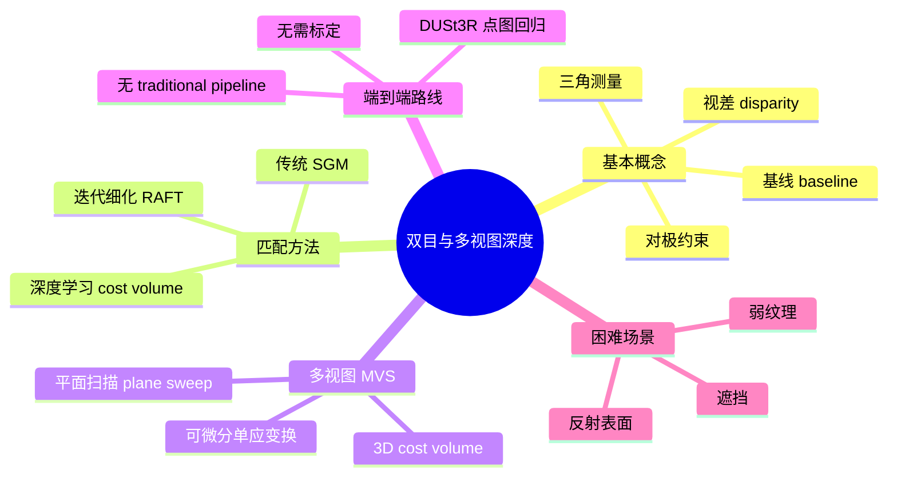

# B.1 直观理解

> **要回答的问题**：双目匹配比单目"猜"深度好在哪？视差怎么变成深度？对极约束为什么能把搜索从"整个图"缩小到"一条线"？什么场景下双目会失败？

## 一个场景

你举起双手，拇指朝上，左眼闭右眼睁，看拇指盖住背景的哪个位置。然后右眼闭左眼睁——拇指"跳"到了另一个位置。这个跳动的幅度，就是**视差**。

拇指离你越近，跳动幅度越大；手臂伸直到最远，两只眼睛看到的拇指几乎在同一个位置。这就是双目深度估计的物理基础：**近处物体视差大，远处物体视差小，无穷远处视差为零。**

## 核心直觉：从"猜"到"算"

单目深度估计是 ill-posed——无穷多个 3D 场景能投影出同一张 2D 图像。双目把这个 ill-posed 问题变成了 well-posed：**给定两台标定好的相机和一个像素在左图的位置，它在右图中的对应点一定落在一条确定的线上（对极线）。你只需要沿着这条线找匹配点，匹配到了就能用三角测量算深度。**

```
左图   ● x                          右图
        \                            |
         \   对极平面              l' ● ← x' 一定在这条线上
          \                          |
           \                       ● x'（匹配点，在 l' 上不远处找到）
          C ●-----------------● C'
                基线 b
```

搜索空间从"整个右图"缩小到"一条线"——这是对极约束给立体匹配的核心加速。**双目把深度估计从一个"语义理解"问题，变成了一个"像素匹配"问题。**

## 视差如何变成深度

基础篇讲过，矫正后的双目系统中，左右图的对应点在同一行上（$v_L = v_R$），只有列坐标不同。列坐标的差就是视差 $d$：

$$d = u_L - u_R$$

已知基线 $b$（两台相机光心的距离）和焦距 $f$（像素单位），深度 $Z$ 由相似三角形直接给出：

$$Z = \frac{f \cdot b}{d}$$

**这个公式没有 scale ambiguity。** 单目模型预测的深度是"相对远近"（差一个未知的 scale 和 shift），双目模型预测的视差可以**直接换算成带物理单位的深度**（米或毫米）——只要 $f$ 和 $b$ 是已知的。

但是 $Z = fb/d$ 也暴露了双目的工程极限：

- **远处物体深度精度低**：$d$ 很小时（远距），$d$ 的微小误差 $\Delta d$ 会导致 $Z$ 的巨大误差。从 $d=4$ 到 $d=3$ 和从 $d=16$ 到 $d=15$ 对应的深度变化差了 20 倍（基础篇推导过）。
- **基线越长，精度越高，但盲区越大**：$b$ 大 → 视差大 → 深度精度高。但 $b$ 大也意味着两台相机看到的场景差异大，遮挡更多，匹配更难。
- **像素级精度是硬天花板**：视差只能精确到亚像素级别（通常 0.25-0.5 pixel），对应的深度误差在远距离呈平方增长。

## 困难场景

不是所有像素都能轻松匹配。双目匹配的三个主要失败模式：

**1. 遮挡（Occlusion）**：左图能看到的一个物体边缘，在右图中被前景挡住了——这个像素在右图中**没有对应点**。强制匹配会产生错误的视差值，导致深度图出现"拖影"。

```
左图看到的场景：          右图看到的场景：
[桌子] [杯子] [墙]        [桌子] [墙]（杯子被桌子挡住了一部分）
   ●-----------------●
     杯子边缘在左图可见，右图不可见
```

**2. 弱纹理 / 重复纹理**：一面白墙——左图的一个像素和右图沿对极线的几十个像素长得几乎一样。哪个才是正确的匹配？白墙上的匹配基本是随机的。同样的问题出现在重复纹理（瓷砖地板、砖墙）——多个位置的外观完全相同，cost function 有多个等深的局部极小值。

**3. 反射和透明表面**：镜子、窗户、水面——这些表面的"外观"不是它们自己的，而是它们反射/折射的远处场景。双目匹配会把这些反射的物体误当作近处表面，把窗户估计成"镜子后面那棵树的距离"。

> 这些困难场景就是为什么双目匹配在 2015 年之前是计算机视觉中最难的问题之一——SGM（半全局匹配）等传统方法在 Middlebury 基准上的错误率长期卡在 10% 以上。深度学习的介入，尤其是 2021 年 RAFT-Stereo 的迭代细化方法，才把错误率推到了 5% 以下。

## 技术全景



## 双目 vs 单目 vs 多视图

| 维度 | 单目 | 双目 | 多视图(MVS) |
|------|------|------|-------------|
| 输入 | 1 张图 | 2 张图（标定好的双目对） | N 张图（任意视角） |
| 深度来源 | 学习到的先验 | 几何三角测量 | 几何三角测量 + 多帧融合 |
| Scale | 模糊（relative） | 确定（metric） | 确定（metric） |
| 精度 | 低（语义级） | 中（像素级） | 高（亚像素级，多帧平均） |
| 失败模式 | 域偏移 | 遮挡、弱纹理 | 计算量大、需覆盖 |
| 代表模型 | Depth Anything | RAFT-Stereo, CREStereo | MVSNet, DUSt3R |
