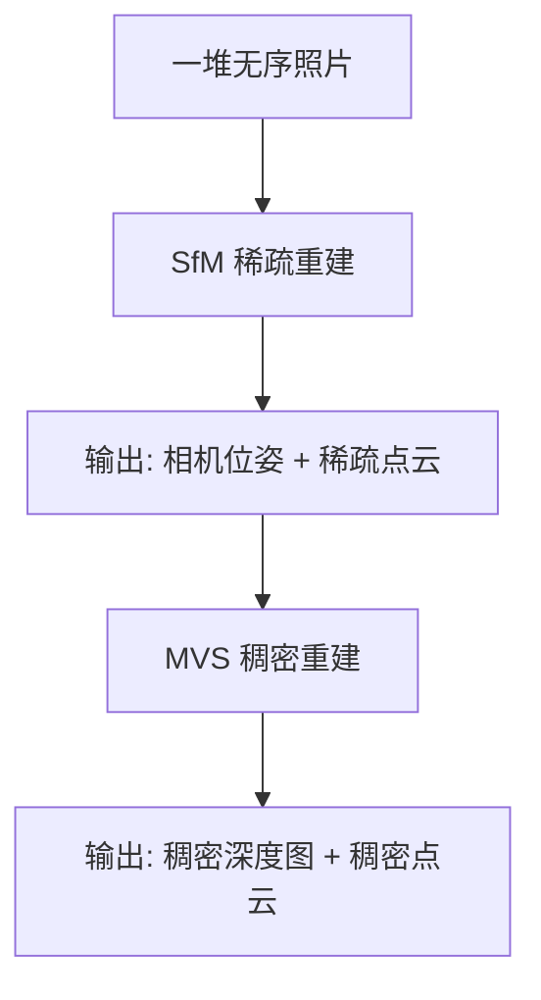

# COLMAP：从照片恢复到 3D 结构

> **一句话**：COLMAP 是 3D 视觉中最常用的开源 SfM + MVS 管线。给它一堆无序照片，它恢复出每张照片的相机位姿和场景的稀疏/稠密 3D 结构。全书几乎所有需要相机位姿的方法（3DGS、NeRF、MVS）都以 COLMAP 为第一步。

## 它解决了什么问题

你拿手机绕着一个场景拍了几十张照片。每张照片的拍摄位置、朝向、焦距都不同。你需要在**没有任何 GPS、IMU、相机标定信息**的情况下，恢复出：

1. 每张照片拍摄时相机在 3D 空间中的位置和朝向（**相机位姿**）
2. 场景的稀疏 3D 点云（**稀疏重建**）
3. （可选）场景的稠密深度图和 3D 模型（**稠密重建**）

COLMAP 做的就是这件事——将一堆无序照片变成带位姿的相机 + 3D 结构。

## COLMAP 的两阶段管线



### 阶段一：SfM（Structure from Motion）——恢复相机位姿和稀疏结构

Schönberger & Frahm 的 CVPR 2016 论文 *Structure-from-Motion Revisited* 是这部分的奠基工作。SfM 是增量式的——从两张图开始，逐步注册更多图像。

#### Step 1：特征提取与匹配

对所有图像提取 SIFT 特征。SIFT 对尺度和旋转不变，适合从不同角度拍的同一场景。每对图像之间做穷举匹配，找出所有"这个像素在这张图和那张图上对应的是同一个 3D 点"的对应关系。

#### Step 2：几何验证

仅仅特征相似还不够——需要验证两帧之间的几何关系是否合理。COLMAP 在这一步做了**多模型几何验证**：

- 用 RANSAC 分别估计基础矩阵 $F$、本质矩阵 $E$、单应矩阵 $H$
- 根据验证结果，把图像对分类为：**一般场景**（$E$ 内点多）、**全景**（纯旋转，$H$ 内点多）、**平面场景**（也可以用 $H$ 但场景共面）、**无效**（水印/时间戳等）
- 输出一个**场景图**（scene graph）：图像 = 节点，几何验证通过的对 = 边

#### Step 3：增量式重建

这是 COLMAP 的核心。从场景图中选一对"最好"的图像开始，逐步加入新图像。

**初始化**：选择共享最多 3D 点的最优图像对——不是随便选，而是用"冗余度"指标：这对图像的可见区域重叠越多，初始重建越鲁棒。

**图像注册（Registration）**：每加入一张新图像，用已有的 3D-2D 对应（已知 3D 位置的点在新图像中的像素坐标），通过 PnP + RANSAC 求解新相机的位姿。COLMAP 的关键创新是**多尺度网格评分**来选择下一个要注册的图像——不仅看"能看到多少已知 3D 点"，还要求这些点在图像上**均匀分布**（覆盖网格的多个区域）。

**三角测量（Triangulation）**：新图像注册后，与已有图像的对应点可以三角化出新的 3D 点。COLMAP 的贡献是**基于 RANSAC 的鲁棒多视图三角测量**——不是从所有观测中三角化（可能混入误匹配），而是随机采样观测对做三角化，选共识最大的结果。

**Bundle Adjustment（BA）**：每次图像注册后做局部 BA（只优化最近邻相机和点），全局 BA 只在模型显著增长后触发。BA 后重新过滤 outlier 并重三角化——这个"优化→过滤→重三角化"的循环是 COLMAP 鲁棒性的核心来源。

**冗余视图聚类**：对于密集拍摄的场景，将高度重叠的相机分组，用组参数表示——减少 BA 的参数量。

### 阶段二：MVS（Multi-View Stereo）——稠密重建

SfM 输出的点云是稀疏的（几千到几万点）。MVS（Schönberger et al., ECCV 2016）把这扩展到稠密：

1. **深度图估计**：对每张参考图像，选择一组最佳邻域图像（视角接近 + 基线适中），用 NCC（归一化互相关）做像素级匹配，估计每个像素的深度。
2. **深度图融合**：多张深度图投影到 3D 空间，一致性检验后融合成统一的稠密点云。
3. **（可选）网格重建**：泊松重建从点云生成三角网格。

## 实际使用

### 安装

```bash
# macOS
brew install colmap

# Ubuntu
sudo apt install colmap

# 或从源码编译
git clone https://github.com/colmap/colmap
cd colmap && mkdir build && cd build
cmake .. && make -j
```

### 自动重建（一键）

```bash
colmap automatic_reconstructor \
    --workspace_path ./workspace \
    --image_path ./images \
    --quality high
```

### 手动控制（推荐理解每个步骤）

```bash
# 1. 特征提取
colmap feature_extractor \
    --database_path database.db \
    --image_path images \
    --SiftExtraction.use_gpu 1

# 2. 穷举匹配
colmap exhaustive_matcher \
    --database_path database.db \
    --SiftMatching.use_gpu 1

# 3. SfM 稀疏重建
mkdir sparse
colmap mapper --database_path database.db \
    --image_path images --output_path sparse

# 4. 图像去畸变（为 MVS 准备）
mkdir dense
colmap image_undistorter \
    --image_path images \
    --input_path sparse/0 \
    --output_path dense

# 5. MVS 稠密重建
colmap patch_match_stereo --workspace_path dense
colmap stereo_fusion --workspace_path dense --output_path dense/fused.ply
```

### 输出格式

SfM 输出（`sparse/0/`）：
- `cameras.bin`：相机内参
- `images.bin`：每张图的位姿（$R, t$）
- `points3D.bin`：稀疏 3D 点及其 track（在哪些图中可见）

MVS 输出（`dense/`）：
- `fused.ply`：稠密点云（可直接导入 MeshLab）
- 每张图的 `depth_map.bin` 和 `normal_map.bin`

### 从 Python 读取 COLMAP 输出

```python
import numpy as np
from read_write_model import read_model

# 读 SfM 结果
cameras, images, points3D = read_model("sparse/0", ext=".bin")

# 遍历所有图像
for img_id, img in images.items():
    qvec = img.qvec   # 四元数 → 旋转矩阵
    tvec = img.tvec   # 平移向量
    cam = cameras[img.camera_id]
    print(f"Image {img.name}: focal={cam.params[0]:.1f}, "
          f"K=[{cam.params[0]},0,{cam.params[2]}; "
          f"0,{cam.params[1]},{cam.params[3]}; 0,0,1]")
```

## COLMAP 什么时候会失败

| 失败场景 | 原因 | 对策 |
|---------|------|------|
| 场景纹理太少（白墙） | SIFT 找不到特征点 | 放一些有纹理的参照物 |
| 纯旋转拍摄（不移动相机） | 没有视差，无法三角化 | 必须移动相机位置 |
| 照片之间有运动的物体 | 特征匹配错误 | 用 mask 排除动态区域 |
| 照片太少（< 10 张） | 覆盖不够，重建不完整 | 至少拍 20-30 张 |
| 重复纹理（砖墙、瓷砖） | SIFT 误匹配 | 降低匹配阈值或加 GPS 约束 |

> COLMAP 不是黑盒——当它失败时，你需要理解上述每个步骤才能调参。但好消息是：大多数自然场景（室内、建筑、自然风光），只要照片拍得够多够好，COLMAP 的默认参数就能用。
