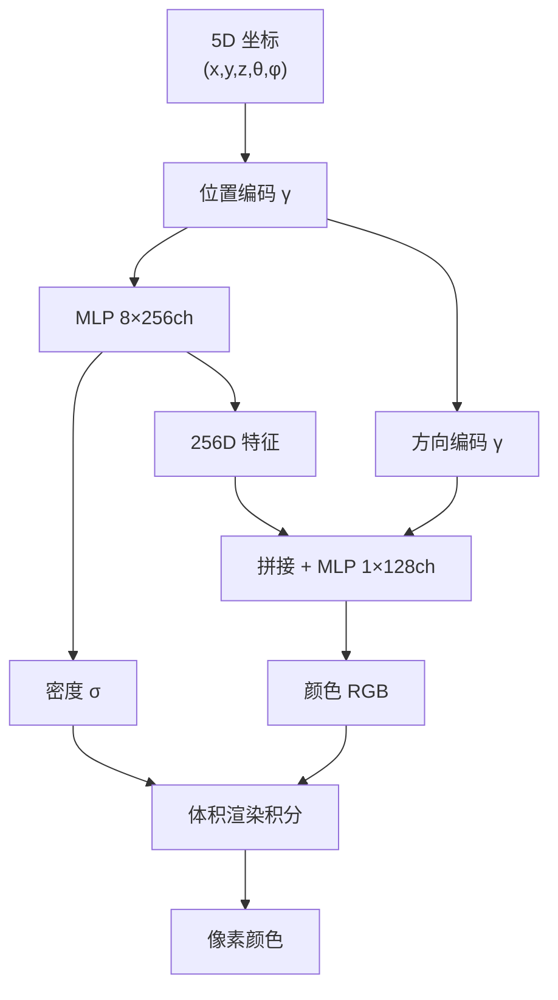

# NeRF：用神经网络"记住"一个场景

> **一句话**：NeRF 用一个多层感知机（MLP）把整个 3D 场景的几何和外观压缩进神经网络的权重里——输入是空间坐标 + 视角方向，输出是该点的颜色和密度。2020 年这篇论文重新定义了"从多张照片重建 3D 场景"这件事怎么做。

## 为什么模块 C 需要 NeRF

模块 C 的 3DGS 是对 NeRF 的直接改进和替代。不理解 NeRF，你只能记"3DGS 比 NeRF 快"这个结论，不理解**为什么快**（NeRF 的体积渲染 vs 3DGS 的光栅化）、**为什么高斯椭球替代了 MLP**（显式 vs 隐式）、**位置编码是什么为什么重要**。

## 核心问题

给定一堆相机位姿已知的照片（比如从 COLMAP 来的），能否"记住"这个场景的完整 3D 外观——从任何未见过的新视角渲染出照片级真实的图像？

传统方法（光场插值、网格重建）要么质量差，要么需要极其复杂的几何重建管线。NeRF 给了一个极端简单的方案：**用一个神经网络直接学习从 3D 坐标到颜色/密度的映射。**

## NeRF 的五个要素

### 1. 场景表示：神经辐射场

场景被表示为一个连续函数 $F_\Theta$，由 MLP（全连接网络）参数化：

$$F_\Theta: (\mathbf{x}, \mathbf{d}) \to (\mathbf{c}, \sigma)$$

- 输入 $\mathbf{x} = (x, y, z)$：3D 空间中的一个点
- 输入 $\mathbf{d} = (\theta, \phi)$：观察该点的视线方向
- 输出 $\sigma$：该点的**体积密度**（越高越不透明，与视角无关）
- 输出 $\mathbf{c} = (r, g, b)$：该点向方向 $\mathbf{d}$ 发出的颜色（与视角有关——这是表面高光的关键）

### 2. 位置编码：为什么 MLP 需要"升维"

直接将 $(x, y, z)$ 喂给 MLP 会产生过度平滑的渲染结果——MLP 偏向学习低频函数。NeRF 的解法是从 Transformer 借来的**位置编码（Positional Encoding）**：

$$\gamma(p) = (\sin(2^0 \pi p), \cos(2^0 \pi p), \sin(2^1 \pi p), \cos(2^1 \pi p), \ldots, \sin(2^{L-1} \pi p), \cos(2^{L-1} \pi p))$$

对于空间坐标 $\mathbf{x}$：$L = 10$，3 维输入 → $3 \times 2 \times 10 = 60$ 维
对于视角方向 $\mathbf{d}$：$L = 4$，3 维输入 → $3 \times 2 \times 4 = 24$ 维

**为什么有效**：不同频率的正弦函数让 MLP 可以同时捕捉场景的"大结构"（低频）和"表面纹理细节"（高频）。没有位置编码的 NeRF 效果几乎退化到模糊一团——这是论文中最重要的消融实验结果之一。

### 3. 体积渲染

沿每条相机射线 $\mathbf{r}(t) = \mathbf{o} + t\mathbf{d}$，从近端 $t_n$ 到远端 $t_f$ 采样 $N$ 个点，渲染颜色由体积渲染积分给出：

$$\hat{C}(\mathbf{r}) = \sum_{i=1}^{N} T_i (1 - \exp(-\sigma_i \delta_i)) \mathbf{c}_i, \quad T_i = \exp\left(-\sum_{j=1}^{i-1} \sigma_j \delta_j\right)$$

其中 $\delta_i = t_{i+1} - t_i$ 是相邻采样点的距离，$T_i$ 是"光线从近端走到点 $i$ 还没被遮挡"的概率。

**直觉**：$T_i$ 是光线到达点 $i$ 的概率；$(1 - \exp(-\sigma_i \delta_i))$ 是光线在点 $i$ 处被散射的概率（体积密度 $\sigma_i$ 越高 → 这一项越接近 1 → 该像素几乎全部来自点 $i$ 的颜色）。乘积积累构成 standard volume rendering equation。

### 4. 分层采样：粗网络 + 细网络

用均匀随机采样 $N_c$ 个点跑一遍粗网络 → 得到粗略的密度分布 → 在密度高的区域（表面附近）多采样 $N_f$ 个点 → 把 $N_c + N_f$ 个点一起跑细网络 → 得到最终颜色。

这解决了"大部分射线在空区域穿行，均匀采样的点大部分落在没用的地方"的问题。两个网络同时训练，loss 是粗网络和细网络的渲染结果与真实颜色的 L2 损失之和：

$$\mathcal{L} = \sum_{\mathbf{r}} \left[ \|\hat{C}_c(\mathbf{r}) - C(\mathbf{r})\|_2^2 + \|\hat{C}_f(\mathbf{r}) - C(\mathbf{r})\|_2^2 \right]$$

### 5. 场景特异性训练

NeRF 不是"训一个模型 → 用在任意场景"的范式。每个场景（一组照片）需要从头训练一个 NeRF，训练时间约 1-2 天（单 GPU）。这点和 3DGS 一样——两者都是 per-scene optimization。

## NeRF 的局限

| 局限 | 原因 | 3DGS 怎么解决的 |
|------|------|---------------|
| 训练慢（1-2天） | 每个像素需沿射线采 100+ 点，每个点跑 MLP | 显式高斯 → 光栅化 |
| 渲染慢（数秒/帧） | 同上 | 100+ FPS |
| 无法编辑 | 场景"锁"在 MLP 权重里 | 高斯可独立移动/删除 |
| 几何质量差 | 密度场没有显式表面 | 2DGS 改进 |

## 为什么 NeRF 还是值得学

1. **它是奠基工作**——3DGS、Instant-NGP、Mip-NeRF 360 等上百篇论文都是对 NeRF 的直接改进。
2. **位置编码 → "坐标映射到高频空间"的思路贯穿整个 3D 视觉。**
3. **体积渲染是辐射度量学的标准公式**——NeRF 把它带进了深度学习。

## 从 NeRF 到 3DGS

NeRF 证明了一个核心假设：**"用可微渲染 + 梯度回传优化场景表示"这条路是走得通的。** 3DGS 继承了这一框架，但把"表示"从隐式 MLP 换成了显式高斯椭球体，把"渲染"从逐射线采样换成了 tile-based 光栅化。下一节（模块 C）就是这条路加速了三个数量级之后的样子。
