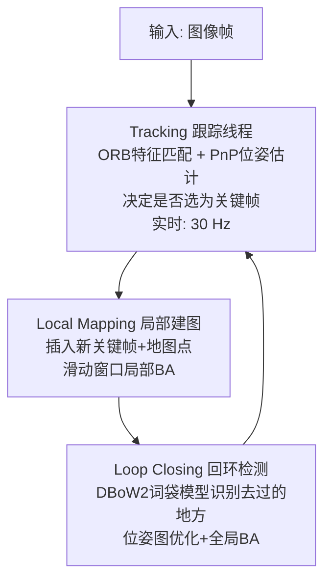

# 视觉 SLAM：同时定位与建图

> **一句话**：SLAM 是让相机在未知环境中边移动边估计自己的位置，同时建立周围环境的 3D 地图。这是机器人、AR、自动驾驶中最基础的感知能力之一。

## 它解决了什么问题

你戴着一个 AR 眼镜在房间里走动。眼镜上的摄像头需要实时回答两个问题：

1. **我在哪？（定位）**：眼镜在房间中的位置和朝向——精确到毫米级
2. **周围是什么？（建图）**：房间的 3D 结构——稀疏特征点或稠密表面

更难的是，这两个问题**互相依赖**：要知道我在哪，需要参考地图；要建立地图，需要知道我的位置。SLAM 就是同时求解这两个耦合问题的系统。

## 为什么这本书需要 SLAM

本书的前七章讲了相机模型、对极几何、三角测量、BA 优化——这些恰好是 SLAM 的数学基础。模块 C 的 3DGS 和 COLMAP 做的是**离线**重建（拍完照片 → 后处理 → 出 3D 场景），SLAM 做的是**在线**重建（边拍边定位边建图）。

SLAM 是基础篇的数学工具箱在真实系统中的第一次完整应用。

## 两条路线：传统几何 vs 深度学习

### 传统路线：ORB-SLAM3

Campos 等人在 2020 年发表的 ORB-SLAM3（IEEE T-RO）是传统几何 SLAM 的集大成者。它的设计哲学是"用最好的手工特征 + 最严谨的几何优化"。

**三线程架构**：

- **Tracking（跟踪）**：从当前帧提取 ORB 特征（Oriented FAST 角点 + Rotated BRIEF 描述子，256 bit）。与已有地图点做 3D-2D 匹配，用 PnP + motion-only BA 估计当前相机位姿。如果跟踪丢失（比如快速移动导致模糊），启动重定位——用 DBoW2 在之前见过的所有地点中搜索最相似的帧，重建匹配。

- **Local Mapping（局部建图）**：新关键帧加入后，三角化新的地图点，剔除冗余的关键帧和观测太少的点。在滑动窗口内做局部 BA（只优化最近邻相机和该区域的点），保持实时性。

- **Loop Closing（回环检测）**：相机走到之前来过的地方时，ORB-SLAM3 能认出"我来过这里"——用 DBoW2（视觉词袋模型）在 Atlas 中搜索最相似的关键帧。检测到回环后，通过位姿图优化（Pose Graph Optimization）把累积的漂移误差"拉回"来，最后跑一次全局 BA 优化所有相机和点。

**Atlas 多地图系统**（ORB-SLAM3 的核心创新）：当跟踪长时间丢失（比如被遮挡、快速转头），不是重启整个系统——而是新建一个"子地图"。当用户重新看到之前见过的场景时，两个子地图自动合并。这让 ORB-SLAM3 在复杂环境下极其鲁棒。

**IMU 融合**：ORB-SLAM3 支持视觉-惯性模式——融合 IMU（加速度计 + 陀螺仪）测量，在相机快速运动或光照变化时保持定位。IMU 提供尺度信息，使单目 SLAM 不再有 scale ambiguity。

### 深度学习路线：DROID-SLAM

Teed & Deng（Princeton）在 2021 年 NeurIPS 发表的 DROID-SLAM，用端到端学习重新设计了 SLAM 的每个模块。它和 RAFT-Stereo 出自同一个实验室，设计理念一脉相承：**用循环迭代优化替代手工设计的几何求解**。

**核心设计**：

- **特征提取 + 相关体**：用 CNN 从每帧提取特征，帧与帧之间构建 4D 相关体（像 RAFT）。
- **GRU 更新算子**：输入相关特征和当前光流估计，输出光流修正量。这与 RAFT-Stereo 的视差更新算子是同一种设计。
- **DBA（Differentiable Bundle Adjustment）层**：这是 DROID-SLAM 的核心创新。传统 BA 是不可微的——需要独立求解一个非线性最小二乘问题。DROID-SLAM 把 BA 公式化为一个可微层——用高斯-牛顿法求解，利用 Schur 补先算相机位姿更新再回代深度更新。这使整个 pipeline（特征提取 → 匹配 → 位姿/深度优化 → loss）端到端可微，梯度能从最终重投影误差一直回传到特征提取网络。

**训练与泛化**：仅在单目视频（TartanAir 合成数据集）上训练，但可以直接泛化到双目和 RGB-D 模式——因为位姿和深度的优化由 DBA 层统一处理，不依赖特定传感器的参数。

**结果**：TartanAir 上单目误差减少 62%（相比 ORB-SLAM3），EuRoC 无人机数据集上零失败方法的误差减少 82%。

## 两条路线的比较

| 维度 | ORB-SLAM3 | DROID-SLAM |
|------|-----------|------------|
| 特征 | 手工 ORB（256-bit 二进制描述子） | 学习的 CNN 特征 |
| 匹配 | 描述子汉明距离 + 对极几何验证 | 4D 相关体 + GRU 迭代 |
| 优化 | 手工 g2o/Ceres BA | 可微 DBA 层 |
| 回环 | DBoW2 词袋模型 | Frame Graph + 全局优化 |
| 训练 | 无需训练 | 需要合成数据训练 |
| 精度 | 极高（有纹理场景） | 高（在弱纹理场景更好） |
| 速度 | 30 Hz 实时 | GPU 依赖，RTX 上 15-20 FPS |
| 可解释性 | 极高——每个模块都可单独调试 | 较低——端到端黑盒 |

> **选择建议**：自动驾驶、机器人、AR——大多数工业场景仍用 ORB-SLAM3（稳定、可解释、实时）。研究前沿、弱纹理场景、需要 RGB-D 高精度重建——DROID-SLAM。

## 与本书其他章节的联系

- COLMAP 做的是**离线 SfM**（拍完再算），SLAM 做的是**在线 SfM**（边拍边算）。数学工具完全一样——PnP、三角测量、BA——区别只在"能不能 30 Hz 跑"。
- 模块 A（单目深度）的输出可以注入 SLAM 做深度先验。
- 模块 B（双目匹配）是双目 SLAM 的核心模块。
- ORB-SLAM3 输出的稀疏点云是模块 C（3DGS）的初始化输入。

> 如果你想深入了解 SLAM，推荐高翔的《视觉 SLAM 十四讲》——它和本书的几何基础完全衔接。
