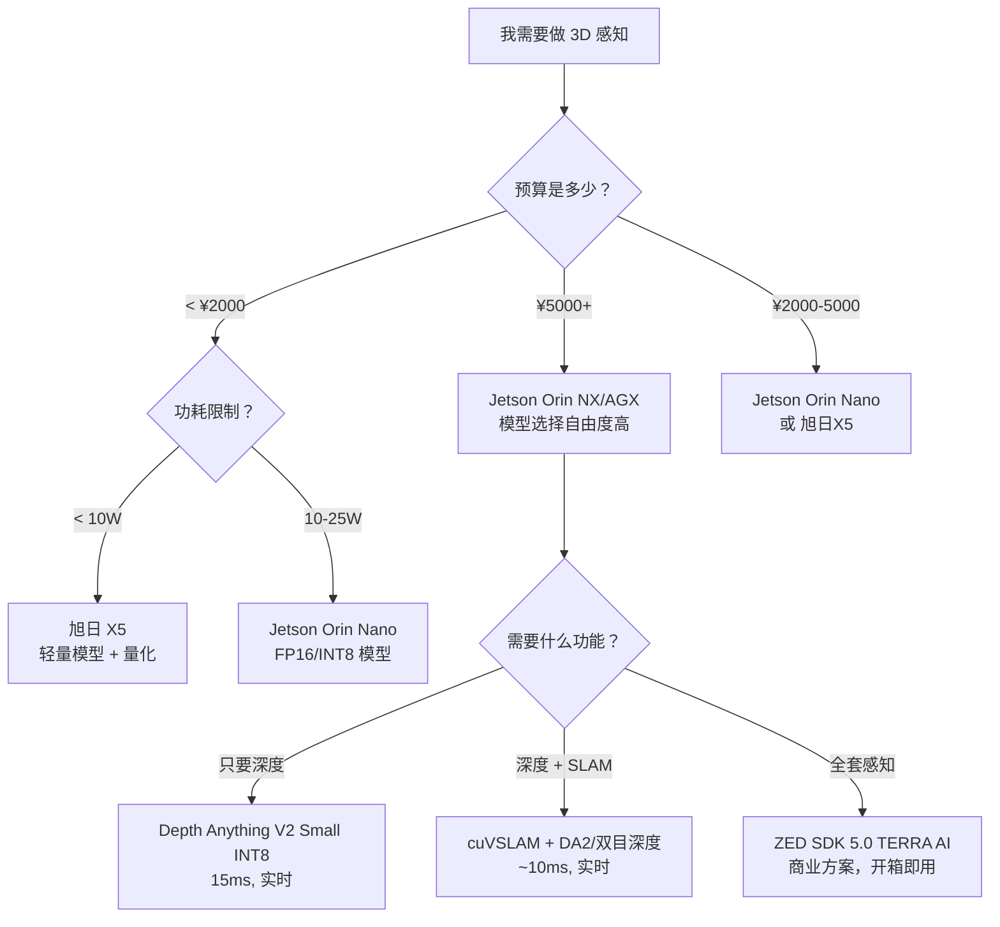

# 嵌入式部署：把 3D 视觉模型塞进机器人里

> **一句话**：服务器上跑得好的模型，要在几百克重、几瓦功耗的机器人芯片上也能跑——这需要一套完全不同的设计哲学。本章告诉你有哪些芯片可选、怎么优化模型、怎么在精度和速度之间做取舍。

## 为什么你需要这章

本书前七章和三模块教的都是"怎么把模型训出来"。但工程师面对的通常是另一个问题：**训练好的模型，怎么在嵌入式设备上跑起来？**

一台扫地机器人：成本 2000 元以内，功耗 10W，没有 CUDA，没有 100GB 显存。你在 RTX 4090 上训的 Depth Anything V2 Large（335M 参数），直接搬到它上面——一帧 3 秒，根本不能用。

本章的核心问题：**在算力、功耗、延迟三重约束下，如何选择和优化 3D 视觉模型？**

## 芯片选型

### 主流嵌入式 AI 芯片（2025）

| 芯片 | 算力 | 功耗 | 价格 | 定位 |
|------|------|------|------|------|
| **地瓜 旭日 X5** | 10 TOPS | 3W 轻载 / 8W 满载 | ¥549-699（开发板） | 扫地/割草/陪伴机器人 |
| **NVIDIA Jetson Orin Nano** | 40 TOPS | 7-15W | $199-499 | 入门级机器人、边缘 AI |
| **NVIDIA Jetson Orin NX** | 100 TOPS | 10-25W | $399-599 | 工业机器人、多传感器融合 |
| **NVIDIA Jetson AGX Orin** | 275 TOPS | 15-75W | $1999 | 自动驾驶、高端机器人 |
| **华为 Atlas 200 DK** | 22 TOPS | 12W | ¥1500-2000 | 国产替代、安防 |

> **地瓜 旭日 X5**（地平线子公司，2024 年发布）是中国市场最值得关注的低功耗机器人芯片。10 TOPS 的 BPU + 8 核 Cortex-A55，支持 Ubuntu 22.04 和 ROS 2，官方提供了 YOLO、Transformer、VSLAM 等 200+ 开源算法的 RDK 部署套件。定价 549 元起，直接对标 Jetson Nano。

### 怎么选

| 你的场景 | 推荐芯片 | 能跑什么 |
|---------|---------|---------|
| 扫地机器人（避障） | 旭日 X5 | YOLO + 简单深度估计 |
| 服务机器人（导航+避障） | Jetson Orin Nano | 单目深度 + 视觉 SLAM |
| 工业 AGV（3D 感知+定位） | Jetson Orin NX | 双目深度 + cuVSLAM + 3D 重建 |
| 自动驾驶/无人机 | Jetson AGX Orin | 全部 |
| 国产化要求 + 低功耗 | 旭日 X5 或 Atlas 200 | 取决于模型优化程度 |

## 模型优化三板斧

嵌入式部署的核心公式：**蒸馏（缩小模型） → 剪枝（去冗余） → 量化（降精度）**。这三个技术叠加可以实现 10-20 倍的压缩。

### 1. 量化（Quantization）

**立刻能做、效果最明显。**

把模型参数从 32 位浮点（FP32）降到 16 位（FP16）或 8 位整数（INT8）。代价是极小的精度损失，换来 2-4 倍的推理加速和 75% 的显存节省。

```bash
# PyTorch → ONNX → TensorRT INT8
python export.py --model depth_anything_v2_vits --output model.onnx

# FP16 (几乎无精度损失)
trtexec --onnx=model.onnx --saveEngine=model_fp16.engine --fp16

# INT8 (需要少量校准数据)
trtexec --onnx=model.onnx --saveEngine=model_int8.engine --int8
```

| 精度 | 模型大小 | 推理速度 | 精度损失 | 适用场景 |
|------|---------|---------|---------|---------|
| FP32（原始） | 100% | 1× | 0% | 训练、服务器部署 |
| FP16 | 50% | 1.5-2× | <0.5% | **几乎总是用** |
| INT8 | 25% | 2-4× | 1-2% | 嵌入式主力 |
| INT4 | 12.5% | 3-6× | 3-5% | 极度资源受限 |

### 2. 模型蒸馏（Distillation）

**大模型教小模型。**

用大模型（teacher）的输出作为"软标签"训练小模型（student）。小模型学会的不只是"正确答案"，还有"正确答案的置信度分布"——这包含了更多信息。

实际效果：Depth Anything V2 Giant（1.3B 参数）→ Small（25M 参数），在深度估计精度上只损失约 10-15%，但推理速度提升 20 倍。

### 3. 结构化剪枝（Pruning）

**把不重要的通道整条删掉。**

非结构化剪枝（删个别权重）在 GPU 上效果有限——不规则稀疏矩阵没有加速。**结构化剪枝**（删整个 channel、attention head 或层）在所有硬件上都有效。

典型流程：训一个稍大的模型 → 评估每个 channel 的重要性（L1 范数、梯度大小）→ 删掉最不重要的 20-30% → 微调恢复精度 → 量化部署。

### 级联方案

```
原始模型 (335M, 100ms) 
  → 蒸馏到小模型 (25M, 10ms)
    → 剪枝 30% channels (18M, 7ms) 
      → INT8 量化 (6MB, 3.5ms)
```

最终：**100ms → 3.5ms，模型大小 100MB → 6MB，精度损失 < 5%。**

## 真实部署案例

### 案例 1：Depth Anything V2 在 Jetson Orin Nano

```python
import tensorrt as trt
import pycuda.driver as cuda
import numpy as np

# 加载 TensorRT 引擎
logger = trt.Logger(trt.Logger.WARNING)
with open("depth_fp16.engine", "rb") as f:
    runtime = trt.Runtime(logger)
    engine = runtime.deserialize_cuda_engine(f.read())

# 分配显存 + 推理
context = engine.create_execution_context()
# ... (输入预处理)
context.execute_v2(bindings)
# 输出: (1, 518, 518) 深度图, < 10ms
```

实测数据：

| 模型 | 参数量 | 推理时间（Jetson Orin Nano） | 精度（AbsRel） |
|------|--------|---------------------------|---------------|
| DA2 Large (FP32) | 335M | ~200 ms | 0.052 |
| DA2 Base (FP16) | 97M | ~60 ms | 0.056 |
| DA2 Small (INT8) | 25M | **~15 ms** | 0.065 |

> 30 FPS 需要每帧 <33ms。Small + INT8 的 15ms 完全满足实时要求。

### 案例 2：cuVSLAM 在 Jetson AGX Orin

NVIDIA 在 2025 年发布的 cuVSLAM 是专门为 Jetson 做的 CUDA 加速视觉 SLAM。和 ORB-SLAM3（跑在 CPU 上）相比：

| 指标 | ORB-SLAM3 (CPU) | cuVSLAM (Jetson AGX Orin) |
|------|----------------|--------------------------|
| 跟踪延迟（640p 双目） | ~15 ms | **3.8 ms** |
| GPU 占用率 | — | **~6%** |
| 支持相机数 | 1-4 | **1-32** |

cuVSLAM 支持 32 路相机同时定位——这对多摄像头机器人和自动驾驶至关重要。

### 案例 3：ZED SDK 5.0 TERRA AI（商业化方案）

Stereolabs 的 ZED SDK 5.0（2025 年 3 月发布）在 Jetson 上实现了**全栈 3D 感知**：

- 深度估计 + 语义分割 + 物体检测：**多任务一个模型**
- 2MP 深度图：**30ms**（Jetson Orin Nano 8GB）
- SLAM + 定位：**厘米级精度**，GPS-denied 环境可用
- 深度范围：**0.1m - 40m**

如果你是做产品而不是做研究，直接用 ZED SDK 比自己训+部署快几个数量级。

## 取舍框架

嵌入式 3D 视觉部署的决策树：



**终极取舍**：

| 你放弃 | 你得到 | 适用于 |
|--------|--------|--------|
| 精度 2-5% | 速度 2-4×（FP16/INT8 量化） | 几乎总是值得 |
| 泛化能力（换蒸馏的小模型） | 速度 10-20× | 固定场景（工厂/仓库） |
| 灵活性（用商业 SDK） | 开发时间 10× | 做产品，不做研究 |
| 模型复杂度（单目替代双目） | 硬件成本 5× | 消费级产品 |

> 嵌入式部署的第一性原理：**不是在服务器上跑出最高的 benchmark，而是在给定的功耗和成本下，找到刚好够用的精度的最快方案。**
