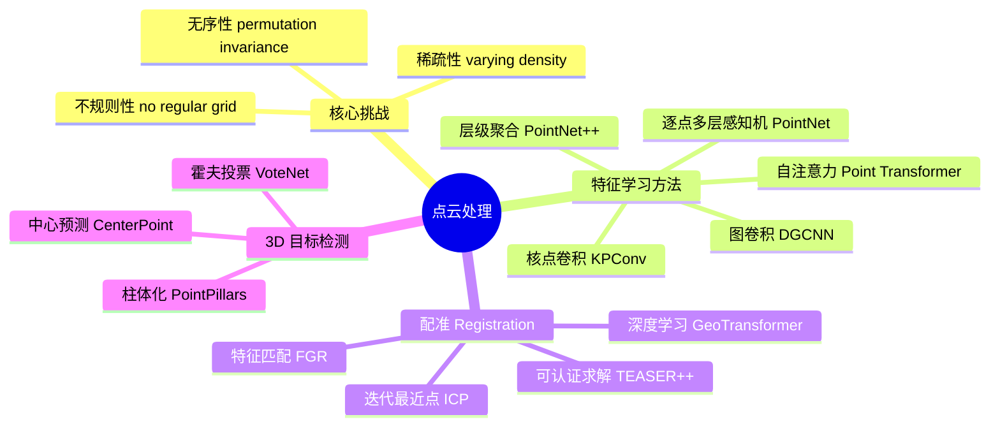
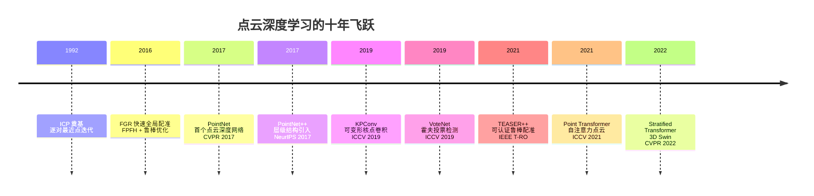

# D.1 直观理解

> **要回答的问题**：拿到一堆 XYZ 坐标，你能做什么？为什么在点云上做深度学习比在图像上难？四大任务（分类、分割、配准、检测）分别解决什么问题？过去十年，点云深度学习的核心范式是怎么演进的？

## 一个场景

你买了一台新的 3D 扫描仪。打开包装，连上电脑，扫描了你桌上的咖啡杯。屏幕上出现了一团彩色的点——大概二十万个，每个点有 XYZ 坐标和 RGB 颜色。你旋转视角看到了杯子的形状。

然后你问自己一个问题：**"我能在这些点里面自动找到杯子的把手吗？"**

这个问题看起来简单——人能一眼看到把手在哪。但让计算机从二十万个无序的点中定位把手，你马上会遇到三个根本性的困难：

1. **这些点是离散的**：它们只是采样位置，不包含"面"的概念。你不知道哪些点组成把手、哪些是杯身。
2. **这些点是无序的**：按照扫描顺序存储的点，和按 Z 坐标排序的点是同一杯咖啡——但输入给神经网络时顺序完全不一样。
3. **这些点是稀疏不均匀的**：近处密度高，远处密度低。扫描仪面对杯子的那一面有大量点，背面几乎没有。

这三个挑战——**离散、无序、稀疏**——就是点云深度学习在过去十年需要克服的核心难题。我们现在来看看研究人员是怎么逐一攻破的。

## 核心直觉：点云处理的四大任务

拿到点云后，你通常想做四件事之一：

```
                   ┌─ 分类 Classification
                   │   "这是什么？（桌子/椅子/杯子）"
                   │   输入：整个点云 → 输出：一个类别标签
                   │
    ┌─ 理解任务 ───┤
    │              └─ 分割 Segmentation
    │                  "每个点属于什么？（把手/杯身/桌面）"
    │                  输入：整个点云 → 输出：每个点的类别标签
    │
    ├─ 空间任务 ─── 配准 Registration
    │                  "这两帧扫描怎么对齐？"
    │                  输入：两个点云 → 输出：刚体变换 (R, t)
    │
    └─ 检测任务 ─── 检测 Detection
                       "场景里有哪些物体？在哪？"
                       输入：整个场景点云 → 输出：3D bounding boxes + 类别
```

**分类**和**分割**是理解任务——回答"是什么"。它们和 2D 图像分类/分割逻辑相同，但处理的是不规则数据。

**配准**是空间任务——回答"怎么对齐"。这是点云独有的：你需要把从不同角度扫描的同一个场景拼接起来。像拼图一样，找到两块碎片之间的相对旋转和平移。

**检测**是综合任务——回答"有什么、在哪"。自动驾驶的 LiDAR 点云每秒产生几十万个点，你需要在其中找到所有车辆、行人、路标的三维边界框。

## 为什么图像上的方法不直接适用

在 2D 图像上，卷积神经网络 (CNN) 能成功，部分原因是**图像是规整的网格**：

- 每个像素有固定的邻居（上、下、左、右）
- 卷积核可以滑过整个图像，每次看到一个小方块
- 空间信息由像素在网格中的位置隐式编码

点云没有这些：

- **没有网格**：点可以落在 3D 空间的任何位置，邻居关系不是固定的
- **没有顺序**：点集 {A, B, C} 和 {C, A, B} 表示同一个点云，CNN 会给出不同结果
- **密度不均**：近处物体有好几百个点，远处的同一物体可能只有几个点

所以，**在点云上做深度学习，核心问题是设计一个既保持置换不变性（permutation invariance），又能捕获局部几何结构的网络架构。**

## 技术全景



## 十年关键突破



> 注意这条时间线里的范式转移：2017 年之前，点云处理主要靠手工特征（FPFH、SHOT、Spin Image）加传统优化（ICP、RANSAC）。PointNet 证明了"可以直接在原始坐标上训练神经网络"这一看似不可能的事情。此后四年，研究重心从"能不能做"转向"怎么做更好"——从全局特征到层级结构，从 MLP 到卷积再到注意力，从分类分割扩展到配准检测。这条演化路径和 2D 视觉从 AlexNet 到 ViT 的路线惊人地相似——只是晚了 5 年。

## 配准到底在解什么问题

配准可能是点云处理中最"不直观"的任务，但也是最重要的。我们专门花一分钟建立直觉。

想象你用手机从两个角度拍同一张桌子，对每张照片用 COLMAP 重建出两个点云 P 和 Q。它们是同一个场景，但坐标系不同——P 是从位置 A 看到的，Q 是从位置 B 看到的。

配准要回答的问题是：**"怎么旋转和平移 Q，让它和 P 对齐？"**

数学上：

$$Q' = R Q + t, \quad \text{使 } Q' \text{ 和 } P \text{ 尽可能重合}$$

R 是 3×3 旋转矩阵，t 是平移向量。如果你知道 P 和 Q 中哪些点是对应的，这是一个能闭式求解的最小二乘问题（Procrustes 问题，用 SVD 秒解）。但现实是你不知道对应关系——这就是为什么配准难。

经典解法 ICP 的思路是"猜对应，再求解"的迭代过程：

```
猜测初始位姿 (R₀, t₀)
while 没收敛:
    找到 Q 中每个点在 P 中的最近点（猜对应关系）
    基于这些对应关系求解 (R, t)（闭式解）
    更新 (R, t)
```

ICP 的问题在于：如果初始位姿猜得不好，最近点对应就全错，算法会在错误的局部最优处卡住。这就是为什么后续工作（FGR、TEASER++）致力于在"不知道对应关系"的情况下找到全局最优。

## Mini Case：用 Open3D 可视化一个点云

拿斯坦福兔子做个热身——这是点云处理领域的"Hello World"：

```python
import open3d as o3d
import numpy as np

# 下载并加载斯坦福兔子点云
bunny = o3d.data.BunnyMesh()
mesh = o3d.io.read_triangle_mesh(bunny.path)
pcd = mesh.sample_points_uniformly(number_of_points=5000)

# 估计法向量（后续很多操作需要法向量）
pcd.estimate_normals(search_param=o3d.geometry.KDTreeSearchParamHybrid(
    radius=0.01, max_nn=30))

# 可视化
o3d.visualization.draw_geometries([pcd], 
    window_name="Stanford Bunny Point Cloud")
```

> **你看到了什么**：5000 个 3D 点的集合，组成了兔子的形状。这个点云已经是后续所有操作——分类、分割、配准——的输入。

接下来我们把兔子稍微旋转一下，然后尝试把它配准回原始位置——这就是配准要解决的问题：

```python
# 复制并旋转
pcd_rotated = copy.deepcopy(pcd)
R = pcd.get_rotation_matrix_from_xyz((0.3, 0.2, 0.1))  # 绕XYZ旋转
pcd_rotated.rotate(R, center=(0, 0, 0))
pcd_rotated.translate((0.02, 0.03, 0.01))

# 展示两个未对齐的点云（红色=目标，绿色=待配准）
pcd.paint_uniform_color([1, 0, 0])
pcd_rotated.paint_uniform_color([0, 1, 0])
o3d.visualization.draw_geometries([pcd, pcd_rotated])
```

下一节我们会看到这背后的算法是怎么工作的。
