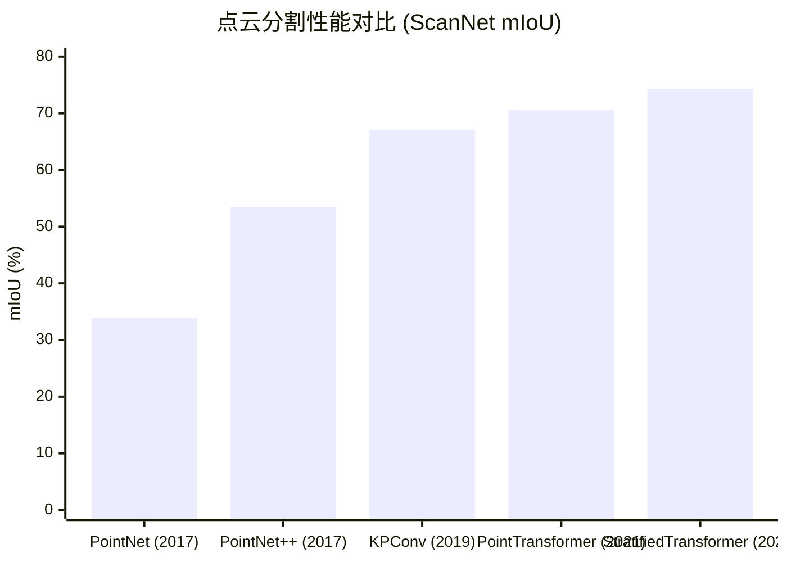

# D.2 原理解析

> **要回答的问题**：PointNet 怎么用 max pooling 保证置换不变性？PointNet++ 的层级采样是怎么工作的？KPConv 的核点卷积和图像卷积有什么异同？ICP、FGR、TEASER++ 的配准路线各自解决了什么问题？VoteNet 的霍夫投票为什么有效？

本节的策略是：先讲**特征学习**的演进（PointNet → PointNet++ → KPConv），再讲**配准**的三条路线，最后讲**检测**。每个方法都回答"第一性原理"——这个设计的物理/数学必要性是什么。

## 第一性原理：点云深度学习的核心约束

在开始讲任何具体算法之前，先确立我们要满足的约束：

**约束 1：置换不变性（Permutation Invariance）**

点云是一个集合，不是序列。输入顺序改变，输出不能变：
$$f(x_1, x_2, ..., x_n) = f(x_{\pi(1)}, x_{\pi(2)}, ..., x_{\pi(n)})$$
其中 $\pi$ 是任意排列。这排除了 RNN（对顺序敏感）和直接在坐标上做卷积（没有网格）。

> [!TIP]
> **人话翻译**：给你的点云重排序（按 X，按 Y，按 Z，随机打乱），同一个点云的网络输出必须完全一致。这就是"置换不变性"——图像上不需要考虑这个约束，因为像素的顺序由网格固定了。

**约束 2：刚体变换不变性（Rigid Motion Invariance）**

旋转和平移点云，语义标签应该不变——一张桌子旋转 90 度还是桌子。这通过 T-Net（学习空间变换）来实现，类似 2D 中的 Spatial Transformer。

**约束 3：局部结构敏感性**

虽然全局标签不受旋转影响，但局部几何——角点、边缘、曲面——是理解形状的关键。好的特征学习必须能在不同尺度上捕获局部几何。

现在来看各个方法如何满足这些约束。

## PointNet：对称函数的力量

PointNet 的核心思想只有一句话：**用对称函数来保证置换不变性。**

什么是"对称函数"？一个函数如果对其输入参数的任意排列输出相同，就是对称的。最简单的对称函数：$+$（加法）和 $\max$（取最大值）。无论你把输入按什么顺序给它们，结果都一样。

PointNet 的架构可以写成：

$$f(\{x_1, ..., x_n\}) = \gamma\left(\max_{i=1,...,n}\{h(x_i)\}\right)$$

- $h$：一个共享的 MLP，把每个点 $x_i$（3 维坐标）映射到高维特征空间（1024 维）
- $\max$：逐元素取最大值（element-wise max pooling），对称函数，保证置换不变性
- $\gamma$：另一个 MLP，把全局特征映射到输出（分类得分或每点标签）

> [!TIP]
> **人话翻译**：每个点独立通过同一个神经网络 $h$，变成 1024 维特征。然后对所有点的每个特征维度取最大值——这等价于"保留 1024 个维度上最强的那个点的信号"。即使你重新排列点云，最强信号还是在同一点上。最后在全局特征上做分类。

### 为什么 max pooling 就够了？

这是 PointNet 论文最深刻的理论贡献。作者证明了：

> **Universal Approximation Theorem for Point Sets**: 任意连续的、置换不变的集合函数 $f: \mathcal{X} \to \mathbb{R}$，可以被近似为 $\gamma(\max_i\{h(x_i)\})$，其中 $\gamma$ 和 $h$ 是连续的 MLP。

> [!NOTE]
> 这个定理的意义：只要你给 $\gamma$ 和 $h$ 足够多的神经元（足够的宽度和深度），$\gamma(\max(h))$ 的形式可以逼近**任意**置换不变函数。PointNet 不需要更复杂的设计——这个简单的对称函数形式在理论上就是完备的。

### Critical Points 与鲁棒性

max pooling 的实际行为比它的形式更精妙。对于给定的点云和网络参数，max pooling 在每个维度上只保留**一个点**的信号——那个在该维度上激活值最大的点。

这些被 max pooling "选中"的点被称为 **critical points**（关键点）。它们形成了点云的"骨架"（skeleton）——决定分类结果的几何结构。

实验发现：
- Critical points 只占点云的大约 15%
- 随机丢弃 50% 的非关键点，分类准确率几乎不变
- 但丢失关键点会导致准确率大幅下降

> 这意味着 PointNet 学到了一种"形状骨架"表示——不是所有点都重要，只有少数定义了拓扑和几何结构的边界点才决定形状身份。

### T-Net：学习最优输入变换

点云被旋转后，其坐标变了。PointNet 在第一个 MLP 之前加入 T-Net——一个微型网络，从输入点云计算一个 3×3 变换矩阵，将点云对齐到规范姿态：

$$x' = T_{net}(x) \cdot x$$

加上正则化 $L_{reg} = \|I - AA^T\|^2_F$ 鼓励变换矩阵接近正交。

> [!CAUTION]
> T-Net 引入需要谨慎。PointNet++ 去掉了 T-Net——作者发现 FPS + Ball Query 的层级采样本身就对旋转有一定鲁棒性。如果你的数据已经过大致对齐，T-Net 可能不是必需的。

### PointNet 的局限性

PointNet 的瓶颈是**它不捕获局部结构**。max pooling 是全局的——它看到的是"整个点云中最强的 1024 个信号"，但不知道一个桌面上的点应该构成平面，一个椅子腿附近的点应该沿垂直方向分布。

这就是 PointNet++ 要解决的问题。

## PointNet++：层级化，像 CNN 一样

CNN 的成功很大程度来自**层级化**——低层检测边缘和纹理、中层检测部件、高层检测物体。PointNet 只有一个全局操作，无法学到层级特征。

PointNet++ 的解决方案是 **Set Abstraction（集合抽象）**——本质上是在点云上实现类似 CNN 的下采样 + 卷积操作，但不依赖规整网格。

### Set Abstraction = 采样 + 分组 + PointNet

每个 Set Abstraction 层做三件事：

```
层级输入: N 个点，每个有 d 维坐标 + C 维特征
  ↓
Step 1: 采样（Sampling）
  从 N 个点中选 N' 个中心点（Farthest Point Sampling）
  ↓
Step 2: 分组（Grouping）
  对每个中心点，找到半径 r 内的所有邻居（Ball Query）
  输出: N' 个组，每组 K 个点（K 不固定）
  ↓
Step 3: PointNet
  对每组点应用 mini-PointNet → 每组输出一个局部特征向量
  输出: N' 个点，每个有 d+C' 维特征
```

### Farthest Point Sampling (FPS)：为什么选最远点

最远点采样从点集中迭代地选择彼此最远的点：

```
FPS({x₁...xₙ}, N'):
  选一个随机起点
  for i = 1 to N'-1:
    选与已选集合距离最远的点加入
  return N' 个已选点
```

> [!TIP]
> **人话翻译**：FPS 回答的问题是"最少选哪些点，能覆盖整个点云的形状"。选邻近的点会遗漏远处形状；选最远点能保证覆盖。这类似 CNN 的 max pooling 选最大激活值——只不过 FPS 在几何空间而不是特征空间操作。

FPS 的计算复杂度是 O(N × N')，对于大点云可能较慢（这也是后续工作改进的方向之一）。

### Ball Query：在 3D 空间定义"局部感受野"

Ball Query 找到一个中心点半径 r 内的所有邻居点。这与 CNN 的固定大小卷积核不同——Ball Query 保证**空间范围的固定性**（固定物理半径 r 米），但组内点数量不固定：

- 密度高的区域：组内有很多点
- 密度低的区域：组内可能只有少数几个点

### 多尺度分组 (MSG)：应对密度不均

点云密度不均是一个关键挑战。MSG 的解决方法是：**同时用多个不同的半径做 Ball Query**，把不同尺度提取的特征拼接起来：

```
半径 r₁ = 0.1m: 细尺度特征（近处密点）
半径 r₂ = 0.2m: 中尺度特征
半径 r₃ = 0.4m: 粗尺度特征（远处疏点）
→ 三个 PointNet 分别提取特征 → 拼接
```

> 这使得网络在不同密度的区域都能正常工作——密区域用细尺度特征，疏区域用粗尺度特征。如果训练时也随机丢弃一些点来模拟不同的密度，效果会进一步提升。

### 特征传播：从子采样回原分辨率

分类任务只需要全局特征——输出一个类别标签。但**分割任务需要每个点的标签**。Set Abstraction 下采样后，点少了，怎么恢复每个点的特征？

PointNet++ 用**基于距离的插值**将特征从子采样点传播回原分辨率：

$$f^{(j)}(x) = \frac{\sum_{i=1}^k w_i(x) f_i^{(j)}}{\sum_{i=1}^k w_i(x)}, \quad w_i(x) = \frac{1}{d(x, x_i)^p}$$

就是说，未知点 $x$ 的特征等于它最近 k 个已知点特征的加权平均，权重与距离成反比（$p=2$, $k=3$ 是标准配置）。

这再通过 skip connection 拼接编码器对应层的特征，类似于 U-Net 的结构。至此，PointNet++ 形成了完整的编码器-解码器架构：

```
编码器: SA₁ → SA₂ → SA₃ → SA₄  (逐层下采样)
解码器: FP₄ → FP₃ → FP₂ → FP₁  (逐层上采样 + skip connection)
```

## KPConv：把卷积带到 3D 空间

PointNet++ 解决了层级化问题，但 Set Abstraction 中的 PointNet 是全局的（对每组内所有点做 max pooling），不像 CNN 那样有明确的"卷积核"概念。

KPConv（Kernel Point Convolution）的目标是：**在 3D 连续空间中定义一个可以滑动的卷积核。**

### 核点：3D 空间中的卷积锚点

在图像上，一个 3×3 卷积核有 9 个固定位置的权重点（以中心像素为原点）。KPConv 用 K 个"核点"（kernel points）$\{\tilde{p}_k\}$ 来类似地定义 3D 卷积核：

$$
(\text{KPConv} * F)(x) = \sum_{x_i \in \mathcal{N}(x)} \sum_{k=1}^{K} h(x_i - x, \tilde{p}_k) \, W_k \, f_i
$$

- $x$ 是卷积的中心位置（输入点）
- $\mathcal{N}(x)$ 是 $x$ 半径 $r$ 内的邻居点
- $\tilde{p}_k$ 是第 k 个核点的 3D 位置（在球面上）
- $W_k$ 是第 k 个核点对应的权重矩阵
- $h$ 是相关性函数：核点 $\tilde{p}_k$ 和邻域点 $x_i$ 之间有多相关

相关性函数 $h$ 的定义：

$$h(y, \tilde{p}_k) = \max\left(0, 1 - \frac{\|y - \tilde{p}_k\|}{\sigma}\right)$$

线性衰减——邻域点离核点越近，权重越大；超出 $\sigma$ 距离则权重为 0。

> [!TIP]
> **人话翻译**：KPConv 在 3D 空间放置 K 个"锚点"（核点），每个锚点带着一组可学习的权重。对每个输入点，找到它附近的锚点，用距离加权的方式把锚点权重组合起来。这和 2D 卷积的逻辑完全一样——只是"网格上的离散像素"变成了"3D 空间中的连续锚点"。

### Rigid vs Deformable KPConv

**Rigid KPConv**: 核点固定在球面上的规则位置（如正八面体或正二十面体的顶点排列），各向同性。

**Deformable KPConv**: 核点位置可以学习偏移。对每个卷积位置，网络额外输出 K 个偏移向量 $\Delta(\tilde{p}_k)$，核点向局部点密度高的方向移动：

$$\Delta(\tilde{p}_k) = \frac{\sum_{x_i \in \mathcal{N}(x)} h(x_i - x, \tilde{p}_k) (x_i - \tilde{p}_k)}{\sum_{x_i \in \mathcal{N}(x)} h(x_i - x, \tilde{p}_k)}$$

> 这和 2D 中的 Deformable Convolution 精神一致——让卷积核的形状适应输入几何。平坦表面上的核点趋向于压扁，尖锐边缘上的核点趋向于沿边分布。

### Grid Subsampling：物理空间的均匀降采样

KPConv 网络的下采样不用 FPS，而是用 Grid Subsampling——在 3D 空间放一个均匀的体素网格，每个体素只保留一个点（通常是质心）。这保证了采样点在物理空间均匀分布，同时比 FPS 快得多。

## 点云配准：三条路线，一个目标

配准的目标是找到刚体变换 (R, t) 使两个点云对齐。三条路线的本质区别在于**如何在未知对应关系的情况下找到正确的 (R, t)**。

### 传统路线：ICP——"猜对应，解变换，循环"

核心公式（点到点 ICP）：

$$(R, t) = \arg\min_{R,t} \sum_i \|Rp_i + t - q_{c(i)}\|^2$$

其中 $c(i)$ 是 $p_i$ 在 Q 中的最近点索引。

算法流程：
```
1. 初始化 (R₀, t₀) ← 恒等变换（或来自先验）
2. 对 P 中每个点 pᵢ，在 Q 中找最近点 q_c(ᵢ)
3. 给定对应关系 (pᵢ, q_c(ᵢ))，用 SVD 求解最优 (R, t)
4. 更新变换，迭代 2-3 直到收敛
```

> [!CAUTION]
> ICP 对初始位姿极其敏感——如果最初的对齐偏差超过一定阈值，最近点对应会全错，算法会在局部最优处停下。实践中，ICP 只适合做"精调"（fine registration），需要先通过其他方法（FGR、RANSAC）给出一个好的初始位姿，再用 ICP 微调。

### 全局路线：FGR——"不猜对应，直接优化匹配"

FGR (Fast Global Registration) 绕过了"猜对应 → 解变换"的循环。它用 **FPFH（Fast Point Feature Histogram）特征**做双向互匹配（mutual nearest neighbors），然后在这些匹配上做**鲁棒优化**。

FPFH 特征对每个点编码其局部几何（法向量之间的相对角度和距离），形成一个 33 维的直方图描述子。两个形状相似的点（比如"桌面上靠近边缘的一个角"）会有相似的 FPFH，即使它们在空间中的绝对位置不同。

> **FGR 最关键的想法是解耦：先用 FPFH 特征找候选对应，再用鲁棒优化处理误匹配。** 这比 RANSAC 随机抽样再验证的方式高效得多——FGR 不需要每次抽样 k 对匹配再算变换，而是直接在全部匹配上做交替优化。

FGR 的损失函数用 Geman-McClure 鲁棒损失：

$$\rho(x) = \frac{\mu x^2}{\mu + x^2}$$

其中 $\mu$ 控制鲁棒性。当残差 $x$ 远大于 $\mu$ 时，$\rho(x) \to \mu$（常数），梯度趋近于零——异常匹配（外点）不再主导优化。

问题：$\rho(x)$ 是非凸的。FGR 用**线过程（line process）**将优化转为交替最小二乘：
- 固定权重 → 解 (R, t) 的加权最小二乘（闭式解）
- 固定 (R, t) → 更新权重（外点权重衰减）

交替迭代，$\mu$ 从大到小逐渐收紧，实现 graduated non-convexity。

### 可认证路线：TEASER++——"我能证明找到了全局最优"

TEASER++ 的核心承诺是：**给定外点比例的上界，TEASER++ 保证在多项式时间内找到全局最优的 (R, t)**——不需要好的初始化、不依赖启发式、不会陷入局部最优。

这听起来几乎是魔法。它怎么做到的？

TEASER++ 将配准分解为三个独立的子问题，每个有自己的可认证求解器：

**第一步：尺度 + 旋转估计（截断最小二乘 + GNC）**

利用**平移不变测量（TIMs）**：两个点差值的对 $(a_i - a_j, b_i - b_j)$ 不含平移信息——它们只受旋转和尺度影响。在 TIMs 上解决截断最小二乘（TLS）：

$$\min_{s, R} \sum_{i,j} \min\left(\frac{\|s R (a_i - a_j) - (b_i - b_j)\|^2}{c^2}, 1\right)$$

> 截断的含义：残差大于 c 的匹配对外点，贡献固定为 1——防止它们劫持优化。

**Graduated Non-Convexity (GNC)**：TLS 是非凸的。GNC 构建一族代理函数，从凸（容易优化但解不准）逐渐过渡到原 TLS 函数。每一步在前一步的解附近初始化，这样"追踪"到全局最优：

$$\lambda_0 = \frac{1}{2c^2} \quad \to \quad \lambda_{\max} = \frac{1}{\epsilon c^2}$$

$\lambda$ 控制"凸度"——越小越凸，越大越接近原 TLS。

**第二步：平移估计（自适应投票）**

已知 (s, R)，平移 t 的求解在 (x, y, z) 三个维度独立。对每个维度，TLS 问题可以在线性时间内在"最大团"（max clique）上自适应投票求解——不需要穷举。

**TEASER++ 的实用价值**：在你完全不知道对应关系质量的情况下（比如两个来自不同传感器、不同扫描密度、有大量异常点的点云），TEASER++ 是首选的初始配准方法。容忍 90%+ 外点意味着只要 10% 的匹配是对的，就能找到正确的变换。配准后用 ICP 精调即可。

## VoteNet：每个点投一张票

3D 目标检测和 2D 目标检测有关键区别：2D 检测依赖于物体中心通常落在感受野内的假设，但 3D 点云中**物体中心经常没有点在附近**（比如桌子中心的表面被物品遮挡，或者物体中心的空洞）。

VoteNet 借鉴了霍夫变换的思想：**让每个种子点"投票"预测物体中心的位置**。远处点的投票也能到达中心，不依赖中心附近有点。

### 霍夫投票的深度学习实现

```
种子点 (N_seed, 3+256)  [坐标+PointNet++特征]
  ↓ Voting Module (MLP)
  投票偏移 Δxᵢ, Δyᵢ, Δzᵢ + 特征残差
  ↓
  投票点: vᵢ = xᵢ + Δxᵢ (N_seed, 3)
  ↓ FPS → K 个 cluster 中心
  ↓ Ball Query 对每个 cluster 收集 votes
  ↓ Proposal Module (shared MLP)
  K 个 object proposals (分类得分 + 3D边界框)
```

每个种子点学一个 3D 偏移指向物体中心，偏移通过回归损失监督：

$$L_{vote} = \frac{1}{M} \sum_i \|\Delta x_i - \Delta x_i^*\| \cdot \mathbb{1}[p_i \text{ on object}]$$

> [!TIP]
> **人话翻译**：如果你是一个位于桌子边缘的点，你"看到"桌子中心在你左上方 0.3 米的位置。你用 MLP 学出这个偏移。所有桌面的点都会投票到大致相同的中心位置。对这些投票做聚类，就得到了桌子的中心。"投票"让远处点和近处点有平等的发言权——只要它们属于同一个物体。

### 损失函数

- **分类**：Focal Loss，处理前景/背景极度不平衡
- **框回归**：中心偏移 + 长宽高 + 朝向角（用角度 bins 分类 + 残差回归）
- **投票回归**：投票偏移的监督

## 方法演进对比



## Code Lens：用 Open3D 配准两个点云

这是 FGR + ICP 的完整配准 pipeline：

```python
import open3d as o3d
import numpy as np

def register_point_clouds(source, target):
    """
    输入: source (待配准点云), target (目标点云)
    输出: 配准后的 source 点云
    """
    # 1. 下采样（加速 + 去噪）
    src_down = source.voxel_down_sample(voxel_size=0.01)
    tgt_down = target.voxel_down_sample(voxel_size=0.01)
    
    # 2. 估计法向量和 FPFH 特征
    for pcd in [src_down, tgt_down]:
        pcd.estimate_normals(
            o3d.geometry.KDTreeSearchParamHybrid(radius=0.05, max_nn=30))
    src_fpfh = o3d.pipelines.registration.compute_fpfh_feature(
        src_down, o3d.geometry.KDTreeSearchParamHybrid(radius=0.1, max_nn=100))
    tgt_fpfh = o3d.pipelines.registration.compute_fpfh_feature(
        tgt_down, o3d.geometry.KDTreeSearchParamHybrid(radius=0.1, max_nn=100))
    
    # 3. FGR 全局配准（给出粗对齐）
    result_fgr = o3d.pipelines.registration.registration_fgr_based_on_feature_matching(
        src_down, tgt_down, src_fpfh, tgt_fpfh,
        o3d.pipelines.registration.FastGlobalRegistrationOption(
            maximum_correspondence_distance=0.05))
    
    # 4. 用 FGR 的结果做 ICP 精调
    result_icp = o3d.pipelines.registration.registration_icp(
        source, target, max_correspondence_distance=0.02,
        init=result_fgr.transformation,
        estimation_method=o3d.pipelines.registration.TransformationEstimationPointToPlane())
    
    # 5. 应用变换
    source.transform(result_icp.transformation)
    
    print(f"FGR fitness: {result_fgr.fitness:.3f}")
    print(f"ICP fitness: {result_icp.fitness:.3f}, RMSE: {result_icp.inlier_rmse:.6f}")
    
    return source

# 使用示例
# registered = register_point_clouds(pcd_source, pcd_target)
```

> **这段代码的价值**：它展示了配准的标准流程——先粗配准再精调。FGR 找到好的初始位姿，ICP 在此基础上微调。两步加起来比单独用 ICP（容易被困在局部最优）或单独用 FGR（精度不够高）都要好。这就是工程中"先用鲁棒方法绕开局部最优，再用局部方法提高精度"的范式。
