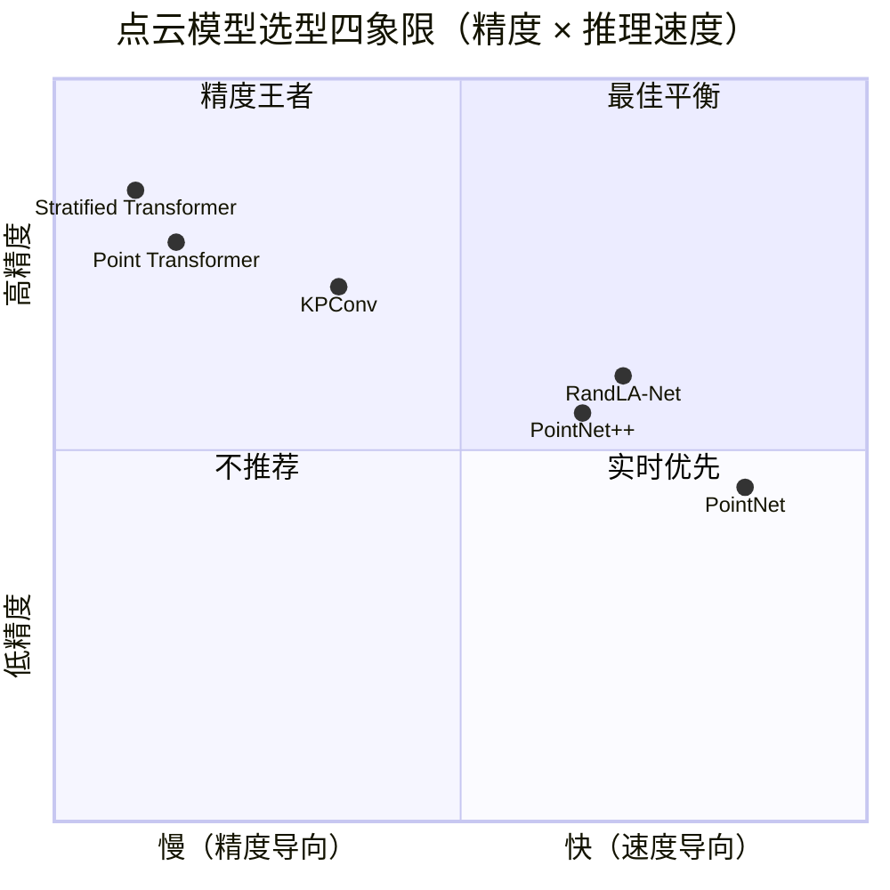

# D.3 部署实战

> **要回答的问题**：写代码完成点云分类和配准的完整 pipeline。模型怎么选？点密度、噪声、域迁移怎么处理？有哪些实战中才会暴露的坑？

## 模型选型



- **实时应用（自动驾驶/机器人）**：PointNet 或轻量 PointNet++，模型小、推理快
- **离线高精度（3D 重建后处理）**：Point Transformer 系列，精度最高
- **配准**：FGR 做粗对齐（几十毫秒），TEASER++ 做鲁棒初始配准（外点多时），ICP 做精调
- **部署到嵌入式设备**：参数量是关键——PointNet 约 3.5M 参数量，PointNet++ 约 1.5M，可以参考模块 07 嵌入式部署中的量化和剪枝策略

## 分类实战：ModelNet40 上跑 PointNet++

ModelNet40 是点云分类的 MNIST——40 类常见物体（桌子、椅子、飞机、汽车等），每类约 100 个训练样本。

```python
import torch
import torch.nn as nn
import torch.nn.functional as F

# PointNet++ 简化实现（分类版本）
class PointNet2Classification(nn.Module):
    """
    简化版 PointNet++ 用于分类。
    完整实现见官方仓库: github.com/charlesq34/pointnet2
    """
    def __init__(self, num_classes=40):
        super().__init__()
        # Set Abstraction 层
        self.sa1 = SetAbstraction(npoint=512, radius=0.2, nsample=32,
                                   in_channel=3, mlp=[64, 64, 128])
        self.sa2 = SetAbstraction(npoint=128, radius=0.4, nsample=64,
                                   in_channel=128+3, mlp=[128, 128, 256])
        self.sa3 = SetAbstraction(npoint=None, radius=None, nsample=None,
                                   in_channel=256+3, mlp=[256, 512, 1024])
        # 分类头
        self.fc1 = nn.Linear(1024, 512)
        self.fc2 = nn.Linear(512, 256)
        self.fc3 = nn.Linear(256, num_classes)
        self.dropout = nn.Dropout(0.4)
        self.bn1 = nn.BatchNorm1d(512)
        self.bn2 = nn.BatchNorm1d(256)
        
    def forward(self, xyz):
        """
        xyz: (B, N, 3) 输入点云坐标
        """
        B, N, _ = xyz.shape
        # Set Abstraction
        l1_xyz, l1_points = self.sa1(xyz, None)
        l2_xyz, l2_points = self.sa2(l1_xyz, l1_points)
        l3_xyz, l3_points = self.sa3(l2_xyz, l2_points)
        # l3_points: (B, 1024, 1) — 全局特征
        x = l3_points.view(B, 1024)
        x = self.dropout(F.relu(self.bn1(self.fc1(x))))
        x = self.dropout(F.relu(self.bn2(self.fc2(x))))
        x = self.fc3(x)
        return F.log_softmax(x, dim=-1)

# 推理示例
# model = PointNet2Classification(num_classes=40)
# model.load_state_dict(torch.load('pointnet2_modelnet40.pth'))
# model.eval()
# with torch.no_grad():
#     pred = model(point_cloud.unsqueeze(0))  # 加 batch 维度
#     class_idx = pred.argmax(dim=1).item()
```

> **关键参数**：`npoint` 控制每层采样点数，`radius` 控制 Ball Query 半径。如果点云密度高（如 LiDAR），适当增大 `radius`；如果稀疏（如 SfM 重建），减小 `radius` 并增大 `nsample`。

## 配准实战：完整 pipeline

```python
import open3d as o3d
import numpy as np
import copy

def full_registration_pipeline(source_pcd, target_pcd, voxel_size=0.05):
    """
    完整的点云配准 pipeline:
    FGR 粗配准 → TEASER++ 鲁棒验证 → ICP 精调
    
    参数:
        source_pcd: 源点云（待配准）
        target_pcd: 目标点云（基准）
        voxel_size: 下采样体素大小（越大越快，但精度越低）
    返回:
        transformation: 4×4 刚体变换矩阵
        registered_source: 配准后的源点云
    """
    
    # === Step 1: 预处理 ===
    src = source_pcd.voxel_down_sample(voxel_size)
    tgt = target_pcd.voxel_down_sample(voxel_size)
    
    # 估计法向量（ICP 点对面需要）
    src.estimate_normals(o3d.geometry.KDTreeSearchParamHybrid(
        radius=voxel_size*2, max_nn=30))
    tgt.estimate_normals(o3d.geometry.KDTreeSearchParamHybrid(
        radius=voxel_size*2, max_nn=30))
    
    # 提取 FPFH 特征
    src_fpfh = o3d.pipelines.registration.compute_fpfh_feature(
        src, o3d.geometry.KDTreeSearchParamHybrid(
            radius=voxel_size*5, max_nn=100))
    tgt_fpfh = o3d.pipelines.registration.compute_fpfh_feature(
        tgt, o3d.geometry.KDTreeSearchParamHybrid(
            radius=voxel_size*5, max_nn=100))
    
    # === Step 2: FGR 全局配准 ===
    fgr_option = o3d.pipelines.registration.FastGlobalRegistrationOption(
        maximum_correspondence_distance=voxel_size*2.5,
        iteration_number=64,
        use_absolute_scale=False,
        decrease_mu=True,
        maximum_tuple_count=1000)
    result_fgr = o3d.pipelines.registration.registration_fgr_based_on_feature_matching(
        src, tgt, src_fpfh, tgt_fpfh, fgr_option)
    
    # === Step 3: ICP 精调 ===
    result_icp = o3d.pipelines.registration.registration_icp(
        source_pcd, target_pcd,
        max_correspondence_distance=voxel_size*0.4,
        init=result_fgr.transformation,
        estimation_method=o3d.pipelines.registration.TransformationEstimationPointToPlane(),
        criteria=o3d.pipelines.registration.ICPConvergenceCriteria(
            relative_fitness=1e-6, relative_rmse=1e-6, max_iteration=100))
    
    # === Step 4: 应用最终变换 ===
    registered_source = copy.deepcopy(source_pcd)
    registered_source.transform(result_icp.transformation)
    
    # === 评估 ===
    print(f"[FGR]  Fitness: {result_fgr.fitness:.4f}, "
          f"Inlier RMSE: {result_fgr.inlier_rmse:.4f}")
    print(f"[ICP]  Fitness: {result_icp.fitness:.4f}, "
          f"Inlier RMSE: {result_icp.inlier_rmse:.4f}")
    
    return result_icp.transformation, registered_source

# 可视化配准结果
def visualize_registration(source, target, registered):
    source.paint_uniform_color([1, 0.706, 0])  # 橙色
    target.paint_uniform_color([0, 0.651, 0.929])  # 蓝色
    registered.paint_uniform_color([0.3, 0.8, 0.3])  # 绿色
    o3d.visualization.draw_geometries([source, target],
        window_name="Before Registration")
    o3d.visualization.draw_geometries([registered, target],
        window_name="After Registration")
```

## 战争故事：真实部署中踩过的坑

### 故事 1：点密度陷阱

我们用消费级结构光相机扫描了一个机械零件。点云有约 100K 个点，分布均匀。配准效果完美——FGR + ICP，RMSE < 0.5 mm。

同样的 pipeline，用在 LiDAR 扫描的户外场景上却完全失败——FGR 的 fitness 低到 0.1 以下。

**原因**：LiDAR 的点密度随距离急剧衰减——5 米处每平方米数千个点，50 米处每平方米只有几个点。FPFH 特征在稀疏区域的邻域半径内找不到足够多的邻居，描述子退化成了噪声。

**解决方案**：
- 按距离分段处理：近处用细粒度配准，远处只做全局约束
- 或者先对点云做密度均衡化（density-aware subsampling）
- 如果可以控制扫描参数，增加重叠区域的扫描时间

### 故事 2：反射表面的"幽灵点"

我们想配准一个有玻璃窗的房间的扫描。FGR 找到了一组"高度一致"的匹配——但它们都位于玻璃窗的位置，对应到了玻璃反射的室外物体。配准后的 RMSE 看起来很好（0.003），但实际上是错的。

**原因**：玻璃上的"点"并不落在玻璃平面上——它们是反射物体的深度。两个扫描角度的反射不同，但 FGR 错误地认为它们匹配得很好。

**解决方案**：
- 用语义分割先识别并移除玻璃/镜子区域（深度估计相关的模块 A 有讨论）
- TEASER++ 的鲁棒性在这种情况下会起关键作用——玻璃点之间的匹配本来就是外点，TEASER++ 会自动忽略它们
- 对于室内场景，预先标定玻璃区域是最可靠的方法

### 故事 3：小重叠区域的"配准幻觉"

两个只重叠 20% 的点云被成功配准——fitness = 0.95, RMSE = 0.002。但当我们把结果用于 3D 重建时，发现非重叠区域有明显的系统性偏差。

**原因**：低重叠率的两个点云，即使正确的配准也只能评估重叠区域的 fitness。FGR 和 ICP 的目标函数都只关心"匹配点对之间的距离"，不关心非重叠区域。如果重叠区域恰好是一个平面（如地面），配准在平面法向量方向的平移分量是欠约束的——你可以沿地面滑动而不改变 fitness。

**解决方案**：
- 在目标函数中加入更多约束（如 ICP 同时优化多视角或加入闭环约束）
- 增加扫描之间的重叠率（>50% 是安全值，<30% 有风险）
- 用 TEASER++ 替代 FGR——它对异常值更鲁棒，不容易被"平面假匹配"愚弄

## 数据陷阱

1. **训练/测试域不匹配**：室内扫描训练的 PointNet++ 在户外 LiDAR 上分割效果骤降。原因是点的密度、噪声特征、物体尺寸分布完全不同。**补救**：在目标域做少量标注数据做微调（fine-tuning），或者用域自适应技术。

2. **采样密度偏差**：ModelNet40 是均匀采样的 CAD 模型，每个物体恰好 1024 个点。真实扫描是不均匀的——某些区域有几千个点，某些区域只有几个。**补救**：训练时做随机降采样和随机加噪声（dropout-like augmentation）。

3. **评估指标的选择**：mIoU 高 ≠ 分割好。如果绝大多数点属于"墙"和"地面"（占 60%+），一个只输出"墙"的模型也会有不错的 mIoU。**补救**：同时报告 per-class IoU 和 mIoU，关注小物体的 IoU。

## 端到端案例：室内场景 3D 感知 pipeline

```
输入：RGB-D 相机的连续帧
  ↓
Step 1: 帧间配准（FGR + ICP）→ 拼接为全局点云
  ↓
Step 2: PointNet++ 语义分割 → 每点标签（墙/地面/家具/杂物）
  ↓
Step 3: VoteNet 目标检测 → 3D bounding boxes + 类别
  ↓
输出：带语义标签和物体检测的全局 3D 场景
```

> 实际工程中，Step 1 和 Step 2 可以并行——配准只需要几何信息，分割只需要特征学习。当研究领域把点云的**表示学习**（PointNet 等）和**几何推理**（ICP 等）分别推进后，工程中把它们组合起来就是完整的 3D 感知系统。

## 苏格拉底时刻

1. **PointNet 和 max pooling 的哲学**：max pooling 只保留"最强的信号"。这意味着 PointNet 本质上在学"每个维度上最有代表性的点"——一种从点集到骨架的映射。如果给你一个全新的 3D 形状类别（训练数据中从未出现），你认为 PointNet 的表现会比 PointNet++ 更好还是更差？为什么？提示：思考全局骨架 vs 局部几何在跨类别泛化中的作用。

2. **配准的元问题**：ICP → FGR → TEASER++ 的演进，本质上是不断提高对"误匹配"的鲁棒性。那么理论上限在哪？如果两个点云只有 5% 的重叠，且这 5% 全在一个平面上（没有 3D 约束），任何配准算法是否都不可能找到正确的变换？你认为"最小所需重叠率"和"重叠区域的几何多样性"之间有什么定量关系？

## 关键论文清单

| 年份 | 论文 | 一句话贡献 |
|------|------|-----------|
| 1992 | Besl & McKay, *A Method for Registration of 3-D Shapes* | ICP 奠基 |
| 2016 | Zhou et al., *Fast Global Registration* (ECCV) | FPFH+鲁棒交替优化，比 RANSAC 快 100× |
| 2017 | Qi et al., *PointNet* (CVPR) | 首个点云深度网络，max pooling = 对称函数 |
| 2017 | Qi et al., *PointNet++* (NeurIPS) | 层级结构 + 集合抽象，点云 CNN 化 |
| 2019 | Thomas et al., *KPConv* (ICCV) | 核点卷积，3D 空间可变形卷积核 |
| 2019 | Qi et al., *VoteNet* (ICCV) | 霍夫投票做纯点云检测 |
| 2021 | Yang et al., *TEASER++* (IEEE T-RO) | 可认证鲁棒配准，容忍 90%+ 外点 |
| 2021 | Zhao et al., *Point Transformer* (ICCV) | 自注意力机制用于点云 |
| 2022 | Qin et al., *GeoTransformer* (ECCV) | Transformer 配准 SOTA |

## 实操练习

1. **分类实验**：下载 ModelNet40 数据集，训练 PointNet++（分类版本）。记录不同点数（256, 512, 1024, 2048）下的分类准确率。1024 到 2048 的增益有多大？它是否趋于饱和？为什么？

2. **失败分析**：用 FGR + ICP 配准两个低重叠率（<30%）的点云。观察配准失败的模式——是旋转错了还是平移错了？如果手动提供一个更接近的初始位姿，ICP 能纠正过来吗？这说明了什么？

3. **特征可视化**：训练好的 PointNet++ 在分割任务中，将中间层特征用 t-SNE 降维到 2D。不同语义类别的特征是否形成可分离的 cluster？在不同物体类别之间泛化时（如用室内训练的模型推理室外场景），特征分布变化的可视化会告诉你什么？

## 延伸阅读

- 本书内：[[模块 C：3D Gaussian Splatting]]（点云表示是 3DGS 的基础）、[[模块 B：双目立体匹配]]（输出视差图可转为点云）、[[模块 07 嵌入式部署]]（模型量化和芯片选型）
- 外部：PointNet/PointNet++ 官方代码 [github.com/charlesq34](https://github.com/charlesq34)；Open3D 教程 [open3d.org](http://www.open3d.org/)；TEASER++ [github.com/MIT-SPARK/TEASER-plusplus](https://github.com/MIT-SPARK/TEASER-plusplus)
