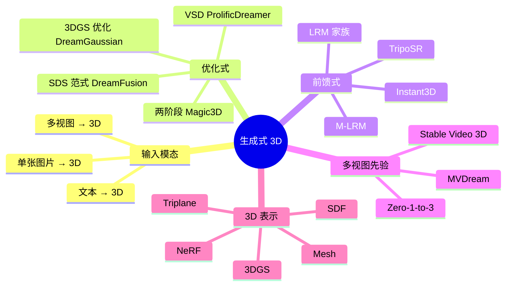
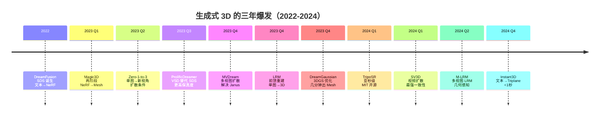

# E.1 直观理解

> **要回答的问题**：从文字/图片生成 3D 为什么这么难？优化式和前馈式两大范式各自的逻辑是什么？过去三年这个领域经历了什么样的爆发？什么是"Janus 问题"？

## 一个场景

你用手机给桌上的盆栽拍了一张照片。一分钟后，你戴上 AR 眼镜，看到那盆植物的三维模型悬浮在客厅中央——你可以绕它走一圈，从任何角度看它，甚至俯身看它底部。"这就是 AI 生成的。只用了那张照片。"

如果你在 2022 年之前说这种话，你会在学术会议上被嘲笑的。但在 2026 年的今天，你可以用开源模型 TripoSR 在自己的电脑上做这件事——从一张照片到 .obj 文件，只需要 0.5 秒。

这是怎么变成可能的？这个故事的核心张力在于**数据和表示的不对称**。

## 核心挑战：3D 数据的稀缺困境

2D 图像生成（如 Stable Diffusion）能在 2022 年爆发，部分原因是**互联网上有几十亿张图片**可以免费爬取。训练 Stable Diffusion 的 LAION-5B 数据集包含 50 亿对图片和文字描述。

但 3D 呢？最大的公开 3D 数据集 Objaverse 包含 80 万个模型——和 50 亿张图片相比差了 6000 倍。而且这 80 万个里，大部分是低质量的 CAD 模型、没有纹理的几何体、或者只有单一角度的扫描。

这就是核心难题：**我们想训练一个"3D 版 Stable Diffusion"，但没有足够数据。**

## 两条路线：优化式 vs 前馈式

面对数据瓶颈，研究者分成了两个阵营：

```
路线 1: 优化式 (Optimization-based)
  "绕过数据瓶颈——不训练 3D 生成模型，只是在 3D 表示上做 per-instance 优化"
  
  方法：DreamFusion, Magic3D, ProlificDreamer
  速度：数分钟到数小时每个场景
  特点：不需要 3D 训练数据、质量高但慢

路线 2: 前馈式 (Feed-forward)
  "用有限但够用的 3D 数据训练神经网络，前馈一次出结果"
  
  方法：LRM, TripoSR, Instant3D, SV3D
  速度：亚秒级到数十秒
  特点：需要 3D 训练数据、速度快但泛化可能受限
```

> 这两条路线不是竞争关系——它们是**时间-空间的权衡**。优化式花更多时间"精调"每个场景，换来不需要 3D 训练数据的自由。前馈式把"精调"的时间花在一次性的训练上，换来实例级的高速推理。理解这条光谱是理解整个生成式 3D 领域的关键。

## 技术全景



## 三年爆发时间线



> 注意这条时间线的加速趋势：2022 年只有一篇 DreamFusion，2023 年 Q3-Q4 几乎每个月都有突破性工作，2024 年重心转向速度（前馈式）和实用化（开源）。这和 2D 图像生成从 GAN 到 Stable Diffusion 的爆发路径平行——都是先证明"能做"，再追求"又快又好"。

## 什么是 Janus 问题？一个贯穿全文的核心挑战

Janus 是罗马神话中的双面神——正面和背面各有一张脸。在 3D 生成中，**Janus 问题**指的是：从不同视角看同一个 3D 生成结果时，看到了不同的内容。

比如你用"一只坐在沙发上的猫"的文字描述生成 3D，从正面看是一只猫，绕到背面——背面也有一只猫的脸。因为 2D 扩散模型在判断"猫"时，并不关心视角。它只要图片里有猫就是好图片。如果你不给它足够的 3D 约束，它会"作弊"——在每个视角都放一只猫，来最大化每个视角的评分。

**Janus 问题的本质是：2D 监督信号不足以约束 3D 的多视图一致性。**

解决 Janus 问题的努力推动了多视图扩散模型（MVDream）和视频扩散模型（SV3D）的发展——通过让扩散模型同时看到多个视角，强制这些视角之间的内容一致。

> [!NOTE]
> Janus 问题不是 3D 独有的。回想一下单目深度估计——它也面临类似的"尺度漂移"问题：同样一层楼，从不同角度看，模型预测的绝对深度不一样。3D 视觉中，凡是用 2D 信号推断 3D 的任务，都需要额外约束来解决这种"视角间不一致"。

## Mini Case：用 TripoSR 从照片生成 3D

以下是一个快速上手的例子（完整部署在第三节）：

```python
# 假设已安装 TripoSR
import torch
from PIL import Image

# 加载预训练模型（在第三节有详细的环境配置）
# model = load_triposr_model()

# 输入：一张照片
image = Image.open("my_plant.jpg")

# 前馈推理（< 1 秒）
# mesh = model.generate(image)
# mesh.export("my_plant_3d.obj")

print("三维文件已生成：my_plant_3d.obj")
print("用 Blender 或在线 Viewer 打开即可查看")
```

> **你得到了什么**：一个 .obj 文件，包含几何和纹理。可以在任何 3D 软件中打开。绕到背面看——如果是复杂形状（有多处遮挡），可能会出现模糊或缺失区域。这是前馈式方法的典型局限：模型只能"猜"被遮挡的部分长什么样。
