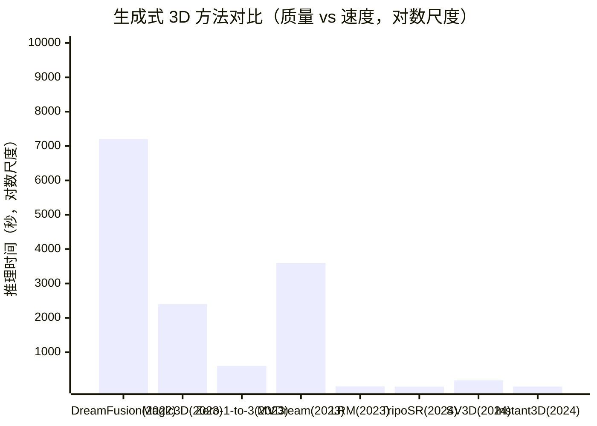

# E.2 原理解析

> **要回答的问题**：SDS 怎么用 2D 扩散模型监督 3D 生成？Zero-1-to-3 怎么把视角信息注入扩散模型？MVDream 如何保证多视角一致？LRM 的 Transformer 怎么从图片直接跳到 3D？SV3D 为什么用视频扩散而不是图像扩散？

本节的线索是：**从优化式到前馈式，从单视角到多视角，从图像到视频**——跟踪生成式 3D 的每一步关键演进。

## 第一性原理：为什么 2D 生成比 3D 早爆发？

根本原因是**数据的维度诅咒**。2D 图像的数据量随分辨率平方增长（$n^2$），3D 数据随分辨率立方增长（$n^3$）。更致命的是——3D 数据的采集成本比 2D 高出几个数量级。

DreamFusion 的洞察是：**既然我们没有足够的 3D 数据来训练 3D 扩散模型，那就用 2D 扩散模型在 3D 表示上做 per-prompt 优化。** 这就像——与其训练一个"3D 版 Stable Diffusion"（需要海量 3D 数据），不如让 Stable Diffusion 当老师，一步步指导一个 3D 模型"你渲染出来的图应该更像什么"。

## 优化式路线：SDS 及其演进

### DreamFusion 与 SDS

DreamFusion 要解决的核心问题：**给定一段文字 $y$，优化一个可微分 3D 表示的参数 $\theta$，使得从任意角度渲染出来的图像都像 $y$ 描述的东西。**

如果有一个好的 3D 评估器，这会很容易——让评估器对渲染结果打分，梯度上升。但我们没有。

如果有一个好的 2D 评估器——等等，Stable Diffusion 不就是一个训练在 50 亿张图片上的"图像理解器"吗？它知道"什么图片像文字描述"。

**SDS 就是把这个想法变成可执行的梯度公式。**

### SDS 的数学

扩散模型训练时，去噪网络 $\hat{\epsilon}_\phi(x_t; y, t)$ 学习预测加到图像 $x$ 上的噪声 $\epsilon$。在常规的图像生成中，我们从纯噪声开始，逐步去噪得到图像。

3D 生成中的"图像"是渲染自可微 3D 表示的结果：$x = g(\theta)$。SDS 的梯度是：

$$\nabla_\theta \mathcal{L}_{\text{SDS}} = \mathbb{E}_{t,\epsilon} \left[ w(t) \left( \hat{\epsilon}_\phi(x_t; y, t) - \epsilon \right) \frac{\partial x}{\partial \theta} \right]$$

- $x_t = \sqrt{\bar{\alpha}_t} x + \sqrt{1-\bar{\alpha}_t} \epsilon$：渲染图的加噪版
- $\hat{\epsilon}_\phi(x_t; y, t) - \epsilon$：去噪网络预测的噪声减去真实添加的噪声——即从 $x_t$ 到干净图 $x$ 的"方向向量"
- $\frac{\partial x}{\partial \theta}$：渲染图对 3D 参数的雅可比——通过可微渲染反向传播

> [!TIP]
> **人话翻译**：每步迭代——(1) 从随机相机角度渲染 3D 场景得到 $x$；(2) 给 $x$ 加噪得到 $x_t$；(3) 问 Stable Diffusion "你觉得 $x_t$ 去噪后应该更像什么？"；(4) SD 给出从 $x_t$ 到干净图的方向向量；(5) 把这个方向通过可微渲染反向传播到 3D 参数，更新参数使渲染结果更像描述。循环几千次，3D 场景逐渐成型。

> SDS 的精妙之处：**它不需要训练任何新网络**。可微渲染负责 $\partial x/\partial \theta$，预训练扩散模型负责 $\hat{\epsilon}_\phi - \epsilon$。两者通过链式法则连接。DreamFusion 没有训练 3D 生成模型——它只是在 3D 表示上做优化，用 2D 模型做损失函数。

### SDS 的关键超参数

- **Classifier-free guidance 权重 $\omega$**：DreamFusion 用 $\omega = 100$，远超图像的 7.5。高引导权重让扩散模型更"自信"地给出方向，但也导致颜色过饱和和过度平滑。
- **噪声时间步 $t$ 的采样策略**：通常采样 $t \sim \mathcal{U}(t_{\min}, t_{\max})$。$t$ 太大（噪声太多），梯度噪声过大；$t$ 太小，缺乏全局结构引导。
- **相机采样策略**：随机在球面上采样，有时加随机 focal length 和偏移来增强鲁棒性。

### Janus 问题的数学根源

SDS 梯度是每个视角独立计算的。时间步 $t$ 处，梯度只反映"这个特定视角下，渲染图应该怎么改变才能更像描述 $y$。"没有任何机制告诉模型："你从另一个视角也应该渲染出同样的物体。"

这就导致了 Janus 问题——每个视角都在竞争，但没有任何跨视角约束来保证一致性。这是 **per-view optimization without cross-view communication** 的必然结果。

### 改进：从 NeRF 到 Mesh/3DGS

- **Magic3D**（Lin et al., CVPR 2023）：两阶段。第一阶段 SDS 优化 low-res NeRF（粗几何），第二阶段 DMTet 优化 textured mesh（高分辨率细节）。
- **ProlificDreamer**（Wang et al., NeurIPS 2023）：用 VSD（Variational Score Distillation）替代 SDS。关键改进：不仅用扩散模型打分，还引入一个"变分分布"来避免 SDS 的 mode-seeking 行为，结果不再过度平滑。
- **DreamGaussian**（Tang et al., ICLR 2024）：用 3DGS 替代 NeRF 作为 3D 表示。3DGS 的光栅化渲染比 NeRF 的体渲染快两个数量级，几分钟就能生成高质量 mesh。

## 多视图先验路线：让扩散模型"看见 3D"

优化式路线的根本痛点是：**2D 扩散模型不理解 3D 一致性**。多视图先验路线的解决思路是：**先训练一个理解 3D 的扩散模型，再用它做监督。**

### Zero-1-to-3：视角条件扩散

Zero-1-to-3 把 Stable Diffusion 改造为"视角条件图像生成器"：

```
输入: 源图像 I_src + 目标相机位姿 (R, T)
  ↓
输出: 该视角下的新图像 I_tgt
```

**架构改造**：
- 源图像通过 CLIP 编码器，embedding 拼接到时间步嵌入中
- 相机位姿 (R, T) 通过 MLP 编码后也注入到去噪网络（cross-attention 的条件向量）
- 在 Objaverse 上微调 3 天

> Zero-1-to-3 的输出不是 3D 模型——它是"新视角合成器"。要把新视角合成为 3D 模型，需要额外的 3D 重建步骤（如 Score Jacobian Chaining 或 NeuS）。

**为什么视角条件不足以解决 Janus**：Zero-1-to-3 一次只生成一个视角。虽然它的一致性比纯 SDS 好（因为有源图片做锚定），但在不同目标位姿调用它时，生成的图片之间仍然可能不一致——微小的位姿变化可能产生不连续的输出。

### MVDream：同时生成多个视角

MVDream 的关键创新是：**让扩散模型同时输出 4 张多视角图片，且它们在注义力层互相通信。**

```
文本 "一只猫"
  ↓
扩散模型 → 同时输出 4 张图片（前、后、左、右）
  ↑ 3D self-attention 保证视角间一致性
```

**3D Self-Attention**：在 Transformer 的 attention 层中，4 个视角的 latent token 可以互相 attend。这意味着左视图的 token 可以和右视图的 token 交换信息——模型被迫学习"这两个视角应该是同一只猫"。

4 张正交视图作为一个多视图先验，比单独一张图片强得多。用 MVDream 做 SDS 监督时，每个训练步随机选择一个视角的渲染图进行比对——但 MVDream 知道从那个视角看"应该长什么样"，因为它已经看过其他 3 个视角了。

> MVDream 将 Janus 问题从"严重"降到了"可控"，但代价是训练成本（需要渲染多视图 3D 数据）和推理时更大的计算开销。

### SV3D：视频扩散的天然一致性

SV3D 提出了一个更激进的方案：**不用图像扩散模型，用视频扩散模型来生成新视角序列。**

视频扩散模型（如 Stable Video Diffusion）在训练时已经学到了"连续帧之间应该一致"的隐式 3D 理解——时间一致性就是视角一致性。

```
输入: 单张图片 + elevation 角度
  ↓
SVD (Video Diffusion U-Net) → 21帧环绕新视角视频
  ↓
NeuS 重建 → 3D mesh
```

**为什么视频比多视图好**：多视图是离散的（4 个视角），视频是连续的（21 帧）。相邻帧之间的微小变化更容易被视频模型学到——它天然地强制了平滑的视角变化。如果帧 10 和帧 11 的内容突变，视频模型会认为这是"坏的视频"并惩罚它。

> [!TIP]
> **人话翻译**：想象你在看一段绕着物体旋转的视频——如果旋转过程中物体的形状突变、颜色改变、或突然出现第二个物体，你会觉得这是"不对的"。视频扩散模型有同样的感觉——它在训练中内化了"旋转物体 = 平滑变化"的先验。SV3D 只是把这个先验从训练域（真实视频）迁移到了目标域（3D 物体）。

SV3D 的两个变体：
- **SV3D_u**：无条件 elevation，适合任意视角生成
- **SV3D_p**：有条件 elevation，适合特定仰角的 3D 重建

## 前馈式路线：从优化到学习

前馈式路线的核心洞察是：**如果你有足够多的高质量 3D 数据，你可以训练一个神经网络直接从图片跳到 3D——不需要 per-instance 优化。**

### LRM：Large Reconstruction Model

LRM 的架构是 Transformer + Triplane。

```
单张图片
  ↓ DINO (ViT 编码器)
图像 token (1025 tokens)
  ↓
Transformer Decoder（cross-attend to image tokens）
  ↓
Triplane tokens (3×32×32×1024)
  ↓ 查询任意 3D 点 (x, y, z)
  投影到 3 个平面 → 特征拼接
  ↓
小 MLP → density + color
  ↓ 体渲染
3D 渲染图
```

**Triplane 表示**：将 3D 场景分解为三个正交平面 (XY, XZ, YZ)，每个平面是 32×32 的特征网格。任意 3D 点投影到三个平面的 2D 位置，取对应特征，拼接后通过小 MLP 解码。

Triplane 的妙处：它将 O(n³) 的 3D 体素缩减到 O(3n²)。Transformer decoder 只需要输出 3×32×32 = 3072 个 token（而不是 32×32×32 = 32768 个），大幅降低了序列长度。

**为什么 LRM 能工作**：图像 token 通过 DINO 已经包含了丰富的 2D 语义。Transformer decoder 的任务是"从这些 2D token 中提取 3D 信息"——这要求模型学习 2D→3D 的映射。Objaverse 的 80 万个模型提供了足够多样的训练数据来学习这个映射。

### 从 LRM 到 TripoSR：数据是王道

TripoSR 最关键的发现是：**训练数据的质量比模型架构更重要。** 

Objaverse 的 80 万模型质量参差不齐——大量模型有错误的法向量、奇怪的材质、不自然的光照。TripoSR 做了四个关键的训练数据改进：

1. **筛选高质量子集**：移除低 poly、无纹理、错误的模型
2. **改善渲染设置**：用 HDR 环境光替代简单的方向光，渲染结果更像真实照片
3. **增加渲染视角数**：每个物体从更多角度渲染，提供更丰富的 3D 线索
4. **渲染风格多样化**：模拟不同的相机参数和光照条件

> 这些改进听起来"只是数据工程"，但它们带来的性能提升超过了任何架构改进。这是一个重要的教训：在 3D 视觉中（和许多其他领域一样），数据的规模和质量往往比模型架构更关键。

TripoSR 的推理速度——A100 上 < 0.5 秒——使它成为首个实用化的前馈式 3D 生成模型。MIT 协议开源使其迅速普及。

### Instant3D (IJCV 2024)：文本直出 3D

最激进的前馈路线：直接从文本到 triplane，跳过图像/多视图中间步骤。

```
文本 "a wooden chair with armrests"
  ↓ Text Encoder
文本 embedding
  ↓
三个机制:
  1. Cross-Attention: 将文本语义映射到 triplane 空间
  2. Style Injection: 将风格信息注入每个平面
  3. Token-to-Plane: 可学习 token 直接解码为 triplane
  ↓
Triplane → 3D 模型
```

通过这三个机制，模型学会了直接从文本理解 3D 结构——不需要先去 SD 生成图片、再用 LRM 重建。推理时间 < 1 秒。

## 方法演进对比



> 速度的跨越式提升是生成式 3D 在过去两年最显著的趋势。但这张图隐藏了一个信息：前馈式方法（LRM, TripoSR, Instant3D）的质量目前仍略逊于优化式方法的纯文本生成场景。如果你需要"最美"的结果，优化式仍是首选；如果你需要"最快"的结果，前馈式是唯一选择。

## Code Lens：TripoSR 推理背后的数据流

```python
# 伪代码展示 TripoSR 的推理流程
# 完整实现参照 stabilityai/TripoSR (Hugging Face)

def triposr_inference(image: torch.Tensor) -> dict:
    """
    输入: image (1, 3, 256, 256) — 单张 RGB
    输出: mesh (.obj)
    """
    # 1. DINO 编码器 → 图像 tokens
    image_tokens = dino_vit(image)  # (1, 1025, 768)
    
    # 2. 拼接相机参数 token
    camera_embedding = camera_mlp(plucker_rays)  # (1, 6, 1024)
    input_tokens = torch.cat([image_tokens, camera_embedding], dim=1)
    
    # 3. Transformer Decoder → Triplane
    triplane_tokens = transformer_decoder(
        query_tokens,  # 3×32×32 个可学习 query
        input_tokens   # 图像 + 相机作为 key/value
    )  # (1, 3072, 1024)
    
    triplane = reshape(triplane_tokens, (3, 32, 32, 1024))
    # 3 个平面: XY, XZ, YZ
    
    # 4. NeRF MLP → 密度 + 颜色
    def query_density_color(xyz):
        # xyz: (N, 3)
        feat_xy = bilinear_sample(triplane[0], xyz[:, [0,1]])
        feat_xz = bilinear_sample(triplane[1], xyz[:, [0,2]])
        feat_yz = bilinear_sample(triplane[2], xyz[:, [1,2]])
        feat = torch.cat([feat_xy, feat_xz, feat_yz], dim=-1)
        return nerf_mlp(feat)  # → (density, color)
    
    # 5. 体渲染 → 密度场 → Marching Cubes → mesh
    mesh = marching_cubes(query_density_color, resolution=128)
    return mesh
```

> **Triplane 是 LRM 的关键设计选择**。三个 2D 平面隐式地编码了完整的 3D 信息——每个 3D 点是三个 2D 投影的交点。这比全 3D 卷积（O(n³)）省内存，比纯 MLP（无空间结构）有更好的归纳偏置。你不禁要问：为什么恰好是三个平面？答案：三个正交平面是编码 3D 信息的最少的 2D 结构（两个平面可以有不确定性——两条线的交点可能不在第三个维度上）。
