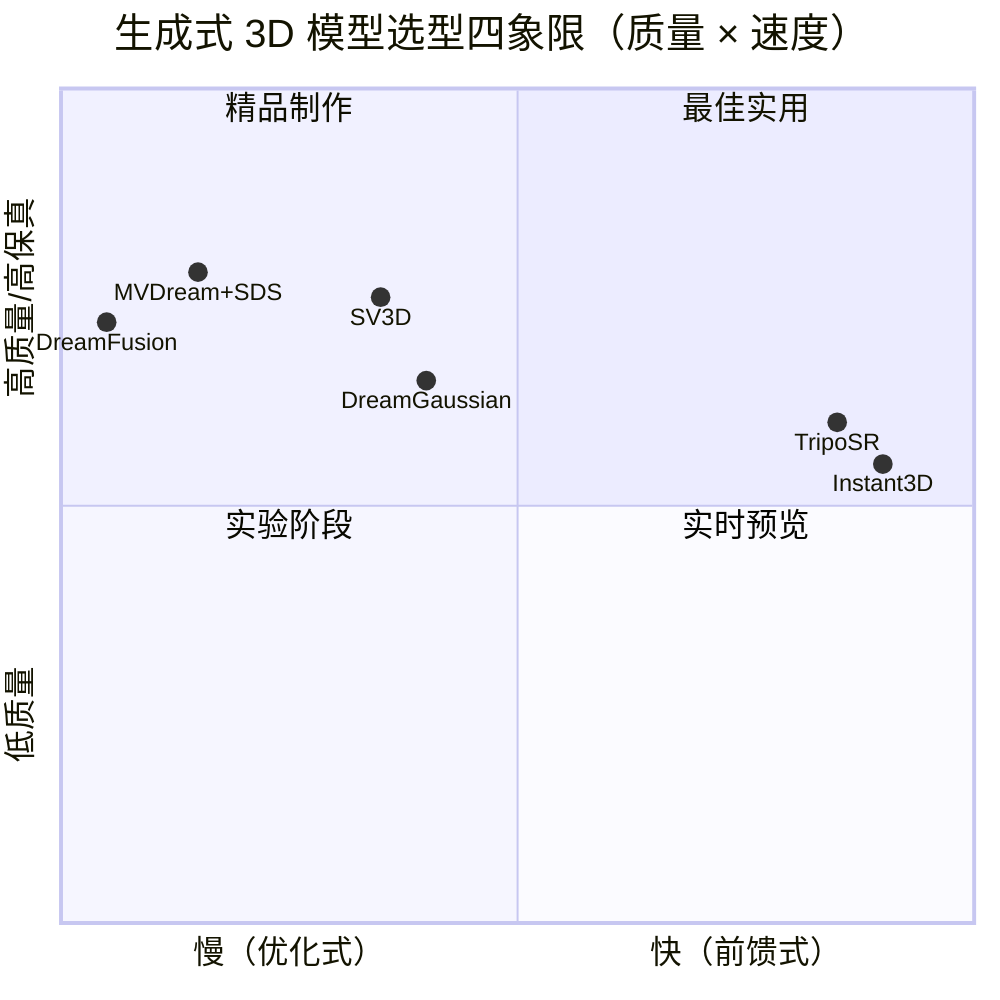

# E.3 部署实战

> **要回答的问题**：怎么在自己的电脑上跑 TripoSR？模型怎么选？哪些输入会导致 3D 生成失败？优化式和前馈式各自的部署考虑是什么？

## 模型选型



- **快速预览/批量生成**：TripoSR 或 Instant3D。亚秒级推理，适合需要快速迭代的场景。
- **精品制作/创意设计**：MVDream + DreamGaussian 或 SV3D。分钟级优化，质量高。
- **需要多视图细节**：SV3D。视频扩散提供最强的多视图一致性。
- **不需要 3D 训练数据**：DreamFusion 或 MVDream+SDS。纯优化式，无需任何 3D 预训练。

## TripoSR 本地部署

### 环境准备

```bash
# 创建虚拟环境
python -m venv triposr_env
source triposr_env/bin/activate

# 安装依赖
pip install torch torchvision --index-url https://download.pytorch.org/whl/cu118
pip install transformers diffusers accelerate
pip install trimesh open3d  # 用于 mesh 处理和可视化
pip install pillow numpy

# 克隆 TripoSR 仓库
git clone https://github.com/VAST-AI-Research/TripoSR.git
cd TripoSR
pip install -e .
```

> [!CAUTION]
> TripoSR 需要 GPU 推理（CUDA）。如果没有 NVIDIA GPU，可以用 CPU 推理但速度会慢 10-20 倍。显存需求约 4-6 GB（batch size=1）。如果是 AMD GPU，需要 ROCm 版本的 PyTorch。

### 完整推理脚本

```python
import torch
import numpy as np
from PIL import Image
import trimesh
import os

# 如果使用 Hugging Face 版本的 TripoSR
# from triposr import TripoSRPipeline
# 
# pipe = TripoSRPipeline.from_pretrained(
#     "stabilityai/TripoSR",
#     torch_dtype=torch.float16,
#     device="cuda"
# )

def preprocess_image(image_path, target_size=256):
    """
    预处理输入图像
    TripoSR 要求: RGB, 正方形, 物体居中于白背景
    """
    img = Image.open(image_path).convert("RGB")
    
    # 保持宽高比，填充为正方形
    w, h = img.size
    max_dim = max(w, h)
    
    # 创建白色正方形画布
    new_img = Image.new("RGB", (max_dim, max_dim), (255, 255, 255))
    # 居中粘贴原图
    paste_x = (max_dim - w) // 2
    paste_y = (max_dim - h) // 2
    new_img.paste(img, (paste_x, paste_y))
    
    # 缩放
    new_img = new_img.resize((target_size, target_size), Image.LANCZOS)
    return new_img

def remove_background(image):
    """
    去除背景（可选但强烈推荐）
    使用 rembg 或类似工具
    """
    from rembg import remove
    return remove(image)

def generate_3d(image_path, output_path="output.obj"):
    """
    从图片生成 3D mesh 的完整流程
    """
    # 1. 预处理
    img = preprocess_image(image_path)
    img = remove_background(img)  # 去除背景，提高质量
    
    # 2. 推理（使用 Hugging Face pipeline）
    # with torch.no_grad():
    #     with torch.autocast("cuda"):
    #         mesh = pipe(img, 
    #                     num_inference_steps=1,
    #                     guidance_scale=3.0)
    
    # 3. 后处理
    # mesh.export(output_path)
    print(f"3D mesh saved to: {output_path}")
    return output_path

# 使用示例
# generate_3d("my_photo.jpg", "my_3d_model.obj")
```

### 查看结果

```python
import open3d as o3d

def visualize_mesh(mesh_path):
    """用 Open3D 可视化生成的 3D 模型"""
    mesh = o3d.io.read_triangle_mesh(mesh_path)
    mesh.compute_vertex_normals()
    
    # 如果模型太小或太大，做归一化
    bbox = mesh.get_axis_aligned_bounding_box()
    scale = 1.0 / max(bbox.get_extent())
    mesh.scale(scale, center=mesh.get_center())
    
    o3d.visualization.draw_geometries(
        [mesh],
        mesh_show_wireframe=False,
        mesh_show_back_face=True,
        window_name="Generated 3D Model"
    )

# visualize_mesh("my_3d_model.obj")
```

## 战争故事：真实使用中踩过的坑

### 故事 1：背景是 3D 生成的敌人

我们用一张随手拍的椅子照片做 TripoSR 推理。生成的 mesh 包含了一个巨大的背景平面——椅子周围的地板被当作了椅子的一部分。

**原因**：TripoSR（和几乎所有前馈式模型）假设输入是"白色背景上的单个物体"。如果背景复杂，模型会尝试重建背景为 3D——而背景没有 3D 信息，模型只能"编造"一个奇怪的平面。

**解决方案**：
- 永远在推理前去除背景（用 rembg、SAM 或手动抠图）
- 如果手动抠图困难，确保物体占据图像的大部分（>60%）
- 用高对比度的背景拍摄（白墙、黑布），物理上隔离物体

### 故事 2：薄结构消失

一把椅子的靠背由细金属管组成。TripoSR 的 triplane 分辨率是 32×32，体渲染分辨率是 128³——这些分辨率不足以捕获金属管的细节。生成的 mesh 中，靠背管变成了断断续续的"面片"。

**原因**：Triplane 的分辨率瓶颈。32×32 的特征网格在物理世界对应的分辨率有限——如果物体特征（如细管）在投影后只占 1-2 个像素，就无法被表示。

**解决方案**：
- 增大输入图片中物品的占比（让细管在图中更大）
- 考虑使用 SV3D（视频扩散天然有更高分辨率的新视角合成）
- 后处理：在 Blender 中用 mesh 编辑工具手动修复薄结构
- 这是前馈式方法的固有限制——等待下一代更高分辨率的 LRM

### 故事 3：透明/反光材质

一张玻璃花瓶的照片。TripoSR 生成的结果是——一个半透明的、奇怪的形状，不像花瓶。

**原因**：透明和反光物体的外观取决于环境，而不是物体本身的材质。TripoSR 看到的是花瓶"透出的背景"和"反射的光斑"，它不知道这些是花瓶之外的场景。模型错误地将环境反射理解为了物体本身的纹理和形状。

**解决方案**：
- 暂时没有完美的解决方案。这是所有基于图像的 3D 重建的固有限制
- 对于半透明物体，尝试在均匀光照下拍摄，减少反射和透射的复杂性
- 或使用优化式方法（DreamFusion + 特定的材质先验），但质量和速度都不如 TripoSR

### 故事 4：前馈式的"忠诚度"问题

一张特殊形状的台灯——灯罩是扭曲的不规则造型。TripoSR 生成了一个"看起来像台灯"的结果，但灯罩的形状和原图不完全匹配——细节被平滑掉了。

**原因**：前馈式模型学到的是"分布的平均值"。如果训练数据中有很多种灯罩形状，模型在遇到一个新形状时，倾向于回归到"最接近的平均灯罩形状"，而不是忠实重建输入。

**这是前馈式方法的根本局限**：泛化和忠实度之间存在张力。训练时见过的形状越多，对"差不多"的形状越容易输出平均结果。优化式方法没有这个问题——它可以从零开始拟合任何形状。

## 优化式部署指南

如果你需要最高的质量，优化式方法用时间换质量。以 DreamGaussian 为例：

```bash
# DreamGaussian: 3DGS 优化，几分钟出高质量 mesh
git clone https://github.com/dreamgaussian/dreamgaussian.git
cd dreamgaussian

# 从文本生成（需要约 5 分钟，8GB+ VRAM）
python main.py --text "a detailed wooden chair with armrests" \
    --save_dir results/chair

# 从图片生成（需要 Zero-1-to-3 作为多视图先验）
python main.py --image input.jpg \
    --save_dir results/from_image
```

> 优化式方法的部署门槛比前馈式高：更大的显存需求（通常 12GB+）、更长的等待时间（分钟到小时）、对超参数更敏感。但质量上限也更高。

## 后处理：让生成的 3D 可用

```python
import trimesh

def postprocess_mesh(mesh_path, output_path):
    """
    mesh 后处理：简化、修复、重定向法向量
    """
    mesh = trimesh.load(mesh_path)
    
    # 1. 移除零面积面片
    mesh.remove_degenerate_faces()
    
    # 2. 移除重复顶点
    mesh.merge_vertices()
    
    # 3. 填充小洞
    mesh.fill_holes()
    
    # 4. 简化（可选，如果面数太多）
    if len(mesh.faces) > 50000:
        mesh = mesh.simplify_quadratic_decimation(50000)
    
    # 5. 对齐到直立方向（基于主成分分析）
    # 假设物体最长轴应该垂直
    # mesh = align_to_principal_axis(mesh)
    
    # 6. 归一化大小
    mesh.apply_scale(1.0 / mesh.scale)
    
    mesh.export(output_path)
    print(f"Post-processed mesh saved to: {output_path}")
```

## 失败 case 速查表

| 输入特征 | 可能的问题 | 对策 |
|---------|-----------|------|
| 复杂背景 | 背景被重建为 3D 物体 | 去除背景 |
| 细长结构（杆、管、线） | Mesh 断裂或缺失 | 增大物体占比、考虑 SV3D |
| 透明/反光材质 | 形状混乱 | 均匀光照拍摄、降低期望 |
| 多物体场景 | 物体粘在一起或部分缺失 | 先检测/分割单个物体 |
| 严重遮挡 | 被挡部分被"编造" | 提供多张不同角度的照片 |
| 低分辨率输入 | 细节丢失、模糊纹理 | 至少 512×512 像素输入 |
| 非常规姿势 | 物体朝向识别错误 | 确保物体直立、常见姿势 |

## 端到端案例：从手机照片到可用的 3D 资产

```
手机拍照一张（确保物体居中、纯色背景）
  ↓
rembg 去除背景
  ↓
TripoSR 前馈推理（< 1 秒，GPU）
  ↓
trimesh 后处理（简化、填洞、归一化）
  ↓
.obj 文件导入 Blender / Unity / Unreal
  ↓
手动调整：纹理修复、薄结构补全、材质调整
  ↓
可用的 3D 资产
```

> 注意这个 pipeline 中 AI 和人工的分工：AI 负责"从 0 到 80%"——快速产出可用的几何结构和基础纹理。人工负责"从 80% 到 100%"——修复特定问题、调整材质、补充细节。目前的生成式 3D 更适合作为**生产力工具**而非**完全替代品**。

## 苏格拉底时刻

1. **SDS 的信息论解释**：SDS 本质上是用 2D 扩散模型的 score function 来估计 3D 渲染分布的梯度。但 2D 模型只见过 2D 图像——它没有 3D 的先验。你认为，如果我们真的有一个 3D 扩散模型（直接训练在 3D 体素/点云上），它的 SDS-like 梯度还会有 Janus 问题吗？为什么？提示：思考 2D 扩散模型做 3D 生成和 3D 扩散模型做 3D 生成之间的信息论差异。

2. **前馈 vs 优化的谱系**：TripoSR 和 DreamFusion 看起来是完全不同的方法，但它们在"学习 vs 推理"的光谱上是相邻的。TripoSR 在训练时做"群体优化"（学习从图片到 3D 的映射），DreamFusion 在推理时做"个体优化"（从零拟合一个 3D）。你认为这条光谱上是否存在一个"甜点"——结合两者优势的方法？如果让 TripoSR 的输出作为 DreamFusion 的初始化，再用 SDS 微调，结果会更好吗？为什么现有方法很少这样做？

## 关键论文清单

| 年份 | 论文 | 一句话贡献 |
|------|------|-----------|
| 2022 | Poole et al., *DreamFusion* (ICLR 2023) | SDS 诞生，首个无 3D 数据的文本→3D |
| 2023 | Lin et al., *Magic3D* (CVPR) | NeRF 粗 + Mesh 精的两阶段优化 |
| 2023 | Liu et al., *Zero-1-to-3* (ICCV) | 视角条件扩散，单图→多视角 |
| 2023 | Wang et al., *ProlificDreamer* (NeurIPS) | VSD 替代 SDS，解决过平滑 |
| 2023 | Shi et al., *MVDream* | 多视图扩散，解决 Janus 问题 |
| 2023 | Hong et al., *LRM* (ICLR 2024) | 首个大规模重建模型，前馈 3D 生成 |
| 2023 | Tang et al., *DreamGaussian* (ICLR 2024) | 3DGS 替代 NeRF，分钟级高质量生成 |
| 2024 | Tochilkin et al., *TripoSR* | 改良训练数据，亚秒级，MIT 开源 |
| 2024 | Voleti et al., *SV3D* (ECCV) | 视频扩散做新视角合成，最强一致性 |
| 2024 | Li et al., *Instant3D* (IJCV) | 文本直出 triplane，< 1 秒 |

## 实操练习

1. **TripoSR 实践**：用自己的手机拍 5 张不同物体的照片（确保去除背景），分别用 TripoSR 生成 3D 模型。哪些类型最成功？哪些失败？失败的共性是什么？写一个简短的失败分析。

2. **对比实验**：找一张在线图片，同时用 TripoSR（前馈）和在线 Demo 的 MVDream（优化式）生成 3D。对比两个结果的质量差异——几何细节、纹理保真度、背面完成度。哪种场景下你更偏好优化式？

3. **Janus 问题实证**：用 DreamFusion 的开源实现（如 threestudio）从文本生成一个"人形"的 3D 模型。绕到背面看——是否有第二张脸？尝试不同类别的物体（动物、家具、建筑）。Janus 问题在哪些类别更严重？为什么？（提示：思考 2D 扩散模型的训练数据分布）

## 延伸阅读

- 本书内：[[模块 C：3D Gaussian Splatting]]（DreamGaussian 的底层 3D 表示）、[[NeRF：神经辐射场]]（DreamFusion 的原始 3D 表示）、[[模块 A：单目深度估计]]（Marigold 也是用扩散模型做 3D 任务）
- 外部：TripoSR [github.com/VAST-AI-Research/TripoSR](https://github.com/VAST-AI-Research/TripoSR)；DreamGaussian [github.com/dreamgaussian/dreamgaussian](https://github.com/dreamgaussian/dreamgaussian)；threestudio [github.com/threestudio-project/threestudio](https://github.com/threestudio-project/threestudio)；生成式 3D 综述 "Generative AI meets 3D" (2401.06120)
